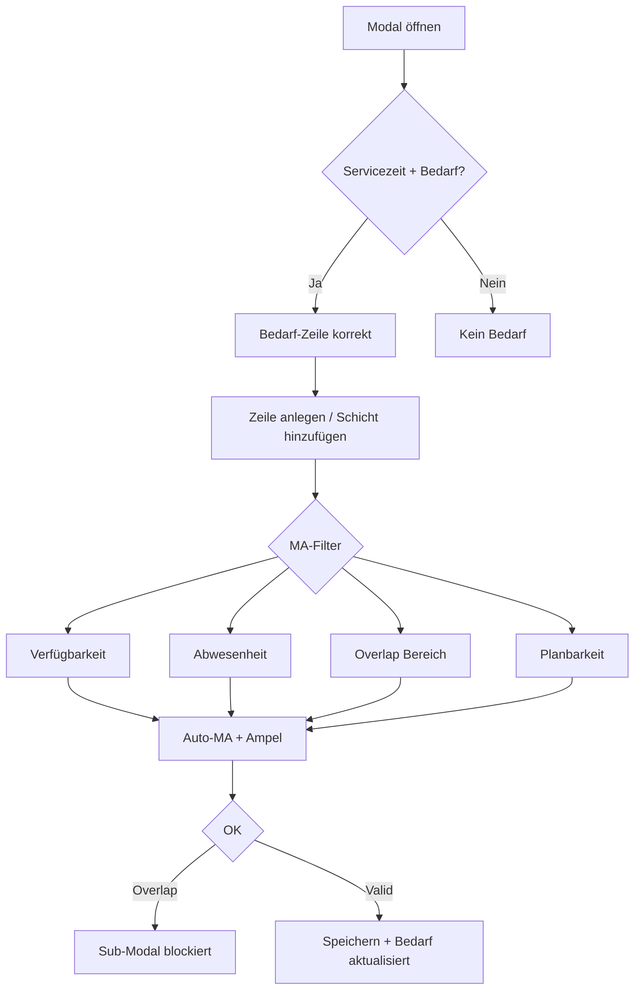

# Testszenarien: „Mehrere Schichten zuweisen“

Strukturiert nach **Geschäftsregeln**, **Modal-Verhalten** und **Kombinationen**. Jede Zeile ist ein konkreter Testfall.

---

## 1. Mitarbeiter-Planbarkeit (`is_active`, `schedulable`, `role`)

| # | Szenario | Erwartung |
|---|----------|-----------|
| 1.1 | MA aktiv + planbar | Erscheint in Mitarbeiter-Combobox (wenn sonst qualifiziert) |
| 1.2 | MA inaktiv | Nicht in Combobox |
| 1.3 | MA aktiv, nicht planbar | Nicht in Combobox |
| 1.4 | MA Manager-Rolle (nicht `basic`) | **UI:** kann erscheinen · **Speichern:** Server lehnt ab („Mitarbeiter nicht gefunden“) |
| 1.5 | MA war inaktiv, wird reaktiviert + planbar | Nach Modal-Neuladen verfügbar |

---

## 2. Mitarbeiter-Verfügbarkeiten (wiederkehrend, Mo–So 0–6)

| # | Szenario | Erwartung |
|---|----------|-----------|
| 2.1 | MA hat Verfügbarkeit am Wochentag, Schicht passt vollständig hinein | Auswählbar |
| 2.2 | Schicht beginnt vor / endet nach Verfügbarkeitsfenster | Nicht auswählbar |
| 2.3 | MA hat mehrere Slots am Tag, einer passt | Auswählbar |
| 2.4 | MA hat keinen Slot an diesem Wochentag | Nicht auswählbar |
| 2.5 | Verfügbarkeit mit verknüpfter Schichtart, Zeiten der Schichtart passen | Auswählbar (Match über Schichtart-Zeiten) |
| 2.6 | Verfügbarkeit mit Schichtart, aber manuell abweichende Von/Bis-Zeiten | Match nur wenn Fenster in Slot **oder** Schichtart-Zeiten passt |
| 2.7 | **Feiertag** (z. B. Dienstag = Feiertag): Verfügbarkeit am Di (0–6), Bedarf über Feiertags-Wochentag 7 | Verfügbarkeit nach Kalender-Wochentag (Di), Bedarf nach Feiertags-Regel — getrennt prüfen |
| 2.8 | Von/Bis unvollständig oder ungültig (`00:00`/`00:00`) | Keine Mitarbeiter in Combobox, Zeile „incomplete“ |
| 2.9 | Nachtschicht (Ende < Start, z. B. 22:00–06:00) | Verfügbarkeits- und Überlappungslogik korrekt |
| 2.10 | Von/Bis geändert → passender MA | Auto-Vorauswahl aktualisiert sich (wenn nicht manuell gewählt) |

---

## 3. Abwesenheiten

| # | Szenario | Erwartung |
|---|----------|-----------|
| 3.1 | Genehmigter Urlaub/Krankheit am Tag | Nicht in Combobox |
| 3.2 | Abwesenheit beantragt, nicht genehmigt | In Combobox (wenn sonst verfügbar) |
| 3.3 | Abwesenheit beginnt/endet am Tag (Randdatum) | Nur am betroffenen Tag ausgeblendet |
| 3.4 | MA abwesend, aber Verfügbarkeit vorhanden | Abwesenheit hat Vorrang → ausgeblendet |

---

## 4. Bereich-Servicezeiten

| # | Szenario | Erwartung |
|---|----------|-----------|
| 4.1 | Bereich am Tag geöffnet, Personalbedarf definiert | Bedarf-Zeile sichtbar |
| 4.2 | Bereich am Tag geschlossen | Keine Bedarf-Einträge im Header |
| 4.3 | **Feiertag**, Bereich nur an Wochentag 7 geöffnet | Bedarf nur wenn Feiertags-Servicezeit gesetzt |
| 4.4 | Vergangener Tag mit bestehenden Schichten | Modal ggf. öffnbar, Speichern blockiert (Server) |
| 4.5 | Zukünftiger Tag, Bereich offen | Normal nutzbar |

---

## 5. Bereich-Personalbedarf (Bedarf-Zeile)

| # | Szenario | Erwartung |
|---|----------|-----------|
| 5.1 | Früh 0/2, Spät 1/1 | Header: `Früh: 0/2 - Spät: 1/1` (Reihenfolge = Schichtart-Sortierung) |
| 5.2 | Zeile im Modal vollständig (MA + Schichtart + Zeiten) | Zähler live +1 (z. B. `1/2`) |
| 5.3 | Zeile nur Schichtart, kein MA | Zähler unverändert |
| 5.4 | Mehrere Zeilen gleiche Schichtart | Jede vollständige Zeile zählt |
| 5.5 | Bereits gespeicherte Schichten im Bereich | In Zähler eingerechnet |
| 5.6 | Schicht ohne `shiftTypeId`, aber Von/Bis = Schichtart-Zeiten | Zählt über Zeiten-Auflösung |
| 5.7 | Bedarf gesättigt (grün) vs. offen (rot) | Farbe `assigned >= required` vs. `<` |

---

## 6. „Schicht hinzufügen“ – Vorauswahl Schichtart & MA

| # | Szenario | Erwartung |
|---|----------|-----------|
| 6.1 | Früh 0/2, Spät 1/1 → neue Zeile | Schichtart **Früh** voreingestellt, Zeiten der Frühschicht |
| 6.2 | Früh 2/2, Spät 0/1 → neue Zeile | Schichtart **Spät** voreingestellt |
| 6.3 | Alles gesättigt | Leere Zeile ohne Schichtart |
| 6.4 | Vorherige Zeile unvollständig → Klick | Sub-Modal: unvollständige Zuweisung |
| 6.5 | Nach Vorauswahl | MA mit längstem Schichtabstand auto-gewählt |
| 6.6 | Zwei MA gleich lang ohne Schicht | Deterministische Auswahl (ID-Sortierung) |
| 6.7 | Kein passender MA (Verfügbarkeit/Abwesenheit/Overlap) | Combobox leer, kein MA vorausgewählt |
| 6.8 | 20 Zeilen erreicht | Button deaktiviert, Hinweis „Maximal 20 Zeilen“ |

---

## 7. Zeitliche Überschneidungen (Von/Bis, nicht Schichtart)

| # | Szenario | Erwartung |
|---|----------|-----------|
| 7.1 | Gleicher MA, zwei Zeilen 08:00–12:00 und 08:30–14:00 | OK blockiert, Sub-Modal mit MA-Name |
| 7.2 | Gleicher MA, 08:00–12:00 und 12:00–16:00 | **Kein** Overlap (Randberührung erlaubt) |
| 7.3 | Gleicher MA, 08:00–12:00 und 18:00–22:00 | Erlaubt, beide speicherbar |
| 7.4 | MA hat bestehende Schicht 08:00–12:00 im Bereich, neue 09:00–13:00 | Nicht in Combobox |
| 7.5 | Bestehend 08:00–12:00, neue 12:00–16:00 | In Combobox wählbar |
| 7.6 | Zwei verschiedene MA, gleiche Zeit | Erlaubt |
| 7.7 | Overlap nur zwischen Modal-Zeilen (kein Bestand) | OK blockiert vor Speichern |
| 7.8 | **Cross-Bereich:** MA Schicht 08:00–12:00 in Bereich A, Zuweisung 09:00–13:00 in Bereich B | **UI:** MA kann wählbar sein (Filter nur aktueller Bereich) · **Server:** überschreibt/merged — bewusst prüfen |
| 7.9 | Von/Bis nach MA-Wahl geändert → Overlap | Auto-MA wechselt (wenn nicht manuell), sonst OK-Warnung |

---

## 8. Qualifikation-Bedarf vs. Qualifikation-Verfügbarkeit

*(Ampel = Hinweis, **blockiert nicht** Speichern)*

| # | Szenario | Erwartung |
|---|----------|-----------|
| 8.1 | Kein Qualifikations-Bedarf für Schichtart/Bereich/Tag | Ampel neutral (grau) |
| 8.2 | Bedarf „Erste Hilfe“, MA hat Qualifikation | Ampel grün |
| 8.3 | Bedarf „Erste Hilfe“, MA hat sie nicht | Ampel gelb, Tooltip mit fehlender Qualifikation |
| 8.4 | Mehrere Qualifikationen gefordert (OR-Logik) | Grün wenn MA **mindestens eine** hat |
| 8.5 | Kein MA / keine Schichtart gewählt | Ampel neutral |
| 8.6 | Qualifikations-Bedarf nur an Feiertags-Wochentag 7 | Am Feiertag prüfen, am normalen Wochentag neutral |
| 8.7 | Speichern trotz fehlender Qualifikation | Erfolgreich (nur Warnung) |

---

## 9. Zeilen-Validierung & Sub-Modals

| # | Szenario | Erwartung |
|---|----------|-----------|
| 9.1 | Nur MA, keine Zeiten | Sub-Modal bei OK / „Schicht hinzufügen“ |
| 9.2 | Nur Zeiten, kein MA | Sub-Modal |
| 9.3 | Leere Zeile + eine vollständige → OK | Speichert nur vollständige |
| 9.4 | Nur leere Zeilen → OK | Sub-Modal: mindestens eine vollständige nötig |
| 9.5 | Lade-Fehler | Sub-Modal, kein Inline-Alert |
| 9.6 | Teilweise Speicher-Fehler | Sub-Modal, fehlgeschlagene Zeilen bleiben |
| 9.7 | Erfolgreiches Speichern | Modal schließt, Undo-Hinweis |
| 9.8 | Sub-Modal offen | Haupt-Modal nicht schließbar (Klick außen/X bei OK deaktiviert) |

---

## 10. Schichtart & Zeiten-Synchronisation

| # | Szenario | Erwartung |
|---|----------|-----------|
| 10.1 | Schichtart Frühschicht wählen | Von/Bis der Schichtart, MA auto-gewählt |
| 10.2 | Von/Bis manuell auf andere Schichtart-Zeiten | Schichtart-Combobox synchronisiert |
| 10.3 | Von/Bis passen zu keiner Schichtart | Schichtart leer |
| 10.4 | Schichtart wählen, dann Von/Bis ändern | MA neu vorgeschlagen (wenn nicht manuell) |
| 10.5 | Verfügbarkeit aus MA-Combobox übernehmen | Zeiten + ggf. Schichtart gesetzt, MA manuell markiert |

---

## 11. Kombinationsszenarien (End-to-End)

| # | Szenario | Erwartung |
|---|----------|-----------|
| 11.1 | Bedarf Früh offen, 3 planbare MA mit Früh-Verfügbarkeit, unterschiedliche `last_shift_date` | Früh vorausgewählt, ältester ohne Schicht auto-gewählt, Bedarf 1/2 |
| 11.2 | MA A abwesend, MA B ohne Qualifikation, MA C mit Overlap | Nur MA D (falls vorhanden) wählbar |
| 11.3 | Zwei Zeilen Früh für zwei verschiedene MA | Bedarf 2/2, beide grün |
| 11.4 | Bereich geschlossen, aber Schichten aus Vergangenheit | Bedarf leer, Modal-Verhalten prüfen |
| 11.5 | Feiertag: Servicezeit 7, Bedarf, Verfügbarkeit am Kalender-Wochentag | MA-Filter + Bedarf-Zeile konsistent |
| 11.6 | Erste Zeile vollständig → „Schicht hinzufügen“ → zweite Zeile | Zweite Schichtart = nächster offener Bedarf, MA ohne Overlap mit erster Zeile |
| 11.7 | Gleicher MA, Früh + Spät (nicht überlappend) | OK erfolgreich, Sortierung nach Von-Zeit |
| 11.8 | Schichtart gesättigt, nächste offene hat keinen verfügbaren MA | Zeile mit Schichtart, leere MA-Combobox |

---

## 12. Grenzfälle & Regressionen

| # | Szenario | Erwartung |
|---|----------|-----------|
| 12.1 | Dropdown-Combobox in scrollbarem Modal | Nicht abgeschnitten (Portal) |
| 12.2 | Zeile löschen → letzte Zeile | Eine leere Zeile bleibt |
| 12.3 | Modal schließen ohne Speichern | Keine Änderungen |
| 12.4 | Undo nach Batch-Speichern | Schichten rückgängig |
| 12.5 | Schicht ohne Schichtart (`shiftTypeId` null), nur Von/Bis | Speicherbar, Bedarf-Zählung über Zeiten |
| 12.6 | MA manuell gewählt, dann Schichtart wechseln | Auto-MA neu (manuell-Flag zurückgesetzt) |

---

## Empfohlene Test-Matrix (Priorität)

**P0 (kritisch):** 2.1, 3.1, 6.1–6.5, 7.1–7.5, 9.1–9.4, 11.1, 11.6  
**P1 (wichtig):** 5.1–5.5, 8.1–8.4, 10.1–10.4, 7.8, 2.7, 4.3  
**P2 (Randfälle):** 2.9, 12.5, 1.4, 11.4, 12.1

---

## Bekannte Abweichungen (bewusst testen)

1. **UI-Filter vs. Server:** Overlap-Filter nur im **aktuellen Bereich**; Server prüft alle Schichten des MA am Tag (organisationsweit).
2. **Planbarkeit:** Client filtert `schedulable`, Server prüft das beim Speichern **nicht** — nur `is_active` + `role=basic`.
3. **Qualifikation:** Nur visuelle Ampel, kein Speicher-Block.
