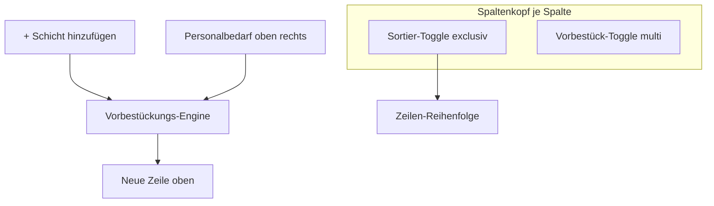
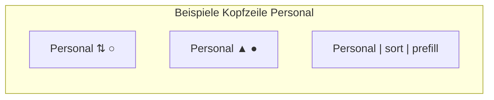
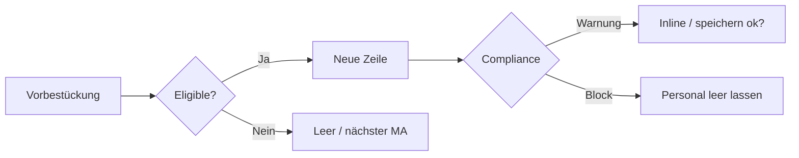

# Brainstorming: Spaltensteuerung Bulk-Schicht-Modal (Sortierung & Vorbestückung)

**Status:** Round 1 — offen  
**Kontext:** Erweiterung von `DashboardBulkShiftModal` („Personal Schichten/Einsatzzeiten zuweisen“).  
**Vorgänger:** `002-bulk-shift-assign-specification.md` (Basis-Modal, Personalbedarf oben rechts, Auto-MA „längste Pause“, Zeilen prepend oben, aktuelle Zeile hervorgehoben).

**Deine Notizen (Kern):**

- Pro Spaltenüberschrift **zwei dezente, unterschiedliche** Steuerelemente
- **Sortierung:** genau **eine** Spalte darf aktiv sortieren (global exclusiv)
- **Vorbestückung:** mehrere Spalten können aktiv sein; **nicht** bei Von/Bis
- Vorbestückung bei „+ Schicht hinzufügen“; Bedarf & Bedarfdeckung (Liste oben rechts) sind maßgeblich
- Person-Vorbestückung: längste Pause, Wunsch-Einsatzzeiten (neue Tabelle, später Mobile), gleiche Person mehrfach wenn Bedarf es verlangt, spätere Zeiten unten
- Schichtvorlagen-Vorbestückung: Zeiten prüfen vor Einfügen
- Problem: Sortierte Zeile springt bei Bearbeitung → verwirrend
- Frontend soll Einstellungen merken (Traffic minimieren)



---

## Round 1 — Scope, UI-Grundform & Sortier-Verhalten

### Q1 — **Scope:** Was gehört in dieses Feature (Release 1)?

- [ ] **A)** Nur UI + Logik im bestehenden Bulk-Modal (Sortierung, Vorbestückung, localStorage) — **Wunsch-Einsatzzeiten-Tabelle kommt später**, bis dahin nur Verfügbarkeit/Abwesenheit/Bedarf ⭐ **empfohlen**
- [x] **B)** Alles inkl. neuer DB-Tabelle „Wunsch-Einsatzzeiten“ + Mobile-API in **demselben** Release
- [ ] **C)** Nur Sortierung + Vorbestückung Personal/Schichtvorlage/Job; Wunschzeiten und „gleiche Person mehrfach“ explizit **Phase 2**
- [ ] **D)** Zusätzlich CSV-Import und Undo-Verhalten an neue Sort/Vorbestück-Regeln anpassen

**Deine Antwort:**


---

### Q2 — **Spalten mit Steuerelementen:** Welche Spalten bekommen welche Toggles?

| Spalte | Sortier-Toggle | Vorbestück-Toggle |
|--------|----------------|-------------------|
| Schichtvorlage | ? | ? |
| Job (Qualifikation) | ? | ? |
| Von | nein | nein |
| Bis | nein | nein |
| Personal | ? | ? |

- [x] **A)** Sortier-Toggle: **Schichtvorlage, Job, Personal, Von, Bis** — Vorbestück: **Schichtvorlage, Job, Personal** (Von/Bis ausgeschlossen) ⭐ **empfohlen** (Sort nach Zeit sinnvoll; Vorbestück nur wo sinnvoll)
- [ ] **B)** Sortier-Toggle nur: **Schichtvorlage, Personal, Von** — Vorbestück wie A
- [ ] **C)** Sortier-Toggle: **alle außer Indikator/Löschen** — Vorbestück nur Schichtvorlage + Personal
- [ ] **D)** Andere Aufteilung (bitte in Antwort konkretisieren)

**Deine Antwort:**


---

### Q3 — **UI der zwei Toggles:** Wie sollen Sortierung und Vorbestückung optisch unterscheidbar und dezent sein?



- [x] **A)** Zwei kleine **Icon-Buttons** rechts im `<th>` (z. B. Pfeil/⇅ für Sort, Punkt/Check für Vorbestück); aktiv = dezente Primary-Farbe ⭐ **empfohlen**
- [ ] **B)** Zwei **Mini-Toggles** (Schieberegler) unter dem Spaltennamen
- [ ] **C)** **Klick auf Spaltenname** = Sort; separates kleines Icon nur für Vorbestück
- [ ] **D)** Ein **Dropdown „Spaltenoptionen“** pro Spalte (Sort an/aus, Vorbestück an/aus)

**Deine Antwort:**


---

### Q4 — **Sortier-Richtung & Kriterium:** Wie sortieren die Spalten?

- [x] **A)** Ein Klick = aufsteigend; zweiter Klick = absteigend; dritter = aus (Sortierung deaktiviert) ⭐ **empfohlen**
- [ ] **B)** Nur aufsteigend, kein Richtungswechsel
- [ ] **C)** Sortierung nur **absteigend** bei Personal (= längste Pause zuerst sichtbar)
- [ ] **D)** Pro Spaltentyp fest: Zeit = chronologisch; Personal = alphabetisch; Schichtvorlage = Vorlagen-Reihenfolge; Job = Name

**Deine Antwort:**


---

### Q5 — **Sortierung vs. Bearbeiten (Springen-Problem):** Wann wird sortiert?

Das ist zentral für dein „Eintrag springt weg“-Problem.

- [x] **A)** **Manuell:** Sortierung nur bei Klick auf Sort-Toggle oder Button „Sortieren anwenden“ — während Bearbeitung **keine** Live-Umsortierung ⭐ **empfohlen**
- [ ] **B)** **Live:** Bei jeder Feldänderung sofort neu sortieren (aktuelle Zeile visuell markiert bleibt)
- [ ] **C)** **Hybrid:** Live nur für **neu hinzugefügte** Zeilen; bestehende Zeilen bleiben an Platz bis „Sortieren“
- [ ] **D)** Sortierung **nur beim OK/Speichern** (Modal-intern unsortiert)

**Deine Antwort:**


---

### Q6 — **Neue Zeilen & Sortierung:** „+ Schicht hinzufügen“ fügt oben ein — wie verhält sich das zur Sortierspalte?

- [x] **A)** Neue Zeile **immer oben** (aktueller Stand); Sort-Toggle beeinflusst nur **bestehende** Zeilen bei manuellem Anwenden ⭐ **empfohlen**
- [ ] **B)** Wenn Sort aktiv: neue Zeile direkt an **sortierte Position** einfügen
- [ ] **C)** Neue Zeile oben, aber sofort **visuell** an sortierte Position animieren
- [ ] **D)** Zurück zu „neue Zeile unten“ wenn Sortierung aktiv ist

**Deine Antwort:**


---

### Q7 — **Vorbestückung — welche Spalten initial?**

- [x] **A)** Standard beim Öffnen: **Schichtvorlage + Personal** vorbestückt an; Job aus — Manager kann toggeln ⭐ **empfohlen**
- [ ] **B)** Alle Vorbestück-Toggles **aus**; Manager merkt sich letzte Wahl (localStorage)
- [ ] **C)** Aus Personalbedarf abgeleitet: wenn Job im Bedarf definiert → Job-Vorbestück an
- [ ] **D)** Fest konfiguriert pro Organisation (Admin-Einstellung)

**Deine Antwort:**


---

### Q8 — **Frontend-Gedächtnis:** Was wird lokal gespeichert (pro Browser / pro User)?

- [x] **A)** Sortier-Spalte + Richtung + Vorbestück-Toggles pro Spalte (localStorage Key z. B. `bulkShiftColumnPrefs`) ⭐ **empfohlen**
- [ ] **B)** Nur Vorbestück-Toggles; Sortierung nie merken
- [ ] **C)** In **Profil/DB** persistieren (geräteübergreifend)
- [ ] **D)** Gar nichts — jedes Öffnen startet frisch

**Deine Antwort:**


---

## Hinweis — Themen für spätere Runden (noch nicht fragen)

Falls du in Round 1 schon Antworten hast, gerne ergänzen; sonst kommen diese in **Round 2+**:

- Wunsch-Einsatzzeiten (Schema, Mobile, Priorität vs. Verfügbarkeit)
- Algorithmus „gleiche Person mehrfach“ (Martin früh + spät) im Detail
- Schichtvorlagen-Vorbestückung vs. Bedarfszeitfenster
- Interaktion mit „aktuelle Zeile“-Indikator
- Bereits gespeicherte Zeilen (`existingShiftId`) bei Sort/Vorbestück
- Compliance/Overlap wenn Vorbestückung mehrere Zeilen auf einmal erzeugt
- i18n / Barrierefreiheit der Kopf-Toggles

**Offene Ergänzung aus deiner Frage „Habe ich alles bedacht?“** — wird nach Round 1–3 als Checkliste in der Specification zusammengeführt.

---

*Round 1 endet hier. Bitte Antworten unter jeder Frage eintragen (`[x]` + ggf. Freitext). Danach folgt Round 2.*

---

## Round 2 — Vorbestückungs-Engine, Wunsch-Einsatzzeiten & Randfälle

**Aus Round 1 (Entscheidungsstand):** Release inkl. Wunsch-Einsatzzeiten-Tabelle + Mobile-API · Sort/Vorbestück-Icons in allen relevanten Spalten · manuelle Sortierung · neue Zeile oben · Standard-Vorbestück Schichtvorlage + Personal · localStorage.

```mermaid
flowchart TD
  click["+ Schicht hinzufügen"]
  demand[Personalbedarf-Liste]
  prefs[Vorbestück-Toggles]
  click --> engine[Vorbestückungs-Engine]
  demand --> engine
  prefs --> engine
  wishes[Wunsch-Einsatzzeiten DB]
  pause[Längste Pause ohne Schicht]
  avail[Verfügbarkeit / Abwesenheit]
  wishes --> engine
  pause --> engine
  avail --> engine
  engine --> row[Neue Zeile oben]
```

---

### Q9 — **Wunsch-Einsatzzeiten (Schema):** Wie werden Wunschzeiten pro Mitarbeiter gespeichert?

- [x] **A)** Neue Tabelle z. B. `profile_shift_preferences`: `profile_id`, `weekday`, `start_time`, `end_time`, optional `location_area_id` / `priority` — mehrere Einträge pro MA/Wochentag möglich ⭐ **empfohlen**
- [ ] **B)** Ein JSON-Feld am Profil (`shift_wish_json`) — schneller, weniger normalisiert
- [ ] **C)** Erweiterung von `profile_recurring_availability` mit Flag `is_preferred` (Wunsch vs. Verfügbarkeit)
- [ ] **D)** Wunschzeiten nur als **Tag + Bereich + Zeitfenster** ohne Wochentag-Wiederholung

**Deine Antwort:**


---

### Q10 — **Mobile-API (Wunschzeiten):** Was liefert Release 1 für die Mobile-App?

- [x] **A)** CRUD-Endpoints (lesen/anlegen/ändern/löschen) für eigene Wunsch-Einsatzzeiten; Web-Bulk nutzt sie nur lesend ⭐ **empfohlen**
- [ ] **B)** Nur **Lesen** in Web; Schreiben erst in Mobile-App (separater Sprint)
- [ ] **C)** Gleiche Server Actions wie Web-Settings (kein separates Mobile-API)
- [ ] **D)** Wunschzeiten in Release 1 **nur** per Web-Admin für MA pflegbar (Mobile später)

**Deine Antwort:**


---

### Q11 — **Priorität bei Personal-Vorbestückung:** In welcher Reihenfolge entscheidet die Engine?

Beispiel: Zwei MA wünschen 08:00–12:00; Bedarf 08:00–10:00; beide verfügbar; MA A länger ohne Schicht als MA B.

- [x] **A)** 1) Verfügbar + nicht abwesend → 2) passt zu **Bedarf-Servicezeit** → 3) **Wunsch-Einsatzzeit** überlappt Fenster → 4) bei Gleichstand **längste Pause** → 5) alphabetisch ⭐ **empfohlen**
- [ ] **B)** Wunsch-Einsatzzeit **vor** längster Pause
- [ ] **C)** Längste Pause **vor** Wunsch-Einsatzzeit
- [ ] **D)** Nur längste Pause (Wunschzeiten ignorieren bis Phase 2 — widerspricht Q1=B, nur falls du Q1 revidierst)

**Deine Antwort:**


---

### Q12 — **Gleiche Person mehrfach:** Wann legt „+ Schicht hinzufügen“ dieselbe Person in einer **neuen** Zeile an?

*(Schichtvorlagen-Vorbestück **aus**, Personal-Vorbestück **an**.)*

- [x] **A)** Nur wenn **offener Bedarf** für dasselbe Servicezeit-Fenster noch `assigned < required` und MA erneut eligible (andere Zeit / zweite Schicht am Tag) ⭐ **empfohlen**
- [ ] **B)** Immer dieselbe Person wiederholen bis Bedarf gedeckt (mehrere Klicks = gleicher MA)
- [ ] **C)** Gleiche Person nur wenn **explizit** Sortierung nach Personal aktiv und Manager mehrere Zeilen manuell anlegt
- [ ] **D)** Nie automatisch — immer nächster MA in Rotationsliste

**Deine Antwort:**


---

### Q13 — **Reihenfolge bei mehreren Einsatzzeiten (08–10, 12–15, 18–22):** Wie wählt die Engine das **nächste** Bedarf-Fenster?

- [x] **A)** Chronologisch: erst ungedecktes **frühestes** Servicezeit-Fenster des Tages ⭐ **empfohlen**
- [ ] **B)** Fenster mit **größter Unterdeckung** (`required − assigned`)
- [ ] **C)** Reihenfolge wie in Personalbedarf-Tabelle oben rechts (UI-Reihenfolge)
- [ ] **D)** Manager wählt aktiv Zeile/Bedarf per Klick in Bedarfs-Liste (neue Zeile übernimmt Auswahl)

**Deine Antwort:**


---

### Q14 — **Schichtvorlagen-Vorbestückung:** Was passiert bei aktivem Schichtvorlagen-Toggle?

- [x] **A)** Vorlage aus **Bedarf-Servicezeit** (passende Vorlage im Fenster); Von/Bis aus Vorlage; wenn keine passt → Zeile mit Bedarfszeiten aber **leere** Vorlage ⭐ **empfohlen**
- [ ] **B)** Immer **erste passende** Vorlage des Bereichs, unabhängig vom Bedarf
- [ ] **C)** Schichtvorlage leer lassen; nur Von/Bis aus Bedarf (Toggle wirkt indirekt über Zeiten)
- [ ] **D)** Bei Konflikt **keine** neue Zeile — Hinweis „Keine passende Schichtvorlage“

**Deine Antwort:**


---

### Q15 — **Job-Vorbestückung (Qualifikation):** Logik wenn Toggle an?

- [ ] **A)** Job aus **Personalbedarf** für gewähltes Servicezeit-Fenster; wenn MA gewählt und Job passt nicht → Warnung, Zeile trotzdem ⭐ **empfohlen**
- [ ] **B)** Job aus MA-Qualifikationen (erster passender zum Bedarf)
- [ ] **C)** Job immer leer — Toggle nur für manuelle Mehrfachauswahl in späterer Version
- [ ] **D)** Job = Pflicht bei Vorbestück; ohne passenden Job keine Zeile anlegen

**Deine Antwort:**
A, aber es sollten eigentlich nur Mitarbeiter mit Jobs auswählbar sein, die für Jobs des Personalbedarfs passen.

---

### Q16 — **Bereits gespeicherte Zeilen (`existingShiftId`):** Wie behandeln Sort & Vorbestück?

- [x] **A)** Gespeicherte Zeilen **bleiben sichtbar**, zählen für Bedarf, nehmen an Sortierung teil; Vorbestückung berücksichtigt sie bei `assigned` ⭐ **empfohlen**
- [ ] **B)** Gespeicherte Zeilen **ausblenden** oder grau (nur neue Zeilen editierbar)
- [ ] **C)** Gespeicherte Zeilen **von Sortierung ausnehmen** (immer oben/unten fix)
- [ ] **D)** Gespeicherte Zeilen **nicht** im Modal — nur im Kalender sichtbar

**Deine Antwort:**


---

### Q17 — **Manuelle Sortierung anwenden:** Wie genau (Round 1 Q5=A)?

- [x] **A)** Klick auf Sort-Icon **wendet sofort** Sortierung an (Zyklus auf/ab/aus); **kein** separater Button ⭐ **empfohlen**
- [ ] **B)** Sort-Icon wählt nur Spalte; Button **„Sortieren“** unten wendet an
- [ ] **C)** Sort-Icon + Bestätigung („Reihenfolge ändern?“) wenn >3 Zeilen
- [ ] **D)** Automatisch beim Schließen des Dropdowns / Verlassen der Zeile

**Deine Antwort:**


---

### Q18 — **Mehrere Zeilen auf einmal:** Soll es neben „+ Schicht hinzufügen“ eine Aktion geben, die **alle offenen Bedarf-Slots** auf einmal vorbefüllt?

- [x] **A)** Nein — nur **eine Zeile pro Klick**; Manager klickt wiederholt ⭐ **empfohlen** (einfacher, weniger Überraschungen)
- [ ] **B)** Ja — Button „**Alle offenen Bedarfe befüllen**“ (max. Zeilen-Limit 20)
- [ ] **C)** Ja — aber nur für **aktuell ausgewähltes** Servicezeit-Fenster (Mehrfach innerhalb eines Fensters)
- [ ] **D)** Long-Press / Shift+Klick auf „+“ für Batch

**Deine Antwort:**


---

## Hinweis — Round 3 (Vorschau)

- Compliance (Ruhezeit, Overlap) bei Vorbestückung
- Interaktion **aktuelle Zeile** + Sortierung
- CSV-Import / Undo
- i18n, Tooltips, Barrierefreiheit der Kopf-Icons
- Checkliste „Habe ich alles bedacht?“

---

*Round 2 endet hier. Bitte Antworten unter jeder Frage eintragen. Danach folgt Round 3.*

---

## Round 3 — Compliance, UX-Randfälle, Import/Undo & Abschluss

**Aus Round 2 (Entscheidungsstand):** `profile_shift_preferences` + Mobile-CRUD · Priorität Verfügbarkeit → Bedarf → Wunsch → Pause · gleiche Person nur bei offenem Bedarf · chronologische Bedarf-Fenster · Schichtvorlage aus Bedarf · Job aus Bedarf (nur MA mit passenden Jobs wählbar) · gespeicherte Zeilen bleiben · Sort sofort per Icon · eine Zeile pro Klick.



---

### Q19 — **Job-Filter (Präzisierung Q15):** Wie strikt ist „nur MA mit passendem Job“?

- [x] **A)** Personal-Combobox listet **nur** MA mit mindestens einer Bedarf-Qualifikation für das Fenster; Vorbestückung wählt nur aus dieser Liste ⭐ **empfohlen**
- [ ] **B)** Alle verfügbaren MA sichtbar; nicht passende **ausgegraut** mit Hinweis
- [ ] **C)** Alle sichtbar; Vorbestückung bevorzugt passende, fällt sonst auf „längste Pause“ unter allen zurück
- [ ] **D)** Wie heute (Area-Qualifikation); Bedarf-Job nur Ampel-Warnung

**Deine Antwort:**


---

### Q20 — **Compliance bei Vorbestückung:** Was passiert, wenn der vorgeschlagene MA **regelwidrig** wäre (Overlap, Ruhezeit, Tagesstunden)?

- [x] **A)** **Nächster eligible MA** in Prioritätskette; Zeile wird trotzdem angelegt ⭐ **empfohlen**
- [ ] **B)** MA-Feld **leer** lassen; Rest (Zeiten/Vorlage/Job) vorbestückt; Manager wählt manuell
- [ ] **C)** **Keine Zeile** anlegen — Toast „Kein passendes Personal“
- [ ] **D)** MA setzen + **deutliche Warnung** in Zeile; Speichern blockiert bis Korrektur

**Deine Antwort:**


---

### Q21 — **Overlap im Modal:** Zählen ungespeicherte Zeilen gegeneinander bei Vorbestückung?

*(MA bereits in Zeile 1 für 08–10; Bedarf 08–10 braucht 2; Klick „+ Schicht“.)*

- [x] **A)** Ja — bereits belegte MA/Zeiten in **anderen Modal-Zeilen** schließen Kandidaten aus (wie Server-Overlap) ⭐ **empfohlen**
- [ ] **B)** Nur **gespeicherte** Schichten + andere Bereiche zählen; Modal-Zeilen erst beim OK
- [ ] **C)** Overlap im Modal erlaubt; Server blockt beim Speichern
- [ ] **D)** Overlap im Modal erlaubt; **visuelle Warnung** pro Zeile

**Deine Antwort:**


---

### Q22 — **„Aktuelle Zeile“ + Sortierung:** Was passiert nach manuellem Sortieren?

- [x] **A)** **Aktuelle Zeile** = weiterhin erste **ungespeicherte** Zeile für nächsten Bedarf (nach Sort ggf. **nicht mehr oben**); Indikator springt mit ⭐ **empfohlen**
- [ ] **B)** Sortierung **deaktiviert** visuell die „aktuelle Zeile“-Markierung bis nächster „+ Klick“
- [ ] **C)** Nach Sort: **oberste ungespeicherte** Zeile wird „aktuell“, unabhängig vom Bedarf
- [ ] **D)** „Aktuelle Zeile“-Feature **entfällt**, wenn Sort aktiv

**Deine Antwort:**


---

### Q23 — **Neue Zeile oben vs. Sort:** Nach Sortieren — wo landet der nächste „+ Klick“?

*(Round 1: neue Zeile immer oben; Round 2: Sort sofort.)*

- [x] **A)** **Immer oben** einfügen (Round 1); sortierte Ansicht zeigt sie ggf. woanders — Indikator zeigt edit-Zeile ⭐ **empfohlen**
- [ ] **B)** Wenn Sort **aktiv**: neue Zeile direkt an **sortierte Position** (Round 1 Q6-B revidieren)
- [ ] **C)** Beim „+ Klick“ Sortierung **automatisch aus** (Reset)
- [ ] **D)** Beim „+ Klick“ kurz **Bestätigung** wenn Sort aktiv

**Deine Antwort:**


---

### Q24 — **Wunsch-Einsatzzeiten vs. Verfügbarkeit:** Was gilt bei Widerspruch?

*(MA wünscht 08–12, Verfügbarkeit nur 14–18.)*

- [x] **A)** Wunsch nur als **Priorisierung** unter eligible MA; ohne Verfügbarkeit **kein** Einsatz ⭐ **empfohlen**
- [ ] **B)** Wunsch kann Verfügbarkeit **erweitern** (weicher Wunsch)
- [ ] **C)** Mobile-App verhindert Wunsch außerhalb Verfügbarkeit schon beim Speichern
- [ ] **D)** Manager-Warnung im Bulk-Modal, aber Zuweisung möglich

**Deine Antwort:**


---

### Q25 — **CSV-Import & Spalten-Prefs:** Verhalten beim Importieren?

- [x] **A)** Import **ignoriert** Vorbestück-Toggles; Zeilen wie bisher aus CSV; Sort-Prefs **nicht** auto-angewendet ⭐ **empfohlen**
- [ ] **B)** Import nutzt aktive Vorbestück-Regeln zum **Anreichern** leerer CSV-Felder
- [ ] **C)** Nach Import automatisch **Sortierung anwenden** wenn Sort-Spalte aktiv
- [ ] **D)** Import setzt alle Spalten-Prefs zurück

**Deine Antwort:**


---

### Q26 — **Undo (letzter Batch):** Nach Speichern mit neuer Sort/Reihenfolge?

- [x] **A)** Undo wie heute (DB-Rollback); **kein** Restore der Modal-Zeilen-Reihenfolge ⭐ **empfohlen**
- [ ] **B)** Undo stellt auch **Modal-Zustand** (Zeilen + Sort + Toggles) wieder her
- [ ] **C)** Undo entfällt, wenn Sort/Vorbestück-Features aktiv
- [ ] **D)** Undo nur für **neu erstellte** Schichten; Sort irrelevant

**Deine Antwort:**


---

### Q27 — **Frontend-Datenladung (Traffic):** Was wird einmalig beim Modal-Open geladen?

- [x] **A)** Wie heute: MA, Qualis, Abwesenheiten, Compliance-Kontext **einmal**; **neu:** Wunsch-Einsatzzeiten aller MA des Standorts für den Tag/Wochentag im selben Request ⭐ **empfohlen**
- [ ] **B)** Wunschzeiten **lazy** pro MA bei Hover/Vorbestück
- [ ] **C)** Alles inkl. Wunschzeiten in **IndexedDB** cachen (TTL 24h)
- [ ] **D)** Separater Request pro „+ Schicht“-Klick

**Deine Antwort:**


---

### Q28 — **Kopf-Icons: i18n & Barrierefreiheit**

- [x] **A)** Icons mit `aria-label` + Tooltip (z. B. „Nach Personal sortieren“, „Personal automatisch vorbestücken“); Labels in `dashboard.*` ⭐ **empfohlen**
- [ ] **B)** Nur `aria-label`, kein Hover-Tooltip
- [ ] **C)** Text-Abkürzungen statt Icons (S / V)
- [ ] **D)** Erst Tooltip bei Fokus (Keyboard), nicht bei Hover

**Deine Antwort:**


---

### Q29 — **Checkliste „Habe ich alles bedacht?“** — welche Punkte fehlen noch im Scope?

*(Mehrfachauswahl möglich — bitte `[x]` setzen oder in Freitext ergänzen.)*

- [ ] **A)** **Bedarfs-Liste klickbar** → nächste Zeile übernimmt gewähltes Fenster (Q13-D-Nachholer)
- [ ] **B)** **Drag&Drop** Zeilen bleibt; Sort-Toggle ist **zusätzlich**, kein Ersatz
- [ ] **C)** **Max. 20 Zeilen** — Verhalten wenn Bedarf >20 Slots
- [ ] **D)** **Mehrere Bereiche** am selben Tag (Cross-Area Ruhezeit) bei Vorbestückung
- [ ] **E)** **Audit/Logging** wer welche Vorbestück-Regeln genutzt hat
- [x] **F)** Nichts Wesentliches fehlt — bereit für Specification ⭐ **empfohlen wenn du zustimmst**

**Deine Antwort:**


---

### Q30 — **Abschluss:** Ist Round 3 die **letzte** Brainstorming-Runde vor der Specification?

- [x] **A)** Ja — nach Beantwortung Q19–Q30 schreibst du `005-bulk-shift-column-controls-specification.md` ⭐ **empfohlen**
- [ ] **B)** Nein — noch **Round 4** (Mobile-UI Wunschzeiten im Detail)
- [ ] **C)** Nein — noch **Round 4** (nur Technologie/API-Design)
- [ ] **D)** Specification in **zwei Docs** (Web Bulk vs. Mobile Wunschzeiten)

**Deine Antwort:**


---

*Round 3 endet hier. Bitte Antworten unter jeder Frage eintragen. Bei Q30=A folgt die vollständige Specification.*
