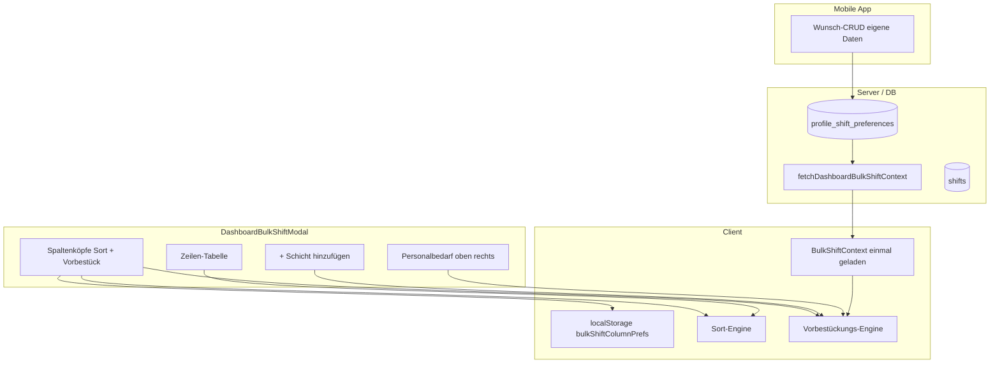

# Specification: Bulk-Schicht-Modal — Spalten-Sortierung & Vorbestückung

**Version:** 1.0  
**Status:** Freigegeben zur Implementierung  
**Quelle:** `specs/005-bulk-shift-column-controls-brainstorming.md` (Runden 1–3)  
**Scope:** Web-App (`apps/web`) Bulk-Modal · Mobile-App (`apps/mobile`) Wunsch-Einsatzzeiten · `packages/database`

**Erweitert:** `002-bulk-shift-assign-specification.md` — ersetzt/ergänzt dort u. a. „kein Auto-Fill“, „neue Zeile am Ende“, reine Button-Sortierung.

---

## 1. Ziel

Im Modal **„Personal Schichten/Einsatzzeiten zuweisen“** (`DashboardBulkShiftModal`) erhalten Spaltenköpfe zwei dezente Steuerungen:

1. **Sortierung** — global exclusiv: höchstens eine Spalte sortiert die Zeilenliste.
2. **Vorbestückung** — pro Spalte unabhängig aktivierbar (außer Von/Bis): steuert, welche Felder beim Klick **„+ Schicht hinzufügen“** automatisch befüllt werden.

Zusätzlich im selben Release:

- Neue Tabelle **Wunsch-Einsatzzeiten** (`profile_shift_preferences`)
- **Mobile-CRUD** für Mitarbeiter (eigene Wünsche pflegen)
- Web-Bulk lädt Wunschzeiten **einmalig** beim Modal-Open (Traffic-minimiert)
- Spalten-Präferenzen in **localStorage** (`bulkShiftColumnPrefs`)

**Maßgeblich bleiben** die Uhrzeit-Felder Von/Bis (002). Personalbedarf oben rechts bleibt Referenz für Bedarf und Deckung.

---

## 2. Entscheidungsübersicht

| Bereich | Entscheidung |
|---------|--------------|
| Release-Scope | Bulk Sort/Vorbestück + DB Wunschzeiten + Mobile-CRUD (Q1=B) |
| Sort-Spalten | Schichtvorlage, Job, Personal, Von, Bis (Q2=A) |
| Vorbestück-Spalten | Schichtvorlage, Job, Personal — **nicht** Von/Bis (Q2=A) |
| Kopf-UI | Zwei Icon-Buttons pro `<th>` (Sort ⇅ / Vorbestück ●); aktiv = Primary (Q3=A) |
| Sort-Zyklus | Aufsteigend → absteigend → aus (Q4=A) |
| Sort-Zeitpunkt | Nur beim Klick auf Sort-Icon; **keine** Live-Sort bei Feldänderung (Q5=A) |
| Sort anwenden | Sofort beim Icon-Klick; kein separater „Sortieren“-Button nötig (Q17=A) |
| Neue Zeile | **Immer oben** einfügen; Sort betrifft Anzeige bestehender Zeilen (Q6=A, Q23=A) |
| Vorbestück Standard | Schichtvorlage + Personal **an**, Job **aus** (Q7=A) |
| localStorage | Sort-Spalte, Richtung, Vorbestück-Toggles (Q8=A) |
| Wunsch-Schema | `profile_shift_preferences` (Q9=A) |
| Mobile-API | CRUD für eigene Wünsche; Web nur lesend (Q10=A) |
| MA-Priorität | Verfügbar → Bedarf-Fenster → Wunsch-Overlap → längste Pause → alphabetisch (Q11=A) |
| Gleiche Person | Nur bei offenem Bedarf im Fenster + eligible (Q12=A) |
| Nächstes Fenster | Chronologisch frühestes ungedecktes Servicezeit-Fenster (Q13=A) |
| Schichtvorlage | Aus Bedarf; Von/Bis aus Vorlage; sonst leere Vorlage + Bedarfszeiten (Q14=A) |
| Job | Aus Personalbedarf; Combobox nur MA mit passendem Job (Q15+A, Q19=A) |
| Gespeicherte Zeilen | Sichtbar, zählen für Bedarf/Sort/Vorbestück (Q16=A) |
| Zeilen pro Klick | Eine Zeile; kein „Alle Bedarfe befüllen“ (Q18=A) |
| Compliance Vorbestück | Nächster eligible MA in Kette (Q20=A) |
| Modal-Overlap | Ungespeicherte Zeilen schließen Kandidaten aus (Q21=A) |
| Aktuelle Zeile | Erste ungespeicherte Zeile für nächsten Bedarf; Indikator folgt nach Sort (Q22=A) |
| Wunsch vs. Verfügbarkeit | Wunsch nur Priorisierung; ohne Verfügbarkeit kein Einsatz (Q24=A) |
| CSV-Import | Ignoriert Vorbestück/Sort-Prefs (Q25=A) |
| Undo | DB-Rollback wie heute; kein Modal-State-Restore (Q26=A) |
| Datenladen | Ein Request inkl. Wunschzeiten aller MA für Wochentag (Q27=A) |
| a11y / i18n | `aria-label` + Tooltip; Keys unter `dashboard.*` (Q28=A) |
| Drag&Drop | Bleibt aus 002; Sort-Toggle **zusätzlich** (Q29, implizit) |
| Zeilen-Limit | Max. 20 (002); bei Bedarf >20: Manager füllt iterativ bis Limit |
| Out of scope | Klickbare Bedarfs-Liste (Q13-D), Audit-Logging (Q29) |

---

## 3. Architektur (Überblick)



---

## 4. Datenmodell

### 4.1 Tabelle `profile_shift_preferences` (neu)

**Migration:** `packages/database/migrations/YYYYMMDD_profile_shift_preferences.sql`

```sql
create table public.profile_shift_preferences (
  id uuid primary key default gen_random_uuid(),
  organization_id uuid not null references public.organizations(id) on delete cascade,
  profile_id uuid not null references public.profiles(id) on delete cascade,
  weekday smallint not null,
  start_time time not null,
  end_time time not null,
  location_area_id uuid references public.location_areas(id) on delete set null,
  priority smallint not null default 0,
  created_at timestamptz not null default now(),
  updated_at timestamptz not null default now(),
  constraint profile_shift_preferences_weekday_check check (weekday >= 0 and weekday <= 6),
  constraint profile_shift_preferences_time_check check (start_time <> end_time)
);

create index profile_shift_preferences_org_profile_weekday_idx
  on public.profile_shift_preferences (organization_id, profile_id, weekday);

create index profile_shift_preferences_area_idx
  on public.profile_shift_preferences (location_area_id)
  where location_area_id is not null;
```

| Feld | Bedeutung |
|------|-----------|
| `weekday` | Wie `profile_recurring_availability`: Montag = 0 … Sonntag = 6; **FT = 7** falls bereits für Verfügbarkeit eingeführt — konsistent halten |
| `start_time` / `end_time` | Gewünschtes Einsatzfenster (TIME, keine Zeitzone) |
| `location_area_id` | Optional: Wunsch nur für Bereich; `null` = standortweit / unspezifisch |
| `priority` | Höher = stärkerer Wunsch bei Gleichstand (optional nutzen) |

**Regeln:**

- Mehrere Einträge pro `profile_id` + `weekday` erlaubt.
- Wunsch **ersetzt nicht** Verfügbarkeit — nur Priorisierung unter bereits eligible MA (Q24=A).
- Mobile-App soll beim Speichern **empfehlen**, Wunsch innerhalb Verfügbarkeit zu halten; Server validiert optional weich (Warnung), harte Blockade nur wenn explizit gewünscht (nicht in v1).

`schema.sql` und `packages/database` Types/Repository-Methoden synchron halten.

### 4.2 Erweiterung Bulk-Context (Web)

**`fetchDashboardBulkShiftContext(date)`** liefert zusätzlich:

```typescript
profileShiftPreferences: Record<
  string, // profile_id
  Array<{
    weekday: number;
    start_time: string;
    end_time: string;
    location_area_id: string | null;
    priority: number;
  }>
>;
```

Filter serverseitig: `weekday` = Wochentag von `date` (+ FT wenn `date` Feiertag und FT-Slots existieren).

---

## 5. Mobile-App — Wunsch-Einsatzzeiten

### 5.1 Scope Mobile UI (Minimal v1)

- Neuer Tab oder Unterbereich unter **Verfügbarkeit** (Ersetzung des Platzhalter-Screens): Liste der eigenen Wunsch-Einsatzzeiten pro Wochentag.
- CRUD: anlegen, bearbeiten, löschen (Q10=A).
- Nur **eigenes** Profil (`profile_id` = eingeloggter User).

### 5.2 API-Zugang

**Empfohlen:** Supabase Client + **RLS-Policies**:

| Operation | Wer |
|-----------|-----|
| SELECT | Eigenes Profil + Manager der Organisation (Bulk) |
| INSERT/UPDATE/DELETE | Nur eigenes Profil |

Alternative gleichwertig: Server Actions / REST unter `apps/mobile` — muss dieselben Regeln erzwingen.

### 5.3 Abgrenzung Verfügbarkeit

| | Verfügbarkeit | Wunsch-Einsatzzeit |
|---|---------------|-------------------|
| Zweck | Hard-Filter (eligible?) | Priorisierung unter Eligible |
| Pflege | Web Settings + künftig Mobile | Mobile (Release) + lesend Web |
| Tabelle | `profile_recurring_availability` | `profile_shift_preferences` |

---

## 6. UI — Spaltenköpfe

### 6.1 Betroffene Spalten

| Spalte | Sort-Icon | Vorbestück-Icon |
|--------|-----------|-----------------|
| Indikator | — | — |
| Schichtvorlage | ja | ja |
| Job | ja | ja |
| Von | ja | **nein** |
| Bis | ja | **nein** |
| Personal | ja | ja |
| Löschen | — | — |

### 6.2 Icon-Verhalten

**Sort-Icon (exclusiv global):**

- Klick auf Spalte X: wenn X inactive → **aufsteigend**; wenn X asc → **absteigend**; wenn X desc → **aus** (keine Sortierung).
- Aktivierung sortiert **sofort** alle Zeilen (inkl. `existingShiftId`).
- Andere Spalten-Sort-Icons werden deaktiviert.
- **Keine** Neusortierung bei Inline-Edit (Q5=A).

**Vorbestück-Icon (unabhängig pro Spalte):**

- Toggle an/aus; mehrere gleichzeitig aktiv erlaubt.
- Wirkt nur auf **„+ Schicht hinzufügen“**, nicht auf bestehende Zeilen rückwirkend.
- Standard beim ersten Besuch: Schichtvorlage + Personal an, Job aus (Q7=A); danach localStorage.

### 6.3 Sortier-Kriterien pro Spalte

| Spalte | Aufsteigend (Default) |
|--------|------------------------|
| Schichtvorlage | Name der Vorlage; leer zuletzt |
| Job | Qualifikationsname; leer zuletzt |
| Von | Uhrzeit chronologisch; unvollständig zuletzt |
| Bis | Uhrzeit chronologisch; unvollständig zuletzt |
| Personal | Nachname, Vorname (aus `full_name` splitten); leer zuletzt |

Absteigend = Umkehrung. Bei Personal optional sekundär Von-Zeit (nicht zwingend v1).

### 6.4 localStorage

**Key:** `schichtwerk.bulkShiftColumnPrefs` (oder `bulkShiftColumnPrefs`)

```typescript
type BulkShiftColumnPrefs = {
  sort: { column: BulkSortColumn | null; direction: "asc" | "desc" | null };
  prefill: {
    template: boolean;
    qualification: boolean;
    employee: boolean;
  };
};
```

- Beim Modal-Open: prefs laden; fehlende Keys → Defaults (Q7=A).
- Beim Toggle-Change: sofort persistieren.

### 6.5 i18n & Barrierefreiheit (Q28=A)

Neue Keys (Beispiele DE):

| Key | DE |
|-----|-----|
| `dashboard.bulkShiftSortColumn` | Nach {column} sortieren |
| `dashboard.bulkShiftSortAsc` | Aufsteigend sortiert |
| `dashboard.bulkShiftSortDesc` | Absteigend sortiert |
| `dashboard.bulkShiftPrefillColumn` | {column} bei neuer Zeile automatisch vorbestücken |
| `dashboard.bulkShiftPrefillActive` | Automatische Vorbestückung für {column} aktiv |

Icons: `aria-pressed` für Toggles; Tooltip + `aria-label` identisch.

---

## 7. Vorbestückungs-Engine

### 7.1 Trigger

Nur bei **`performAddRow` / „+ Schicht hinzufügen“** (eine Zeile pro Klick, Q18=A).

Ablauf:

1. Nächstes **Bedarf-Servicezeit-Fenster** ermitteln (§7.2).
2. Pro aktivem Vorbestück-Toggle Felder setzen (§7.3–7.5).
3. Zeile **oben** in `rows` einfügen (Q23=A).
4. **`demandServiceHourId`** am Row-Objekt setzen (bestehendes Feld).

### 7.2 Nächstes Bedarf-Fenster

Eingabe: `staffingEntries` (Personalbedarf oben rechts), alle `rows` inkl. gespeicherte.

Algorithmus (Q13=A):

1. Servicezeit-Fenster des Tages **chronologisch** sortieren.
2. Erstes Fenster mit `assigned < required` wählen.
3. `assigned` zählt Zeilen mit passendem `demandServiceHourId` **oder** überlappenden Von/Bis + passender Qualifikation (bestehende Logik `computeBulkModalStaffingEntries`).

Wenn alle Fenster gedeckt: Fallback wie `staffingEntryForNewBulkRow` heute (Wiederholung / erstes Fenster) — Zeile trotzdem anlegbar.

### 7.3 Schichtvorlagen-Vorbestückung (Toggle an)

(Q14=A)

1. Von/Bis aus **Bedarf-Servicezeit** (via `personalbedarfDemandTimesForEntry`).
2. Passende **Schichtvorlage** im Fenster suchen (`resolvePresetShiftTemplateForDemandTimes` / Filter).
3. Wenn genau eine / passende Vorlage: `shiftTypeId` + Von/Bis aus Vorlage.
4. Wenn keine Vorlage passt: Von/Bis aus Bedarf, **`shiftTypeId` leer**.

Vor Einfügen: Von/Bis müssen innerhalb Servicezeiten liegen (bestehende Validierung).

### 7.4 Job-Vorbestückung (Toggle an)

(Q15 + Q19)

1. Job aus **Personalbedarf** für gewähltes `serviceHourId` (`presetQualificationForServiceHour`).
2. Personal-Combobox filtert **strikt**: nur MA mit mindestens einer Qualifikation aus der Bedarf-Menge für dieses Fenster.
3. Vorbestückung wählt MA nur aus dieser Liste (§7.5).

Toggle **aus**: Job-Feld leer; MA-Filter weiterhin bedarfsbasiert wenn Job manuell gesetzt.

### 7.5 Personal-Vorbestückung (Toggle an)

Prioritätskette (Q11=A) — Kandidaten = MA aus §7.4 Filter, zusätzlich:

1. **Verfügbarkeit** für geplantes Von/Bis am Tag; **keine** genehmigte Abwesenheit.
2. Passt zu **Bedarf-Servicezeit** (Zeitfenster der Zeile).
3. **Wunsch-Einsatzzeit** überlappt Bedarf-Fenster (`profile_shift_preferences` für Wochentag; optional `location_area_id` match oder null).
4. **Längste Pause** seit letzter Schicht (`last_shift_date` / bestehende Logik).
5. **Alphabetisch** `full_name`.

**Compliance** (Q20=A, Q21=A): Für jeden Kandidaten in Reihenfolge prüfen:

- Kein Overlap mit **anderen Modal-Zeilen** (gleicher Tag, gleicher Bereich).
- Kein Overlap mit **gespeicherten** Schichten des MA (Modal + DB).
- Ruhezeit / Tagesstunden (clientseitig dieselben Regeln wie `validateShiftLaborCompliance` / Day-Compliance soweit im Modal bereits vor OK).

Erster MA der alle Checks besteht → setzen. Sonst nächster Kandidat. Wenn keiner: **Personal leer**, Restfelder trotzdem vorbestückt.

**Gleiche Person erneut** (Q12=A): Erlaubt, wenn nach Zuweisung in neuer Zeile weiterhin `assigned < required` **im selben** Servicezeit-Fenster und MA für **neue** Zeiten eligible (z. B. zweiter Kellner 08–10). Nicht erlaubt: dieselbe Person zweimal **überlappend** im Modal.

### 7.6 Toggle aus — Verhalten

| Spalte | Toggle aus |
|--------|------------|
| Schichtvorlage | `shiftTypeId` leer; Von/Bis weiter aus Bedarf wenn anderer Toggle/Zeitlogik |
| Job | `qualificationId` leer |
| Personal | `employeeId` = leer (EMPTY) |

Von/Bis: immer aus Bedarf-Fenster (nicht togglebar); unabhängig von Schichtvorlagen-Toggle.

---

## 8. Interaktion mit bestehenden Features

### 8.1 Aktuelle Zeile (Indikator)

- **Definition:** Erste **ungespeicherte** Zeile (`!existingShiftId`), die zum `staffingEntryForNewBulkRow`-Ziel passt (bestehende `resolveCurrentBulkShiftRowId`-Logik).
- Nach **Sort:** Indikator folgt dieser Zeile — sie kann visuell nicht mehr oben stehen (Q22=A).
- Neue Zeile via „+“: **immer** oben eingefügt; Indikator = diese Zeile bis Vorbestückung abgeschlossen / Bedarf wechselt.

### 8.2 Gespeicherte Zeilen (`existingShiftId`)

- Bleiben in Tabelle sichtbar (Q16=A).
- Zählen in Bedarf `assigned`.
- Nehmen an Sortierung teil.
- Vorbestückung berücksichtigt sie bei Kandidaten-Ausschluss / Bedarf-Zählung.

### 8.3 Drag&Drop

- Unverändert aus 002 (falls implementiert).
- Manuelle Reihenfolge per Drag und Sort-Toggle können kollidieren: **Sort-Anwenden** überschreibt manuelle Order; kein Merge ( dokumentiert, kein Sonderfall v1).

### 8.4 CSV-Import (Q25=A)

- Importierte Zeilen: **keine** Vorbestück-Toggles anwenden.
- Sort-Prefs **nicht** automatisch anwenden nach Import.
- Manager kann Sort manuell aktivieren.

### 8.5 Undo (Q26=A)

- Unverändert: letzter Batch DB-Undo.
- Modal schließt bzw. refresh; **kein** Wiederherstellen von Sort/Vorbestück/Toggle-State.

### 8.6 OK / Speichern

- Unverändert zu 002 (Batch, Partial Success, modale Fehlerliste).
- Sort- und Vorbestück-State irrelevant für Persistenz-Reihenfolge.

---

## 9. Technische Umsetzung (Orientierung)

### 9.1 Neue / geänderte Module (Web)

| Modul | Aufgabe |
|-------|---------|
| `bulk-shift-column-prefs.ts` | localStorage load/save, Defaults |
| `bulk-shift-row-sort.ts` | Sortierfunktionen pro Spalte |
| `bulk-shift-row-prefill.ts` | Vorbestückungs-Engine §7 |
| `dashboard-bulk-shift-modal.tsx` | Kopf-Icons, Integration |
| `dashboard-shift-assign.ts` | Context + Wunschzeiten |
| `packages/database` | CRUD `profile_shift_preferences` |

### 9.2 Tests (Pflicht)

- Unit: Sort pro Spalte, Prefill-Priorität, Compliance-Fallback, gleiche Person bei offenem Bedarf.
- Unit: `resolveCurrentBulkShiftRowId` mit Sortierung.
- Integration: `fetchDashboardBulkShiftContext` inkl. Preferences.

### 9.3 Abweichungen von 002 (Dokumentations-Update)

| 002 | 005 |
|-----|-----|
| Kein Auto-Fill Personalbedarf | Vorbestückung über Spalten-Toggles |
| Neue Zeile am Ende | Neue Zeile **oben** |
| Button „Sortieren“ | Spalten-Sort-Icons (alter Button entfernen oder redundant vermeiden) |

---

## 10. Out of scope / später

- Klickbare Personalbedarf-Liste zur Fenster-Auswahl (Q13-D, Q29-A)
- Audit-Logging der Vorbestück-/Sort-Einstellungen (Q29-E)
- Batch „Alle offenen Bedarfe befüllen“ (Q18-B–D)
- Geräteübergreifende Prefs in DB (Q8-C)
- Org-weite Admin-Defaults für Toggles (Q7-D)

---

## 11. Akzeptanzkriterien (Kurz)

1. Jede relevante Spaltenüberschrift zeigt zwei unterscheidbare, dezente Icons; Sort ist global exclusiv.
2. Sort-Zyklus asc/desc/aus; Sort nur auf Icon-Klick, nicht beim Tippen.
3. „+ Schicht“ legt **eine** Zeile **oben** an; Vorbestückung respektiert aktive Toggles und Personalbedarf chronologisch.
4. Personal-Vorbestückung nutzt Wunschzeiten, längste Pause, Bedarf; Compliance-Fallback auf nächsten MA.
5. Job-Combobox listet nur MA mit passenden Bedarf-Jobs.
6. Wunschzeiten in DB; Mobile kann CRUD; Web lädt sie im Bulk-Open-Request.
7. Prefs überleben Browser-Neustart (localStorage).
8. CSV-Import und Undo unverändert im Verhalten zu 002 bzgl. Sort/Vorbestück.

---

*Ende der Specification v1.0*
