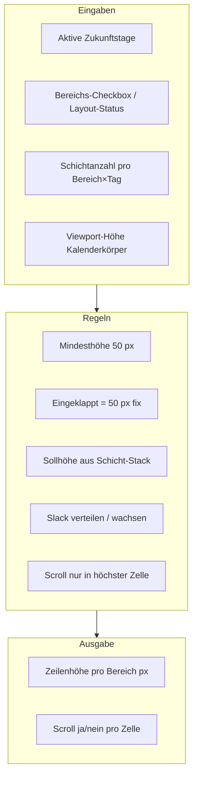
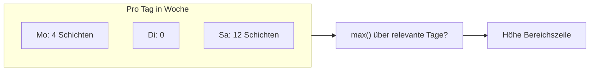
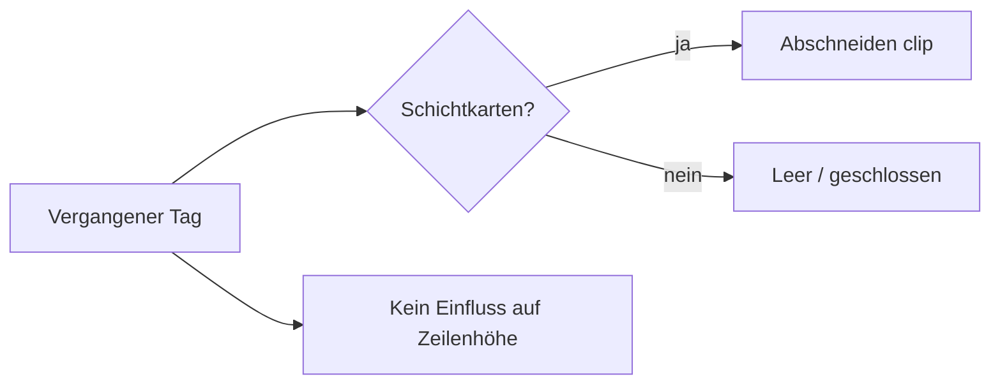
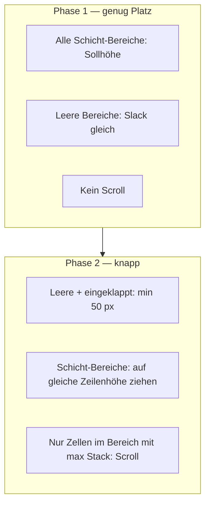

# Brainstorming: Bereichszeilen-Höhe im Dashboard-Kalender

**Status:** Round 1 — offen  
**Kontext:** Vertikale Höhenverteilung der Bereichszeilen (Tag × Bereich) im Dashboard-Kalender — Schichtkarten, Scroll-Verhalten, eingeklappte Bereiche, leere Bereiche, Vergangenheit vs. Zukunft.  
**Vorgänger:** Bestehende Logik in `shift-card-row-layout.ts`, `calendar-area-row-height-dates.ts`, `dashboard-calendar.tsx`.

**Deine Notizen (Kern):**

- Höhenberechnung gilt **nur für aktive, zukünftige Tage** — vergangene Tage beeinflussen die Zeilenhöhe nicht
- Schichtkarten an vergangenen Tagen dürfen abgeschnitten werden
- **Keine Schichtkarten** in aktiven Zukunftstagen → alle Bereiche **gleich hoch**, Kalender füllt Viewport vertikal
- **Eingeklappte Bereiche** → feste Höhe **50 px** (Minimum pro Bereich: 50 px)
- **Teilweise eingeklappt** → nicht eingeklappte Bereiche teilen sich den Rest
- **Wenn möglich:** alle Schichtkarten in allen Bereichen **ohne Scrollbar** sichtbar
- **Alle Bereiche mit Schichtkarten:** kleinere Bereiche wachsen bis annähernd Höhe der größten Zelle; **größte Zelle** scrollt zuerst, wenn nötig
- Scrollbars möglichst vermeiden; erst in der **höchsten Bereichszelle**
- **Leere, nicht eingeklappte Bereiche:** füllen ungenutzten Platz; Minimum 50 px

---

## Round 1 — Scope, Begriffe & Bezugsgröße

### Q1 — **Scope:** Welche Kalender-Ansichten sind von dieser Spezifikation betroffen?

- [x] **A)** Nur **Tag × Bereich** (Multi-Area-Dashboard-Kalender) ⭐ **empfohlen** (dort existiert die Bereichszeilen-Logik heute)
- [ ] **B)** Tag × Bereich **und** Simple Planning (eine gemeinsame Zeile ohne Bereichsspalten)
- [ ] **C)** Zusätzlich Planungsmodus / andere Kalender (z. B. `ShiftPlanner`)
- [ ] **D)** Nur Tag × Bereich, Simple Planning bleibt unverändert mit eigener Regel

**Deine Antwort:**

---

### Q2 — **Begriff „eingeklappt“:** Was löst die feste Höhe von 50 px aus?

Im UI gibt es mehrere Zustände (Bereichs-Checkbox, Layout-Animation, Vorschau-Dummy). Bitte festlegen, welche **50 px fix** bedeuten:

| Zustand | 50 px fix? |
|---------|------------|
| Bereichs-Checkbox **aus** (Bereich inaktiv) | ? |
| Bereichs-Checkbox **an**, Layout noch animiert / verzögert | ? |
| Bereich aktiv, Tag eingeklappt (Tages-Checkbox) | ? |
| Bereich aktiv, Tag offen, **keine** Schichtkarten an Zukunftstagen | ? |

- [x] **A)** Nur **Bereichs-Checkbox aus** (= Bereich im Layout nicht expandiert) → 50 px; leere expandierte Bereiche **ohne** Schichten teilen sich Slack ⭐ **empfohlen** (entspricht aktuellem `layoutActiveAreaIds`-Konzept)
- [ ] **B)** Bereichs-Checkbox aus **oder** expandiert aber ohne Schichten an aktiven Zukunftstagen → 50 px Minimum, kein Slack-Aufblähen
- [ ] **C)** Zusätzlich: Tag eingeklappt reduziert die Zeilenhöhe des betroffenen Bereichs auf 50 px
- [ ] **D)** Andere Zuordnung (bitte Tabelle in Antwort ausfüllen)

**Deine Antwort:**

---

### Q3 — **Bezugsgröße Schichtanzahl:** Wie wird die benötigte Zeilenhöhe pro Bereich ermittelt?

Eine Bereichszeile gilt für **alle Tage** der Woche gleichzeitig. Die Schichtanzahl kann pro Tag variieren (z. B. Sa. 12, Mo. 4).

- [x] **A)** **Maximum** der Schichtanzahl über alle **aktiven, nicht-vergangenen** Tage dieses Bereichs ⭐ **empfohlen** (eine Zeile muss den vollsten Tag fassen)
- [ ] **B)** Maximum nur über **eingeklappte/expandierte Tage** (`layoutActiveDayDates`), vergangene Tage ausgeschlossen — wie heute `isCalendarAreaRowHeightDate`
- [ ] **C)** **Summe** oder gewichteter Durchschnitt (selten sinnvoll bei gemeinsamer Zeilenhöhe)
- [ ] **D)** Pro Tag unterschiedliche Zeilenhöhe (würde Grid-Architektur grundlegend ändern)

**Deine Antwort:**

---

### Q4 — **Reserv unter der letzten Schichtkarte:** Soll unter der letzten sichtbaren Karte weiterhin ca. **30 px** freier Abstand eingeplant werden (wie heute `AREA_ROW_VISIBLE_SPACE_BELOW_LAST_SHIFT_PX`)?

- [ ] **A)** Ja, **30 px** sichtbarer Abstand unter der letzten Karte in expandierten Zukunftszellen ⭐ **empfohlen** (explizit in früheren Anforderungen)
- [ ] **B)** Ja, aber kleinerer Wert (bitte px in Antwort)
- [ ] **C)** Nein, nur technisches Padding, kein bewusster visueller Abstand
- [ ] **D)** Nur in Bereichen mit Schichten; leere Bereiche ohne Extra-Reserve

**Deine Antwort:**
A, aber 20px sollten ausreichen.

---

### Q5 — **Priorität bei Platzknappheit:** Wenn **nicht** alle Schichtkarten ohne Scroll sichtbar sein können — in welcher Reihenfolge wird Platz verteilt?

Deine Notizen: kleinere Bereiche wachsen bis annähernd die größte; die **größte** scrollt zuerst.

- [x] **A)** **Zwei Phasen:** (1) Wenn genug Platz → alle Bereiche auf Sollhöhe ohne Scroll; (2) Wenn nicht → kleinere Schicht-Bereiche wachsen bis max. zur Sollhöhe des größten, **nur der Bereich mit dem höchsten Schicht-Stack** darf Scroll bekommen ⭐ **empfohlen**
- [ ] **B)** Gleichmäßiges Schrumpfen aller Bereiche ab 50 px, Scroll in **allen** betroffenen Bereichen gleichzeitig
- [ ] **C)** Zuerst leere Bereiche auf 50 px, dann Schicht-Bereiche proportional schrumpfen, Scroll zuerst im dominanten Bereich
- [ ] **D)** Restaurant / Bereich mit meisten Schichten bekommt **immer** Priorität auf volle Sollhöhe; Rest wird reduziert

**Deine Antwort:**

---

### Q6 — **Verteilung bei leeren expandierten Bereichen:** Wenn einige Bereiche Schichten haben und andere expandiert aber leer sind — wie wird der übrige Platz geteilt?

- [x] **A)** **Gleichmäßig** unter allen leeren expandierten Bereichen (Minimum je 50 px) ⭐ **empfohlen**
- [ ] **B)** Proportional zur Anzahl Personalbedarf-Einträge / Servicezeit-Fenster im Header
- [ ] **C)** Leere Bereiche bleiben bei 50 px; übriger Platz geht an Schicht-Bereiche (Aufblähen über Sollhöhe hinaus — unüblich)
- [ ] **D)** Feste Reihenfolge: von unten nach oben oder umgekehrt zuerst füllen

**Deine Antwort:**

---

*Antworten bitte direkt unter jede Frage eintragen. Round 2 folgt nach deinen Antworten.*

---

## Round 2 — Vergangenheit, Scroll-Granularität, Algorithmus & Technik

**Round-1-Konsens (Kurz):** Tag×Bereich · eingeklappt = Checkbox aus (50 px) · max. Schichten · 20 px unter letzter Karte · Zwei-Phasen-Priorität · Slack gleichmäßig an leere Bereiche.

---

### Q7 — **„Aktive Tage“ für max. Schichtanzahl (Präzisierung zu Q3):** Welche Tage fließen in `max(Schichten pro Tag)` ein?

Du hast **Q3-A** gewählt; technisch gibt es zwei Filter:

| Filter | Bedeutung |
|--------|-----------|
| `activeDayDates` | Tages-Checkbox **an** |
| `layoutActiveDayDates` | Tag im Layout **expandiert** (nach Animations-Delay) |
| `!isPastCalendarDate` | kein vergangener Tag |

- [x] **A)** Max nur über Tage in **`layoutActiveDayDates`** ∩ Zukunft ⭐ **empfohlen** (Höhe folgt sichtbarem Layout; eingeklappte Zukunftstage zählen nicht)
- [ ] **B)** Max über **`activeDayDates`** ∩ Zukunft (Checkbox an reicht, auch wenn Tag visuell noch kollabiert)
- [ ] **C)** Alle Tage der Woche in Zukunft, unabhängig von Tages-Checkbox
- [ ] **D)** Nur der **sichtbar breiteste** Tag (z. B. bei Spalten-Fokus) — Sonderfall

**Deine Antwort:**

---

### Q8 — **Vergangene Tage:** Wie verhalten sich Zellen an vergangenen Tagen in expandierten Bereichen?

- [x] **A)** **Kein Scroll**, `overflow: hidden` / clip; Höhe der Zeile kommt nur aus Zukunftstagen ⭐ **empfohlen** (entspricht Notizen + `clipVerticalOverflow`)
- [ ] **B)** Wie A, aber vergangene Tage mit vielen Schichten dürfen **doch** die Zeilenhöhe beeinflussen (Abweichung von Notizen)
- [ ] **C)** Scroll erlaubt, aber nur in vergangenen Zellen (unwahrscheinlich gewünscht)
- [ ] **D)** Vergangene Tage automatisch **kollabiert** (keine Schichtkarten sichtbar)

**Deine Antwort:**

---

### Q9 — **Scroll-Granularität:** Wo genau erscheint die Scrollbar?

Eine Bereichszeile hat **7 Tageszellen**. Die Zeilenhöhe ist für alle gleich, die Schichtanzahl pro Tag kann differieren (Sa. 12, Mo. 2).

- [x] **A)** Scroll-Entscheidung **pro Tag×Bereich-Zelle** (`dayShifts.length` vs. verfügbare Zellhöhe); Zeile hoch genug für max. Tag; nur Zellen mit mehr Schichten als „passend“ scrollen ⭐ **empfohlen**
- [ ] **B)** Scroll **pro Bereichszeile** einheitlich: wenn irgendein Zukunftstag nicht passt → ganze Zeile scrollt synchron
- [ ] **C)** Scroll nur in der **Zelle des vollsten Zukunftstags**; andere Zellen clip
- [ ] **D)** Wie A, aber laut Q5: wenn Zeile insgesamt knapp → Scroll **nur** in der Zelle des Bereichs mit globalem Maximum über alle Bereiche (dominanter Bereich)

**Deine Antwort:**

---

### Q10 — **„Annähernd so groß wie die höchste Bereichszelle“ (Q5 Phase 2):** Was bedeutet „annähernd“ konkret?

Wenn mehrere Bereiche Schichten haben, kleinere wachsen Richtung größter Bereich, bevor der größte scrollt.

- [x] **A)** Kleinere Schicht-Bereiche wachsen bis **100 % ihrer eigenen Sollhöhe**; danach wird Slack **gleichmäßig** an alle Schicht-Bereiche unterhalb der größten Sollhöhe verteilt, bis alle **dieselbe Zeilenhöhe** haben; dann scrollt nur der Bereich mit dem **höchsten Schicht-Stack** ⭐ **empfohlen**
- [ ] **B)** Kleinere Bereiche wachsen maximal bis **Sollhöhe des größten Bereichs** (visuell gleiche Zeilenhöhe), auch wenn ihr eigener Stack weniger Karten hat
- [ ] **C)** Toleranz: gleiche Höhe wenn Differenz ≤ **N px** (bitte N in Antwort)
- [ ] **D)** Kein Ausgleich zwischen Schicht-Bereichen — jeder bleibt auf eigener Sollhöhe, nur leere Bereiche füllen Slack

**Deine Antwort:**

---

### Q11 — **Szenario: Keine Schichtkarten in allen expandierten Bereichen (Zukunft):** Wie wird der Viewport gefüllt?

- [x] **A)** Alle expandierten Bereiche erhalten **dieselbe Höhe**: `(Kalenderkörper − eingeklappte×50) / Anzahl expandiert` ⭐ **empfohlen**
- [ ] **B)** Alle auf **Minimum 50 px**, Rest bleibt unten leer (kein Force-Fill)
- [ ] **C)** Wie A, aber **max. Höhe** pro Bereich cap (bitte px)
- [ ] **D)** Erster/offener Bereich bekommt mehr Platz als andere

**Deine Antwort:**

---

### Q12 — **Technische Umsetzung Zeilenhöhen:** Wie sollen die CSS-Grid-Tracks gesetzt werden?

- [x] **A)** **JS berechnet exakte px** pro Zeile; Grid `grid-template-rows` mit festen Werten; Summe = Kalenderkörperhöhe ⭐ **empfohlen** (präzise Kontrolle, testbar in `shift-card-row-layout.ts`)
- [ ] **B)** Hybrid: Schicht-Bereiche **fix px**, leere Bereiche **`minmax(50px, 1fr)`**
- [ ] **C)** Rein CSS: dominanter Bereich fix, Rest `1fr` ohne px-Summe
- [ ] **D)** ResizeObserver + **DOM-Messung** der Schichtkarten-Stacks statt Formel

**Deine Antwort:**

---

### Q13 — **Animation Ein-/Ausklappen:** Verhalten während der ~280 ms Layout-Transition?

- [x] **A)** Höhen neu berechnen **sofort**, CSS-Transition auf `grid-template-rows` (kann während Animation „kämpfen“) ⭐ **empfohlen** (einfach; ggf. `transition` beibehalten wie heute)
- [ ] **B)** Höhe erst nach **Delay** anpassen (wie heute `layoutActiveAreaIds` / `CALENDAR_LAYOUT_ANIMATION_DELAY_MS`), dann ein Zielsprung
- [ ] **C)** Keine Zeilenhöhen-Animation — nur Opacity/Inhalt animiert
- [ ] **D)** Während Animation alte Höhen frozen, danach Remeasure

**Deine Antwort:**

---

*Round 3 folgt nach deinen Antworten (Scroll-Styling, Metriken/Konstanten, Tests, Randfälle).*

---

## Round 3 — Scroll-UX, Metriken, Randfälle & Abnahme

**Round-2-Konsens (Kurz):** `layoutActiveDayDates` ∩ Zukunft · vergangene Tage clip · Scroll pro Zelle · Schicht-Bereiche gleichziehen dann Scroll nur im höchsten Stack · alle leer → gleiche Höhe · JS px-Grid · Transition sofort.

---

### Q14 — **Leerraum in Schicht-Bereichen nach Q10-A:** Wenn kleinere Bereiche auf die **gleiche Zeilenhöhe** wie der größte Schicht-Bereich gezogen werden — was passiert unter den Schichtkarten?

Beispiel: Restaurant 12 Karten (Sollhöhe ~500 px), Bar 2 Karten (Sollhöhe ~200 px), beide Zeilen nach Ausgleich je 500 px hoch.

- [x] **A)** **Extra Platz bleibt sichtbar leer** unter den Karten (kein Scroll in Bar, nur visueller Freiraum) ⭐ **empfohlen**
- [ ] **B)** Bar-Zellen **scrollen nicht**, aber Karten werden **vertikal zentriert** im Mehrplatz
- [ ] **C)** Mehrplatz wird **nur** an leere Bereiche verteilt — Schicht-Bereiche bleiben strikt auf **eigener Sollhöhe**, nie höher
- [ ] **D)** Wie C, aber wenn kein leerer Bereich übrig: kleinere Schicht-Bereiche doch auf gleiche Höhe wie größter (Q10-A widersprüchlich — bitte präzisieren)

**Deine Antwort:**

---

### Q15 — **Scroll nur im „höchsten Bereich“ (Q5/Q10):** Wenn Restaurant 12 Schichten und Küche 8 Schichten hat — wer darf scrollen?

- [ ] **A)** Scroll **nur** in Zellen des Bereichs mit **globalem** max. Schichtanzahl (Restaurant); Küche clippt oder hat Leerraum, **kein** Scroll ⭐ **empfohlen**
- [ ] **B)** Jeder Bereich scrollt **eigenständig** in Zellen, sobald `dayShifts.length` die Zellhöhe sprengt (Q9-A widerspricht Q5 teilweise)
- [ ] **C)** Wie A, aber nach Zeilenhöhen-Ausgleich (Q10-A): scrollt nur der dominante Bereich; andere nie, auch wenn einzelner Tag mehr Karten hätte als Sollhöhe des kleineren Bereichs erlaubt
- [ ] **D)** Bei Gleichstand Schichtanzahl (z. B. beide 8): beide dürfen scrollen

**Deine Antwort:**
A, aber in keinem Bereich soll geclippt werden. Wenn in einem Bereich nicht alle Schichtkaretn sichtbar sein können, soll immer in der jeweiligen Zelle eine Scrollbar erscheinen.

---

### Q16 — **Gleichstand beim dominanten Bereich:** Zwei Bereiche haben **dieselbe** max. Schichtanzahl (z. B. je 8 an unterschiedlichen Tagen).

- [x] **A)** Scroll in **beiden** Bereichen erlaubt, wenn deren Zelle nicht passt ⭐ **empfohlen** (fair, einfache Regel)
- [ ] **B)** Scroll nur im **obersten** Bereich (Listen-Reihenfolge `areas`)
- [ ] **C)** Scroll nur im Bereich mit **lexikographisch erster** `area.id`
- [ ] **D)** Zeilenhöhe reicht für beide — kein Sonderfall nötig

**Deine Antwort:**

---

### Q17 — **Extremfall Viewport zu klein:** Selbst der dominante Bereich kann seine Sollhöhe nicht erreichen (Summe aller Mindesthöhen > Kalenderkörper).

Beispiel: 4 Bereiche, 3 expandiert mit je 12 Schichten, sehr niedriges Fenster.

- [x] **A)** Reihenfolge: (1) eingeklappte 50 px, (2) leere expandiert 50 px, (3) **nicht-dominante** Schicht-Bereiche auf 50 px, (4) dominanter Bereich bekommt **Rest**; Scroll dort ⭐ **empfohlen**
- [ ] **B)** Alle Schicht-Bereiche gleichmäßig unter Minimum schrumpfen (jeder ≥ 50 px)
- [ ] **C)** Kalenderkörper wird **scrollbar** (äußerer Scroll), Zeilenhöhen unverändert
- [ ] **D)** Sollhöhen beibehalten, Inhalt clip überall

**Deine Antwort:**

---

### Q18 — **Höhenformel & Konstanten:** Wie werden Sollhöhen aus Schichtanzahl abgeleitet?

Aktuell: Kartenhöhe ~31 px, Gap 4 px, Chrome (Padding/Header/Footer) ~54 px, Reserve unten **20 px** (Q4).

- [x] **A)** **Reine Formel** in TypeScript (`shift-card-row-layout.ts`); Konstanten zentral; bei UI-Änderung an Karten manuell anpassen ⭐ **empfohlen**
- [ ] **B)** Formel + **Sicherheits-Puffer** (+N px global, bitte N)
- [ ] **C)** **DOM-Messung** nach erstem Render als Fallback wenn Formel < `scrollHeight`
- [ ] **D)** Formel nur für Planung; finale Höhe immer per ResizeObserver am vollsten Tag

**Deine Antwort:**

---

### Q19 — **Scrollbar-Erscheinungsbild:** Wenn Scroll unvermeidbar ist (nur dominante Zellen).

- [x] **A)** Bestehende **`MODAL_SCROLLBAR_CLASS`** (dezent, konsistent mit App) ⭐ **empfohlen**
- [ ] **B)** Native dünne Scrollbar ohne Extra-Klasse
- [ ] **C)** Scrollbar **nur bei Hover** über der Zelle
- [ ] **D)** Scroll vermeiden — lieber letzte Karte minimal clip als Scroll anzeigen

**Deine Antwort:**

---

### Q20 — **Tests & Abnahme:** Was ist für „fertig“ verbindlich?

- [x] **A)** **Unit-Tests** für Layout-Algorithmus (`computeAreaRowLayouts`, Scroll-Entscheidung) + **manueller** Abnahme-Checkliste (Restaurant 12 Karten, leere Bereiche füllen, kein weißer Gap) ⭐ **empfohlen**
- [ ] **B)** Zusätzlich **Playwright**-Screenshot-Tests für feste Viewport-Größen
- [ ] **C)** Nur Unit-Tests, kein visuelles QA
- [ ] **D)** Unit-Tests + dokumentierte Szenarien in `specs/007-…-test-scenarios.md` (wie Bulk-Shift)

**Deine Antwort:**

---

### Q21 — **Scope-Abschluss:** Gibt es bewusst **keine** Schema-/API-Änderungen?

- [x] **A)** **Rein Frontend** — keine DB, keine API; nur Layout-Logik + ggf. Konstanten ⭐ **empfohlen**
- [ ] **B)** User-Preference speichern (localStorage: letzte Bereichs-Expansion)
- [ ] **C)** Server-seitige Einstellung pro Standort
- [ ] **D)** Unklar — bitte klären

**Deine Antwort:**

---

*Nach Beantwortung von Round 3 erstelle ich `specs/007-area-row-heights-specification.md` mit allen Entscheidungen und empfohlenen Defaults.*

