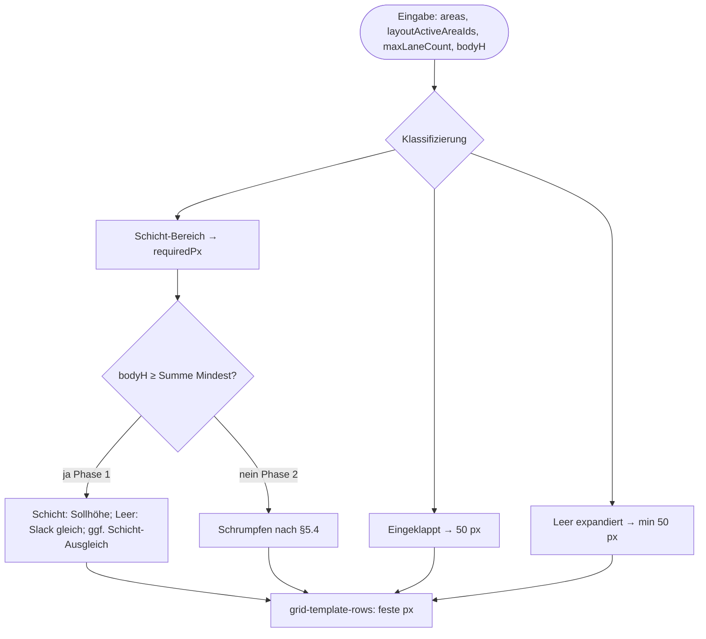
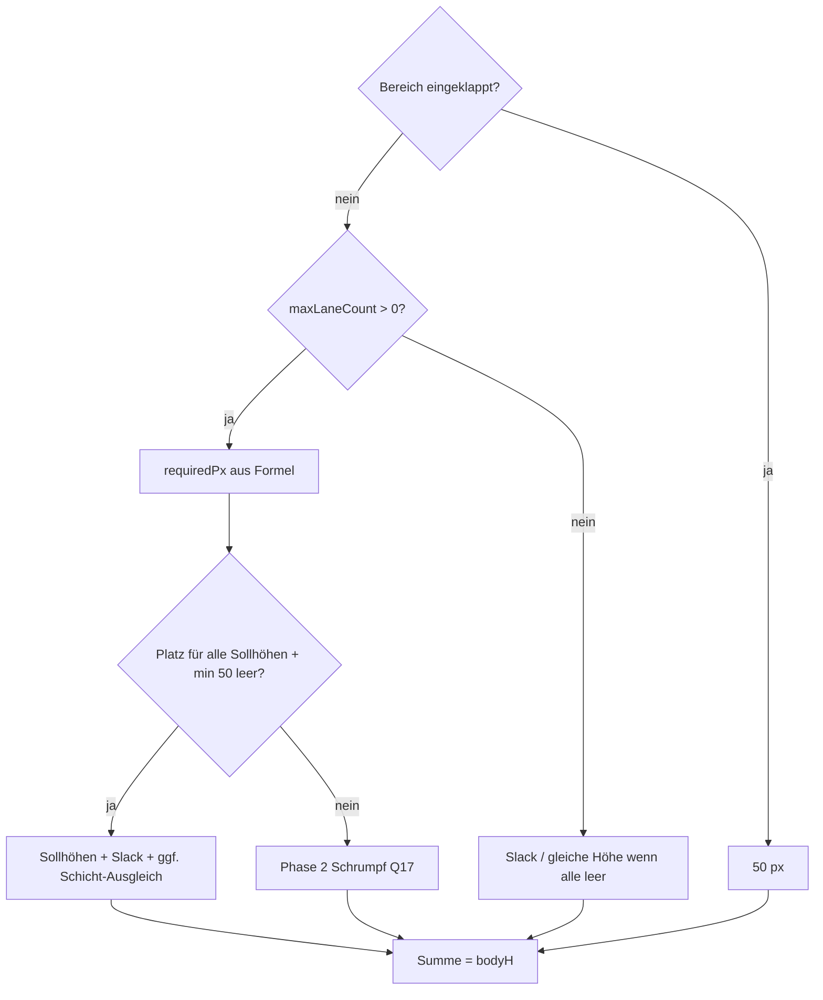

# Specification: Bereichszeilen-Höhe im Dashboard-Kalender

**Version:** 1.1  
**Status:** Implementiert  
**Quelle:** `specs/007-area-row-heights-brainstorming.md` (Runden 1–3)  
**Scope:** Rein Frontend — Tag×Bereich-Dashboard-Kalender (`apps/web`)

**Änderungen v1.1 (Implementierung / DOM-Abgleich):**

- `SHIFT_CARD_ROW_FIT_BUFFER_PX`: 8 → **12** (Reserve unter der Liste, Schatten letzte Karte)
- Neu: **`SHIFT_CARD_SHADOW_BLEED_PX = 3`** — pro Karte im Stack (`shiftCardListItemHeightPx`)
- `AREA_ROW_LIST_FIT_SLACK_PX`: 20 → **12** (Schatten im Stack modelliert)
- `measureOverflowFallback` in Zukunftszellen nach Grid-Transition (~350 ms) als DOM-Fallback (§6.5)
- Phase 1: `boostShiftAreasFromEmptySlack` — Slack von leeren expandierten Bereichen (≥ 50 px) an Schicht-Bereiche, wenn Stack nicht passt

**Betroffene Module (bestehend):**

- `apps/web/src/lib/shift-card-row-layout.ts` — Algorithmus, Konstanten, Scroll-Entscheidung
- `apps/web/src/lib/calendar-area-row-height-dates.ts` — Filter für Höhen-relevante Tage
- `apps/web/src/components/dashboard/dashboard-calendar.tsx` — Grid, `maxLaneCountByAreaId`, Layout-Anwendung
- `apps/web/src/components/dashboard/dashboard-shift-cards-list.tsx` — Scroll/Clip in Zellen

**Nicht im Scope:** Simple Planning, `ShiftPlanner`, DB/API, localStorage-Präferenzen.

---

## 1. Ziel

Die **vertikale Höhe** jeder Bereichszeile im Multi-Area-Kalender soll den verfügbaren Viewport **vollständig ausfüllen**, ohne unnötige Lücken unten, und Schichtkarten in **Zukunftstagen** möglichst **ohne Scrollbar** darstellen. Wo das nicht möglich ist, erscheint Scroll **pro Tag×Bereich-Zelle** — **niemals Clipping** in Zukunftszellen.

Vergangene Tage beeinflussen die Zeilenhöhe **nicht**; deren Inhalt darf abgeschnitten werden.

---

## 2. Entscheidungsübersicht

| Bereich | Entscheidung |
|---------|--------------|
| Kalender-Ansicht | Nur **Tag × Bereich** (Q1=A) |
| Eingeklappt | **Bereichs-Checkbox aus** → Zeile **50 px** fix (`layoutActiveAreaIds`) (Q2=A) |
| Leer expandiert | Expandierter Bereich **ohne** Schichten an Zukunftstagen → **Slack** (min. 50 px) (Q2=A, Q6=A) |
| Schichtanzahl pro Zeile | **max(`dayShifts.length`)** über **`layoutActiveDayDates` ∩ Zukunft** (Q3=A, Q7=A) |
| Reserve unter letzter Karte | **20 px** sichtbar (Q4 → 20 px) |
| Platz knapp | **Zwei Phasen** (Q5=A, Q10=A) — siehe §5 |
| Leere Bereiche mit Slack | **Gleichmäßig** (Q6=A) |
| Vergangene Tage | **Kein Scroll**, **clip**; **kein** Einfluss auf Zeilenhöhe (Q8=A) |
| Scroll-Granularität | **Pro Tag×Bereich-Zelle** (Q9=A) |
| Mehrplatz in kleineren Schicht-Zeilen | **Sichtbar leer** unter Karten (Q14=A) |
| Scroll vs. Clip (Zukunft) | **Kein Clip** — bei Überlauf **Scrollbar in der jeweiligen Zelle** (Q15, Ergänzung) |
| Gleichstand max. Schichten | **Beide** Bereiche dürfen scrollen, wenn Zelle nicht passt (Q16=A) |
| Extrem kleines Fenster | Schrumpf-Reihenfolge Q17=A |
| Sollhöhe | **Formel** in TS (Q18=A) |
| Scrollbar-Stil | **`MODAL_SCROLLBAR_CLASS`** (Q19=A) |
| Keine Schichten (alle expandiert) | **Gleiche Höhe**, Viewport füllen (Q11=A) |
| Grid-Technik | **JS px**, Summe = Kalenderkörperhöhe (Q12=A) |
| Animation | Höhe **sofort** neu; CSS-Transition auf `grid-template-rows` (Q13=A) |
| Tests | **Unit-Tests** + manuelle Abnahme-Checkliste (Q20=A) |
| Schema/API | **Keine** (Q21=A) |

---

## 3. Begriffe & Zustände

### 3.1 Bereichszeile (Area Row)

Eine horizontale Grid-Zeile für einen Standortbereich (Restaurant, Bar, …). Gilt für **alle 7 Wochentage** gleichzeitig — die Zeilenhöhe ist **ein Wert pro Bereich**.

### 3.2 Bereichs-Zustände

| Zustand | Bedingung | Zeilenhöhe |
|---------|-----------|------------|
| **Eingeklappt** | Bereich ∉ `layoutActiveAreaIds` | **50 px** fix |
| **Schicht-Bereich** | ∈ `layoutActiveAreaIds` und `maxLaneCount > 0` | Sollhöhe aus Formel (§4); in Phase 2 ggf. angepasst (§5) |
| **Leer expandiert** | ∈ `layoutActiveAreaIds` und `maxLaneCount === 0` | **≥ 50 px**; erhält Anteil am Slack |
| **Service-dormant expandiert** | Expandierter Bereich: ab heute bis Wochenende (sichtbare Woche) **weder Servicezeit noch Schichten**; in **vergangenen Tagen dieser Woche keine Schichten** (Schichten ohne Servicezeit folgen in Kürze); unabhängig von Tag-Checkbox | **50 px** fix; kein Slack |

**Nicht eingeklappt** durch: leere Zukunftstage, eingeklappte **Tages**-Checkbox (Tag zählt nur nicht für `maxLaneCount`, Zeile bleibt expandiert).

### 3.3 Höhen-relevante Tage

```typescript
isCalendarAreaRowHeightDate(date, layoutActiveDayDates, todayISO) :=
  layoutActiveDayDates.has(date) && !isPastCalendarDate(date, todayISO)
```

Nur diese Tage fließen in `maxLaneCountByAreaId` ein.

### 3.4 Kalenderkörper-Höhe

```
availableBodyHeightPx = calendarScrollRef.clientHeight − CALENDAR_HEADER_HEIGHT_PX
```

(`CALENDAR_HEADER_HEIGHT_PX = 56`, entspricht Header-Row `3.5rem` bei 16 px root.)

Grid: `h-full min-h-0`; Zeilensumme (Body) **=** `availableBodyHeightPx`.

---

## 4. Sollhöhe aus Schichtanzahl

### 4.1 Konstanten (verbindlich)

| Konstante | Wert | Bedeutung |
|-----------|------|-----------|
| `AREA_ROW_MIN_HEIGHT_PX` | **50** | Minimum jeder Zeile |
| `AREA_ROW_EMPTY_HEIGHT_PX` | **50** | Eingeklappt / leer ohne Slack |
| `AREA_ROW_VISIBLE_SPACE_BELOW_LAST_SHIFT_PX` | **20** | Sichtbarer Abstand unter letzter Karte |
| `SHIFT_CARD_TWO_LINE_HEIGHT_PX` | **31** | Kartenhöhe (30 + 1 Extra) |
| `SHIFT_CARD_LIST_GAP_PX` | **4** | `gap-1` zwischen Karten |
| `SHIFT_CARD_LIST_BOTTOM_PADDING_PX` | **4** | `pb-1` der Liste |
| `SHIFT_CARD_SHADOW_BLEED_PX` | **3** | Externer Schatten unter jeder Karte; Wrapper = 31 + 3 px |
| `SHIFT_CARD_ROW_FIT_BUFFER_PX` | **12** | Reserve unter der Liste (Subpixel) |
| `AREA_ROW_LIST_FIT_SLACK_PX` | **12** | Zusätzliche Listenhöhe — siehe §4.4 |
| `AREA_ROW_VERTICAL_CHROME_PX` | **54** | Zell-Padding Y (16) + Header (20) + Footer (18) |

### 4.2 Formeln

```typescript
shiftCardListItemHeightPx(cardH = 31) = cardH + 3

areaRowShiftStackHeightPx(n) =
  n * shiftCardListItemHeightPx() + max(0, n - 1) * 4

areaRowRequiredHeightPx(n) =
  n <= 0 ? 50
  : 54 + areaRowShiftStackHeightPx(n) + 4 + 20 + 12 + 12
  //                                    pb  ^    ^    ^ LIST_FIT_SLACK

areaRowContentHeightPx(rowHeightPx) =
  rowHeightPx - 54 - 20 - 12
  // = stack + pb + LIST_FIT_SLACK  (bei heightPx === requiredPx)
```

**Beispiel 12 Schichten:** `requiredPx = 554`, `contentHeightPx = 462`, Stack + `pb-1` = 452 → **10 px** Puffer in der Liste.

### 4.3 maxLaneCount pro Bereich

```typescript
maxLaneCountByAreaId[areaId] = max(
  dayShifts.length
  for date in dates
  where isCalendarAreaRowHeightDate(date, layoutActiveDayDates, todayISO)
)
```

`requiredPx[areaId] = areaRowRequiredHeightPx(maxLaneCount)`.

### 4.4 Semantik `AREA_ROW_LIST_FIT_SLACK_PX`

`FIT_BUFFER` und `VISIBLE_SPACE_BELOW` werden in **`areaRowContentHeightPx`** abgezogen — eine Erhöhung dieser Werte vergrößert die Zeile, **nicht** die Listenhöhe.

`LIST_FIT_SLACK` wird **nur** zu `areaRowRequiredHeightPx` addiert und **nicht** in `areaRowContentHeightPx` subtrahiert. Dadurch wächst die verfügbare Listenhöhe um denselben Betrag; der Slack wird in Phase 1 von **leeren expandierten** Bereichen (min. 50 px) abgezogen (`boostShiftAreasFromEmptySlack`).

---

## 5. Layout-Algorithmus (`computeAreaRowLayouts`)

### 5.1 Übersicht



### 5.2 Phase 1 — genügend Platz

**Ziel:** Kein Scroll in Zukunftszellen, wenn physikalisch möglich; Viewport vollständig gefüllt.

1. **Eingeklappte** Bereiche: `heightPx = 50`.
2. **Schicht-Bereiche:** `heightPx = requiredPx` (Sollhöhe).
3. **Leer expandiert:** erhalten gleichen Anteil am verbleibenden Slack:

   ```
   slack = bodyH − Σ(eingeklappt×50) − Σ(Schicht-Bereiche.requiredPx)
   heightPx(leer) = max(50, slack / count(leer))   // Restpixel an letzte Zeile
   ```

4. **Alle expandiert, alle leer** (kein Schicht-Bereich):

   ```
   heightPx = (bodyH − count(eingeklappt)×50) / count(expandiert)
   ```

5. **Mehrere Schicht-Bereiche, Slack übrig** (Q10-A):  
   Nach Schritt 2–3 verbleibender Slack wird **gleichmäßig** an alle Schicht-Bereiche verteilt, deren `requiredPx` **unter** dem **größten** `requiredPx` liegt, bis alle Schicht-Bereiche **dieselbe Zeilenhöhe** haben (= `max(requiredPx)` unter Schicht-Bereichen).  
   Mehrplatz unter den Karten in kleineren Bereichen bleibt **sichtbar leer** (Q14=A) — **kein** vertikales Zentrieren.

6. **Summe aller `heightPx` = `availableBodyHeightPx`** (Restpixel an letzte growable/Schicht-Zeile).

7. **Schicht-Bereich passt nicht in `contentHeightPx`:** Slack von **leer expandierten** Bereichen (≥ 50 px) auf Schicht-Bereiche übertragen, bis `areaRowShiftStackFitsPx` erfüllt ist (`boostShiftAreasFromEmptySlack`).

### 5.3 Phase 1 — Ergebnis bei typischem Szenario

**Restaurant 12 Schichten, Bar/Küche leer expandiert, bodyH = 900 px:**

| Bereich | heightPx (ca.) |
|---------|----------------|
| Restaurant | **554** (required für 12) |
| Bar | (900 − 554) / 2 ≈ **173** |
| Küche | ≈ **173** |

Kein Scroll, kein weißer Gap.

### 5.4 Phase 2 — Platz knapp

Wenn `Σ Mindesthöhen > bodyH`:

**Schrumpf-Reihenfolge** (Q17=A):

1. Eingeklappte bleiben **50 px**.
2. Leer expandiert → **50 px** (Minimum).
3. **Nicht-dominante** Schicht-Bereiche → **50 px** (Minimum).
4. **Dominanter** Schicht-Bereich (höchster `maxLaneCount`; bei Gleichstand: alle gleichrangig) erhält **den Rest**.

Dominanz: Bereich mit größtem `maxLaneCount`; bei Gleichstand kein einzelner „Gewinner“ für Schrumpfen (Q16=A).

Nach Schrumpfen: wo Zeilenhöhe `< requiredPx`, können Zellen scrollen (§6).

### 5.5 CSS-Grid

```typescript
buildAreaRowGridTrack(layout) => `${layout.heightPx}px`
```

`grid-template-rows`: `` `${CALENDAR_HEADER_ROW_HEIGHT} ${bodyRows.join(" ")}` ``

**Kein** `minmax`/`1fr` für Body-Zeilen — ausschließlich berechnete px (Q12=A).

---

## 6. Scroll-Verhalten (Zukunft vs. Vergangenheit)

### 6.1 Regeln

| Tag | Overflow | Scroll |
|-----|----------|--------|
| **Vergangen** | Nur in **eingeklappten** Tag-/Bereichsvorschau: kein Scroll, ggf. Clip | **Nein** (Vorschau) |
| **Vergangen, Tag aufgeklappt** | `overflow-y: auto` wenn Stack > `contentHeightPx` | **Ja** — wie Zukunft, Zeilenhöhe bleibt unverändert |
| **Zukunft / heute** | `overflow-y: hidden` wenn alles passt | **Nein** |
| **Zukunft / heute** | `overflow-y: auto` wenn Stack > `contentHeightPx` | **Ja** — **niemals clip** (Q15-Ergänzung) |

### 6.2 Entscheidung pro Zelle

```typescript
cellShiftListNeedsScroll(laneCount, rowLayout) {
  if (laneCount === 0) return false;
  return !areaRowShiftStackFitsPx(laneCount, rowLayout.contentHeightPx);
}
```

Gilt für **aufgeklappte** Tag×Bereich-Zellen (Vergangenheit und Zukunft). Vergangene Tage beeinflussen **nicht** `maxLaneCount` / Zeilenhöhe; Scroll entscheidet nur, ob der Stack in die **zugewiesene** `contentHeightPx` passt.

- **Pro Tag×Bereich-Zelle** (`dayShifts.length` vs. Zeilenhöhe dieses Bereichs) (Q9=A).
- Auch **nicht-dominante** Bereiche scrollen in der betroffenen Zelle, wenn deren Karten nicht passen (Q15-Ergänzung).
- Bei **Gleichstand** max. Schichtanzahl: jeder betroffene Bereich scrollt in überfüllten Zellen (Q16=A).

### 6.3 Scrollbar-Stil

Bei aktivem Scroll: Klasse **`MODAL_SCROLLBAR_CLASS`** auf `DashboardShiftCardsList` (Q19=A).

### 6.4 Abgrenzung Q5 vs. Q15

- **Q5/Q10** regeln **Zeilenhöhen-Verteilung** (wer wächst/schrumpft).
- **Q15-Ergänzung** regelt **Zell-Overflow:** Zukunftszellen **dürfen nicht clippen**; Scroll ist pro Zelle erlaubt, sobald der Stack nicht in die verfügbare `contentHeightPx` passt — unabhängig vom dominanten Bereich.

### 6.5 DOM-Fallback (`measureOverflowFallback`)

In **aufgeklappten** Zellen: wenn die Formel keinen Scroll verlangt, aber `scrollHeight > clientHeight` (nach Grid-Transition, ResizeObserver), wird Scroll trotzdem aktiviert — **Clip vermeiden** (Q15).

Karten-Wrapper in `dashboard-shift-card-view.tsx`: Höhe `shiftCardListItemHeightPx()` (Karte + Schatten-Bleed); kompakter dunkler `box-shadow` (§6.5).

---

## 7. UI/UX

### 7.1 Eingeklappte Bereiche (50 px)

- Bereichs-Checkbox **aus** → Zeile 50 px, Vorschau-Dummy (`InactiveAreaDummyShiftCard`) wie heute.
- Nicht eingeklappte leere Bereiche **füllen** Slack — erscheinen **größer** als 50 px.

### 7.2 Animation

- `layoutActiveAreaIds` / `layoutActiveDayDates` weiter mit Delay für **Inhalts**-Opacity (bestehend).
- **Zeilenhöhen** werden bei Checkbox-Änderung **sofort** neu berechnet; `grid-template-rows`-Transition ~280 ms (Q13=A).
- `ResizeObserver` auf Kalender-Scroll-Container für `availableBodyHeightPx`.

### 7.3 Nicht-Ziele

- Kein äußerer Kalender-Scroll nur wegen Bereichshöhen (Q17=C verworfen).
- Kein Clipping in Zukunftszellen zugunsten „nur dominanter Bereich scrollt“.

---

## 8. Technische Umsetzung

### 8.1 Dateien & Änderungen

| Datei | Änderung |
|-------|----------|
| `shift-card-row-layout.ts` | Algorithmus Phase 1/2; Konstanten §4; Schicht-Bereich-Ausgleich; `boostShiftAreasFromEmptySlack`; feste px-Tracks |
| `calendar-area-row-height-dates.ts` | Unverändert (Filter bereits korrekt); REVERT-Kommentar beibehalten |
| `dashboard-calendar.tsx` | `maxLaneCountByAreaId`; `areaRowLayouts`; `grid-template-rows`; Scroll-Props mit `isPastDay` |
| `dashboard-shift-cards-list.tsx` | Scroll/Clip gemäß §6; `measureOverflowFallback` |
| `dashboard-shift-card-view.tsx` | Karten-Wrapper: feste Höhe, `overflow-hidden` (§6.5) |
| `shift-card-row-layout.test.ts` | Szenarien §9 abdecken |

### 8.2 API `AreaRowLayout`

```typescript
type AreaRowLayout = {
  heightPx: number;      // zugewiesene Zeilenhöhe
  requiredPx: number;    // Sollhöhe aus maxLaneCount
  contentHeightPx: number; // für Schichtkarten-Liste
  flexGrow: boolean;     // deprecated / immer false (px-Grid)
};
```

### 8.3 Keine Schema-/API-Änderungen

Keine Migration, kein neues Endpoint, kein localStorage (Q21=A).

---

## 9. Tests & Abnahme

### 9.1 Unit-Tests (`shift-card-row-layout.test.ts`)

| # | Szenario | Erwartung |
|---|----------|-----------|
| T1 | 12 Schichten, required passt | `cellShiftListNeedsScroll(12, layout) === false` |
| T2 | Restaurant 12, 2 leer, bodyH 900 | Restaurant = required; leere teilen Rest; Summe = bodyH |
| T3 | Alle expandiert, alle leer, bodyH 600, 3 Bereiche | je 200 px |
| T4 | 2 Schicht-Bereiche, Slack für Ausgleich | gleiche Zeilenhöhe nach Q10-A |
| T5 | Eingeklappt + expandiert | eingeklappt 50 px |
| T6 | bodyH knapp | Q17-Schrumpf-Reihenfolge |
| T7 | Scroll-Entscheidung | past → false; future overflow → true |
| T8 | Konstante Reserve | 20 px sichtbar + 12 px FIT_BUFFER + 20 px LIST_FIT_SLACK in `areaRowRequiredHeightPx(1)` |

### 9.2 Manuelle Abnahme-Checkliste

- [ ] **Restaurant, Sa. 12 Karten:** alle sichtbar + ~20 px darunter, **kein** Scroll bei normalem Viewport
- [ ] **Bar/Küche leer:** füllen verbleibende Höhe **gleichmäßig**, min. 50 px
- [ ] **Kein weißer Streifen** unter letztem Bereich
- [ ] **Bereich einklappen:** Zeile springt auf 50 px; expandierte Nachbarn wachsen
- [ ] **Vergangener Tag:** Schichten ggf. abgeschnitten, **kein** Scroll
- [ ] **Fenster verkleinern:** zuerst leere Bereiche schrumpfen; Scroll nur in Zellen mit echtem Überlauf, **kein** Clip in Zukunft
- [ ] **Zwei Bereiche gleiche max. Schichten:** beide können in überfüllter Zelle scrollen
- [ ] **Wochentag einklappen:** aus `maxLaneCount` entfernt; Zeilenhöhe passt sich an

---

## 10. Randfälle

| Fall | Verhalten |
|------|-----------|
| `availableBodyHeightPx === 0` (Initial-Render) | Mindesthöhen / required; Remeasure via ResizeObserver |
| Ein Bereich, expandiert, 12 Schichten | Gesamter Body = required (ggf. < bodyH → leerer Rest nur wenn kein zweiter Bereich) |
| Alle Bereiche eingeklappt | n × 50 px; ggf. Gap unter Grid wenn bodyH größer (akzeptabel) |
| Tag mit 0 Schichten in sonst vollem Bereich | Zeilenhöhe aus **max** anderer Tage; Zelle ohne Scroll |
| Simple Planning | **Unverändert** (eigene Zeile, nicht diese Spec) |

---

## 11. Migrationshinweis (Historisch)

Spec v1.0 → v1.1: Konstanten und Formeln in §4; DOM-Abgleich (LIST_FIT_SLACK, Karten-Wrapper, Overflow-Fallback). Implementierung abgeschlossen.

---

## 12. Referenz: Entscheidungsbaum Zeilenhöhe (Kurz)



---

*Ende der Specification v1.0*
