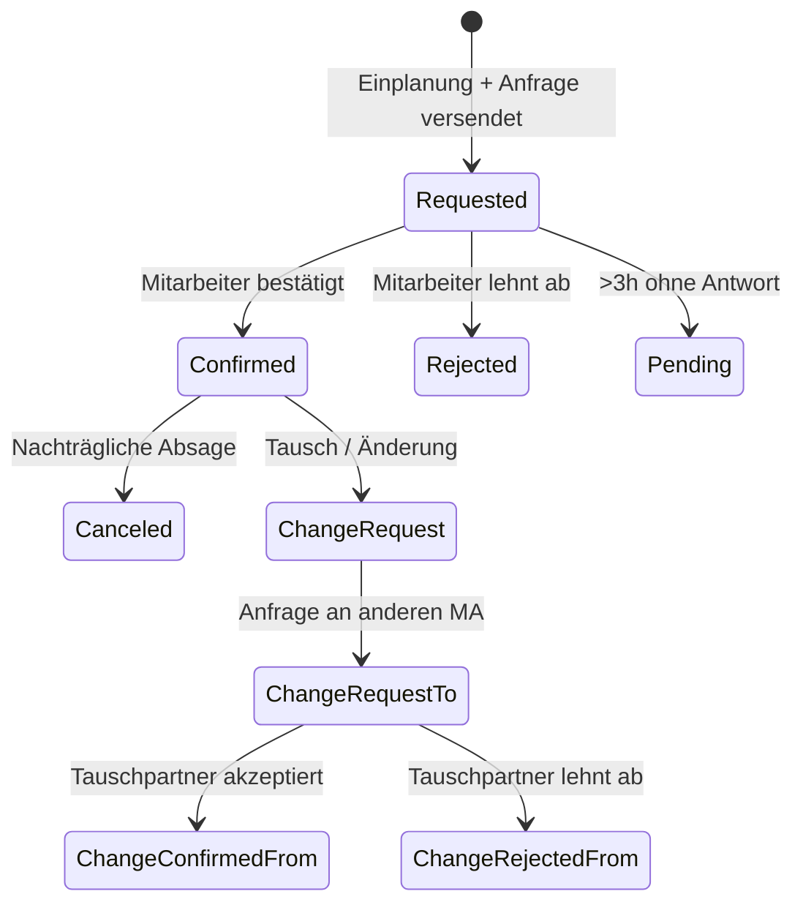
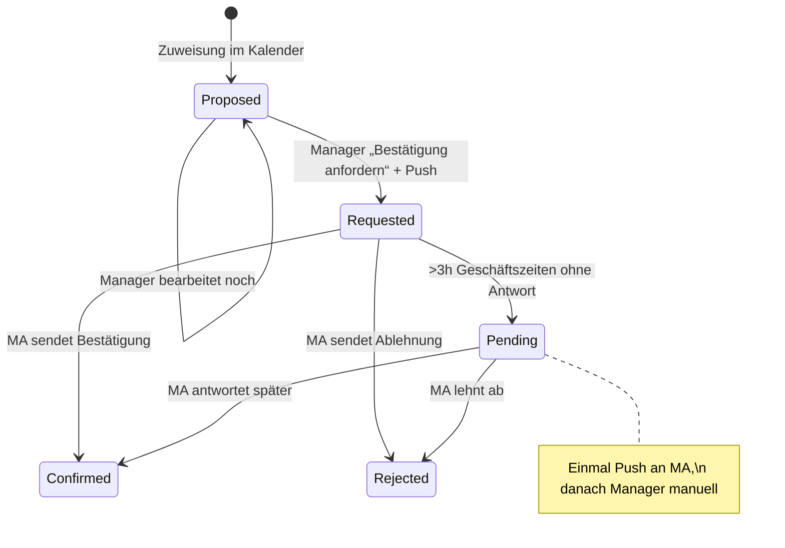
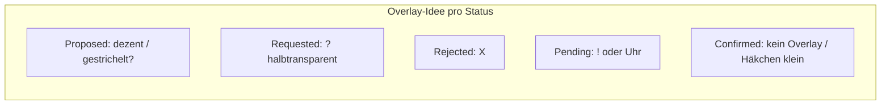
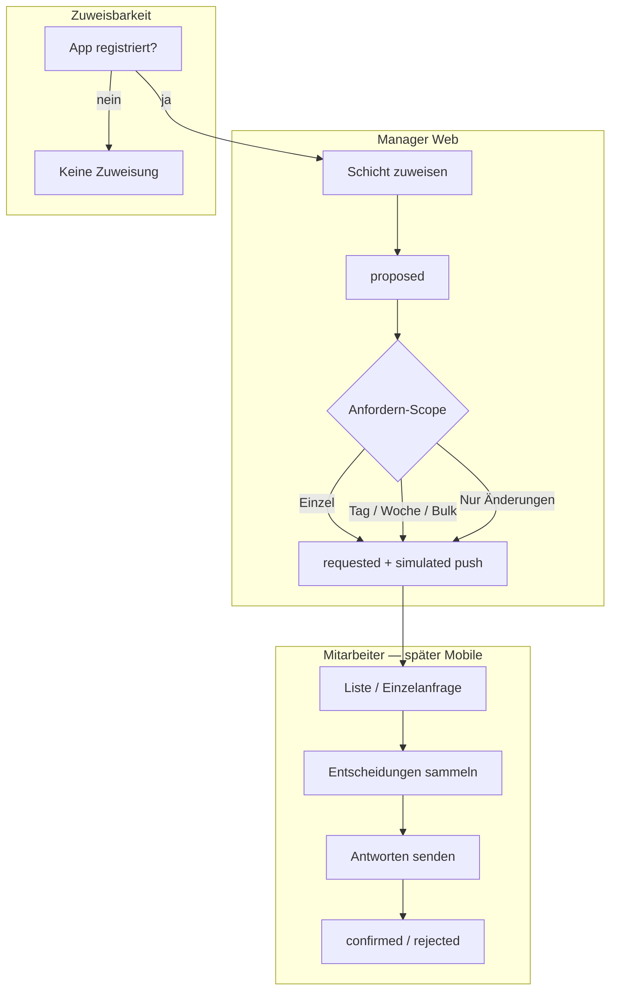
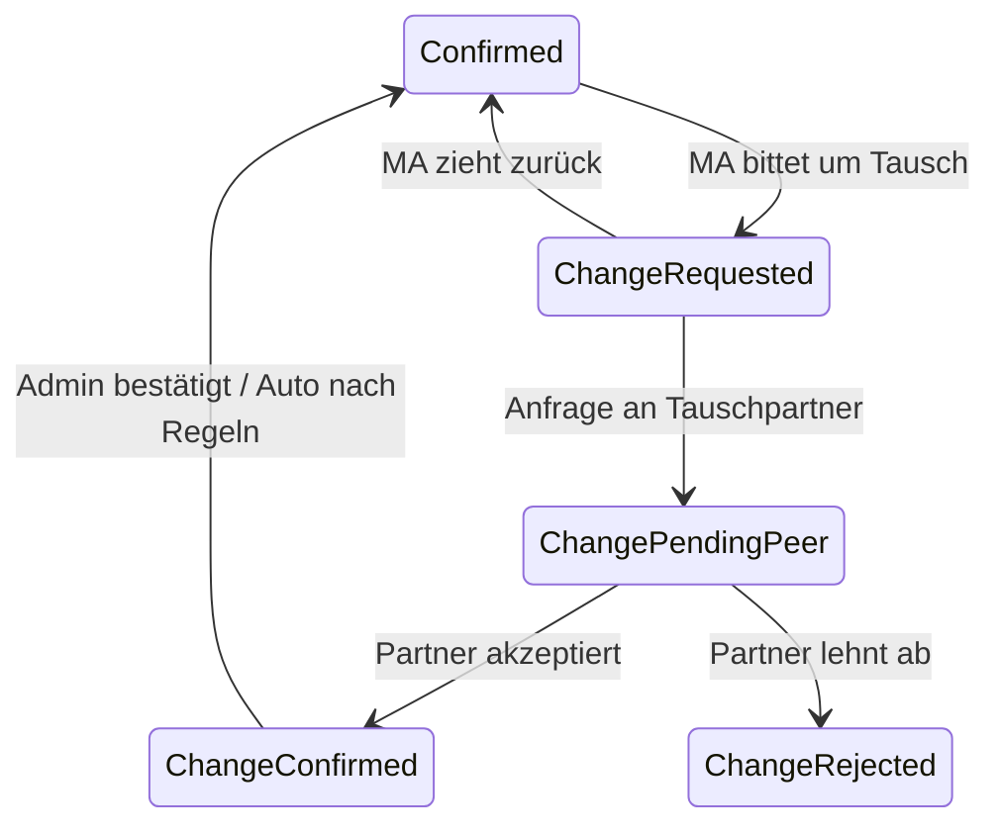
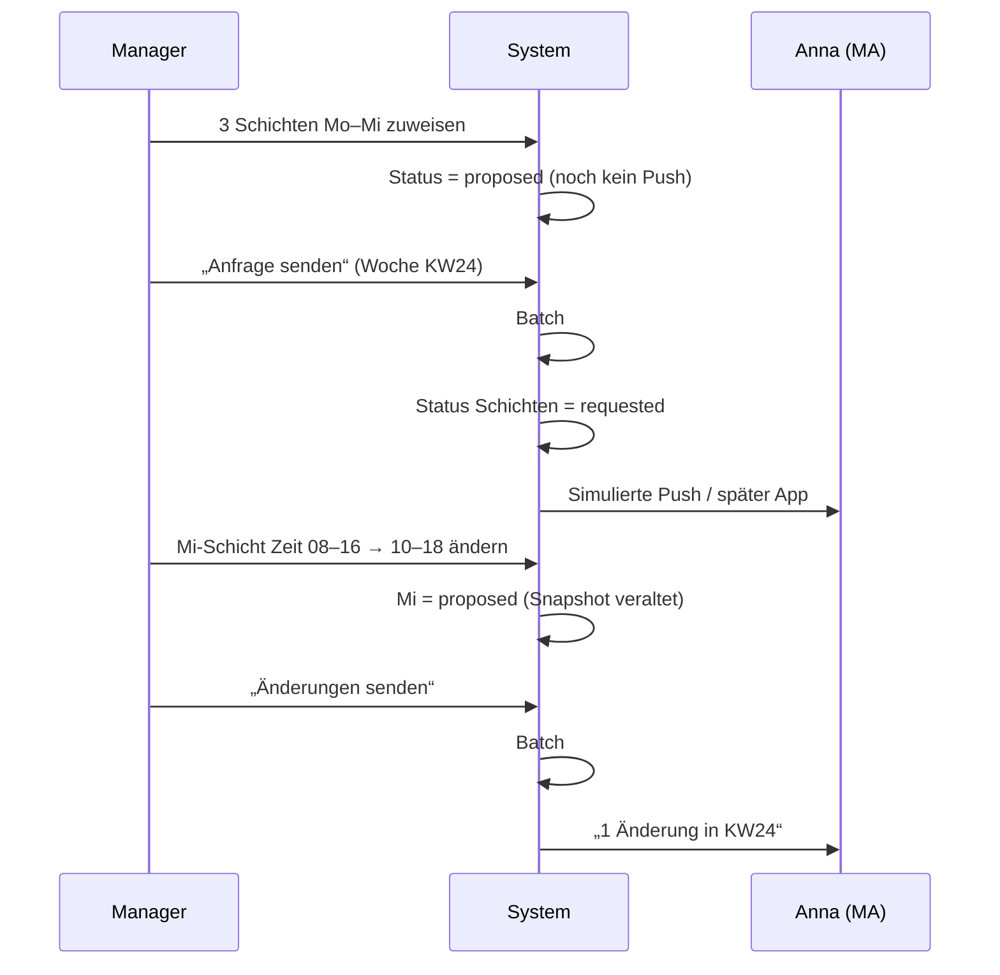

# Brainstorming: Mitarbeiter-Bestätigung von Schichten (Shift Confirmation)

**Status:** Round 1 — offen  
**Kontext:** Geplante Schichten sollen vom zugewiesenen Mitarbeiter bestätigt oder abgelehnt werden können; Manager erhalten Rückmeldung; Dashboard zeigt Status visuell. Mobile UI/Push-Details der App folgen später — hier zunächst Gesamtarchitektur, Web-Dashboard, DB, Prozesse.  
**Bestand:** Tabelle `shifts` ohne Bestätigungs-Status; Zuweisung über Dashboard-Kalender (Single + Bulk); Profile mit Telefonnummer; Mobile-App existiert teilweise.

**Deine Notizen (Kern):**

- Nach Einplanung: Push an Mitarbeiter („Anfrage Woche \<von\>–\<bis\>“)
- Mobile: Wochenliste mit Standort, Bereich, Schichtvorlage, Zeit, Job → pro Eintrag bestätigen/ablehnen → Button „Auswahl senden“
- Push an Admin/Manager: „\<Name\> Einplanung voll bestätigt“ vs. „… inkl. Ablehnungen“
- Web: Schicht in `shifts` mit Status (requested / confirmed / rejected / …)
- Stati u. a.: Requested, Confirmed, Rejected, Pending (\>3 h ohne Antwort), Canceled, ChangeRequest, ChangeRequestTo, ChangeConfirmedFrom, ChangeRejectedFrom
- Bulk-/Einzel-Versand von Push-Nachrichten; Tausch an Admin oder bestimmten Mitarbeiter
- Dashboard: dezente Kennzeichnung (Overlay ~25 %, Symbole) ohne Farbgebung der Karten stark zu verändern

---

## Round 1 — Fundament: Datenmodell, Auslöser & MVP-Umfang

> Bitte markiere deine Wahl mit `[x]`. Empfohlene Option ist mit ⭐ gekennzeichnet.  
> Antworten nur unter **Deine Antwort:** eintragen — bestehende Fragen nicht ändern.

---

### Q1 — **Datenmodell:** Wo leben Bestätigungs-Status und Historie?

Eine Schicht kann mehrfach angefragt, bestätigt, abgelehnt oder zum Tausch angeboten werden. Reicht ein Feld auf `shifts`, oder brauchen wir eine separate Entität?

| Option | Beschreibung |
|--------|--------------|
| **A** | Nur `shifts.confirmation_status` (enum) + `status_updated_at` — ein Status pro Schicht, Historie optional später |
| **B** | `shifts.confirmation_status` **+** Tabelle `shift_confirmation_events` (Audit: wer, wann, alt→neu, Kommentar) ⭐ **empfohlen** (Nachvollziehbarkeit für Konflikte/Tausch) |
| **C** | Nur separate Tabelle `shift_assignments` (Schicht = Slot, Assignment = Mitarbeiter + Status); Tausch = neues Assignment |
| **D** | Hybrid: Status auf `shifts` für Dashboard-Performance, Events für Historie und Push-Log |

- [ ] **A)** Nur Status-Spalte auf `shifts`
- [x] **B)** Status auf `shifts` + Event-Historie ⭐
- [ ] **C)** Assignment-Modell (Schicht und Zuweisung trennen)
- [ ] **D)** Hybrid wie in D beschrieben

**Deine Antwort:**

---

### Q2 — **Auslöser „Requested“:** Wann geht eine Schicht in den Status *Requested* und wann wird Push versendet?

Heute werden Schichten beim Speichern im Kalender sofort „fest“ eingeplant.

- [ ] **A)** **Jede neue/geänderte Zuweisung** an einen Mitarbeiter → automatisch `Requested` + Push (sofern Org-Einstellung aktiv) ⭐ **empfohlen** für klaren Default; Manager kann vor Versand noch bearbeiten, wenn Q3 Batch wählt
- [ ] **B)** Schicht wird zuerst **intern geplant** (z. B. `Draft`), Manager declickt explizit **„Bestätigung anfordern“** (pro Schicht / Bulk / Woche)
- [ ] **C)** Org-Einstellung: Modus **„Auto-Request“** vs. **„Manuell senden“** (beides unterstützt)
- [ ] **D)** Nur Bulk-Einplanung löst Request aus; Einzelschichten bleiben ohne Bestätigungspflicht

**Deine Antwort:**
Gut, dass wir brainstormen! Wir brauchen noch einen weiteren Status "proposed" (direkt bei jeder neuen/geänderten Zuweisung). "requested" nur, wenn push
versendet wurde. Push soll immer explizit ausgeführt werden durch Manger-Klick **„Bestätigung anfordern“** (pro schicht / Bereich / Tag / Woche /Bulk).
Später soll noch hinzukommen, dass KI automatisch schichtvorschläge für Tag/woche oder abgesagte schichten erstellt. Nur da soll dann dirkets versenden von pushs
möglich sein.

---

### Q3 — **Granularität Mitarbeiter-Antwort:** Wie antwortet der Mitarbeiter (konzeptionell — Mobile-UI später)?

Deine Notiz: Liste pro Woche, am Ende **„Auswahl senden“** (Sammelabsendung).

- [ ] **A)** **Nur Sammelantwort** pro Woche: alle Entscheidungen lokal, ein Submit → Server verarbeitet Batch ⭐ **empfohlen** (passt zu Push „Woche X–Y“; weniger Push-Spam)
- [ ] **B)** **Sofort pro Schicht** bei Tap (jede Entscheidung sofort gespeichert + optional sofort Push an Manager)
- [ ] **C)** Beides: Default Sammelmodus, optional Org-Einstellung „sofortige Bestätigung“
- [ ] **D)** Sammelantwort pro **Tag** statt pro Woche

**Deine Antwort:**
Mitarbeiter erhält liste oder einzel-anfrage. Bei Liste: je Schicht bestätigen oder ablehnen(toggle), aber auch "changeRequest" oder "ChangeRequestTo" bearbeiten zu können (inkl. Mitarbeiterauswahl). Die Antworten sollen gesamamelt werden und explizit versendet werden. Am unteren ende der Liste oder der einzel-anfrage
steht ein Button "Antworten senden". Mitarbeiter soll die möglichkeit haben, diese Liste ohne senden zu verlassen, aber soll einen starken hinweis eingebelendet bekommen, wenn er die App öffnet oder sich weiterhin in der app bewegt. Beim übergang von "Requested" in "Pending" soll erneut einmalig eine push an den Mitarbeiter erfolgen. Danach muss der manager manuell die Sache in die Hand nehmen. 

---

### Q4 — **„Pending“ (>3 h):** Was bedeutet Pending fachlich und technisch?

- [ ] **A)** Rein **informativer** Status für Manager (Dashboard-Kennzeichnung); Schicht bleibt für Planung sichtbar; **keine** Auto-Aktion ⭐ **empfohlen** für Phase 1
- [ ] **B)** Pending + **Erinnerungs-Push** an Mitarbeiter (z. B. nach 3 h und nochmals nach 24 h)
- [ ] **C)** Pending + **Auto-Eskalation** an Manager (Push/E-Mail)
- [ ] **D)** Nach Pending + weiterer Frist: automatisch **Rejected** oder Zuweisung aufheben

**Zeitbasis für „3 Stunden“:**

- [ ] **i)** Kalenderstunden ab `requested_at` (serverseitig, Org-Zeitzone) ⭐
- [x] **ii)** Nur **Geschäftszeiten** (z. B. 08–20 Uhr)
- [ ] **iii)** Konfigurierbar pro Organisation

**Deine Antwort (Q4 + Zeitbasis):**
Rein **informativer** Status für Manager (Dashboard-Kennzeichnung); Schicht bleibt für Planung sichtbar; 
Push wird nach 3 Stunden versendet - zeitbasis B

---

### Q5 — **MVP-Scope (Phase 1 ohne Mobile-UI):** Was bauen wir zuerst in Web + Backend?

Mobile-Anzeige/Versand-Optionen explizit **später** — aber Push und API müssen ggf. schon existieren.

| Baustein | Phase 1? |
|----------|----------|
| DB-Status + Events | ? |
| Dashboard-Overlays (Requested/Rejected/Pending/…) | ? |
| Manager: manuell/bulk „Anfrage senden“ | ? |
| Push an Mitarbeiter (Stub/Queue ohne App-UI) | ? |
| REST/API für Mobile (Liste Woche + Submit) | ? |
| Tausch (ChangeRequest*) | ? |
| Canceled (nachträgliche Absage) | ? |

- [x] **A)** Phase 1: **Requested / Confirmed / Rejected / Pending** + Dashboard + API für Mobile-Liste/Submit + Push-Grundgerüst; **Tausch + Canceled in Phase 2** ⭐ **empfohlen**
- [ ] **B)** Phase 1: alles inkl. **ChangeRequest\*** und **Canceled**
- [ ] **C)** Phase 1: nur **Web-Dashboard-Status** ohne Push (Mobile/Push Phase 2)
- [ ] **D)** Eigene Aufteilung (bitte Tabelle in Antwort ausfüllen)

**Deine Antwort:**

---

### Q6 — **Bestehende Schichten:** Was passiert mit Schichten, die **vor** dem Feature bereits im Kalender liegen?

- [x] **A)** Retroaktiv **`Confirmed`** (still angenommen — kein Request) ⭐ **empfohlen** (kein Massen-Chaos beim Rollout)
- [ ] **B)** Retroaktiv **`Requested`** für alle Zukunftsschichten ab Go-Live
- [ ] **C)** Nur **neue** Schichten ab Go-Live; bestehende ohne Status (`NULL` = legacy confirmed)
- [ ] **D)** Manager-Wizard: einmalig „Alle ab \<Datum\> bestätigen lassen“

**Deine Antwort:**

---

## Nächste Runde (Vorschau)

Nach Beantwortung von Round 1 folgen u. a.:

- Status-Enum verfeinern (ChangeRequest\*-Zustandsautomat)
- Push-Kanal (SMS vs. FCM/APNs vs. WhatsApp) & Telefonnummer aus Profil
- Manager-Benachrichtigung: wer ist „Admin“ (Rolle admin/manager/inhaber)?
- Dashboard-UX: Overlay-Symbole vs. Badge vs. Randstreifen
- Bulk-Regeln: eine Push pro Woche vs. pro Schichtänderung
- Konflikt: Mitarbeiter lehnt ab — muss Manager neu zuweisen oder bleibt Schicht „offen“?

---

*Ende Round 1 — bitte Antworten eintragen, dann geht es mit Round 2 weiter.*

---

## Round 2 — Status-Modell, Push, Ablehnung & Dashboard-UX

**Status:** Round 2 — offen  
**Aus Round 1 (Kurz):** `Proposed` bei Zuweisung → `Requested` erst nach Manager-Push; Sammelantwort „Antworten senden“; Pending nach 3 h **Geschäftszeiten** + **einmaliger** Erinnerungs-Push; Phase 1 ohne Tausch/Canceled; Bestand = `Confirmed`.

> Bitte markiere deine Wahl mit `[x]`. Empfohlene Option ist mit ⭐ gekennzeichnet.  
> Antworten nur unter **Deine Antwort:** eintragen.

---

### Q7 — **Status-Enum Phase 1:** Welche Werte kommen in `shifts.confirmation_status` (und DB-Constraint)?

Dein neuer Status **Proposed** ergänzt die Liste. Für Phase 1 (ohne Tausch/Canceled) — welches Set?

- [x] **A)** `proposed`, `requested`, `confirmed`, `rejected`, `pending` — **5 Werte** Phase 1; Tausch/Canceled erst Phase 2 ⭐ **empfohlen**
- [ ] **B)** Zusätzlich schon `canceled` in Phase 1 (MA kann bestätigte Schicht absagen, Manager sieht Status)
- [ ] **C)** Zusätzlich `draft` statt `proposed` (engl. Naming wie Rest der Codebase)
- [ ] **D)** Anderes Set (bitte auflisten)

**Zusatz:** Soll **`legacy_confirmed`** oder `NULL` für migrierte Alt-Schichten erlaubt bleiben, oder strikt nur `confirmed` nach Migration (Round 1 = A)?

- [x] **i)** Migration setzt alles auf `confirmed`; kein NULL ⭐
- [ ] **ii)** `NULL` = „vor Feature, gilt als confirmed“ (Dashboard behandelt wie confirmed)

**Deine Antwort:**

---

### Q8 — **Nach Ablehnung (`Rejected`):** Was passiert mit der Schicht im Kalender?

- [x] **A)** Schicht **bleibt** am Mitarbeiter + Status `rejected`; Manager muss **manuell** umplanen oder löschen ⭐ **empfohlen** (klar sichtbar, kein Datenverlust)
- [ ] **B)** Zuweisung wird **automatisch entfernt** (`employee_id` null / Schicht gelöscht); Slot ist „offen“
- [ ] **C)** Schicht bleibt, aber **ausgegraut** / in separater „Konflikt“-Liste für Manager
- [ ] **D)** Manager wählt pro Org: **A oder B**

**Deine Antwort:**

---

### Q9 — **Manager-Aktion „Bestätigung anfordern“:** Welche Bulk-Granularität in Phase 1 (Web)?

Du nanntest: pro Schicht / Bereich / Tag / Woche / Bulk.

| Granularität | Phase 1? |
|--------------|----------|
| Einzelne Schicht (Kontextmenü) | ? |
| Alle `proposed` eines **Tages × Bereichs** | ? |
| Alle `proposed` eines **Mitarbeiters × Woche** | ? |
| Alle `proposed` einer **Woche** (gesamt) | ? |
| Bulk-Modal (bestehend) — nur `proposed` markierte Zeilen | ? |

- [x] **A)** **Mitarbeiter × Woche** als Hauptflow (passt zu Push-Text „Woche von–bis“) + Einzelschicht; Tag×Bereich optional ⭐ **empfohlen**
- [ ] **B)** Alles oben in Phase 1
- [ ] **C)** Nur Einzelschicht + gesamte Woche (kein Tag×Bereich)
- [ ] **D)** Eigene Priorität (bitte Tabelle ausfüllen)

**Push pro Aktion:** Wie viele Push-Nachrichten an den Mitarbeiter?

- [ ] **i)** **Max. eine Push pro Mitarbeiter × Kalenderwoche** (weitere `proposed` in derselben Woche → nur In-App-Liste, kein neuer Push) ⭐
- [ ] **ii)** **Jeder** Klick „Anfordern“ = neue Push (auch mehrmals pro Woche)
- [ ] **iii)** Manager wählt beim Senden: „Push senden“ ja/nein

**Deine Antwort:**
Es soll mehrere Möglichkeiten geben. Manager kann push pro Zuweisung senden, oder für den ganzen Tag (Ein Mitarbeiter könnte an einem Tag in mehrere Teil-Zeiten zugewiesen sein) oder pro woche bzw. für alle Tage, in denen er zu dem zeitpunkt des versandts eingeteilt ist (hier muss mehrfach versenden möglich sein, wenn sich etwas in der woche verändert hat, dann aber nur für Mitarbeiter und nur die änderungen). Bei Bulk-Versendung wäre in Modal mit mitarbeiterauswahl eine idee. Mitarbeiter, an die bereits
versebdet wurde, werden nicht mehr gelistet. Mitarbeiter, bei denen sich etwas geändert hat in der Woche, bekommen nur die änderungen gesendet.
Ich denke, hier müssen wir nich etwas brainstormen.
---

### Q10 — **Push-Kanal Phase 1:** Wie erreichen wir den Mitarbeiter (Telefon im Profil)?

Mobile-UI später — aber Versand muss technisch starten.

- [ ] **A)** **FCM/APNs** (Push an installierte App) + Fallback **SMS** wenn keine App-Registrierung ⭐ **empfohlen** langfristig; Phase 1 kann mit SMS-Stub starten
- [ ] **B)** Nur **SMS** an `mobile_phone` (einfacher MVP)
- [ ] **C)** Nur **In-App** (kein externer Push bis App fertig); Manager sieht „nicht zugestellt“
- [ ] **D)** **E-Mail** zusätzlich/alternativ

**Deine Antwort:**
SMS kosten Geld - das sollte erstmal vermieden werden. Stattdessen sind email vom Mitarbeiter hinterlegt. Eine e_amil kann an den Mitarbeiter versendet werden.
Andererseits wird es keine app-registrierung geben bzw. ein Mitarbeiter wird nicht zuweisbar sein, wenn die app nicht registriert wurde. Verliwert der Mitarbeiter
sein handy oder es wird zerstört, soll email erstmal der weg sein. Manager bekommt nach 3 Stunden pending-info.
Echte pushs sollen in phase 1 erstmal nur simuliert werden.

---

### Q11 — **Manager-Benachrichtigung** nach „Antworten senden“ des Mitarbeiters:

Wer erhält Push/Nachricht bei „\<Name\> Einplanung voll bestätigt“ vs. „… inkl. Ablehnungen“?

- [x] **A)** Alle Profile mit Rolle **`admin` oder `manager`** in der Organisation ⭐ **empfohlen**
- [ ] **B)** Nur der **`created_by`**-Manager der betroffenen Schicht(en)
- [ ] **C)** Konfigurierbare **Empfänger-Liste** pro Standort/Bereich
- [ ] **D)** A + optional Inhaber als separates System-Rolle (falls abweichend von admin)

**Kanal Manager Phase 1:**

- [ ] **i)** In-App-Badge / Notification-Center in Web (kein Handy-Push für Manager) ⭐ für Phase 1
- [ ] **ii)** Auch Push/E-Mail an Manager

**Deine Antwort:**
Phase 1: i
Pahse 2:
Ablehnung = push (Phase 2)
Confirmation nur In-App-Badge / Notification-Center in Web

---

### Q12 — **Dashboard-Kennzeichnung:** Wie zeigen wir Status auf Schichtkarten?

Dein Vorschlag: Overlay ~25 %, Symbole (?, X, Initialen, ⚠). Kartenfarbe der Schichtvorlage soll **dominant bleiben**.

- [ ] **A)** **Rechte obere Ecke:** kleines Icon-Badge (kein Voll-Overlay); Farbe der Karte unverändert ⭐ **empfohlen** (Lesbarkeit)
- [ ] **B)** **Voll-Overlay 25 %** + großes Symbol wie in deinen Notizen
- [ ] **C)** **Linker Randstreifen** (4 px) in Statusfarbe + Mini-Icon
- [ ] **D)** Kombination: Randstreifen + kleines Icon (kein Voll-Overlay)

**Symbole Phase 1 (ohne Tausch-Initialen):**

| Status | Darstellung |
|--------|-------------|
| `proposed` | ? |
| `requested` | ? |
| `pending` | ? |
| `rejected` | ? |
| `confirmed` | keins / ✓ |

Bitte kurz bestätigen oder eigene Zuordnung in Antwort.

- [ ] **E)** Vorschlag übernehmen: proposed=⋯, requested=?, pending=⏱, rejected=✕, confirmed=— ⭐

**Deine Antwort:**
Rechte Hälfte der Karte vollständig mit overlay (25% deckfähigkeit) + rechte obere Ecke mit Icon-Badge und Werten aus Zeichen aus Vorschlag E

---

### Q13 — **Geschäftszeiten für Pending (3 h):** Woher kommen 08–20 Uhr?

Round 1: Zeitbasis = Geschäftszeiten; ein Push bei Übergang Requested → Pending.

- [x] **A)** Fest **08:00–20:00** Org-Zeitzone (hardcoded MVP) ⭐ **empfohlen** für Phase 1
- [ ] **B)** Aus **Servicezeiten** des Standorts/Bereichs der Schicht (komplex)
- [ ] **C)** Pro Organisation konfigurierbar (`pending_business_hours_start/end`)
- [ ] **D)** Pro Standort konfigurierbar

**„3 Stunden“ zählen:**

- [x] **i)** Nur Stunden **innerhalb** des Geschäftszeit-Fensters ⭐
- [ ] **ii)** Kalenderstunden, aber Timer **pausiert** nachts (08–20 aktiv)

**Deine Antwort:**

---

### Q14 — **Re-Request:** Manager ändert Schicht nach `Requested` / `Rejected` / `Pending` — Status?

Beispiel: Zeit geändert, anderer Bereich, oder erneut „Anfordern“ nach Ablehnung.

- [x] **A)** Jede relevante **Planungsänderung** → zurück auf **`proposed`**; Manager muss erneut „Anfordern“ ⭐ **empfohlen**
- [ ] **B)** Bleibt `requested`; Mitarbeiter sieht **Diff** in der Liste (alt vs. neu)
- [ ] **C)** Automatisch neuer `requested` + Push bei jeder Änderung (ohne proposed-Zwischenschritt)
- [ ] **D)** Nur bei Wechsel des **Mitarbeiters** → `proposed`; Zeitänderung → bleibt Status

**Deine Antwort:**

---

### Q15 — **Event-Tabelle (`shift_confirmation_events`):** Was protokollieren wir minimal Phase 1?

Round 1 = B (Status + Events).

- [x] **A)** Jeder Statuswechsel + `actor_id` + `payload` (JSON: push_id, batch_id, …) ⭐ **empfohlen**
- [ ] **B)** Zusätzlich jeder **Push-Versuch** (sent/failed) als Event
- [ ] **C)** Nur Mitarbeiter-Antworten + Manager „Anfordern“ (kein System pending)
- [ ] **D)** A + B

**Deine Antwort:**

---

## Nächste Runde (Vorschau)

Round 3 u. a.:

- ChangeRequest*-Automat (Phase 2) — Nummerierung & Zustände
- KI-Schichtvorschläge → Auto-Push (später)
- API-Endpunkte Mobile (Woche laden, Batch submit, Einzelanfrage)
- Org-Einstellungen (Feature-Flag, Geschäftszeiten, Auto vs. manuell)
- Konflikt-UI Manager: „Offene Ablehnungen“-Panel
- Rechtliches / Arbeitsrecht-Hinweis (Bestätigung ≠ Arbeitsvertrag)

---

*Ende Round 2 — bitte Antworten eintragen, dann geht es mit Round 3 weiter.*

---

## Round 3 — Push/Batch-Modell, App-Gate, API & Phase-2-Vorbereitung

**Status:** Round 3 — offen  
**Aus Round 2 (Kurz):** 5 Status-Werte; Ablehnung behält Zuweisung; **Push-Granularität offen** (Tag/Woche/Änderungen); **App-Registrierung Pflicht** für Zuweisbarkeit; E-Mail-Fallback; Push Phase 1 **simuliert**; Manager Pending-Info nach 3 h (In-App); Dashboard = rechte Hälfte Overlay 25 % + Badge; Planänderung → `proposed`.

> Bitte markiere deine Wahl mit `[x]`. Empfohlene Option ist mit ⭐ gekennzeichnet.  
> Antworten nur unter **Deine Antwort:** eintragen.

---

### Q16 — **Push-/Anfrage-Modell (Follow-up Q9):** Wie modellieren wir „Versand“ und **Delta-Nachsendung**?

Du brauchst: pro Zuweisung, pro Tag, pro Woche, Bulk-Modal; bereits Versendetes ausblenden; bei Wochenänderung **nur Delta** erneut senden.

**Kernidee:** Jede Anfrage = **`confirmation_request_batch`** (Woche von–bis, Mitarbeiter, `sent_at`, Kanal) + **`confirmation_request_items`** (Schicht-IDs, Snapshot: Zeit/Bereich/Vorlage zum Sendezeitpunkt).

| Option | Beschreibung |
|--------|--------------|
| **A** | Batch pro **Sendeaktion**; Item speichert **Snapshot**; erneuter Versand nur für Schichten mit `proposed` oder **geändert seit letztem Snapshot** ⭐ **empfohlen** |
| **B** | Kein Batch — nur `requested_at` pro Schicht; Delta per Diff der Schichtfelder |
| **C** | Eine offene Batch pro MA×KW; Items werden append-only ergänzt |

**Sende-Scopes Phase 1 (Mehrfachauswahl erlaubt?):**

- [ ] **i)** Einzelschicht (Kontextmenü)
- [ ] **ii)** Alle `proposed` **MA × Kalendertag** (alle Teil-Schichten des Tages)
- [ ] **iii)** Alle `proposed` **MA × ISO-Woche**
- [ ] **iv)** Bulk-Modal: **Mitarbeiterauswahl** — nur MA mit mindestens einem `proposed`/Delta in gewählter Woche; bereits vollständig `requested` ohne Änderung **ausgeblendet** ⭐
- [ ] **v)** Gesamte Woche alle MA (selten — optional Phase 1?)

**Delta-Regel:** Schicht war `requested`, Manager ändert Zeit → zurück `proposed` (Q14). Beim erneuten Senden:

- [ ] **a)** Nur diese Schicht(en) in **neuer Mini-Batch** / neues Item; Push-Text: „1 Änderung in deiner Woche …“ ⭐
- [ ] **b)** Ganze Woche erneut listen (alle offenen Items)
- [ ] **c)** Manager wählt beim Senden: „nur Änderungen“ vs. „alles Offene“

**Deine Antwort:**
Habe ich nicht verstanden!

---

### Q17 — **App-Registrierung als Zuweisungs-Gate:** Was passiert technisch und in der UI?

„Kein zuweisbarer Mitarbeiter ohne App-Registrierung.“

- [x] **A)** Feld `profiles.app_registered_at` (oder Device-Token-Tabelle); Kalender/Bulk **filtert** nicht-registrierte MA aus Auswahl ⭐ **empfohlen**
- [ ] **B)** Warnung beim Zuweisen, aber Zuweisung **trotzdem möglich** (nur E-Mail)
- [ ] **C)** Zuweisung möglich → Status bleibt `proposed`, Versand blockiert mit Fehlermeldung
- [ ] **D)** Org-Einstellung: **Strikt (A)** vs. **E-Mail-only (B)**

**E-Mail-Fallback (Handy verloren):**

- [x] **i)** Manager setzt Flag **„E-Mail-Modus“** am Profil → Links statt App bis Re-Registrierung ⭐
- [ ] **ii)** Automatisch E-Mail wenn kein Token (ohne Manager-Aktion)
- [ ] **iii)** Kein Fallback — MA gesperrt bis App neu registriert

**Deine Antwort:**

---

### Q18 — **Simulierter Push Phase 1:** Was sieht Manager / Entwickler?

- [x] **A)** **`notification_outbox`** Tabelle (Empfänger, Template, Payload, `simulated=true`); Web-UI „Benachrichtigungen (Dev)“ zum Inspizieren ⭐ **empfohlen**
- [ ] **B)** Nur **Server-Log** + Event-Eintrag in `shift_confirmation_events`
- [ ] **C)** Echte **E-Mail** an MA (kein Simulieren), Push bleibt aus
- [ ] **D)** A + optional E-Mail parallel wenn `email_fallback` aktiv

**Pending-Erinnerung (MA, nach 3 h Geschäftszeit):**

- [ ] **i)** Ebenfalls simuliert (Outbox) Phase 1 ⭐
- [ ] **ii)** Echte E-Mail an MA
- [ ] **iii)** Gar kein MA-Push/E-Mail Phase 1 — nur Manager-In-App (Widerspruch zu Round 1? bitte klären)

**Deine Antwort:**

---

### Q19 — **API Mobile (Phase 1 Backend):** Welche Endpunkte bauen wir vor UI?

- [x] **A)** **REST** unter `/api/mobile/confirmations/…` (Session/JWT wie bestehende Mobile-Auth) ⭐ **empfohlen**
- [ ] **B)** Server Actions nur Web; Mobile später separates GraphQL
- [ ] **C)** Supabase Realtime + RLS direkt (ohne App-Server)

**Minimal-Contract (bitte bestätigen oder korrigieren):**

| Endpunkt | Zweck |
|----------|--------|
| `GET …/week?from=&to=` | Offene Items (`requested`/`pending`) für eingeloggten MA |
| `GET …/shift/:id` | Einzelanfrage (Deep-Link aus E-Mail später) |
| `POST …/respond` | Body: `{ items: [{ shiftId, decision: confirm\|reject }] }` — atomarer Batch |
| `GET …/pending-reminder` | Optional: ungesendete lokale Entwürfe (nur Client?) |

**Ungesendete Entwürfe** (MA verlässt Liste ohne „Antworten senden“):

- [x] **i)** Nur **Client-local** (AsyncStorage); Server kennt Entwürfe nicht ⭐
- [ ] **ii)** Server speichert **Draft** pro Item (`draft_decision`) für Hinweis-Banner

**Deine Antwort:**

---

### Q20 — **Hinweis-Banner** (MA ohne gesendete Antwort): Wann und wie stark?

- [x] **A)** Beim App-Start und bei Navigation: **Modal** „Du hast X offene Anfragen ohne Antwort“ + Link zur Liste ⭐ **empfohlen**
- [ ] **B)** Persistenter **Banner** oben, dismissible pro Session
- [ ] **C)** A + erneut nach 24 h Geschäftszeit
- [ ] **D)** Nur Badge auf Tab „Schichten“

**Deine Antwort:**

---

### Q21 — **Manager: Pending & Ablehnungen** — Wo sieht der Manager Handlungsbedarf?

**Pending (>3 h Geschäftszeit):**

- [x] **A)** Schichtkarte `pending` + **Notification-Center** Eintrag aggregiert pro MA ⭐ **empfohlen**
- [x] **B)** Zusätzlich dediziertes Panel **„Offene Rückmeldungen“** (Filter: pending / rejected / proposed ohne Versand)
- [ ] **C)** Nur Kalender-Overlay, kein separates Panel Phase 1

**Rejected:**

- [ ] **i)** Kalender + optional Panel-Zähler „3 Ablehnungen diese Woche“ ⭐
- [x] **ii)** Panel mit Quick-Action „Neu zuweisen“ (öffnet bestehendes Bulk/Assign)

**Deine Antwort:**

---

### Q22 — **Org-Einstellungen Phase 1:** Welche Schalter in Einstellungen?

- [x] **A)** **`shift_confirmation_enabled`** (Feature an/aus; aus = alle neuen Zuweisungen direkt `confirmed`?) ⭐ **empfohlen**
- [ ] **B)** Zusätzlich **`require_app_registration`** (Default an, siehe Q17)
- [ ] **C)** Geschäftszeiten Pending (später; Phase 1 hardcoded 08–20)
- [ ] **D)** Alles oben in Phase 1

**Wenn Feature aus (A):**

- [x] **i)** Neue Zuweisungen → sofort **`confirmed`** (kein proposed) ⭐
- [ ] **ii)** Feature komplett unsichtbar; Verhalten wie heute (ohne Status-Spalte-Nutzung)

**Deine Antwort:**

---

### Q23 — **ChangeRequest / Tausch (Phase 2 — Konzept):** Zustände bereinigen

Deine ursprüngliche Liste hatte doppelte Nummerierung. Vorschlag Phase 2:

- [ ] **A)** Obiges **4-Status-Tauschmodell** + Admin-Freigabe optional ⭐ **empfohlen**
- [ ] **B)** Tausch nur an **Admin** (kein Peer-to-Peer)
- [ ] **C)** Tausch = neue Schicht + alte `canceled` (kein eigener Automat)
- [ ] **D)** Phase 2 ganz streichen / verschieben auf Phase 3

**`Canceled` (MA sagt bestätigte Schicht ab):**

- [ ] **i)** Phase 2: Status `canceled`, Zuweisung bleibt sichtbar, Manager muss neu planen ⭐
- [ ] **ii)** Phase 2: Zuweisung wird entfernt
- [ ] **iii)** Nicht vorgesehen

**Deine Antwort:**
Doppelte nummerierung war schreibfehler. Letzte 7 sollte eine 9 sein.

---

### Q24 — **KI-Schichtvorschläge (später):** Auto-Push — Grenzen?

Round 1: KI darf Vorschläge **direkt** pushen (Ausnahme zum Manager-Klick).

- [x] **A)** KI erzeugt Schichten in **`proposed`**; **Auto-Request** nur wenn Org **`ai_auto_request_enabled`** ⭐ **empfohlen**
- [ ] **B)** KI-Schichten immer **`proposed`**; nie Auto-Push — Manager sendet immer manuell
- [ ] **C)** Eigener Status **`ai_suggested`** vor `proposed`
- [ ] **D)** Thema erst nach Phase 2 specen — in Spec nur Platzhalter

**Deine Antwort:**

---

### Q25 — **Rechtlicher Hinweis / UX-Copy:** Brauchen wir festen Disclaimer?

Bestätigung in App ≠ rechtsverbindliche Arbeitszeitvereinbarung (je nach Betrieb).

- [x] **A)** Einzeiler unter „Antworten senden“ + in Einstellungen Org-Hinweistext (editierbar) ⭐ **empfohlen**
- [ ] **B)** Nur statischer i18n-Text, nicht editierbar
- [ ] **C)** Kein Disclaimer Phase 1
- [ ] **D)** Checkbox „zur Kenntnis genommen“ vor erstem Submit pro MA

**Deine Antwort:**

---

### Q26 — **Abschluss Brainstorming:** Bereit für Specification?

Wenn Q16–Q25 (und offene Punkte aus R1/R2) beantwortet sind, erstellen wir **`specs/008-shift-employee-confirmation-specification.md`**.

- [ ] **A)** Ja — nach Round 3 Antworten Spec schreiben (DB-Migration, API, UI, Jobs, i18n) ⭐
- [x] **B)** Noch **Round 4** (bitte Themen nennen)
- [ ] **C)** Spec in **zwei Docs** splitten: Phase 1 Spec + Phase 2 Appendix

**Falls Round 4 — gewünschte Themen (frei eintragen):**

**Deine Antwort:**
Q16 ist unklar. bitte klarer formulieren!

---

## Nächste Runde (Vorschau)

Falls Round 4 nötig:

- Cron/Job: Pending-Transition (`requested` → `pending`) — Frequenz, Idempotenz
- E-Mail-Templates (Anfrage, Erinnerung, Delta)
- Berechtigungen RLS (MA sieht nur eigene Schichten)
- Konflikt: Teilbestätigung innerhalb einer Woche (3 von 5 bestätigt, 2 rejected)
- Testplan & Rollout-Flag pro Organisation

---

*Ende Round 3 — bitte Antworten eintragen; danach Specification oder Round 4.*

---

## Round 4 — Q16 vereinfacht, Jobs, RLS & Randfälle

**Status:** Round 4 — offen  
**Grund:** Q16 war unverständlich — hier noch einmal **in Alltagssprache** mit Beispiel. Danach technische Randthemen vor der Specification.

### Q16 nochmal — Das „Versand-Paket“ in 60 Sekunden

**Problem:** Manager plant Schichten. Mitarbeiter soll erst antworten, **nachdem** der Manager aktiv „Anfrage senden“ klickt. Manchmal sendet Manager **nochmal** — aber nur für **neue oder geänderte** Schichten, nicht alles von vorn.

**Lösung in zwei Tabellen (Metapher: Brief + Inhalt):**

| Tabelle | Was speichert sie? | Beispiel |
|---------|-------------------|----------|
| **`confirmation_request_batch`** | Ein **Versand-Vorgang** (wer, wann, welche Woche) | „Mo 10.6., 14:03 — Anfrage an Anna für KW 24“ |
| **`confirmation_request_items`** | **Welche Schichten** in diesem Versand + **Snapshot** (Stand zum Sendezeitpunkt) | Schicht #471: 08–16 Uhr, Bereich Küche |

**Snapshot** = Kopie der wichtigen Felder (Zeit, Bereich, Vorlage). Wenn Manager **danach** die Zeit ändert, erkennt das System: „Snapshot ≠ aktuelle Schicht → wieder `proposed` → darf erneut versendet werden.“

**Beispiel-Ablauf:**

---

### Q27 — **Q16 Entscheidung (vereinfacht):** Stimmt dieses Modell?

- [x] **A)** **Ja** — Batch + Items + Snapshot wie oben; erneuter Versand nur für `proposed` / geänderte Schichten ⭐ **empfohlen**
- [ ] **B)** **Nein** — lieber **ohne** Batch-Tabelle; nur Status auf `shifts` + `requested_at` (einfacher, Delta schwerer)
- [ ] **C)** **Ja, aber** Batch-Tabelle erst Phase 2; Phase 1 nur Einzelschicht-Versand ohne Delta-Logik
- [ ] **D)** Andere Idee (bitte beschreiben)

**Deine Antwort:**

---

### Q28 — **„Anfrage senden“ — welche Buttons braucht der Manager Phase 1?**

Mehrfachauswahl möglich (`[x]`):

- [x] **i)** **Einzelschicht** — Kontextmenü auf Karte
- [x] **ii)** **Mitarbeiter × Tag** — alle `proposed`/Delta eines MA an einem Tag
- [x] **iii)** **Mitarbeiter × Woche** — alle offenen Schichten dieser KW für einen MA ⭐ **empfohlen als Hauptbutton**
- [x] **iv)** **Bulk-Modal** — mehrere MA auswählen (nur MA mit offenen/Delta-Schichten in der Woche; MA ohne Offenes **nicht** in Liste) ⭐
- [ ] **v)** **Ganze Woche alle MA** — ein Klick für alle mit Offenem (optional)

**Beim erneuten Senden nach Änderung:**

- [x] **a)** System sendet **automatisch nur Delta** (geänderte/neue `proposed`) — kein Extra-Klick „nur Änderungen“ ⭐ **empfohlen**
- [ ] **b)** Manager wählt explizit: „Nur Änderungen“ vs. „Alles offene erneut“
- [ ] **c)** Immer **komplette Woche** nochmal (einfach, aber mehr Noise für MA)

**Deine Antwort:**

---

### Q29 — **Pending-Job:** Wer setzt `requested` → `pending` nach 3 h Geschäftszeit?

- [x] **A)** **Cron** alle 15 Min.: prüft `requested` + `requested_at` + Geschäftsstunden-Zähler; idempotent (pro Schicht nur 1× pending + 1× Erinnerungs-Push) ⭐ **empfohlen**
- [ ] **B)** Cron stündlich
- [ ] **C)** Bei jedem Dashboard-Laden (kein separater Job — nicht empfohlen)
- [ ] **D)** Supabase **pg_cron** / Edge Function — egal welches, Hauptsache A-Logik

**Erinnerungs-Push an MA (offen aus Q18):**

- [ ] **i)** Phase 1: **simuliert** in `notification_outbox` ⭐
- [ ] **ii)** Phase 1: **echte E-Mail** an MA
- [ ] **iii)** Phase 1: **kein** MA-Push/E-Mail; nur Manager sieht `pending`

**Deine Antwort:**

---

### Q30 — **Teilantwort innerhalb einer Woche:** Anna bestätigt 3 Schichten, lehnt 2 ab — ein Submit

- [x] **A)** **Ein Submit** verarbeitet **gemischte** Entscheidungen; Manager bekommt **eine** Meldung „… inkl. Ablehnungen“ wenn ≥1 rejected ⭐ **empfohlen**
- [ ] **B)** MA muss **alle** Positionen entscheiden bevor Submit (kein Teil-Submit)
- [ ] **C)** Pro Schicht sofort speichern (widerspricht Sammelantwort Round 1)
- [ ] **D)** Submit erlaubt, aber **Warnung** wenn noch unentschiedene Schichten in der Liste

**Schichten ohne Entscheidung im Submit:**

- [x] **i)** Bleiben `requested` / werden `pending` nach Frist ⭐
- [ ] **ii)** Submit blockiert bis alle beantwortet

**Deine Antwort:**

---

### Q31 — **E-Mail Phase 1:** Wann echte Mail vs. nur Simulation?

Du wolltest: Push simuliert; E-Mail bei verlorenem Handy; SMS vermeiden.

- [ ] **A)** **Standard:** simulierte Push (Outbox); **E-Mail nur** wenn Profil **`email_fallback_mode`** (Manager gesetzt) ⭐ **empfohlen**
- [ ] **B)** **Jede** Anfrage zusätzlich E-Mail (zur Sicherheit)
- [ ] **C)** Phase 1 **gar keine** E-Mail — nur Outbox + In-App Dev-View
- [ ] **D)** E-Mail nur für Pending-Erinnerung, nicht für Erstanfrage

**E-Mail-Inhalt (später):**

- [ ] **i)** Link zur **Web-Antwortseite** (Mobile-UI noch nicht da) ⭐ für Phase 1
- [ ] **ii)** Nur Hinweis „App öffnen“ ohne Web-Antwort
- [ ] **iii)** Vollständige Schichtliste im E-Mail-Body

**Deine Antwort:**
Echte email in Phase 1 ebenfalls nur simulieren (sind vorerst nur fake-emails)

---

### Q32 — **RLS / Berechtigungen:** Wer sieht was?

- [x] **A)** **MA** (Rolle employee): nur **eigene** Schichten + eigene Batches/Items lesen; `POST respond` nur für eigene `shift_id` ⭐ **empfohlen**
- [x] **B)** **Manager/admin:** alle Schichten der Org; dürfen `send confirmation request` + Status lesen
- [ ] **C)** **MA darf `shifts` nicht direkt** — nur über API-View `employee_confirmation_inbox`
- [ ] **D)** A + C (API-View als einzige MA-Schnittstelle)

**Dashboard Kalender:**

- [x] **i)** MA-Rolle **kein** Web-Dashboard Phase 1 ⭐
- [ ] **ii)** MA kann Web-Kalender read-only sehen

**Deine Antwort (Hauptwahl A/B/C/D + i/ii):**

---

### Q33 — **Notification-Center Manager:** Aggregation

Nach „Antworten senden“ oder Pending-Übergang:

- [x] **A)** **Ein Eintrag pro Ereignis** (Anna hat geantwortet; Anna Schicht X pending) ⭐ **empfohlen**
- [ ] **B)** **Tages-Digest** — „3 Mitarbeiter haben geantwortet“
- [ ] **C)** A für Antworten + B für Pending
- [ ] **D)** Nur Badge-Zähler am Glocken-Icon, keine Liste Phase 1

**Gelesen / Erledigt:**

- [x] **i)** Manager kann Notification **dismissen**; kein Auto-Clear ⭐
- [ ] **ii)** Auto-Clear wenn alle Schichten des MA in der Woche `confirmed`/`rejected` bearbeitet

**Deine Antwort:**

---

### Q34 — **Rollout & Migration**

- [x] **A)** Feature default **aus** (`shift_confirmation_enabled=false`); Org schaltet bewusst an ⭐ **empfohlen**
- [ ] **B)** Feature default **an** für alle Orgs
- [ ] **C)** Nur ausgewählte Test-Orgs per Allowlist

**Migration Bestand (Round 1 Q6 = confirmed):**

- [x] **i)** Einmal-SQL: alle bestehenden Schichten mit MA → `confirmed` ⭐
- [ ] **ii)** Nur Zukunftsschichten ab Go-Live-Datum

**Deine Antwort:**

---

### Q35 — **Phase 2 Status-Nummerierung (Klarstellung Q23)**

Dein Schreibfehler: „7“ → „9“. Für die Spec — **finale Namen** Phase 2 (Tausch/Absage):

Vorschlag Enum-Ergänzung:

| Status | Bedeutung |
|--------|-----------|
| `change_requested` | MA möchte tauschen / Admin einschalten |
| `change_pending_peer` | Warte auf Tauschpartner |
| `change_confirmed` | Tausch akzeptiert (ggf. Admin-Freigabe) |
| `change_rejected` | Partner lehnt ab |
| `canceled` | MA sagt bestätigte Schicht ab |

- [x] **A)** Namen wie oben (snake_case, Englisch wie Codebase) ⭐ **empfohlen**
- [ ] **B)** Deutsche Enum-Werte
- [ ] **C)** Phase 2 erst in separatem Spec-Dokument — Phase-1-Spec ohne diese Werte

**Deine Antwort:**

---

### Q36 — **Specification starten?**

Wenn Q27–Q35 beantwortet (und Q16 damit geklärt):

- [x] **A)** **Ja** — `specs/008-shift-employee-confirmation-specification.md` (Phase 1 vollständig; Phase 2 als Appendix) ⭐ **empfohlen**
- [ ] **B)** Noch **Round 5** (Thema: _____________)
- [ ] **C)** Zwei Spec-Dateien: `…-phase1.md` + `…-phase2.md`

**Deine Antwort:**

---

*Ende Round 4 — bitte Antworten eintragen; danach Specification (sofern Q36 = A).*

