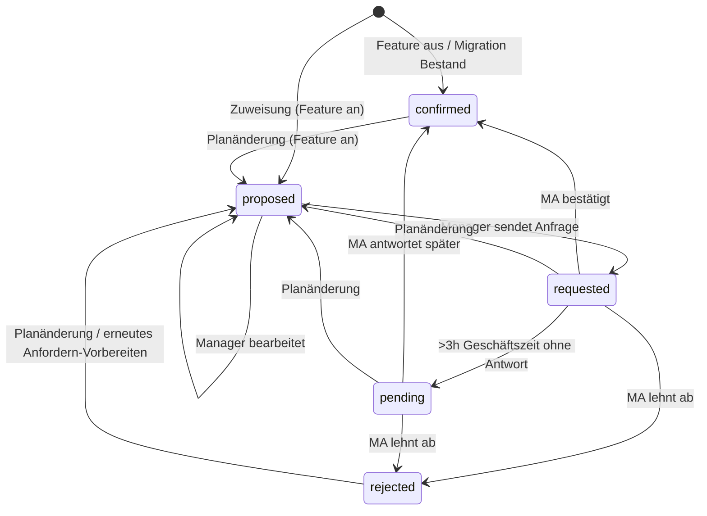
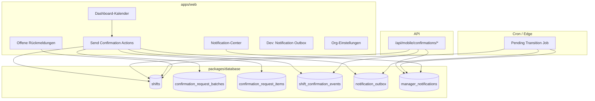
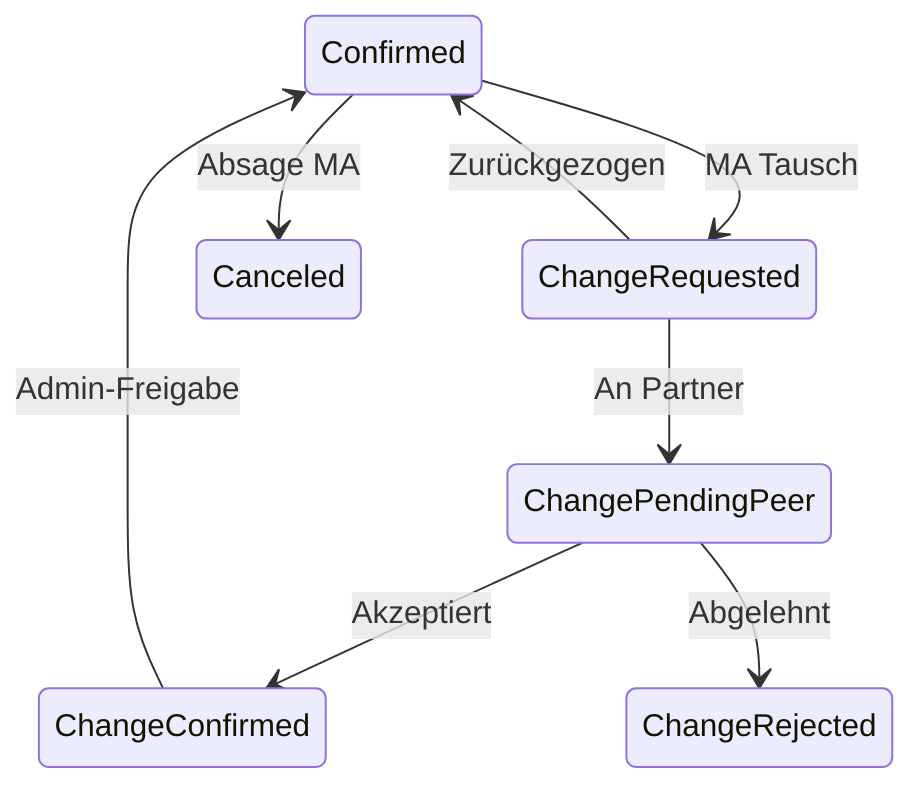

# Specification: Mitarbeiter-Bestätigung von Schichten (Shift Confirmation)

**Version:** 1.0  
**Status:** Freigegeben zur Implementierung  
**Quelle:** `specs/008-shift-employee-confirmation-brainstorming.md` (Runden 1–4)  
**Scope:** Phase 1 — Web-Dashboard + Backend + Mobile-API (ohne Mobile-UI); Push/E-Mail **simuliert** via Outbox

**Nicht in Phase 1:** Tausch (`change_*`), `canceled`, echte FCM/APNs/SMS, Mobile-Antwort-UI, KI-Auto-Push (nur Platzhalter)

---

## 1. Ziel

Nach Zuweisung einer Schicht im Dashboard-Kalender soll der zugewiesene Mitarbeiter die Schicht **bestätigen oder ablehnen** können. Manager steuern den Ablauf:

1. Zuweisung → Status **`proposed`** (intern geplant, noch keine Anfrage)
2. Manager klickt **„Bestätigung anfordern“** → Status **`requested`** + Benachrichtigung (simuliert)
3. Mitarbeiter antwortet gesammelt (**„Antworten senden“**) → **`confirmed`** / **`rejected`**
4. Ohne Antwort nach 3 h **Geschäftszeit** → **`pending`** + einmalige Erinnerung (simuliert) + Manager-In-App-Hinweis

Das Dashboard zeigt den Status **dezent** auf Schichtkarten. Manager sehen offene Rückmeldungen im **Notification-Center** und Panel **„Offene Rückmeldungen“**.

---

## 2. Entscheidungsübersicht

| Bereich | Entscheidung | Quelle |
|---------|--------------|--------|
| Datenmodell | `shifts.confirmation_status` + `shift_confirmation_events` | Q1=B |
| Initialstatus | **`proposed`** bei neuer/geänderter Zuweisung (wenn Feature an) | Q2 |
| Requested | Erst nach Manager **„Bestätigung anfordern“** + Versand | Q2 |
| Auto-Push | **Nein** (Ausnahme später: KI + Org-Flag) | Q2, Q24 |
| MA-Antwort | Sammelmodus, Button **„Antworten senden“**; Entwürfe nur client-local | Q3, Q19 |
| Pending | Informativ für Manager; **1× Erinnerung** an MA nach 3 h Geschäftszeit | Q4 |
| Geschäftszeit | **08:00–20:00** Org-Zeitzone; nur Stunden **innerhalb** zählen | Q13 |
| Phase-1-Status | `proposed`, `requested`, `confirmed`, `rejected`, `pending` | Q7 |
| Migration Bestand | Alle bestehenden Schichten mit MA → **`confirmed`** | Q6, Q34 |
| Nach Ablehnung | Zuweisung **bleibt**; Status `rejected`; Manager plant manuell um | Q8 |
| Planänderung | Relevante Änderung → zurück **`proposed`** | Q14 |
| Versand-Modell | **`confirmation_request_batch`** + **`confirmation_request_items`** + Snapshot | Q27 |
| Sende-Scopes | Einzelschicht, MA×Tag, MA×Woche, Bulk-Modal (Mehrfach-MA) | Q28 |
| Delta-Versand | Automatisch nur **`proposed`** / geänderte Schichten | Q28-a |
| App-Gate | Nur MA mit **`app_registered_at`** zuweisbar | Q17 |
| E-Mail-Fallback | Profil-Flag **`email_fallback_mode`** (Manager); Phase 1 **simuliert** | Q17, Q31 |
| Push Phase 1 | **`notification_outbox`**, `simulated=true` | Q10, Q18, Q31 |
| Manager-Notify | Rollen **admin/manager**; Phase 1 **In-App** only | Q11 |
| Dashboard-UI | Rechte Hälfte Overlay 25 % + Badge oben rechts (Symbole E) | Q12 |
| Org-Flag | **`shift_confirmation_enabled`**, Default **aus** | Q22, Q34 |
| Feature aus | Neue Zuweisungen → direkt **`confirmed`** | Q22-i |
| Events | Jeder Statuswechsel + `actor_id` + `payload` JSON | Q15 |
| Mobile-API | REST `/api/mobile/confirmations/…` | Q19 |
| MA Web-Dashboard | **Kein** Zugang Phase 1 | Q32 |
| RLS | MA nur eigene Schichten; Manager/Admin Org-weit | Q32 |
| Teilantwort | Gemischter Submit; unbeantwortete bleiben `requested`/`pending` | Q30 |
| Notification-Center | Ein Eintrag pro Ereignis; manuell dismiss | Q33 |
| Pending-Job | Cron **15 Min**, idempotent | Q29 |
| Disclaimer | Einzeiler + editierbarer Org-Text | Q25 |
| Phase 2 Status | `change_requested`, `change_pending_peer`, … (Appendix) | Q35 |

---

## 3. Status-Automat (Phase 1)



### 3.1 Übergangsregeln

| Auslöser | Von | Nach | Akteur |
|----------|-----|------|--------|
| Schicht zugewiesen / MA geändert | — | `proposed` | System |
| Org `shift_confirmation_enabled=false` | — | `confirmed` | System |
| Manager „Bestätigung anfordern“ | `proposed` | `requested` | Manager |
| MA Submit `confirm` | `requested`, `pending` | `confirmed` | Employee |
| MA Submit `reject` | `requested`, `pending` | `rejected` | Employee |
| Pending-Job (3 h Geschäftszeit) | `requested` | `pending` | System |
| Planungsänderung* | `requested`, `confirmed`, `rejected`, `pending` | `proposed` | System |

\* **Planungsänderung** = Änderung an mindestens einem Snapshot-Feld (§5.3) oder Wechsel `employee_id`.

### 3.2 Dashboard-Symbole (Phase 1)

Overlay: **rechte Hälfte** der Karte, **25 % Opazität**; zusätzlich **Badge** oben rechts.

| Status | Badge | Overlay-Hinweis |
|--------|-------|-----------------|
| `proposed` | ⋯ | dezent |
| `requested` | ? | halbtransparent |
| `pending` | ⏱ | halbtransparent |
| `rejected` | ✕ | halbtransparent |
| `confirmed` | — | kein Overlay |

---

## 4. Architektur



**Betroffene Module (neu/erweitert):**

| Bereich | Pfad |
|---------|------|
| Schema + Migration | `packages/database/schema.sql`, `migrations/20250709_shift_confirmation_phase1.sql` |
| DB-Adapter | `packages/database/src/supabase-database.ts`, `interface.ts` |
| Types | `packages/types/src/index.ts` |
| Shift-Zuweisung | `apps/web/src/app/actions/shifts.ts` |
| Confirmation Actions | `apps/web/src/app/actions/shift-confirmations.ts` (neu) |
| Mobile API | `apps/web/src/app/api/mobile/confirmations/**` (neu) |
| Kalender-Overlays | `apps/web/src/components/dashboard/dashboard-calendar.tsx`, Shift-Karten |
| Bulk/Send-UI | Dashboard-Kontextmenü, Bulk-Modal, Send-Modal |
| Manager-Panel | `apps/web/src/components/dashboard/open-confirmations-panel.tsx` (neu) |
| Notifications | `apps/web/src/components/notifications/` (neu/erweitern) |
| Org-Settings | Einstellungen → neuer Abschnitt neben Arbeitsentgelt |
| Pending-Job | `apps/web/src/app/api/cron/shift-confirmation-pending/route.ts` oder Supabase pg_cron |
| i18n | `packages/i18n/src/messages/de.ts`, `en.ts` |

---

## 5. Datenbank

### 5.1 Enum `shift_confirmation_status`

```sql
create type public.shift_confirmation_status as enum (
  'proposed',
  'requested',
  'confirmed',
  'rejected',
  'pending'
);
```

Phase 2 reserviert (noch **nicht** im Constraint): `change_requested`, `change_pending_peer`, `change_confirmed`, `change_rejected`, `canceled` — siehe **Appendix A**.

### 5.2 Erweiterung `shifts`

```sql
alter table public.shifts
  add column confirmation_status public.shift_confirmation_status not null default 'confirmed',
  add column confirmation_status_updated_at timestamptz not null default now(),
  add column requested_at timestamptz;

create index shifts_confirmation_status_idx
  on public.shifts (organization_id, confirmation_status, shift_date);
```

- `requested_at`: gesetzt bei Übergang → `requested` (letzter Versand)
- Bei `proposed` / `confirmed` (ohne offene Anfrage): `requested_at` **null**

**Migration Bestand:**

```sql
update public.shifts
set confirmation_status = 'confirmed',
    confirmation_status_updated_at = now()
where employee_id is not null;
```

### 5.3 Erweiterung `organizations`

```sql
alter table public.organizations
  add column shift_confirmation_enabled boolean not null default false,
  add column shift_confirmation_disclaimer text;
```

### 5.4 Erweiterung `profiles`

```sql
alter table public.profiles
  add column app_registered_at timestamptz,
  add column email_fallback_mode boolean not null default false;
```

- **`app_registered_at`:** gesetzt bei erster erfolgreicher Mobile-Device-Registrierung (Phase 1: manuell setzbar für Dev/Test oder via Mobile-Login-Hook)
- **`email_fallback_mode`:** Manager aktiviert bei verlorenem Handy; Benachrichtigungen gehen simuliert als Typ `email` in Outbox

### 5.5 Tabelle `shift_confirmation_events`

```sql
create table public.shift_confirmation_events (
  id uuid primary key default gen_random_uuid(),
  organization_id uuid not null references public.organizations (id) on delete cascade,
  shift_id uuid not null references public.shifts (id) on delete cascade,
  actor_id uuid references public.profiles (id) on delete set null,
  from_status public.shift_confirmation_status,
  to_status public.shift_confirmation_status not null,
  payload jsonb not null default '{}',
  created_at timestamptz not null default now()
);

create index shift_confirmation_events_shift_idx
  on public.shift_confirmation_events (shift_id, created_at desc);
```

**Payload-Beispiele:** `{ "batch_id": "…", "scope": "employee_week" }`, `{ "decision": "reject", "respond_batch_id": "…" }`

### 5.6 Tabelle `confirmation_request_batches`

```sql
create table public.confirmation_request_batches (
  id uuid primary key default gen_random_uuid(),
  organization_id uuid not null references public.organizations (id) on delete cascade,
  employee_id uuid not null references public.profiles (id) on delete cascade,
  sent_by uuid not null references public.profiles (id) on delete restrict,
  scope text not null check (scope in (
    'single_shift', 'employee_day', 'employee_week', 'bulk_week'
  )),
  week_start date not null,
  week_end date not null,
  is_delta boolean not null default false,
  sent_at timestamptz not null default now()
);
```

### 5.7 Tabelle `confirmation_request_items`

```sql
create table public.confirmation_request_items (
  id uuid primary key default gen_random_uuid(),
  batch_id uuid not null references public.confirmation_request_batches (id) on delete cascade,
  shift_id uuid not null references public.shifts (id) on delete cascade,
  snapshot jsonb not null,
  created_at timestamptz not null default now(),
  unique (batch_id, shift_id)
);
```

**Snapshot-Felder (verbindlich):**

```typescript
type ShiftConfirmationSnapshot = {
  employee_id: string;
  location_id: string | null;
  location_area_id: string | null;
  area_shift_template_id: string | null;
  shift_date: string;       // ISO date
  starts_at: string;        // ISO timestamptz
  ends_at: string;
  notes: string | null;
};
```

**Snapshot-Vergleich:** Nach jeder Schicht-Aktualisierung: wenn `confirmation_status` ∈ `{ requested, confirmed, rejected, pending }` und aktuelle Felder ≠ letzter Snapshot des Items → Status → **`proposed`**, Event loggen.

### 5.8 Tabelle `notification_outbox`

```sql
create table public.notification_outbox (
  id uuid primary key default gen_random_uuid(),
  organization_id uuid not null references public.organizations (id) on delete cascade,
  recipient_profile_id uuid not null references public.profiles (id) on delete cascade,
  channel text not null check (channel in ('push', 'email')),
  template_key text not null,
  payload jsonb not null default '{}',
  simulated boolean not null default true,
  created_at timestamptz not null default now()
);
```

**Template-Keys Phase 1:**

| Key | Empfänger | Auslöser |
|-----|-----------|----------|
| `confirmation_request_week` | MA | Erstanfrage Woche/Tag/Einzel |
| `confirmation_request_delta` | MA | Delta-Versand |
| `confirmation_pending_reminder` | MA | Requested → Pending |
| `employee_response_summary` | Manager | MA Submit (aggregiert) |
| `employee_pending_escalation` | Manager | Pending-Übergang |

Phase 1: **`simulated = true`** immer; kein externer Versand.

### 5.9 Tabelle `manager_notifications`

```sql
create table public.manager_notifications (
  id uuid primary key default gen_random_uuid(),
  organization_id uuid not null references public.organizations (id) on delete cascade,
  recipient_profile_id uuid not null references public.profiles (id) on delete cascade,
  type text not null,
  title text not null,
  body text not null,
  payload jsonb not null default '{}',
  read_at timestamptz,
  dismissed_at timestamptz,
  created_at timestamptz not null default now()
);
```

Empfänger: alle Profile der Org mit `permission_level` ∈ `{ admin, manager }`.

---

## 6. Geschäftszeit-Berechnung (Pending)

**Konstanten Phase 1:**

| Konstante | Wert |
|-----------|------|
| `PENDING_BUSINESS_HOUR_START` | 8 |
| `PENDING_BUSINESS_HOUR_END` | 20 |
| `PENDING_BUSINESS_HOURS_REQUIRED` | 3 |

**Algorithmus `businessMinutesBetween(from, to, timezone)`:**

- Zähle nur Minuten, die in `[08:00, 20:00)` in Org-Zeitzone liegen
- Wochenenden: **gleiche Regel** (kein Sonderfall Phase 1)

**Pending-Job (alle 15 Min):**

```typescript
for (shift of shifts where confirmation_status = 'requested' and requested_at is not null) {
  if (businessMinutesBetween(shift.requested_at, now, org.timezone) >= 180
      && !shift.pending_transition_sent) {
    set status → pending
    write event
    enqueue outbox confirmation_pending_reminder (once per shift)
    create manager_notifications employee_pending_escalation
    set flag pending_reminder_sent on shift or track in payload/events
  }
}
```

**Idempotenz:** Pro Schicht höchstens **ein** Übergang `requested` → `pending` und **eine** MA-Erinnerung; prüfen via Event-Typ oder Spalte `pending_since timestamptz`.

Empfohlene Zusatzspalte:

```sql
alter table public.shifts add column pending_since timestamptz;
alter table public.shifts add column pending_reminder_sent_at timestamptz;
```

---

## 7. Versand-Logik „Bestätigung anfordern“

### 7.1 Eligible Shifts

Schicht ist sendbar, wenn:

1. Org `shift_confirmation_enabled = true`
2. `confirmation_status = 'proposed'`
3. MA hat `app_registered_at IS NOT NULL` **oder** `email_fallback_mode = true`
4. Schicht hat `employee_id`

### 7.2 Scopes

| Scope | Auswahl | Enthaltene Schichten |
|-------|---------|----------------------|
| `single_shift` | Kontextmenü Karte | Eine Schicht |
| `employee_day` | MA + Datum | Alle `proposed` des MA an diesem Tag |
| `employee_week` | MA + KW | Alle `proposed` des MA in ISO-Woche |
| `bulk_week` | Modal: mehrere MA + KW | Pro MA alle `proposed`/Delta |

**Bulk-Modal:**

- Liste nur MA mit ≥1 `proposed`-Schicht in gewählter Woche
- MA ohne Offenes **nicht** anzeigen
- MA mit nur bereits gesendeten (kein Delta) **nicht** anzeigen

### 7.3 Delta-Erkennung

Für Schicht in `proposed` nach früherem Versand:

- Letztes Item in `confirmation_request_items` für `shift_id` laden
- Wenn Snapshot ≠ aktuelle Schicht → **Delta**
- Beim Senden: Batch `is_delta = true`, Template `confirmation_request_delta`

### 7.4 Ablauf Send (atomar pro MA×Aktion)

1. Schichten sammeln (Scope + Delta-Filter)
2. `confirmation_request_batches` insert
3. Pro Schicht: Item + Snapshot; Status → `requested`; `requested_at = now()`
4. `shift_confirmation_events` (pro Schicht)
5. `notification_outbox` (push oder email je nach Profil)
6. `revalidatePath` Dashboard

### 7.5 Zuweisungs-Gate

In `assignShiftWithTimes` / `assignShiftBatch`:

- Wenn Feature an: Kandidatenliste **filtert** `app_registered_at IS NULL AND email_fallback_mode = false`
- Initialstatus: `proposed` (Feature an) oder `confirmed` (Feature aus)
- Bei Feature an + Planänderung: Snapshot-Vergleich → ggf. `proposed`

---

## 8. Mitarbeiter-Antwort (API)

### 8.1 Endpunkte

Basis: `/api/mobile/confirmations` — Auth: Supabase Session JWT (wie Mobile heute über `@schichtwerk/database`).

#### `GET /week?from=YYYY-MM-DD&to=YYYY-MM-DD`

Response:

```typescript
type ConfirmationWeekItem = {
  shiftId: string;
  status: 'requested' | 'pending';
  shiftDate: string;
  startsAt: string;
  endsAt: string;
  locationName: string;
  areaName: string;
  templateName: string | null;
  jobName: string | null;
  disclaimer: string | null;
};

type ConfirmationWeekResponse = {
  items: ConfirmationWeekItem[];
  organizationDisclaimer: string | null;
};
```

Nur Schichten mit `employee_id = currentUser` und Status ∈ `{ requested, pending }`.

#### `GET /shift/:shiftId`

Einzelanfrage (Deep-Link-Vorbereitung); 404 wenn nicht berechtigt oder falscher Status.

#### `POST /respond`

```typescript
type RespondBody = {
  items: Array<{
    shiftId: string;
    decision: 'confirm' | 'reject';
  }>;
};
```

**Regeln:**

- Atomare Transaktion pro Request
- Nur `requested` / `pending` und eigene Schichten
- Gemischte Entscheidungen erlaubt (Q30)
- Nicht im Body enthaltene offene Schichten: **unverändert**
- Pro Item: Status → `confirmed` | `rejected`, Events schreiben
- Danach: **eine** `manager_notifications` pro admin/manager:
  - Alle confirm → „{name} Einplanung voll bestätigt“
  - ≥1 reject → „{name} Einplanung inkl. Ablehnungen“

**Kein** `GET /pending-reminder` serverseitig — Entwürfe nur AsyncStorage (Client).

### 8.2 Mobile-UI (Phase 1)

**Nicht implementieren** — nur API + Contract-Tests.

Geplant Phase 1.5:

- Wochenliste + Einzelansicht
- Toggle confirm/reject pro Zeile
- Button **„Antworten senden“** + Disclaimer
- Modal bei App-Start/Navigation wenn offene `requested`/`pending` existieren

---

## 9. Web-UI (Manager)

### 9.1 Schichtkarte

- Bestehende Template-Farbe **dominant**
- CSS: rechte 50 % Overlay `opacity: 0.25`
- Badge oben rechts mit Status-Symbol (§3.2)
- Tooltip mit Status-Label + ggf. `requested_at`

### 9.2 Aktionen „Bestätigung anfordern“

| Entry | UI |
|-------|-----|
| Einzelschicht | Kontextmenü Schichtkarte |
| MA × Tag | Kontextmenü Spalte/MA-Zeile (wenn vorhanden) oder Submenü |
| MA × Woche | Button Toolbar / MA-Kontext in Wochenansicht |
| Bulk Woche | Modal mit MA-Checkbox-Liste |

Disabled + Tooltip wenn Feature aus oder keine `proposed`.

### 9.3 Panel „Offene Rückmeldungen“

Filter-Tabs:

- **Pending** — `confirmation_status = pending`
- **Rejected** — `rejected`
- **Nicht versendet** — `proposed` in aktueller Woche

Quick-Action **„Neu zuweisen“** → bestehendes Bulk/Assign-Modal mit vorausgewählter Schicht.

### 9.4 Notification-Center

- Glocken-Icon im Dashboard-Header
- Liste `manager_notifications` (nicht dismissed)
- Ein Eintrag pro Ereignis; klick → Kalender/Panels
- Dismiss setzt `dismissed_at`

### 9.5 Org-Einstellungen

Unter Einstellungen (neuer Eintrag oder Erweiterung):

- Toggle **Schichtbestätigung aktivieren** (`shift_confirmation_enabled`)
- Textarea **Hinweistext Mitarbeiter** (`shift_confirmation_disclaimer`)

Profil-Einstellungen (Manager):

- Toggle **E-Mail-Modus** (`email_fallback_mode`) — mit Hinweis „Phase 1: simuliert“

### 9.6 Dev: Notification Outbox

Nur **admin** oder `NODE_ENV=development`:

- Seite `/settings/notifications-outbox` oder Dev-Panel
- Tabelle `notification_outbox` readonly, neueste zuerst

---

## 10. RLS & Berechtigungen

### 10.1 Shifts

Bestehende Manager-Policies unverändert erweitern.

**Employee (permission_level = basic):**

```sql
-- SELECT eigene Schichten
create policy "shifts_select_own_employee"
  on public.shifts for select
  using (employee_id = auth.uid());

-- UPDATE verboten direkt; Antwort nur via Service-Role API
```

Mobile `/respond` läuft über **Server Route** mit Service Role + expliziter Prüfung `employee_id = session.user.id`.

### 10.2 Confirmation-Tabellen

- `shift_confirmation_events`: Manager SELECT org; INSERT via Server
- `confirmation_request_*`: Manager SELECT/INSERT org
- `notification_outbox`: Manager SELECT org (Dev)
- `manager_notifications`: Empfänger SELECT/UPDATE own dismiss

---

## 11. i18n

Neuer Namespace `shiftConfirmation.*` (DE/EN):

| Key | DE (Beispiel) |
|-----|----------------|
| `status.proposed` | Geplant |
| `status.requested` | Angefragt |
| `status.pending` | Ausstehend |
| `status.rejected` | Abgelehnt |
| `status.confirmed` | Bestätigt |
| `actions.requestConfirmation` | Bestätigung anfordern |
| `actions.sendResponses` | Antworten senden |
| `disclaimer.default` | Die Bestätigung ersetzt keine arbeitsvertragliche Vereinbarung. |
| `notifications.responseAllConfirmed` | {name} hat die Einplanung vollständig bestätigt. |
| `notifications.responseWithRejections` | {name} hat die Einplanung inkl. Ablehnungen beantwortet. |
| `notifications.pending` | {name} hat auf Schichten nicht rechtzeitig geantwortet. |
| `panel.title` | Offene Rückmeldungen |
| `settings.enabled` | Schichtbestätigung durch Mitarbeiter |
| `gate.appNotRegistered` | Mitarbeiter ohne App-Registrierung kann nicht eingeplant werden. |

---

## 12. Cron / Deployment

**Route:** `GET /api/cron/shift-confirmation-pending`

- Auth: `CRON_SECRET` Header (Vercel Cron / manueller Trigger)
- Intervall: **15 Minuten**
- Log: Anzahl Übergänge, Fehler

Alternativ: Supabase `pg_cron` — Entscheidung Implementierung; Spec verlangt **A-Logik** (Q29).

---

## 13. Testplan

### 13.1 Unit Tests

| Modul | Fälle |
|-------|-------|
| `business-minutes.ts` | 3 h innerhalb 08–20; über Nacht; Wochenende |
| `shift-snapshot.ts` | Gleich/ungleich; Planänderung → proposed |
| `confirmation-send.ts` | Scope-Filter; Delta-only; leere Menge |
| `confirmation-respond.ts` | Teilantwort; gemischt; fremde shift_id → Fehler |

### 13.2 Integration / E2E (manuell)

- [ ] Feature aus: Zuweisung → sofort `confirmed`, kein Overlay
- [ ] Feature an: Zuweisung → `proposed`, kein Outbox-Eintrag
- [ ] Send Einzelschicht → `requested`, Outbox, Snapshot
- [ ] Zeit ändern → `proposed`; Delta-Send → nur geänderte Schicht
- [ ] MA respond gemischt → Manager-Notification korrekt
- [ ] Pending-Job nach 3 h Geschäftszeit → `pending` + Erinnerung Outbox
- [ ] Rejected: Schicht bleibt, Panel Quick-Action
- [ ] MA ohne App-Registrierung nicht in Assign-Liste
- [ ] Migration: Alt-Schichten `confirmed`

---

## 14. Implementierungs-Reihenfolge

1. Migration + Types + Snapshot-Helper
2. Zuweisungs-Hook (`proposed` / Gate)
3. Send-Actions + Batch-Tabellen
4. Dashboard-Overlays
5. Pending-Cron
6. Manager Notifications + Panel
7. Mobile API Routes + Tests
8. Org-/Profil-Settings + Outbox Dev-UI
9. i18n + manuelle Abnahme

---

## Appendix A — Phase 2 (Vorbereitet, nicht implementieren)

### A.1 Zusätzliche Status

| Status | Bedeutung |
|--------|-----------|
| `change_requested` | MA initiiert Tausch |
| `change_pending_peer` | Warte auf Tauschpartner |
| `change_confirmed` | Tausch akzeptiert |
| `change_rejected` | Partner lehnt ab |
| `canceled` | MA sagt bestätigte Schicht ab |



### A.2 Manager-Benachrichtigung Phase 2

- **Ablehnung:** zusätzlich Push (echt) an Manager
- **Bestätigung:** weiter nur In-App

### A.3 KI-Schichtvorschläge

- Schichten in `proposed`
- Auto-Request nur wenn `organizations.ai_auto_request_enabled = true` (Spalte Phase 2)
- Sonst manueller Manager-Send wie Phase 1

---

## Appendix B — Offene Implementierungsdetails

| Thema | Vorgabe |
|-------|---------|
| `app_registered_at` setzen | Mobile-Login/Device-Register Hook — Phase 1 minimal: Admin-Override in Profil-Settings für Tests |
| Web-Antwortseite für E-Mail | Vorbereitet in API; UI optional wenn E-Mail simuliert bleibt |
| Phase-2-Enum-Migration | Separates SQL wenn Tausch gebaut wird |

---

*Ende Specification v1.0*
