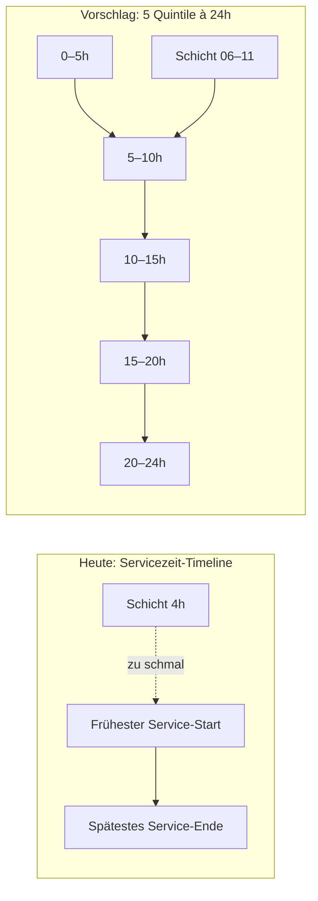
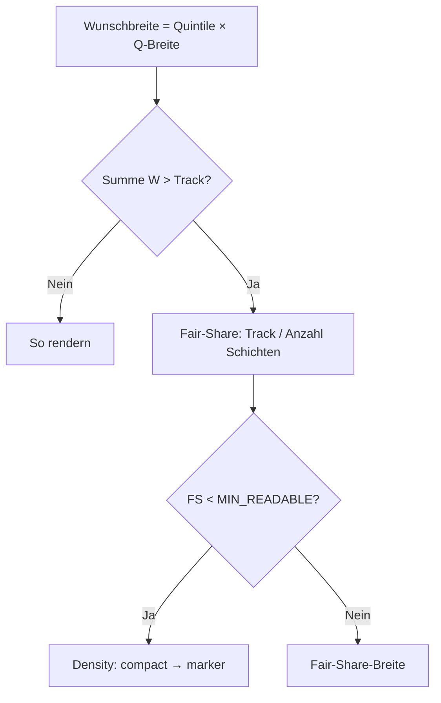

# Brainstorming: Schichtkarten-Position & -Länge (Dashboard, aufgeklappte Tage)

**Status:** Round 1 — offen  
**Kontext:** Lesbarkeit und Proportionen von Schichtkarten in **aufgeklappten** Tagzellen des Dashboard-Kalenders (Tag × Bereich). Zugeklappte Tage und Nachtschicht-Overlays bleiben unverändert.  
**Vorgänger:** `shift-card-cell-layout.ts`, `shift-card-service-timeline.ts`, `dashboard-service-day-timeline.ts`, `shift-card-time-gradient.ts`

---

## Ausgangslage (deine Notizen + Ist-Stand im Code)

### Problem

- Schichtkarten sind manchmal **zu lang** (z. B. 4 h wirken wie halber Tag).
- Manchmal **zu kurz** (2–4 h kaum lesbar; 22:00–23:59 extrem schmal).
- Ursache: Breite/Position leiten sich von der **standortweiten Servicezeit-Timeline** ab (frühester Start bis spätestes Ende aller Bereiche, ggf. bis 23:59 wegen Nachtschichten). Kurze Schichten in langen Servicezeit-Spannen werden visuell unterrepräsentiert.

### Was unverändert bleiben soll

- **Zugeklappte Tage** (Pixel-Marker / Collapsed Preview)
- **Nachtschichten** (Overnight-Span-Karten über zwei Tage)
- **Farbverlauf** auf der Karte nach echten Uhrzeiten (Tageslicht-Bänder)

### Aktuelle Tageszeit-Farben (`SHIFT_CARD_TIME_BANDS`)

| Uhrzeit | Farbe (RGB) | Anmerkung |
|---------|-------------|-----------|
| 00:00–04:00 | Silber/Grau `#C0C0C0` | Nacht |
| 04:00–10:00 | Hellblau `#7DD3FC` | Morgen |
| 09:30–16:30 | Gelb `#FDE047` | Tag (überlappt mit Morgen) |
| 16:00–20:00 | Rot `#F87171` | Abend |
| 20:00–24:00 | Silber/Grau `#C0C0C0` | Nacht |

→ Verlauf bleibt **uhrzeitbasiert (24 h)**; nur **Layout (X-Position, Breite)** soll neu gedacht werden.

### Dein Vorschlag (5-Abschnitts-Modell)

24 h in **5 Segmente** à 5+5+5+5+4 h; Position/Länge **nicht** mehr an Servicezeiten, sondern an „Tagesgewicht“ der Schicht (morgens/mittags/abends). Beispiel: 06:00–11:00 → Start am Anfang von Abschnitt 2. **Mindestbreite** für Lesbarkeit.



```text
Zelle (aufgeklappt) — Quintile-Modell (Beispiel 300 px breit):

|← 5h →|← 5h →|← 5h →|← 5h →|← 4h →|
  Nacht   Morgen  Tag    Abend   Nacht
        [==== Schicht 06–11 ====]
```

### Alternative zum Diskutieren (Empfehlung vorab)

**Hybrid:** X-Position weiterhin aus **echter Startzeit**, aber auf einer **festen 24-h-Skala pro Zelle** (nicht Servicezeit-Spanne). Breite = `max(MIN_READABLE, duration / 24h × Zellbreite × K)` mit Kompromiss-Faktor K (z. B. 0,6–0,8), damit 4 h nicht halbe Zelle füllen, 2 h aber lesbar bleiben. Farbverlauf unverändert.

---

## Round 1 — Scope, Layout-Modell & Mindestbreite

### Q1 — **Scope:** Was ist exakt im Scope dieser Spezifikation?

- [x] **A)** Nur Dashboard **Tag × Bereich**, nur **same-day** Schichtkarten in **aufgeklappten** Tagen ⭐ **[RECOMMENDED]**
- [ ] **B)** Zusätzlich **Simple Planning** (eine Zeile ohne Bereiche)
- [ ] **C)** Zusätzlich **Schichtplan erstellen** (Planungskalender, aufgeklappte Tage)
- [ ] **D)** A + B (Dashboard Multi-Area + Simple Planning)

**Deine Antwort:**


---

### Q2 — **Layout-Grundlage:** Welche Zeitachse soll Position & Breite bestimmen (nur aufgeklappte Same-Day-Karten)?

- [x] **A)** **5 Quintile** (5+5+5+5+4 h), komplett unabhängig von Servicezeiten — wie in deinen Notizen ⭐ **[RECOMMENDED]** als Kompromiss gegen extreme Unterschiede zwischen Bereichen
- [ ] **B)** **Feste 24-h-Skala** (linear: 1 h = 1/24 der Zellbreite), unabhängig von Servicezeiten
- [ ] **C)** **Hybrid:** 24-h linear für Position, aber Breite mit **Mindest-** und **Höchstanteil** (Deckel z. B. max. 35 % Zellbreite für 4 h)
- [ ] **D)** Servicezeit-Timeline behalten, nur **Mindestbreite** und **Fair-Share** schärfen (minimaler Eingriff)
- [ ] **E)** A, aber Quintile-Grenzen **verschiebbar** (z. B. 6–12 / 12–18 statt 5 h Blöcke)

**Deine Antwort:**


---

### Q3 — **X-Position:** Wie soll die horizontale Startposition einer Schicht bestimmt werden?

- [x] **A)** **Dominantes Quintil:** Schicht startet am **linken Rand des Quintils**, in dem die **meisten Minuten** der Schicht liegen (dein Beispiel 06–11 → Abschnitt 2) ⭐ **[RECOMMENDED]** bei Q2=A
- [ ] **B)** **Echter Start** auf 24-h-Skala, gemappt auf Quintil-Innenbereich (feiner, aber weniger „grober Kompromiss“)
- [ ] **C)** **Echter Start** linear auf voller Zellbreite (24 h = 100 %), ohne Quintile
- [ ] **D)** **Zentrum** der Schicht im dominanten Quintil zentrieren (nicht linksbündig im Quintil)
- [ ] **E)** Kombination: Start aus echter Uhrzeit (C), aber **snapping** zum nächsten Quintil-Rand (±2,5 h Toleranz)

**Deine Antwort:**


---

### Q4 — **Breite:** Wie soll die Kartenbreite bestimmt werden?

- [x] **A)** **Quintil-basiert:** Breite = Anzahl der Quintile, die die Schicht „berührt“, × Quintilbreite (mindestens 1 Quintil) ⭐ **[RECOMMENDED]** bei Q2=A — einfach, gut lesbar
- [ ] **B)** **Dauer-linear auf 24 h:** `duration / 24h × Zellbreite`, mit **Mindestbreite** (s. Q5)
- [ ] **C)** **Hybrid B + Deckel:** linear, aber `min(max(MIN, proportional), MAX_FRACTION × Zellbreite)`
- [ ] **D)** Wie heute (`timelineDurationWidthPx`), aber Timeline = 24 h statt Servicezeit-Spanne
- [ ] **E)** **Inhaltgetrieben:** Breite = max(MIN_READABLE, Textbreite), Position separat; Dauer nur für Verlauf

**Deine Antwort:**


---

### Q5 — **Mindestbreite & Konflikte:** Was passiert bei wenig Platz (viele Schichten, schmale Spalte)?

- [ ] **A)** **Mindestbreite pro Karte** (z. B. 72–120 px Inhalt) hat Vorrang; Karten dürfen sich **leicht überlappen** oder **nach rechts clampen** ⭐ **[RECOMMENDED]**
- [x] **B)** Mindestbreite gilt, aber bei Platzmangel **Fair-Share** aller Karten in der Zelle (Breite sinkt unter MIN → Text-Dichte/Marker)
- [ ] **C)** Mindestbreite nur, wenn **≤ N Schichten** in der Zelle (N = ?); sonst Marker-Modus
- [ ] **D)** Keine harte MIN; stattdessen **Density-Fallback** (compact → marker) wie heute
- [ ] **E)** MIN gilt, Overnight-/Rand-Schichten (22–24 h) bekommen **Sonderregel** (immer mindestens 1 Quintil breit)

**Deine Antwort:** (optional N bei C):


---

### Q6 — **Hintergrund & Stundengitter:** Was passiert mit der sichtbaren Timeline in der Zelle?

Heute: Stundenlinien / Verlauf basieren auf **Servicezeit-Timeline** der Zelle (standortweit).

- [x] **A)** **Visuell umstellen auf 24-h-Quintile** (5 Trennlinien / dezente Zonen), Servicezeit-Gitter entfällt in aufgeklappten Zellen ⭐ **[RECOMMENDED]** bei Quintil-Modell — konsistent mit Kartenlayout
- [ ] **B)** **24-h fein** (24 Stundenlinien oder bestehende Daytimes-Leiste), Servicezeit-Gitter entfällt
- [ ] **C)** **Doppelte Ebene:** Servicezeit-Gitter bleibt dezent, Karten nutzen Quintil-Layout
- [ ] **D)** Servicezeit-Gitter **unverändert**; nur Kartenposition/-breite ändern sich

**Deine Antwort:**


---

### Q7 — **Gleichheit zwischen Bereichen:** Soll die Kartenbreite für dieselbe Schicht in **allen Bereichen gleich** sein?

(Heute: gleiche Timeline pro Tag über alle Bereiche → gleiche Pixelbreite.)

- [x] **A)** **Ja, standortweit pro Tag** (eine 24-h/Quintil-Map für alle Bereiche) ⭐ **[RECOMMENDED]** — weiterhin vergleichbar
- [ ] **B)** **Pro Bereich** unterschiedlich (Bereichs-Servicezeit beeinflusst nur Hintergrund, nicht Karte)
- [ ] **C)** Ja, plus **uniformShiftDurationWidth** (gleiche Dauer = exakt gleiche Breite überall)

**Deine Antwort:**


---

*Ende Round 1 — bitte Antworten unter jeder Frage eintragen. Danach folgt Round 2 (Details Quintil-Mapping, Randfälle 22–24 h, Schwellenwerte, Tests).*

---

## Round 1 — Entscheidungsstand (aus Markierungen)

| Frage | Gewählt |
|-------|---------|
| Q1 Scope | A — Dashboard Tag×Bereich, same-day, aufgeklappt |
| Q2 Layout | A — 5 Quintile (5+5+5+5+4 h) |
| Q3 Position | A — dominantes Quintil, linksbündig |
| Q4 Breite | A — Anzahl berührter Quintile × Quintilbreite |
| Q5 Konflikt | B — Fair-Share, unter MIN → Density/Marker |
| Q6 Hintergrund | A — Quintil-Trennlinien/-zonen statt Servicezeit-Gitter |
| Q7 Vergleichbarkeit | A — standortweit pro Tag |

---

## Round 2 — Quintil-Regeln, Randfälle & Fair-Share

### Q8 — **Quintil-Grenzen:** Exakte Uhrzeit-Schnitte für die 5 Abschnitte?

```text
Variante Standard (dein Vorschlag):
  Q1: 00:00 – 04:59  (5 h)
  Q2: 05:00 – 09:59  (5 h)
  Q3: 10:00 – 14:59  (5 h)
  Q4: 15:00 – 19:59  (5 h)
  Q5: 20:00 – 23:59  (4 h)

Variante an Farbbändern angelehnt:
  Q1: 00:00 – 03:59  (Nacht grau)
  Q2: 04:00 – 09:59  (Morgen blau)
  Q3: 10:00 – 16:29  (Tag gelb, inkl. Überlapp)
  Q4: 16:30 – 19:59  (Abend rot)
  Q5: 20:00 – 23:59  (Nacht grau)
```

- [ ] **A)** **Standard 5+5+5+5+4** ab 00:00 (symmetrisch, einfach) ⭐ **[RECOMMENDED]**
- [ ] **B)** **An Farbbändern** angelehnt (Q8-Tabelle unten, ungleiche Blocklängen)
- [ ] **C)** Standard 5+5+5+5+4, aber **Q2 beginnt 04:00** (an Morning-Band angeglichen)
- [ ] **D)** Konfigurierbar pro Standort (später; MVP = A)

**Deine Antwort:**


---

### Q9 — **„Quintil berührt“ (Breite):** Wann zählt ein Quintil für die Kartenbreite?

Beispiel: Schicht **08:00–12:00** (4 h) → berührt Q2 (08–10) und Q3 (10–12).

- [ ] **A)** **Alle berührten Quintile** zählen → Breite = 2 × Quintilbreite (08–12) ⭐ **[RECOMMENDED]** bei Q4=A
- [ ] **B)** Nur **dominantes Quintil + direkte Nachbarn**, wenn Schicht ≥ X Minuten in Nachbar-Quintil (X = ?)
- [ ] **C)** **Nur dominantes Quintil** (Breite immer 1 Quintil — maximal lesbar, wenig Differenzierung)
- [ ] **D)** Dominantes Quintil + **+1 Nachbar**, wenn Endzeit in nächstes Quintil reicht (auch bei 1 Minute)
- [ ] **E)** Wie A, aber **Deckel** max. 3 Quintile Breite

**Deine Antwort:** (optional X):


---

### Q10 — **Dominantes Quintil (Position):** Gleichstand & Rand-Schichten

Beispiele:

| Schicht | Minuten pro Quintil | Dominant? |
|---------|---------------------|-----------|
| 09:30–14:30 | Q2: 30 min, Q3: 270 min | Q3 |
| 07:00–12:00 | Q2: 180, Q3: 120 | Q2 |
| 22:00–23:59 | Q5: 119 min | Q5 |
| 09:00–10:00 | Q2: 60 min | Q2 |

- [ ] **A)** Mehr **Kalenderminuten** im Quintil gewinnt; bei Gleichstand: **früheres Quintil** ⭐ **[RECOMMENDED]**
- [ ] **B)** Gleichstand: Quintil mit **echter Startzeit** (Start liegt in Q2 → Q2)
- [ ] **C)** Gleichstand: **Mitte der Schicht** entscheidet
- [ ] **D)** Schichten, die **nur Q5** berühren (≥ 20:00 Start): Position = **linker Rand Q5**, Breite mindestens 1 volles Q5 (Sonderregel Rand)

**Deine Antwort:**


---

### Q11 — **Schichten am Tagesrand (same-day, kein Overnight):** 20:00–23:59, 22:00–23:59, 00:00–02:00

Overnight-Spans bleiben aus Scope; **same-day** Abendschichten und ggf. Mitternachts-Nähe:

- [ ] **A)** Wie alle anderen: dominant Q5, Breite = berührte Quintile (22–24 oft **1 Quintil**) ⭐ **[RECOMMENDED]**
- [ ] **B)** Schichten mit Endzeit **≥ 20:00** und Dauer **< 3 h**: immer **volle Q5-Breite** (Lesbarkeit)
- [ ] **C)** Schichten **00:00–04:59 Start**: immer volle **Q1-Breite**, wenn Dauer ≤ 4 h
- [ ] **D)** B + C (Rand-Schichten bekommen immer mindestens 1 volles Rand-Quintil)
- [ ] **E)** Zusätzlich: Start in Q5 → Karte **rechtsbündig** am Zellenrand andocken

**Deine Antwort:**


---

### Q12 — **Fair-Share (Q5=B):** Algorithmus bei mehreren Schichten in einer Zelle

Heute: `sparseCellFairShare` + timeline-basierte Breite. Neu: Quintil-Breite als **Wunschbreite**.



- [ ] **A)** Wunschbreite = Quintil-Regel; bei Überlauf **gleichmäßiger Fair-Share**; Position (Quintil-Start) **bleibt**, Breite schrumpft ⭐ **[RECOMMENDED]**
- [ ] **B)** Fair-Share, aber **Position wandert mit** (zentriert in verfügbarem Slot)
- [ ] **C)** Fair-Share nur wenn **> 4** Schichten; sonst Überlappung erlauben
- [ ] **D)** **Lanes** (vertikal gestapelt wie heute): horizontal Fair-Share **pro Lane**, Position pro Schicht unabhängig
- [ ] **E)** Zuerst Wunschbreite; Überlappung **horizontal** (z-index) statt Fair-Share bis MIN unterschritten

**Deine Antwort:**


---

### Q13 — **Mindestbreite & Density-Fallback:** Konkrete Schwellen?

Bezug: `SHIFT_CARD_ABSOLUTE_MIN_WIDTH_PX`, Density `two-line → compact → marker`.

- [ ] **A)** MIN Inhalt **~72 px** (≈ heute absolut min); darunter **compact**, **< 40 px** marker ⭐ **[RECOMMENDED]**
- [ ] **B)** MIN **~96 px** (aggressiver lesbar); darunter compact/marker
- [ ] **C)** MIN = **1 Quintil-Breite** (skaliert mit Spaltenbreite; z. B. schmale Woche = schmaleres MIN)
- [ ] **D)** MIN fix in px, aber **nie breiter als 1 Quintil** (Deckel + Boden)
- [ ] **E)** Andere Werte (bitte px angeben): MIN = ___ compact ab ___ marker ab ___

**Deine Antwort:**


---

### Q14 — **Horizontale Überlappung:** Dürfen sich Karten überlappen, wenn Fair-Share unter MIN fällt?

Zwei Schichten im **selben Quintil**, schmale Spalte:

- [ ] **A)** **Kein Überlappen** — immer Density-Fallback (compact/marker) ⭐ **[RECOMMENDED]** mit Q5=B
- [ ] **B)** Leichtes Überlappen (**≤ 20 %** Breite) erlaubt, bevor marker
- [ ] **C)** Überlappen erlaubt, Tooltip bleibt Pflicht für Lesbarkeit
- [ ] **D)** Schichten im **selben Quintil** sequentiell **innerhalb Quintil** fair-teilen (Unter-Slots)

**Deine Antwort:**


---

### Q15 — **Quintil-Hintergrund (Q6=A):** Wie sichtbar?

- [ ] **A)** **4 vertikale Trennlinien** (dezent, z. B. 10 % Opacity), **keine** Flächenfärbung ⭐ **[RECOMMENDED]**
- [ ] **B)** Trennlinien + **sehr schwache Quintil-Flächen** (5 % Tageszeitfarbe)
- [ ] **C)** Nur **Daytimes-Streifen** oben (4 px wie heute), darunter keine Linien
- [ ] **D)** Trennlinien + **Labels** (z. B. „Mo“ irrelevant; optional „5–10“ nur im Tooltip/Debug)
- [ ] **E)** Gar keine Linien — nur Kartenposition zeigt das Modell

**Deine Antwort:**


---

### Q16 — **Gleiche Schicht, alle Bereiche:** Position **und** Breite identisch?

(Q7=A: standortweit pro Tag)

- [ ] **A)** **Ja** — gleiche `left` + `width` in px in jeder Bereichs-Zelle (Spaltenbreite kann variieren → **prozentual** gleich?) ⭐ **[RECOMMENDED]**
- [ ] **B)** Ja in **Prozent der Zellbreite** (nicht px), damit schmale/spaltenbreite Tage konsistent
- [ ] **C)** Nur Breite gleich, Position pro Bereich frei
- [ ] **D)** px-gleich; wenn Zellbreiten unterschiedlich → **Referenzbreite** = breiteste aktive Tag-Spalte

**Deine Antwort:**


---

### Q17 — **Technik & Migration:** Wo lebt die neue Logik?

- [ ] **A)** Neues Modul z. B. `dashboard-quintile-shift-layout.ts`; `computeShiftCardCellLayout` ruft Quintil-Layout **nur** für Dashboard expanded same-day ⭐ **[RECOMMENDED]**
- [ ] **B)** Erweiterung von `shift-card-service-timeline.ts` (Timeline = Quintile statt Service)
- [ ] **C)** A + Feature-Flag `quintileShiftLayout` für schrittweisen Rollout
- [ ] **D)** A, Tests in `shift-card-cell-layout.test.ts` + neue Snapshot-Fälle

**Deine Antwort:**


---

### Q18 — **Akzeptanzkriterien / Testfälle:** Welche Szenarien sind Pflicht für „fertig“?

Bitte markieren, welche **must-have** sind:

- [ ] **1)** 2 h Schicht (z. B. 10:00–12:00) in breiter Zelle → **lesbar** (two-line oder compact) ⭐ **[RECOMMENDED]**
- [ ] **2)** 4 h Schicht (08:00–12:00) → **nicht** > 50 % Zellbreite bei 5-Quintil-Modell
- [ ] **3)** 22:00–23:59 → mindestens **1 Quintil** breit, Text lesbar oder compact
- [ ] **4)** 8 Schichten in einer Zelle → kein Layout-Bruch; marker/scroll wie heute
- [ ] **5)** Gleiche Schicht in **zwei Bereichen** → gleiche relative Position/Breite
- [ ] **6)** Farbverlauf 06–11 zeigt **Blau→Gelb**, unabhängig von Kartenbreite
- [ ] **7)** Zugeklappter Tag **unverändert** (Regression)
- [ ] **8)** Overnight-Span **unverändert** (Regression)

**Deine Antwort:** (Nummern oder „alle“):


---

*Ende Round 2 — nach Beantwortung folgt Round 3 (Feinschliff UI, Planung später?, Spec) oder direkt Specification falls Round 2 ausreicht.*

