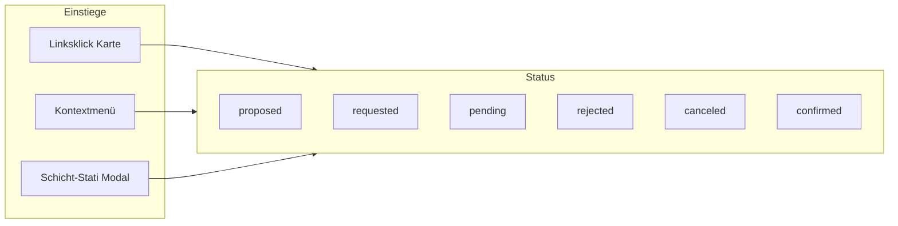
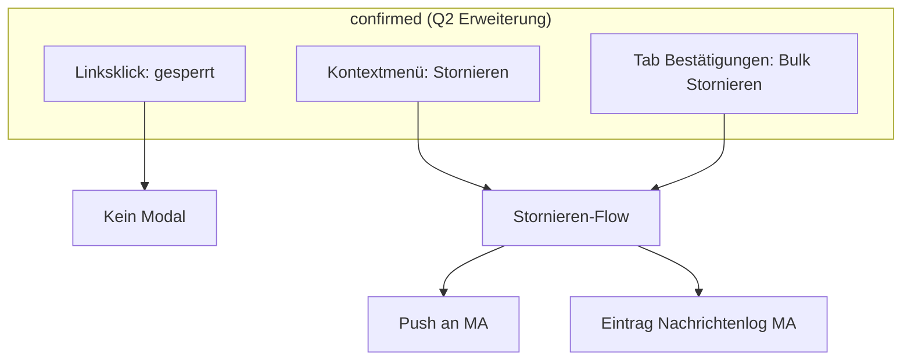
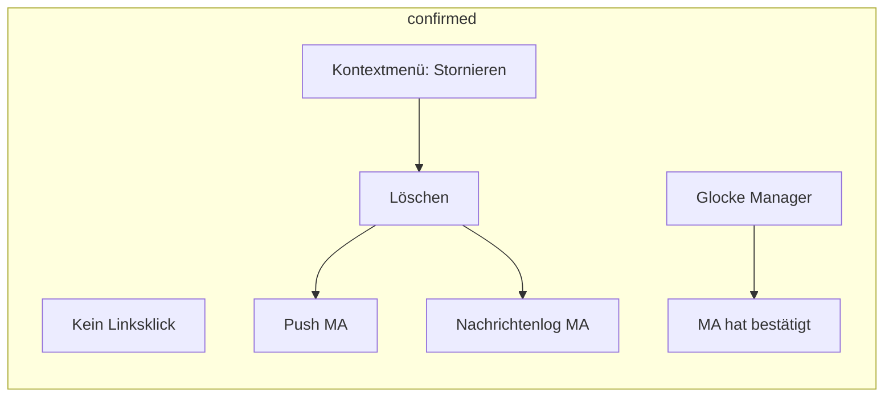

# Brainstorming: Schicht-Stati — Aktionen, Linksklick & UI-Parität

**Status:** Round 1 — offen  
**Kontext:** Nach Lifecycle-Migration (Sprints 1–3) sind Stati technisch geklärt (`docs/shift-statuses.md`). Offen ist die **produktive Soll-Logik**: Welche Aktionen erscheinen im Fenster **Schicht-Stati** (Tabs + Buttonleiste), im **Kontextmenü** der Schichtkarte und bei **Linksklick** — konsistent für Dashboard und Bereich-Kalender.  
**Ist-Stand (Kurz):** Kontextmenü spiegelt weitgehend Tab-Buttons; Linksklick öffnet fast immer „Schicht bearbeiten“; `confirmed` hat kein Kontextmenü, aber in der Zukunft noch Linksklick-Bearbeiten.

**Leitidee (Option 3 — zur Abstimmung in Q1):**

> Linksklick = **eine** primäre Aktion pro Status · Kontextmenü = Tab-Buttonleiste · Schicht-Stati = Bulk-Inbox

---

## Round 1 — Fundament: Philosophie & Kern-Status

> Bitte markiere deine Wahl mit `[x]`. Empfohlene Option ist mit ⭐ gekennzeichnet.  
> Antworten nur unter **Deine Antwort:** eintragen — bestehende Fragen und Antworten nicht ändern.

---

### Q1 — **Gesamtmodell:** Wie hängen Linksklick, Kontextmenü und Schicht-Stati zusammen?

| Option | Beschreibung |
|--------|--------------|
| **A** | **Drei getrennte Regeln** — jeder Einstieg darf andere Aktionen haben (max. Flexibilität, höherer Lernaufwand) |
| **B** | **Parität Menü = Tab-Buttons**; Linksklick separat als „Primäraktion“ pro Status ⭐ **empfohlen** |
| **C** | **Alles identisch** — Linksklick, Menü und Bulk-Buttons führen immer dieselbe Aktion aus (einfach, aber wenig Nuance) |
| **D** | **Nur Schicht-Stati** für Aktionen; Karte = rein Anzeige + Linksklick nur Bearbeiten |

- [ ] **A)** Drei getrennte Regelsätze
- [x] **B)** Menü = Tab-Buttons; Linksklick = Primäraktion ⭐
- [ ] **C)** Alle Einstiege identisch
- [ ] **D)** Aktionen nur im Schicht-Stati-Fenster

**Deine Antwort:**

---

### Q2 — **`confirmed` (bestätigt):** Was darf der Manager an der Schichtkarte tun?

Heute: kein Kontextmenü, kein Tab — aber **Linksklick öffnet in der Zukunft noch** das Bearbeiten-Modal.

| Option | Beschreibung |
|--------|--------------|
| **A** | **Komplett gesperrt** — kein Linksklick, kein Menü, kein Tab; Änderung nur durch Löschen + Neu-Anlage (oder separater Admin-Weg) ⭐ **empfohlen** |
| **B** | **Nur Ansehen** — Linksklick öffnet read-only Detail (Zeit, MA, Status), keine Speicherung |
| **C** | **Bearbeiten erlaubt** — Linksklick = Bearbeiten-Modal wie heute; Bestätigung bleibt oder wird zurückgesetzt (siehe Q3) |
| **D** | **Bearbeiten mit Warnung** — Modal mit Hinweis „Schicht ist bestätigt“ + expliziter Bestätigungsschritt vor Speichern |

- [ ] **A)** Gesperrt (terminal) ⭐
- [ ] **B)** Read-only Detail
- [ ] **C)** Bearbeiten wie heute
- [ ] **D)** Bearbeiten mit Warnung

**Deine Antwort:**
A, aber admin kann Schicht stornieren über Option in Kontext-Menü "Schicht stornieren"
Auch in Fenster Schicht-stati soll button "Schicht stornieren" bei tabpage "Bestätigungen" angezeigt werden.
Bei Stornieren muss push-Nachricht an Mitarbeiter gesendet werden und im Mitarbeiter-Kalender muss Nachricht im Nachrichen-log erscheinen.

---

### Q3 — **Falls `confirmed` doch bearbeitbar (C/D aus Q2):** Was passiert mit dem Bestätigungs-Status beim Speichern?

*(Nur beantworten wenn Q2 ≠ A)*

| Option | Beschreibung |
|--------|--------------|
| **A** | Automatisch zurück auf **`proposed`** (neue Bestätigungsrunde nötig) ⭐ **empfohlen** wenn Edit erlaubt |
| **B** | Bleibt **`confirmed`** (Planänderung ohne erneute MA-Freigabe) |
| **C** | Manager wählt beim Speichern: „Bestätigung beibehalten“ vs. „Erneut anfordern“ |
| **D** | Bearbeitung nur für Felder, die keinen Reset auslösen (z. B. Notiz ja, MA/Zeit nein) |

- [x] **A)** Reset auf `proposed`
- [ ] **B)** Bleibt `confirmed`
- [ ] **C)** Manager entscheidet beim Speichern
- [ ] **D)** Nur „sichere“ Felder editierbar
- [ ] **—)** entfällt (Q2 = A)

**Deine Antwort:**

---

### Q4 — **`pending` (ausstehend, MA hat Frist überschritten):** Linksklick & Planungs-Edit?

Heute: Bereich-Kalender blockiert „Bearbeiten“ im Kontextmenü bei `pending`; Linksklick öffnet trotzdem Bearbeiten-Modal.

| Option | Beschreibung |
|--------|--------------|
| **A** | **Kein Planungs-Edit** — weder Linksklick-Bearbeiten noch Menüpunkt Bearbeiten; nur Stornieren + Erneut anfordern (Tab/ Menü) ⭐ **empfohlen** |
| **B** | **Linksklick → Schicht-Stati** — fokussiert Tab „Ausstehend“, kein Kalender-Modal |
| **C** | **Bearbeiten erlaubt** — wie `requested` / `proposed` (Plan darf geändert werden) |
| **D** | **Bearbeiten nur eingeschränkt** — z. B. Notiz/Vorlage ja, MA/Zeit erst nach Stornieren |

- [x] **A)** Kein Edit; nur Stornieren / Erneut anfordern ⭐
- [ ] **B)** Linksklick → Schicht-Stati Tab fokussieren
- [ ] **C)** Volles Bearbeiten erlaubt
- [ ] **D)** Eingeschränktes Bearbeiten

**Deine Antwort:**

---

### Q5 — **`rejected` & `canceled` (MA abgesagt):** Was ist die Primäraktion bei Linksklick?

Heute: Linksklick öffnet Bearbeiten-Modal. Tab/Menü bieten **Neu zuweisen** + Löschen.

| Option | Beschreibung |
|--------|--------------|
| **A** | **Neu zuweisen** — Linksklick startet Wiederbesetzung (Modal mit Fokus Ersatz-Mitarbeiter / neue Zuweisung) ⭐ **empfohlen** |
| **B** | **Bearbeiten** — generisches Planungs-Modal wie bei `proposed` |
| **C** | **Schicht-Stati** — Linksklick öffnet passenden Tab mit vorausgewählter Zeile |
| **D** | **Unterschiedlich:** `rejected` → Neu zuweisen, `canceled` → nur über Schicht-Stati (kein Linksklick) |

- [x] **A)** Linksklick = Neu zuweisen ⭐
- [ ] **B)** Linksklick = Bearbeiten
- [ ] **C)** Linksklick = Schicht-Stati fokussieren
- [ ] **D)** Unterschied rejected vs. canceled

**Deine Antwort:**

---

### Q6 — **Dashboard vs. Bereich-Kalender:** Gleiche Regeln?

| Option | Beschreibung |
|--------|--------------|
| **A** | **Identische Logik** — gleicher Linksklick, gleiches Menü, gleiche Modals (unterschiedliche UI-Hülle: Einzel- vs. Bulk-Zeile ok) ⭐ **empfohlen** |
| **B** | **BK mehr Bulk** — BK-Linksklick immer Bulk-Modal der Tageszelle; Dashboard immer Einzel-Modal |
| **C** | **Dashboard vereinfacht** — weniger Stati-Aktionen am Dashboard, volle Tiefe nur im BK |
| **D** | **Getrennte Regeln** pro Ansicht (nur wenn fachlich nötig) |

- [x] **A)** Parität (gleiche Regeln, unterschiedliche Modal-Hülle ok) ⭐
- [ ] **B)** BK = Bulk-first
- [ ] **C)** Dashboard vereinfacht
- [ ] **D)** Getrennte Regeln

**Deine Antwort:**

---

## Nächste Runde (Vorschau)

Nach Round 1 folgen u. a.:

- `proposed` / `requested` — Linksklick & Tab-Selektion
- Vergangen + unbestätigt — „Als bestätigt setzen“
- Konflikte- & Tausch-Tabs
- Visuelles Feedback (Cursor, Tooltip, deaktivierte Karten)
- Org ohne Schichtbestätigung
- Fehlermeldungen & Bestätigungsdialoge

---

*Round 1 erstellt. Bitte Antworten eintragen — danach folgt Round 2 (append only).*

---

## Round 2 — `proposed`/`requested`, `confirmed`/Stornieren, Vergangenheit, Sonder-Tabs

**Status:** Round 2 — offen  
**Aus Round 1 (Kontext für diese Runde):**

- Q1 **B** — Menü = Tab-Buttons; Linksklick = Primäraktion
- Q2 **A + Erweiterung** — `confirmed` grundsätzlich gesperrt, **aber** Kontextmenü + Tab „Bestätigungen“ mit Aktion **Schicht stornieren** (Push + MA-Nachrichtenlog)
- Q4 **A** — `pending`: kein Edit, nur Stornieren / Erneut anfordern
- Q5 **A** — `rejected`/`canceled`: Linksklick = Neu zuweisen
- Q6 **A** — Dashboard ≡ Bereich-Kalender (Logik)

> Bitte markiere deine Wahl mit `[x]`. Empfohlene Option ist mit ⭐ gekennzeichnet.  
> Antworten nur unter **Deine Antwort:** eintragen — Round 1 nicht ändern.

---

### Q7 — **Neuer Tab „Bestätigungen“:** Welche Schichten erscheinen dort?

Du hast einen Tab **„Bestätigungen“** mit Button **Schicht stornieren** vorgeschlagen (zusätzlich zu den heutigen Handlungsbedarf-Tabs).

| Option | Beschreibung |
|--------|--------------|
| **A** | **Alle `confirmed`** der aktuellen Woche/Standort — reine Übersicht + optional Stornieren ⭐ **empfohlen** |
| **B** | **Nur `confirmed` in der Zukunft** — vergangene bestätigte Schichten nicht im Tab |
| **C** | **Nur ausgewählte `confirmed`** — Tab erscheint nur, wenn Manager explizit filtert / sucht |
| **D** | **Kein eigener Tab** — Stornieren nur über Kontextmenü auf der Karte (kein Bulk) |

- [ ] **A)** Alle `confirmed` (Woche/Standort)
- [ ] **B)** Nur zukünftige `confirmed`
- [ ] **C)** Nur bei explizitem Filter
- [ ] **D)** Kein Tab — nur Kontextmenü ⭐ *(widerspricht deiner Q2-Notiz — bitte bewusst wählen)*

**Deine Antwort:**
Bitte vergiss das! Wir haben ja die Glocke und können dort sehen, wenn etwas bestätigt wurde.
Nimm für Q2 = A

---

### Q8 — **`confirmed` stornieren:** Was bedeutet „Schicht stornieren“ fachlich?

Heute: Manager-Stornieren bei offenen Stati = **Schicht löschen**. Bei `confirmed` soll laut Q2 ein MA informiert werden.

| Option | Beschreibung |
|--------|--------------|
| **A** | **Löschen + Push** — Schicht wird entfernt; MA erhält Push + Log-Eintrag („Schicht entfällt“) ⭐ **empfohlen** (konsistent mit Manager-Storno) |
| **B** | **Status `canceled`** — Schicht bleibt im Plan sichtbar (orange), MA wird informiert |
| **C** | **Soft-Cancel** — Schicht bleibt, MA muss bestätigen dass er die Absage zur Kenntnis nahm |
| **D** | **Nur Benachrichtigung** — Schicht bleibt `confirmed`, Push ist rein informativ (Plan unverändert) |

- [x] **A)** Löschen + Push + Log ⭐
- [ ] **B)** Status `canceled` (sichtbar im Plan)
- [ ] **C)** Soft-Cancel mit MA-Bestätigung
- [ ] **D)** Nur Info-Push, Plan bleibt

**Deine Antwort:**

---

### Q9 — **`confirmed` — Kontextmenü:** Nur Stornieren oder mehr?

| Option | Beschreibung |
|--------|--------------|
| **A** | **Nur „Schicht stornieren“** — kein Bearbeiten, kein Löschen ohne Bestätigungsdialog ⭐ **empfohlen** |
| **B** | **Stornieren + Löschen** — zwei Einträge (Löschen = still, Stornieren = mit MA-Info) |
| **C** | **Stornieren + Ansehen** — read-only Detail zusätzlich |
| **D** | **Gar kein Kontextmenü** — Stornieren nur im Tab „Bestätigungen“ |

- [x] **A)** Nur Stornieren ⭐
- [ ] **B)** Stornieren + Löschen
- [ ] **C)** Stornieren + Ansehen
- [ ] **D)** Nur über Tab

**Deine Antwort:**

---

### Q10 — **`proposed` & `requested`:** Linksklick-Primäraktion?

Beide sind „offen“ im Bestätigungsflow, aber unterschiedlich weit.

| Option | Beschreibung |
|--------|--------------|
| **A** | **Beide → Bearbeiten-Modal** (Planung anpassen) ⭐ **empfohlen** |
| **B** | **`proposed` → Bearbeiten**, **`requested` → Schicht-Stati** Tab „Bestätigung angefordert“ |
| **C** | **`proposed` → Bearbeiten**, **`requested` → keine Linksklick-Aktion** (nur Menü: Stornieren) |
| **D** | **Beide → Schicht-Stati** — kein direktes Bearbeiten von der Karte |

- [ ] **A)** Beide: Bearbeiten ⭐
- [x] **B)** proposed Bearbeiten / requested → Stati
- [ ] **C)** proposed Bearbeiten / requested gesperrt
- [ ] **D)** Beide nur über Stati

**Deine Antwort:**

---

### Q11 — **Schicht-Stati — Tab-Selektion & Buttonleiste:** Soll sich etwas am heutigen Verhalten ändern?

**Heute:**

| Tab | Bulk-Buttons | Zeilen-Checkbox-Label |
|-----|--------------|------------------------|
| proposed | Anfordern, Löschen | Anfordern |
| requested | Stornieren | Auswählen |
| pending | Stornieren, Erneut anfordern | Erneut anfordern |
| rejected / canceled | Neu zuweisen, Löschen | Neu zuweisen |

| Option | Beschreibung |
|--------|--------------|
| **A** | **Unverändert** — passt zu Round-1-Entscheidungen ⭐ **empfohlen** |
| **B** | **`requested` auch „Erneut anfordern“** in Buttonleiste (Resend ohne Umweg über pending) |
| **C** | **`proposed` ohne Löschen** — nur Anfordern; Löschen nur über Karte/Kontextmenü |
| **D** | **Einheitliche Checkbox** — überall „Auswählen“, Aktions-Label nur in Buttonleiste |

- [x] **A)** Heutige Tab-Buttons beibehalten ⭐
- [ ] **B)** requested + Erneut anfordern
- [ ] **C)** proposed ohne Bulk-Löschen
- [ ] **D)** Checkbox-Labels vereinheitlichen

**Deine Antwort:**

---

### Q12 — **`pending` — Linksklick:** Was passiert bei Klick auf die Karte?

(Round 1: kein Planungs-Edit)

| Option | Beschreibung |
|--------|--------------|
| **A** | **Kein Pointer / kein Klick** — Karte wirkt „passiv“; Aktionen nur Menü + Stati ⭐ **empfohlen** |
| **B** | **Linksklick → Schicht-Stati** Tab „Ausstehend“, Zeile fokussiert |
| **C** | **Linksklick → Mini-Dialog** mit Stornieren + Erneut anfordern (ohne volles Stati-Fenster) |
| **D** | **Wie heute Bearbeiten** — (widerspricht Q4 A) |

- [x] **A)** Passiv — kein Linksklick ⭐
- [ ] **B)** Schicht-Stati fokussieren
- [ ] **C)** Mini-Dialog Stornieren/Erneut
- [ ] **D)** Bearbeiten (heute)

**Deine Antwort:**

---

### Q13 — **Vergangen + unbestätigt:** Primäraktion (Dashboard & BK)?

Heute: Linksklick öffnet Bearbeiten; Kontextmenü bietet **„Status auf bestätigt setzen“**.

| Option | Beschreibung |
|--------|--------------|
| **A** | **Linksklick = „Als bestätigt setzen“** (schnellster Aufräum-Weg); volles Bearbeiten nur über separates Menü ⭐ **empfohlen** |
| **B** | **Linksklick = Bearbeiten** — Bestätigen nur im Kontextmenü (heute) |
| **C** | **Beides gesperrt** — nur Schicht-Stati (neuer Tab „Vergangen offen“?) |
| **D** | **Nur Bestätigen, kein Edit** — weder Linksklick noch Menü für Bearbeiten |

- [ ] **A)** Linksklick = Bestätigen setzen ⭐
- [ ] **B)** Linksklick = Bearbeiten (heute)
- [ ] **C)** Nur Schicht-Stati
- [ ] **D)** Nur Bestätigen, nie Edit

**Deine Antwort:**
Kein linksklick möglich, nichts in Schicht-stati, menü: "Schicht löschen" + "Status auf bestätigt setzen"

---

### Q14 — **Tab „Konflikte“ & „Tausch“:** Linksklick auf betroffene Karte?

| Option | Beschreibung |
|--------|--------------|
| **A** | **Linksklick → Schicht-Stati** mit passendem Tab (Konflikte / Tausch) fokussiert ⭐ **empfohlen** |
| **B** | **Linksklick = Bearbeiten** — Konflikt/Tausch nur im Stati-Fenster |
| **C** | **Kein Linksklick** — nur Badge/Overlay als Hinweis |
| **D** | **Konflikte → Bearbeiten**, **Tausch → Stati** (unterschiedlich) |

- [x] **A)** Linksklick → Stati-Tab fokussieren ⭐
- [ ] **B)** Linksklick = Bearbeiten
- [ ] **C)** Kein Linksklick
- [ ] **D)** Unterschiedlich je Tab

**Deine Antwort:**

---

### Q15 — **Visuelles Feedback:** Wie erkennt der Manager „klickbar vs. gesperrt“?

| Option | Beschreibung |
|--------|--------------|
| **A** | **Cursor** — `pointer` nur wenn Linksklick-Aktion existiert; sonst `default` ⭐ **empfohlen** |
| **B** | **Cursor + Tooltip** — zusätzlich „Klicken zum …“ / „Keine Aktion — Rechtsklick für Menü“ |
| **C** | **Opacity** — gesperrte Karten leicht ausgegraut |
| **D** | **Nur Overlay/Badge** — Cursor immer gleich; Status reicht |

- [x] **A)** Nur Cursor-Unterschied ⭐
- [ ] **B)** Cursor + Tooltip
- [ ] **C)** Cursor + Ausgrauen
- [ ] **D)** Nur Badge, kein Cursor-Signal

**Deine Antwort:**

---

## Nächste Runde (Vorschau)

Round 3 (falls nötig):

- Org **ohne** Schichtbestätigung (vereinfachtes Modell)
- Bestätigungsdialoge (Stornieren, Löschen, Bulk)
- Reihenfolge / Badge-Zählung Tabs inkl. „Bestätigungen“
- Mobile-Parität (was sieht MA bei Manager-Storno?)
- i18n / Label „Stornieren“ vs. „Löschen“ vs. „Neu zuweisen“

---

*Round 2 appended. Bitte Antworten eintragen — danach Round 3 oder Specification.*

---

## Round 3 — Dialoge, Benachrichtigungen, Mobile, Labels & Randfälle

**Status:** Round 3 — offen  
**Aus Round 1–2 (Kontext):**

- **Parität** Menü = Tab-Buttons; Linksklick = Primäraktion (Q1 B, Q6 A)
- **`confirmed`:** kein Linksklick; Kontextmenü **nur Stornieren** (Q9 A); Storno = **Löschen + Push + Log** (Q8 A); **kein Tab „Bestätigungen“** — Info über **Glocke/Benachrichtigungen** (Q7)
- **`proposed`:** Linksklick Bearbeiten · **`requested`:** Linksklick → Schicht-Stati (Q10 B)
- **`pending`:** passiv, kein Linksklick (Q12 A)
- **`rejected`/`canceled`:** Linksklick Neu zuweisen (Q5 A)
- **Vergangen unbestätigt:** kein Linksklick, nicht in Schicht-Stati; Menü: **Löschen + Als bestätigt setzen** (Q13 Freitext)
- **Konflikte/Tausch:** Linksklick → Schicht-Stati Tab (Q14 A)
- **Cursor** signalisiert Klickbarkeit (Q15 A)

> Bitte markiere deine Wahl mit `[x]`. Empfohlene Option ist mit ⭐ gekennzeichnet.  
> Antworten nur unter **Deine Antwort:** eintragen — Round 1–2 nicht ändern.

---

### Q16 — **Org ohne Schichtbestätigung:** Vereinfachtes Interaktionsmodell?

Wenn `shift_confirmation_enabled = false`:

| Option | Beschreibung |
|--------|--------------|
| **A** | **Klassisch** — Linksklick = Bearbeiten; Kontextmenü = Löschen; kein Schicht-Stati-Fenster ⭐ **empfohlen** |
| **B** | **Wie `confirmed`** — nach Zuweisung gesperrt, nur Löschen |
| **C** | **Schicht-Stati bleibt** — für Konflikte/Tausch (falls später aktiv) |
| **D** | **Wie heute + dokumentiert** — keine Änderung am Code-Verhalten |

- [x] **A)** Bearbeiten + Löschen, kein Stati ⭐
- [ ] **B)** Gesperrt wie confirmed
- [ ] **C)** Stati für Konflikte/Tausch
- [ ] **D)** Unverändert

**Deine Antwort:**

---

### Q17 — **`confirmed` stornieren:** Bestätigungsdialog vor Löschen?

| Option | Beschreibung |
|--------|--------------|
| **A** | **Ja, immer** — „Schicht wirklich stornieren? Mitarbeiter wird informiert.“ ⭐ **empfohlen** |
| **B** | **Nur Bulk** — Einzel-Storno über Kontextmenü ohne Dialog |
| **C** | **Nein** — direktes Löschen (riskant) |
| **D** | **Stufenweise** — erste Storno pro Tag mit Dialog, danach „Nicht mehr fragen“ |

- [x] **A)** Immer Bestätigungsdialog ⭐
- [ ] **B)** Dialog nur bei Bulk
- [ ] **C)** Kein Dialog
- [ ] **D)** Mit „Nicht mehr fragen“

**Deine Antwort:**

---

### Q18 — **Glocke / Benachrichtigungen:** Was soll der Manager bei MA-Bestätigung sehen?

(Ersatz für Tab „Bestätigungen“ — Q7)

| Option | Beschreibung |
|--------|--------------|
| **A** | **Bestehendes Modell** — Manager-Notification wie heute („X hat bestätigt/abgelehnt/ausstehend“); kein extra Tab ⭐ **empfohlen** |
| **B** | **Zusätzlich:** jede Einzelbestätigung als eigener Glocken-Eintrag (auch bei Bulk-Woche) |
| **C** | **Digest only** — nur Sammelmeldungen, keine Einzelschicht |
| **D** | **Glocke + optionaler Filter** im Kalender „Zuletzt bestätigt“ |

- [x] **A)** Wie heute, kein Bestätigungen-Tab ⭐
- [ ] **B)** Einzelbestätigung in Glocke
- [ ] **C)** Nur Digest
- [ ] **D)** Glocke + Kalender-Filter

**Deine Antwort:**

---

### Q19 — **Mobile (Mitarbeiter):** Was passiert bei Manager-Storno einer `confirmed`-Schicht?

(Q8 A = Schicht wird gelöscht + Push + Log)

| Option | Beschreibung |
|--------|--------------|
| **A** | **Push + In-App-Nachricht** — Schicht verschwindet aus MA-Kalender; Log-Eintrag lesbar ⭐ **empfohlen** |
| **B** | **Nur Push** — kein persistenter Log-Eintrag |
| **C** | **Schicht bleibt sichtbar** als „entfallen“ / grau bis MA dismissed |
| **D** | **Phase 2** — Mobile später; Web reicht zunächst |

- [x] **A)** Push + Log + aus Kalender entfernt ⭐
- [ ] **B)** Nur Push
- [ ] **C)** Als entfallen markiert
- [ ] **D)** Mobile später

**Deine Antwort:**

---

### Q20 — **Begriffe in der UI:** „Stornieren“ vs. „Löschen“ vs. „Neu zuweisen“?

Heute gemischt: Manager-Storno = oft **Löschen** in DB; Label teils „Schicht stornieren“.

| Option | Beschreibung |
|--------|--------------|
| **A** | **Stornieren** = MA informieren (confirmed + offene Stati); **Löschen** = still ohne MA (nur proposed ohne Request) ⭐ **empfohlen** |
| **B** | **Ein Begriff „Löschen“** überall — Stornieren nur als Erklärtext im Dialog |
| **C** | **Stornieren** überall wo MA betroffen; **Entfernen** für reine Planungslöschung |
| **D** | **Beibehalten** — heutige i18n-Keys unverändert |

- [x] **A)** Stornieren vs. Löschen fachlich trennen ⭐
- [ ] **B)** Alles „Löschen“
- [ ] **C)** Stornieren vs. Entfernen
- [ ] **D)** Labels wie heute

**Deine Antwort:**

---

### Q21 — **`requested` — Linksklick → Schicht-Stati:** Verhalten im Detail?

(Q10 B)

| Option | Beschreibung |
|--------|--------------|
| **A** | **Modal öffnen**, Tab „Bestätigung angefordert“, **Zeile vorausgewählt**, Fokus auf Buttonleiste ⭐ **empfohlen** |
| **B** | Modal öffnen, Tab fokussiert, **keine** Vorauswahl |
| **C** | **Nur Tab wechseln** wenn Stati schon offen; sonst Modal neu |
| **D** | Linksklick = Bearbeiten doch erlauben (Q10 A statt B) |

- [x] **A)** Stati + Tab + Zeile selected ⭐
- [ ] **B)** Tab ohne Vorauswahl
- [ ] **C)** Nur wenn Modal schon offen
- [ ] **D)** Doch Bearbeiten

**Deine Antwort:**

---

### Q22 — **Vergangen + unbestätigt:** Menü „Schicht löschen“ — gleiche Logik wie wann?

(Q13: kein Linksklick, nicht in Stati; Menü Löschen + Bestätigen setzen)

| Option | Beschreibung |
|--------|--------------|
| **A** | **Löschen** = still entfernen (kein MA-Push, Schicht war nie bestätigt) · **Bestätigen setzen** = Audit-Abschluss ⭐ **empfohlen** |
| **B** | **Löschen** = mit Push falls jemals `requested` war |
| **C** | **Nur Bestätigen setzen** — Löschen nicht anbieten (Historie) |
| **D** | **Beide** mit Bestätigungsdialog |

- [x] **A)** Löschen still / Bestätigen = Abschluss ⭐
- [ ] **B)** Löschen ggf. mit Push
- [ ] **C)** Nur Bestätigen setzen
- [ ] **D)** Beide mit Dialog

**Deine Antwort:**

---

### Q23 — **„Neu zuweisen“ (`rejected`/`canceled`):** Was öffnet der Linksklick?

(Q5 A)

| Option | Beschreibung |
|--------|--------------|
| **A** | **Bearbeiten-Modal** mit **leerem / anderem MA-Feld** und gleicher Schichtvorlage-Zeit (Wiederbesetzung) ⭐ **empfohlen** |
| **B** | **Schicht-Stati** Tab + Button „Neu zuweisen“ (zweiter Klick nötig) |
| **C** | **Neue Schicht anlegen** — alte bleibt als `rejected`/`canceled` sichtbar |
| **D** | **Bulk-Modal (BK) / Einzel (Dashboard)** — gleiche Wiederbesetzungs-UX, unterschiedliche Hülle (Q6 A) |

- [x] **A)** Modal Wiederbesetzung ⭐
- [ ] **B)** Über Schicht-Stati
- [ ] **C)** Neue Schicht, alte bleibt
- [ ] **D)** Modal, BK/Dashboard-Hülle wie Q6

**Deine Antwort:**

---

### Q24 — **Bulk-Aktionen:** Standard-Auswahl beim Tab-Wechsel?

Heute: `proposed`/`pending` oft alle sichtbaren vorausgewählt; `rejected`/`requested`/`canceled` leer.

| Option | Beschreibung |
|--------|--------------|
| **A** | **Unverändert** — pro Tab wie heute (`defaultSelectedResponseShiftIds`) ⭐ **empfohlen** |
| **B** | **Immer leer** — Manager muss bewusst auswählen |
| **C** | **Immer alle** — schneller Bulk, riskanter |
| **D** | **Merken pro Tab** — letzte Auswahl pro Manager speichern |

- [x] **A)** Wie heute ⭐
- [ ] **B)** Immer leer
- [ ] **C)** Immer alle
- [ ] **D)** Pro Tab merken

**Deine Antwort:**

---

### Q25 — **Abschluss:** Reicht Round 3 für die Specification?

| Option | Beschreibung |
|--------|--------------|
| **A** | **Ja** — nach Beantwortung Q16–Q24 kann `010-shift-status-actions-specification.md` geschrieben werden ⭐ |
| **B** | **Nein** — noch Round 4 für: Tausch-Tab-Aktionen, Berechtigungen (Admin vs Manager), Undo |
| **C** | **Ja, aber** — Specification nur für Web; Mobile als Anhang „Phase 2“ |
| **D** | **Nein** — noch UX-Mockup-Fragen (Modal-Reihenfolge, Tastatur, A11y) |

- [x] **A)** Specification nach Round 3 ⭐
- [ ] **B)** Round 4 nötig
- [ ] **C)** Web-Spec + Mobile-Anhang
- [ ] **D)** Round 4 UX/A11y

**Deine Antwort:**

---

## Nächster Schritt

Nach Round 3 → **`specs/010-shift-status-actions-specification.md`** (Soll-Matrix aller Stati × Linksklick × Menü × Tab × Dialoge).

---

*Round 3 appended.*

