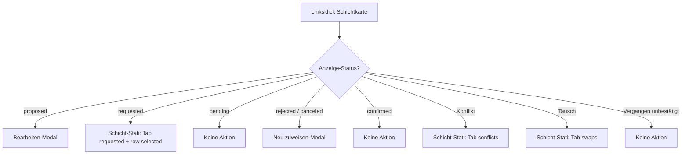
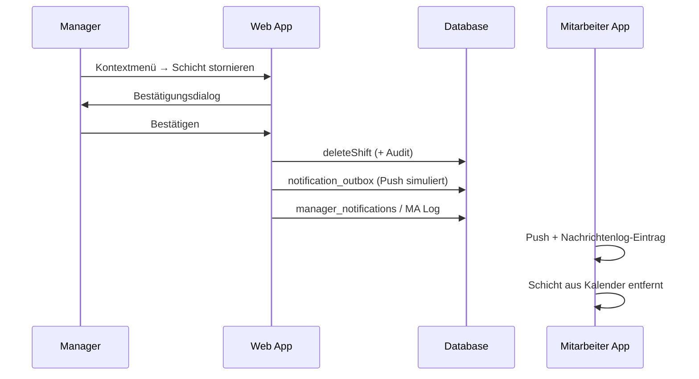

# Specification: Schicht-Stati — Aktionen, Linksklick & UI-Parität

**Version:** 1.0  
**Status:** Freigegeben zur Implementierung  
**Quelle:** `specs/010-shift-status-actions-brainstorming.md` (Runden 1–3)  
**Bezug:** `docs/shift-statuses.md`, `specs/008-shift-employee-confirmation-specification.md`  
**Scope:** Web — Dashboard & Bereich-Kalender (Manager/Admin); Mobile-Verhalten nur für **Manager-Storno `confirmed`** (Push + Log)

**Nicht in diesem Spec:** Sprint-4 Legacy-Drop; Tausch-Tab-Aktionen (Approve/Reject) im Detail; Admin-vs-Manager-Berechtigungen; Undo; A11y-Tiefenspezifikation

---

## 1. Ziel

Ein **einheitliches Interaktionsmodell** für Schichtkarten und das Fenster **Schicht-Stati**:

1. **Linksklick** = genau **eine Primäraktion** pro Anzeige-Status (wenn überhaupt klickbar)
2. **Kontextmenü (Rechtsklick)** = dieselben Aktionen wie die **Buttonleiste** des passenden Schicht-Stati-Tabs (Parität)
3. **Schicht-Stati** = Bulk-Inbox für Handlungsbedarf (kein Tab für `confirmed`)

Dashboard und Bereich-Kalender folgen **dieselben Regeln**; unterschiedliche Modal-Hüllen (Einzel- vs. Bulk-Zeile) sind erlaubt.

---

## 2. Leitprinzipien (Entscheidungsübersicht)

| # | Bereich | Entscheidung | Quelle |
|---|---------|--------------|--------|
| 1 | Gesamtmodell | Menü = Tab-Buttons; Linksklick = Primäraktion | Q1 B |
| 2 | Dashboard ≡ BK | Identische Logik, unterschiedliche Modal-Hülle ok | Q6 A |
| 3 | `confirmed` | Kein Linksklick; Kontextmenü **nur Stornieren**; kein Schicht-Stati-Tab | Q2 A, Q7, Q9 A |
| 4 | Storno `confirmed` | Schicht **löschen** + Push an MA + Eintrag **Nachrichtenlog MA** | Q8 A, Q19 A |
| 5 | Storno-Dialog | Immer Bestätigungsdialog („Mitarbeiter wird informiert“) | Q17 A |
| 6 | MA-Bestätigung sichtbar | **Glocke** / bestehende Manager-Notifications — **kein** Tab „Bestätigungen“ | Q7, Q18 A |
| 7 | `proposed` | Linksklick → **Bearbeiten-Modal** | Q10 B |
| 8 | `requested` | Linksklick → **Schicht-Stati**, Tab „Bestätigung angefordert“, Zeile vorausgewählt | Q10 B, Q21 A |
| 9 | `pending` | **Passiv** — kein Linksklick; nur Menü + Stati | Q4 A, Q12 A |
| 10 | `rejected` / `canceled` (MA) | Linksklick → **Neu zuweisen** (Wiederbesetzungs-Modal) | Q5 A, Q23 A |
| 11 | Vergangen + unbestätigt | Kein Linksklick; **nicht** in Schicht-Stati; Menü: **Löschen** + **Als bestätigt setzen** | Q13 |
| 12 | Konflikte / Tausch | Linksklick → Schicht-Stati, passender Tab fokussiert | Q14 A |
| 13 | Cursor | `pointer` nur wenn Linksklick-Aktion existiert; sonst `default` | Q15 A |
| 14 | Tab-Buttonleisten | Unverändert zum Ist-Stand (Q11 A) | Q11 A |
| 15 | Bulk-Vorauswahl | Unverändert (`defaultSelectedResponseShiftIds`) | Q24 A |
| 16 | Org ohne Bestätigung | Linksklick Bearbeiten; Menü Löschen; kein Schicht-Stati | Q16 A |
| 17 | Begriffe UI | **Stornieren** = MA informieren · **Löschen** = still entfernen | Q20 A |
| 18 | Vergangen Löschen | Still (kein Push); **Als bestätigt setzen** = Audit-Abschluss | Q22 A |

---

## 3. Begriffe: Stornieren vs. Löschen

| Begriff (UI) | Wann | Backend-Wirkung | MA informiert? |
|--------------|------|-----------------|----------------|
| **Schicht stornieren** | `confirmed` (Kontextmenü); Tabs `requested`, `pending` (Bulk „Stornieren“) | Schicht **löschen** (Manager-Pfad) | **Ja** — Push + Log (`confirmed`-Storno); bei offenen Stati wie heute |
| **Schicht löschen** / **Löschen** | `proposed`, `rejected`, `canceled`, Konflikte; Vergangen unbestätigt | Schicht **löschen** | **Nein** (still) |
| **Neu zuweisen** | `rejected`, `canceled` | Bestehende Schicht ersetzen / MA wechseln (Wiederbesetzung) | Kontextabhängig (neue ggf. `proposed`) |
| **Als bestätigt setzen** | Vergangen unbestätigt | Status → `confirmed` | Nein |

i18n: Bestehende Keys beibehalten, aber Labels gemäß Tabelle konsistent einsetzen (`shiftConfirmation.actions.cancelShiftManager` = Stornieren wo MA betroffen).

---

## 4. Schicht-Stati — Tabs & Buttonleisten

**Kein Tab für `confirmed`.** Bestätigte Schichten nur über **Glocke/Benachrichtigungen** sichtbar (bestehendes Modell).

### 4.1 Tab-Reihenfolge (unverändert)

`conflicts` → `swaps` → `canceled` → `rejected` → `pending` → `proposed` → `requested`

### 4.2 Pro Tab

| Tab | Label (DE) | Bulk-Buttons | Zeilen-Checkbox-Label | Standard-Vorauswahl |
|-----|------------|--------------|---------------------|---------------------|
| `conflicts` | Konflikte | Neu zuweisen, Stornieren, Löschen | Neu zuweisen | Alle sichtbaren |
| `swaps` | Tausch-Anfragen | *(keine in v1)* | — | Leer |
| `canceled` | MA abgesagt | Neu zuweisen, Löschen | Neu zuweisen | Leer |
| `rejected` | Abgelehnt | Neu zuweisen, Löschen | Neu zuweisen | Leer |
| `pending` | Ausstehend | Stornieren, Bestätigung anfordern | Erneut anfordern | Alle sichtbaren |
| `proposed` | Nicht versendet | Bestätigung anfordern, Löschen | Anfordern | Alle sichtbaren |
| `requested` | Bestätigung angefordert | Stornieren | Auswählen | Leer |

**Hinweis „Bestätigung anfordern“ auf Tab `pending`:** entspricht **Erneut anfordern** (Resend).

### 4.3 Bulk-Auswahl

Verhalten wie `defaultSelectedResponseShiftIds` in `communication-hub.ts` — **unverändert** (Q24 A).

---

## 5. Soll-Matrix: Anzeige-Status × Interaktion

Anzeige-Status = `legacyConfirmationStatus` aus `resolveShiftCardDisplayState` (siehe `docs/shift-statuses.md`).

| Status | Schicht-Stati-Tab | Linksklick (Primär) | Cursor | Kontextmenü | Anmerkung |
|--------|-------------------|---------------------|--------|-------------|-----------|
| **`proposed`** | Ja (`proposed`) | **Bearbeiten-Modal** | pointer | Bestätigung anfordern, Löschen | BK: Bulk-Modal Zeile fokussiert |
| **`requested`** | Ja (`requested`) | **Schicht-Stati** öffnen, Tab + Zeile selected | pointer | Stornieren | Kein Bearbeiten per Linksklick |
| **`pending`** | Ja (`pending`) | **Keine Aktion** | default | Stornieren, Bestätigung anfordern | Kein Bearbeiten |
| **`rejected`** | Ja (`rejected`) | **Neu zuweisen-Modal** | pointer | Neu zuweisen, Löschen | Wiederbesetzung |
| **`canceled`** (MA) | Ja (`canceled`) | **Neu zuweisen-Modal** | pointer | Neu zuweisen, Löschen | Manager-Absagen nicht im Tab |
| **`confirmed`** | **Nein** | **Keine Aktion** | default | **Nur Stornieren** | Storno → Dialog → Löschen + Push + Log |
| **Konflikt** | Ja (`conflicts`) | **Schicht-Stati**, Tab Konflikte | pointer | = Tab-Buttons | Zeile fokussieren |
| **Tausch** | Ja (`swaps`) | **Schicht-Stati**, Tab Tausch | pointer | *(v1 keine Bulk-Buttons)* | — |
| **Vergangen unbestätigt** | **Nein** | **Keine Aktion** | default | **Löschen**, **Als bestätigt setzen** | Löschen still; kein Push |
| **Vergangen bestätigt** | Nein | Keine Aktion | default | Kein Menü | Wie `confirmed` ohne Storno?* |

\*Storno `confirmed` gilt unabhängig vom Datum (Zukunft & Vergangenheit), sofern Schicht existiert.

### 5.1 Sonderfall: Org ohne Schichtbestätigung

| Interaktion | Verhalten |
|-------------|-----------|
| Linksklick | Bearbeiten-Modal |
| Kontextmenü | Löschen |
| Schicht-Stati | **Nicht anzeigen** / deaktiviert |
| Anzeige-Status | Effektiv `confirmed` oder kein Overlay |

---

## 6. Linksklick — technisches Verhalten

### 6.1 Bearbeiten-Modal (`proposed`)

- **Dashboard:** `DashboardAssignShiftModal`, Titel „Schicht bearbeiten“
- **Bereich-Kalender:** `AreaCalendarBulkShiftModal` / Bulk-Dialog, Fokus auf `focusShiftId`
- Kein „Schicht entfernen“ im Footer bei bestehender Schicht (bereits umgesetzt)

### 6.2 Schicht-Stati öffnen (`requested`, Konflikte, Tausch)

Parameter an `CommunicationHubModal` / `CommunicationOpenOptions`:

- `category`: `requested` | `conflicts` | `swaps`
- Optional: `preselectedShiftIds: Set<string>` mit genau der angeklickten Schicht

### 6.3 Neu zuweisen-Modal (`rejected`, `canceled`)

- Gleiche Modal-Hülle wie Bearbeiten, aber:
  - Fokus auf **Mitarbeiter-Feld** (leer oder zur Auswahl)
  - Schichtvorlage + Zeit **beibehalten**
  - Titel/Intent: Wiederbesetzung (i18n ergänzen falls nötig)
- **Dashboard:** Einzel-Modal · **BK:** Bulk-Zeile fokussiert (Q6 A + Q23 A)

---

## 7. Kontextmenü — Parität & Sonderfälle

**Regel:** `shiftCardContextMenuActions` = `communicationTabActions(tab)` für den passenden Tab.

| Status | Menüeinträge |
|--------|--------------|
| `proposed` | Bestätigung anfordern, Löschen |
| `requested` | Schicht stornieren |
| `pending` | Schicht stornieren, Bestätigung anfordern |
| `rejected` | Neu zuweisen, Löschen |
| `canceled` | Neu zuweisen, Löschen |
| `confirmed` | **Nur** Schicht stornieren |
| Vergangen unbestätigt | Schicht löschen, Status auf bestätigt setzen |
| Konflikte (Karte) | Neu zuweisen, Stornieren, Löschen |

**Entfällt:** separater Menüpunkt „Bearbeiten“ im Bereich-Kalender (Primäraktion = Linksklick).

**`confirmed`:** `canOpenShiftCardContextMenu` = true wenn Menü nicht leer (nur Stornieren).

---

## 8. Flow: Stornieren bei `confirmed`

**Anforderungen:**

1. Bestätigungsdialog **immer** (Q17 A)
2. Schicht physisch **löschen** (nicht Status `canceled`) — Q8 A
3. MA: **Push + persistenter Log-Eintrag**; Schicht **nicht mehr** in MA-Kalender — Q19 A
4. **Kein** Bulk-Storno über Schicht-Stati (kein Tab) — nur Einzel-Karte Kontextmenü

---

## 9. Flow: Vergangen + unbestätigt

| Aktion | Verhalten |
|--------|-----------|
| Linksklick | Blockiert (`planningShiftCardShowsPointerCursor` → false) |
| Schicht-Stati | Schicht erscheint **nicht** in Handlungsbedarf-Tabs |
| Menü **Löschen** | Still löschen, **kein** MA-Push (Q22 A) |
| Menü **Als bestätigt setzen** | `confirmPastShiftAsManager` — Audit-Abschluss |

---

## 10. Visuelles Feedback (UX)

| Signal | Regel |
|--------|--------|
| **Cursor `pointer`** | Nur wenn Linksklick-Primäraktion definiert ist |
| **Cursor `default`** | `pending`, `confirmed`, Vergangen unbestätigt/bestätigt |
| **Overlay/Badge** | Unverändert (`shift-confirmation-display.ts`) |
| **Tooltip** | Kein zusätzlicher Klick-Hinweis in v1 (Q15 A) |

---

## 11. Benachrichtigungen (Manager-Glocke)

- **Kein** Tab „Bestätigungen“ für `confirmed`-Übersicht (Q7, Q18 A)
- Bestehende Manager-Notifications bei MA-Antworten beibehalten:
  - Voll bestätigt / inkl. Ablehnungen / Ausstehend-Eskalation
- Notification-Center bleibt Einstieg für „MA hat reagiert“

---

## 12. Implementierungs-Hinweise (Referenz, nicht Scope)

Zentrale Anpassungspunkte:

| Bereich | Datei(en) |
|---------|-----------|
| Tab-Buttons | `apps/web/src/lib/communication-tab-actions.ts` |
| Kontextmenü | `apps/web/src/lib/shift-card-context-menu-actions.ts` |
| Linksklick Dashboard | `apps/web/src/components/dashboard/dashboard-view.tsx`, `dashboard-calendar-grid.tsx`, … |
| Linksklick BK | `apps/web/src/components/areacalendar/areacalendar-calendar.tsx` |
| Stati-Modal | `communication-hub-modal.tsx`, `communication-responses-tab.tsx` |
| Cursor | `planningShiftCardShowsPointerCursor` |
| Storno confirmed | Neuer/erweiterter Action-Pfad: Löschen + Outbox + MA-Log |
| Display-Status | `resolveShiftCardDisplayState` (bereits Sprint 3) |

**Konfigurationstabelle** (neu, empfohlen): z. B. `shift-card-interaction-policy.ts` — mappt `ShiftConfirmationStatus` + Kontext (past, conflict, …) auf `{ primaryClick, contextMenuActions, pointer }`.

---

## 13. Abweichungen Ist → Soll (Checkliste)

| # | Ist | Soll |
|---|-----|------|
| 1 | `confirmed` + Linksklick → Bearbeiten | Kein Linksklick |
| 2 | `confirmed` kein Kontextmenü | Nur Stornieren (+ Dialog + Push) |
| 3 | `requested` Linksklick → Bearbeiten | Schicht-Stati Tab `requested` |
| 4 | `pending` Linksklick → Bearbeiten | Passiv |
| 5 | `rejected`/`canceled` Linksklick → Bearbeiten | Neu zuweisen-Modal |
| 6 | BK Kontextmenü „Bearbeiten“ | Entfernen (Linksklick = Primär) |
| 7 | Vergangen unbestätigt Linksklick → Bearbeiten | Passiv; Menü Löschen + Bestätigen |
| 8 | Tab „Bestätigungen“ | **Nicht bauen** — Glocke |

---

## 14. Offene Punkte (Phase 2 / Round 4 optional)

Nicht blockierend für v1-Implementierung dieser Spec:

- Tausch-Tab: Bulk-Aktionen Annehmen/Ablehnen
- Berechtigung Admin vs. Manager für Storno `confirmed`
- Undo nach Storno
- Keyboard/A11y-Tiefenspezifikation
- Einzelbestätigung vs. Digest in Glocke (Q18 B abgelehnt, kann später revisitiert werden)

---

## 15. Testplan (manuell)

- [ ] Jeder Anzeige-Status: Cursor korrekt (pointer vs. default)
- [ ] Jeder Anzeige-Status: Linksklick löst Soll-Primäraktion aus (oder nichts)
- [ ] Kontextmenü = Tab-Buttons für gleichen Status
- [ ] `confirmed`: Stornieren → Dialog → Schicht weg, MA Push/Log (simuliert)
- [ ] `requested`: Linksklick → Stati mit Vorauswahl
- [ ] `pending`: weder Linksklick noch Bearbeiten im Menü
- [ ] Vergangen unbestätigt: nur Menü Löschen / Bestätigen setzen
- [ ] Org ohne Bestätigung: kein Stati, Bearbeiten + Löschen
- [ ] Dashboard und BK: gleiches Verhalten pro Status

---

*Ende der Specification v1.0*
