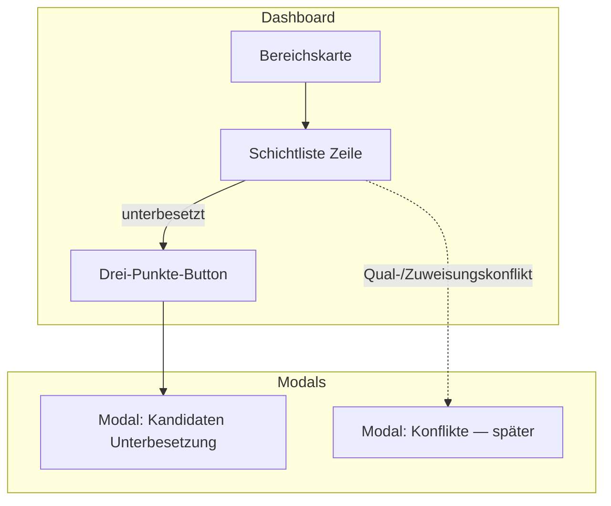
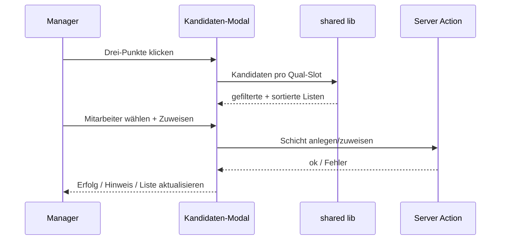
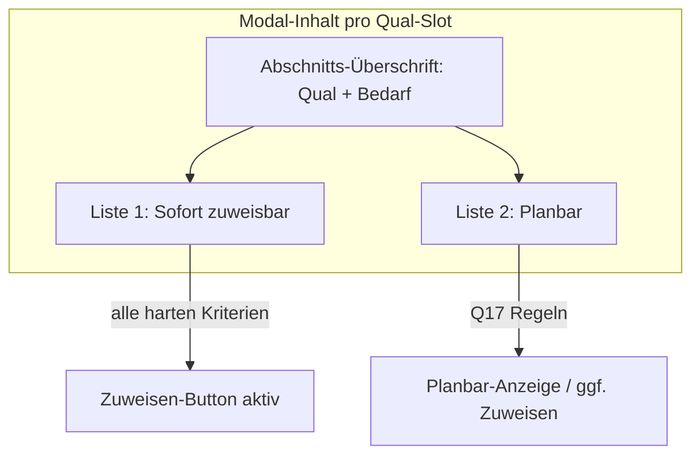

# Brainstorming: Dashboard — Mitarbeiter-Vorschläge bei Unterbesetzung (Bereichskarten)

**Status:** Round 1 — offen  
**Kontext:** In den Bereichskarten im Dashboard zeigt die Schichtliste bei **Unterbesetzung** (Zukunft/heute, keine vergangenen Tage) einen Drei-Punkte-Button. Beim Klick soll ein Modal alle **in Frage kommenden Mitarbeiter** für genau diese Schicht/Zeile anzeigen. **Qualifikations-Konflikte** und andere Konflikttypen bekommen ein **eigenes Modal** — Scope dafür wird hier nur abgegrenzt, Details später.  
**Ist-Stand (Kurz):** Button + Spaltenlayout existieren; Klick noch ohne Modal. Kandidatenlogik existiert teilweise im Planer (`available-employees-for-shift`, `profile-shift-preference-matching`, Bulk-Prefill).

**Kriterien für „in Frage kommend“ (aus Notizen):** Verfügbarkeit · Abwesenheit · Qualifikation · Schichtüberlappung · Wochenstundenlimit · Schichtwunsch (z. B. Früh-/Spätschicht) · Zeitfenster der Zeile

---

## Round 1 — Umfang, Zweck & Datenquelle

> Bitte markiere deine Wahl mit `[x]`. Empfohlene Option ist mit ⭐ gekennzeichnet.  
> Antworten nur unter **Deine Antwort:** eintragen — bestehende Fragen und Antworten nicht ändern.

---

### Q1 — **Scope dieser Spezifikation:** Was gehört in den ersten Release?

| Option | Beschreibung |
|--------|--------------|
| **A** | **Nur Unterbesetzung** — Drei-Punkte-Button → Kandidaten-Modal; Konflikt-Modal explizit **out of scope** (eigenes Brainstorming später) ⭐ **empfohlen** |
| **B** | Unterbesetzung + **Qualifikations-Konflikte** (falsch zugewiesene / fehlende Qual am besetzten Slot) in einem Modal |
| **C** | Unterbesetzung + alle Konflikttypen aus `DashboardStaffingIssue` (überbesetzt, Mismatch, …) |
| **D** | Zuerst nur **Anzeige** der Kandidaten ohne Modal-Interaktion (Prototyp) |

- [x] **A)** Nur Unterbesetzung; Konflikte später ⭐
- [ ] **B)** Unterbesetzung + Qual-Konflikte
- [ ] **C)** Unterbesetzung + alle Konflikttypen
- [ ] **D)** Prototyp ohne echtes Modal

**Deine Antwort:**

---

### Q2 — **Zweck des Kandidaten-Modals:** Was kann der Manager dort tun?

| Option | Beschreibung |
|--------|--------------|
| **A** | **Nur Informationsliste** — wer theoretisch passen würde; Zuweisung weiter nur im Bereichskalender ⭐ **empfohlen** (kleinerer Scope, schneller nutzbar) |
| **B** | **Liste + direkte Zuweisung** — Mitarbeiter auswählen → Schicht wird im System angelegt/zugewiesen (wie „Schicht hinzufügen“) |
| **C** | **Liste + Deep-Link** — Klick auf Mitarbeiter öffnet Bereichskalender mit vorausgefüllter Zuweisung |
| **D** | **Liste + Kontakt** — z. B. nur Anzeige mit Hinweis „im Kalender zuweisen“ + Copy/Export der Namen |

- [ ] **A)** Nur Anzeige ⭐
- [x] **B)** Direkte Zuweisung im Modal
- [ ] **C)** Deep-Link in Kalender
- [ ] **D)** Anzeige + Hilfshinweis/Export

**Deine Antwort:**

---

### Q3 — **Mehrere fehlende Qualifikationen:** Wie strukturieren wir die Listen im Modal?

Beispiel: Fenster „Mittag“ braucht 1× Koch + 1× Service, beide Slots offen.

| Option | Beschreibung |
|--------|--------------|
| **A** | **Getrennte Abschnitte untereinander** — je fehlender Qual ein Block mit Überschrift (Qual-Name + Bedarf) und eigener Mitarbeiterliste ⭐ **empfohlen** (entspricht deiner Notiz) |
| **B** | **Eine gemischte Liste** — Mitarbeiter, die *irgendeine* fehlende Qual abdecken; Badge zeigt welche Qual(s) |
| **C** | **Tabs** — ein Tab pro fehlender Qualifikation |
| **D** | **Zuerst nur Gesamt-Bedarf** — eine Liste für „fehlender Kopf“ ohne Qual-Aufschlüsselung (Vereinfachung) |

- [x] **A)** Abschnitte pro fehlender Qual ⭐
- [ ] **B)** Eine Liste mit Qual-Badges
- [ ] **C)** Tabs pro Qual
- [ ] **D)** Nur Gesamtliste ohne Qual-Split

**Deine Antwort:**

---

### Q4 — **Filterlogik:** Welche Mitarbeiter erscheinen in der Liste?

| Option | Beschreibung |
|--------|--------------|
| **A** | **Nur voll qualifizierte & verfügbare** — alle harten Kriterien müssen erfüllt sein (Verfügbarkeit, keine Abwesenheit, Qual, keine Überlappung, Wochenstunden OK) ⭐ **empfohlen** (klare „zuweisbar“-Liste) |
| **B** | **Zwei Stufen** — oben „sofort zuweisbar“, darunter „mit Einschränkung“ (z. B. Wunsch nicht erfüllt, knapp an Wochenstundenlimit) mit Grund |
| **C** | **Alle Mitarbeiter des Standorts** — mit Ampel/Icons warum sie passen oder nicht |
| **D** | **Wie Bereichskalender „Schicht hinzufügen“** — exakt dieselbe Filter-Pipeline wie dort (1:1 Parität) ⭐ **alternativ empfohlen** wenn Parität wichtiger als Vereinfachung |

- [ ] **A)** Nur harte Kriterien erfüllt ⭐
- [ ] **B)** Zwei Stufen (zuweisbar / eingeschränkt)
- [ ] **C)** Alle mit Status-Icons
- [ ] **D)** 1:1 Parität mit Schicht-hinzufügen-Modal

**Deine Antwort:**
A + planbar

---

### Q5 — **Schichtwunsch (Früh-/Spät, Bereich, Zeit):** Rolle in der Anzeige?

| Option | Beschreibung |
|--------|--------------|
| **A** | **Nur Sortierung** — Wunsch erfüllt → weiter oben; kein Ausschluss ⭐ **empfohlen** (konsistent mit `rankEmployeesByShiftWish`) |
| **B** | **Harter Filter** — nur Mitarbeiter mit passendem Wunsch |
| **C** | **Nur Badge** — „Wunsch erfüllt“ / „Wunsch offen“, Sortierung alphabetisch |
| **D** | **V1 ignorieren** — Wunsch erst in späterer Iteration |

- [x] **A)** Sortierung nach Wunsch-Score ⭐
- [ ] **B)** Harter Filter
- [ ] **C)** Nur visuelles Badge
- [ ] **D)** Wunsch später

**Deine Antwort:**

---

### Q6 — **Technik:** Wo wird die Kandidatenliste berechnet?

| Option | Beschreibung |
|--------|--------------|
| **A** | **Client-seitig** — Dashboard hat bereits `employees`, `absences`, `recurringAvailability`, `shifts` im Shell; Berechnung in shared lib (wie Planer) ⭐ **empfohlen** (kein Extra-Roundtrip, Woche schon geladen) |
| **B** | **Server Action** — beim Öffnen des Modals frisch berechnen (schwerer, aber immer aktuell bei parallelen Edits) |
| **C** | **Hybrid** — Client-Default; optional Refresh-Button lädt Server-Neuberechnung |
| **D** | **Beim SSR der Dashboard-Seite voraggregieren** — pro Zeile Kandidaten-ID-Listen mitliefern (größeres Page-Payload) |

- [x] **A)** Client + shared lib ⭐
- [ ] **B)** Server Action on open
- [ ] **C)** Hybrid mit Refresh
- [ ] **D)** SSR-Voraggregation

**Deine Antwort:**

---

### Q7 — **Modal-UI:** An welches bestehende Pattern anlehnen?

| Option | Beschreibung |
|--------|--------------|
| **A** | **`DashboardAreaStaffingIssuesModal`** — gleiche Shell (Overlay, Header, Schließen, Scroll-Body) ⭐ **empfohlen** |
| **B** | **`PlanningSidePanel`** — seitliches Panel wie Schicht hinzufügen |
| **C** | **Kompaktes Popover** — an Button verankert, kein Voll-Modal |
| **D** | **Neue generische `DashboardStaffingModal`-Shell** — für später auch Konflikt-Modal wiederverwendbar ⭐ **alternativ** wenn Konflikt-Modal gleich mitplant wird |

- [x] **A)** Wie Staffing-Issues-Modal ⭐
- [ ] **B)** Side Panel
- [ ] **C)** Popover
- [ ] **D)** Neue wiederverwendbare Shell

**Deine Antwort:**

---

*Round 2 folgt nach deinen Antworten (Details: Zeilen-Kontext im Header, leere Listen, Sortierung, i18n, Berechtigungen, Zeilendaten im `DashboardStaffingWindowRow`, Sonder-Einsätze, Performance).*

---

## Round 2 — Modal-Inhalt, Zuweisung & Randfälle

> **Round-1-Kernentscheidungen (Referenz):** Nur Unterbesetzung · **direkte Zuweisung im Modal** · Abschnitte pro fehlender Qual · nur harte Filter · Wunsch = Sortierung · Client-Lib · Issues-Modal-Shell  
> Bitte markiere mit `[x]`. Antworten nur unter **Deine Antwort:** — nichts oben ändern.

---

### Q8 — **Modal-Kopf:** Welcher Kontext wird oben angezeigt?

| Option | Beschreibung |
|--------|--------------|
| **A** | **Kompakt eine Zeile** — Bereich · Wochentag · Uhrzeit · Schichtname ⭐ **empfohlen** |
| **B** | **Zweizeilig** — Zeile 1: Bereich + Schicht; Zeile 2: Datum/Wochentag + Uhrzeit + „X/Y besetzt“ |
| **C** | **Wie Tabellenzeile gespiegelt** — exakt dieselben vier Spaltenwerte wie in der Karte |
| **D** | **Nur Schichtname** — Rest implizit aus Tabellenkontext |

- [ ] **A)** Kompakt eine Zeile ⭐
- [ ] **B)** Zweizeilig mit Besetzt/Bedarf
- [ ] **C)** Vier Spalten gespiegelt
- [ ] **D)** Nur Schichtname

**Deine Antwort:**
Eventuell müssen mehrere Schichten besetzt werden mit gleichen Qualifikationen.
Wie könnte man diese am besten anzeigen?

---

### Q9 — **Zuweisungs-Interaktion:** Wie weist der Manager einen Kandidaten zu?

*(Bezug Q2 = direkte Zuweisung)*

| Option | Beschreibung |
|--------|--------------|
| **A** | **Ein Klick pro Person** — Zeile mit Button „Zuweisen“; sofort Server Action, kein Zwischen-Dialog ⭐ **empfohlen** für schnelles Dashboard |
| **B** | **Auswählen + Bestätigen** — Radio/Checkbox, unten ein „Zuweisen“-Button (weniger Fehlklicks) |
| **C** | **Wie Schicht-hinzufügen-Modal** — Person wählen, optional Vorlage/Zeit prüfen, dann OK |
| **D** | **Nur erste Iteration Anzeige** — Zuweisung kommt in V1.1 (widerspricht Q2 — nur wenn du Q2 revidieren willst) |

- [x] **A)** Ein-Klick-Zuweisen ⭐
- [ ] **B)** Auswahl + Bestätigen
- [ ] **C)** Volles Mini-Formular wie Kalender
- [ ] **D)** Zuweisung später

**Deine Antwort:**
A inkl. status proposed und entsprechenden Eintrag in Schicht-stati Anfrage senden.

---

### Q10 — **Nach erfolgreicher Zuweisung:** Was passiert im Modal?

| Option | Beschreibung |
|--------|--------------|
| **A** | **Modal schließen** + Dashboard-Daten aktualisieren (Karte/Tabellenzeile) ⭐ **empfohlen** |
| **B** | **Modal offen lassen** — Liste neu berechnen; weitere Slots derselben Zeile zuweisbar (wichtig bei mehreren fehlenden Quals) ⭐ **alternativ empfohlen** bei Q3=A |
| **C** | **Modal offen** — nur Erfolgs-Toast; manuelles Schließen |
| **D** | **Weiterleitung** — automatisch zum Bereichskalender springen |

- [x] **A)** Schließen + Refresh ⭐
- [ ] **B)** Offen lassen, Liste aktualisieren ⭐
- [ ] **C)** Toast, Modal offen
- [ ] **D)** Redirect Kalender

**Deine Antwort:**

---

### Q11 — **Leere Kandidatenliste** für einen Qual-Slot: Was zeigen wir?

| Option | Beschreibung |
|--------|--------------|
| **A** | **Kurzer Hinweis** — „Kein passendes Personal“ + Link „Bereichskalender öffnen“ ⭐ **empfohlen** |
| **B** | **Hinweis + Aufschlüsselung** — warum niemand passt (aggregiert: „3 abwesend, 2 keine Verfügbarkeit, …“) — aufwändiger |
| **C** | **Abschnitt ausblenden** — leere Qual-Blöcke nicht rendern |
| **D** | **Gesamtes Modal blockieren** — eine Meldung statt Listen |

- [x] **A)** Kurzer Hinweis + Kalender-Link ⭐
- [ ] **B)** Hinweis mit Gründen
- [ ] **C)** Leere Abschnitte verstecken
- [ ] **D)** Eine globale Leer-Meldung

**Deine Antwort:**

---

### Q12 — **Sortierung innerhalb eines Qual-Abschnitts** (nach Wunsch-Score, Q5=A):

| Option | Beschreibung |
|--------|--------------|
| **A** | **Wunsch-Score absteigend**, dann **Name A–Z** ⭐ **empfohlen** |
| **B** | **Wunsch-Score**, dann **wenigste Wochenstunden** dieser Woche |
| **C** | **Alphabetisch** — Wunsch nur als kleines Icon/Badge |
| **D** | **Manuell umschaltbar** — Sortierung per Dropdown im Modal |

- [ ] **A)** Wunsch → Name ⭐
- [x] **B)** Wunsch → Wochenstunden
- [ ] **C)** Alphabetisch + Badge
- [ ] **D)** Umschaltbar

**Deine Antwort:**

---

### Q13 — **Mitarbeiter-Pool:** Aus welchem Bestand werden Kandidaten gesucht?

| Option | Beschreibung |
|--------|--------------|
| **A** | **Dieselben Planungs-Mitarbeiter wie Dashboard/Kalender** — bereits im `DashboardSummaryShell` geladen ⭐ **empfohlen** |
| **B** | **Nur Mitarbeiter mit Profil am Standort** — zusätzlicher Standort-Filter |
| **C** | **Alle Org-Mitarbeiter** — breiter Pool |
| **D** | **Nur Mitarbeiter, die in dieser Woche schon eine Schicht am Standort haben** |

- [ ] **A)** Planungs-Pool wie Kalender ⭐
- [ ] **B)** Standort-gebunden
- [x] **C)** Gesamte Organisation
- [ ] **D)** Nur mit bestehender Wochen-Schicht

**Deine Antwort:**

---

### Q14 — **Schichtbestätigung** (`shift_confirmation_enabled`): Status neuer Zuweisungen?

| Option | Beschreibung |
|--------|--------------|
| **A** | **Gleiche Regeln wie Bereichskalender** — ggf. `proposed` + Bestätigungsflow; nicht sendbare Zuweisung blockieren mit Fehlermeldung ⭐ **empfohlen** (Parität) |
| **B** | **Immer `proposed`** — Manager sendet Bestätigung später gesammelt |
| **C** | **Immer sofort `confirmed`** — Dashboard-Zuweisung ohne MA-Freigabe |
| **D** | **Feature ignorieren** — nur wenn Bestätigung org-weit aus ist relevant |

- [x] **A)** Parität mit Kalender ⭐
- [ ] **B)** Immer proposed
- [ ] **C)** Immer confirmed
- [ ] **D)** Nur ohne Bestätigungs-Feature

**Deine Antwort:**

---

### Q15 — **Zeilendaten:** Woher kommen fehlende Qual-Slots pro Tabellenzeile?

Aktuell: `DashboardStaffingWindowRow` hat `assigned/required/status`, aber **keine** Qual-Aufschlüsselung.

| Option | Beschreibung |
|--------|--------------|
| **A** | **Beim Modal-Öffnen berechnen** — aus `staffingRules`, `serviceHourId`, `dateISO`, bestehenden Schichten (Client) ⭐ **empfohlen** |
| **B** | **In `computeDashboardAreaWeekStats` voraggregieren** — `missingQualSlots[]` pro Zeile mitliefern |
| **C** | **Server Action nur für Qual-Slots** — Rest Client |
| **D** | **Nur Gesamt-Defizit** — keine echte Qual-Trennung in V1 (widerspricht Q3) |

- [x] **A)** On-demand beim Öffnen ⭐
- [ ] **B)** Voraggregiert in Stats
- [ ] **C)** Hybrid Server für Quals
- [ ] **D)** Kein Qual-Split

**Deine Antwort:**

---

### Q16 — **Read-only-Woche / Berechtigungen:** Button und Zuweisung?

| Option | Beschreibung |
|--------|--------------|
| **A** | **Button sichtbar**, Modal read-only — Listen anzeigen, Zuweisen deaktiviert mit Hinweis ⭐ **empfohlen** |
| **B** | **Button ausblenden** in read-only-Wochen |
| **C** | **Keine Einschränkung** — Dashboard-Zuweisung immer erlaubt |
| **D** | **Wie Kalender** — exakt dieselbe `canAssign` / Block-Reason-Logik |

- [x] **A)** Modal read-only ⭐
- [ ] **B)** Button verstecken
- [ ] **C)** Immer zuweisbar
- [ ] **D)** 1:1 Kalender-Regeln

**Deine Antwort:**

---

*Round 3 (falls nötig): Mitarbeiter-Zeilen-UI, Fehlerbehandlung, Tests, Schema/API der Zuweisung, Konflikt-Modal-Abgrenzung, Performance bei vielen MA.*

---

## Round 3 — „Planbar“-Stufe, UI-Details & Technik

> **Wichtig — Q4 überarbeitet:** Statt nur **A** (hart filterbar) gilt **A + planbar** = zwei Kategorien in der Anzeige.  
> **Round-2-Hinweise:** Q8 offen (mehrere Slots gleicher Qual) · Q9 = proposed + Schicht-Stati · Q10 = Modal zu · Q13 = **gesamte Organisation** als Pool  
> Bitte markiere mit `[x]`. Antworten nur unter **Deine Antwort:** — nichts oben ändern.

---

### Q17 — **„Planbar“ (Q4):** Was bedeutet die zweite Stufe konkret?

*Sofort zuweisbar = alle harten Kriterien (Verfügbarkeit, keine Abwesenheit, Qual, keine Überlappung, Wochenstunden OK).*

| Option | Beschreibung |
|--------|--------------|
| **A** | **Nur Wunsch fehlt** — sonst alle harten Kriterien erfüllt; trotzdem zuweisbar ⭐ **empfohlen** als Minimal-Unterschied zu Stufe 1 |
| **B** | **Wunsch oder knapp am Wochenstundenlimit** — noch zuweisbar, mit Warn-Badge |
| **C** | **Ein hartes Kriterium weich** — z. B. Verfügbarkeit „knapp“ (Teilüberlappung mit Verfügbarkeitsfenster); Zuweisen mit Bestätigungsdialog |
| **D** | **Nur Anzeige, nicht zuweisbar** — „Planbar“ = Hinweis für manuelle Planung im Kalender, kein Zuweisen-Button ⭐ **alternativ** wenn Planbar = Orientierung |

- [ ] **A)** Planbar = nur Wunsch fehlt, zuweisbar ⭐
- [ ] **B)** Wunsch oder Wochenstunden knapp
- [ ] **C)** Ein weiches Kriterium + Bestätigung
- [ ] **D)** Planbar nur Info, kein Zuweisen ⭐

**Deine Antwort:**
Planbar ist ein flag bei profiles, wie aktiv und sagt aus, ob ein Mitarbeiter für schichten eingeplant werden kann.
Das Flag soll bei der Prüfung nahc geeigeneten Mitarbeitern für die Liste zuätzlich berücksichtigt werden.

---

### Q18 — **UI der zwei Stufen (Q4):** Wie werden „zuweisbar“ und „planbar“ dargestellt?

| Option | Beschreibung |
|--------|--------------|
| **A** | **Zwei Unterlisten pro Qual-Abschnitt** — Überschrift „Sofort zuweisbar“ / „Planbar“ ⭐ **empfohlen** |
| **B** | **Eine Liste** — Badge pro Person („sofort“ / „planbar“) |
| **C** | **Nur eine kombinierte Liste** — Planbar unten, abgetrennt durch Divider, ohne Extra-Überschrift |
| **D** | **Umschaltbar per Toggle** — Standard nur Sofort; „Planbar einblenden“ |

- [ ] **A)** Zwei Unterlisten mit Überschriften ⭐
- [ ] **B)** Eine Liste mit Badge
- [ ] **C)** Eine Liste, Planbar unten
- [ ] **D)** Toggle Planbar einblenden

**Deine Antwort:**
Siehe Q17

---

### Q19 — **Mehrere offene Slots gleicher Qualifikation** (Q8-Nachfrage):

Beispiel: 2× „Service“ fehlen im selben Servicezeit-Fenster.

| Option | Beschreibung |
|--------|--------------|
| **A** | **Ein Abschnitt** — Überschrift „Service · 2 fehlend“; dieselbe Kandidatenliste; jeder Klick „Zuweisen“ füllt einen Slot ⭐ **empfohlen** (passt zu Q10 Modal schließen nach 1 Zuweisung — oder mehrere Zuweisungen nacheinander Modal offen?) |
| **B** | **Zwei identische Abschnitte** — „Service (1/2)“ und „Service (2/2)“ mit je eigener Liste |
| **C** | **Ein Abschnitt + Zähler im Header** — „0/2 besetzt“ live aktualisiert; Modal bleibt offen (widerspricht Q10=A) |
| **D** | **Ein Abschnitt, Batch** — mehrere MA auswählen, ein „2 zuweisen“-Button |

- [x] **A)** Ein Abschnitt „2 fehlend“, Liste geteilt ⭐
- [ ] **B)** Zwei separate Abschnitte
- [ ] **C)** Ein Abschnitt, Modal offen bis voll
- [ ] **D)** Multi-Select + Batch

**Deine Antwort:**

---

### Q20 — **Mitarbeiter-Zeile im Modal:** Welche Infos neben dem Namen?

| Option | Beschreibung |
|--------|--------------|
| **A** | **Name + Zuweisen-Button** — minimal ⭐ **empfohlen** für V1 |
| **B** | **Name + Wochenstunden diese Woche + Button** |
| **C** | **Name + Wunsch-Icon + Wochenstunden + Button** ⭐ **alternativ** (Q12=B nutzt Wochenstunden) |
| **D** | **Wie Mitarbeiter-Legende im Kalender** — Verfügbarkeits-Tooltip, Qual-Badges |

- [x] **A)** Name + Button ⭐
- [ ] **B)** Name + Wochenstunden + Button
- [ ] **C)** Name + Wunsch + Wochenstunden + Button ⭐
- [ ] **D)** Wie Kalender-Legende

**Deine Antwort:**

---

### Q21 — **Zuweisung API:** Welche Server-Logik wiederverwenden?

| Option | Beschreibung |
|--------|--------------|
| **A** | **Bestehende Kalender-Assign-Action** (`areacalendar-shift-assign` o. ä.) — gleiche Validierung Server-seitig ⭐ **empfohlen** |
| **B** | **Neue schlanke Dashboard-Action** — nur Create+Assign für Servicezeit-Zeile |
| **C** | **Client optimistisch** — UI sofort, Sync im Hintergrund |
| **D** | **Bulk-Assign aus Bulk-Shift-Modal** — gleiche Payload-Struktur |

- [x] **A)** Bestehende Assign-Action ⭐
- [ ] **B)** Neue Dashboard-Action
- [ ] **C)** Optimistic UI
- [ ] **D)** Bulk-Assign-Payload

**Deine Antwort:**

---

### Q22 — **Nach Zuweisung (Q9/Q10):** Refresh & Schicht-Stati

Q9: Status `proposed` + Eintrag für „Anfrage senden“ in Schicht-Stati.

| Option | Beschreibung |
|--------|--------------|
| **A** | **Modal schließen** · `router.refresh()` · neue Schicht erscheint in Kommunikation/ Schicht-Stati Tab „Vorgeschlagen“ wie beim Kalender ⭐ **empfohlen** (konsistent Q10=A) |
| **B** | **Modal schließen** · zusätzlich Toast „In Schicht-Stati unter Vorgeschlagen“ |
| **C** | **Modal offen** bis alle Slots der Zeile gefüllt; dann Schicht-Stati Sammelaktion |
| **D** | **Automatisch Bestätigungsanfrage senden** — nicht nur proposed, sondern sofort Request raus |

- [x] **A)** Schließen + Refresh + Schicht-Stati wie Kalender ⭐
- [ ] **B)** + Toast mit Hinweis
- [ ] **C)** Offen bis voll
- [ ] **D)** Sofort Anfrage senden

**Deine Antwort:**

---

### Q23 — **Org-weiter Pool (Q13=C):** Zusätzliche Daten im Dashboard?

Gesamte Organisation durchsuchen — braucht ggf. mehr Daten als aktuell im Summary-Shell.

| Option | Beschreibung |
|--------|--------------|
| **A** | **Beim Modal-Öffnen lazy nachladen** — Server Action liefert Org-Profile + Quals + Verfügbarkeit für die Woche ⭐ **empfohlen** bei Org-Pool |
| **B** | **Summary-Page lädt alle Org-Planungs-MA vor** — größeres Initial-Payload |
| **C** | **Doch auf Planungs-Pool des Standorts begrenzen** — Q13 revidieren |
| **D** | **Org-Pool, aber nur MA mit passender Qual** — Vorfilter in DB/Action |

- [x] **A)** Lazy Load beim Modal-Öffnen ⭐
- [ ] **B)** Alles im Summary vorladen
- [ ] **C)** Q13 auf Standort-Pool zurück
- [ ] **D)** Org-Pool qual-gefiltert serverseitig

**Deine Antwort:**

---

### Q24 — **Einfacher Planungsmodus** (ohne Qual-Regeln): Verhalten bei Unterbesetzung?

Wenn `simplePlanning` / keine Qual-Bedarfe: nur Kopfzahl fehlt.

| Option | Beschreibung |
|--------|--------------|
| **A** | **Ein Abschnitt „Personalbedarf“** — ohne Qual-Name; eine Kandidatenliste ⭐ **empfohlen** |
| **B** | **Gleiche Qual-UI** — mit Platzhalter-Qual „Mitarbeiter“ |
| **C** | **Button/Modal nicht anzeigen** — nur mit aktivem Qual-Staffing |
| **D** | **Wie Kalender ohne Job-Auswahl** — alle verfügbaren MA |

- [x] **A)** Ein Abschnitt ohne Qual ⭐
- [ ] **B)** Platzhalter-Qual
- [ ] **C)** Nur mit Qual-Staffing
- [ ] **D)** Alle verfügbaren ohne Qual-Filter

**Deine Antwort:**

---

### Q25 — **Konflikt-Modal (später):** Kurz-Abgrenzung in dieser Spec festhalten?

| Option | Beschreibung |
|--------|--------------|
| **A** | **Explizit out of scope** — eigene Spec `012-…`; dieser Button nur bei `understaffed` ⭐ **empfohlen** |
| **B** | **Gleicher Button**, anderes Modal bei Konflikt-Zeilen (später) |
| **C** | **Konflikte nur über bestehendes Issues-Modal** (Dreieck oben in Karte) |
| **D** | **Noch offen** — in Spec nicht erwähnen |

- [x] **A)** Out of scope, eigene Spec ⭐
- [ ] **B)** Gleicher Button, anderes Modal
- [ ] **C)** Nur Issues-Modal oben
- [ ] **D)** Offen lassen

**Deine Antwort:**

---

### Q26 — **Abschluss:** Reicht Round 3 für die Specification, oder noch Round 4?

| Option | Beschreibung |
|--------|--------------|
| **A** | **Ja, Spec schreiben** — nach Beantwortung von Q17–Q25 ⭐ **empfohlen** wenn keine großen Lücken |
| **B** | **Round 4** — Tests, Fehlertexte, i18n-Keys, Edge Cases Sonder-Einsatz |
| **C** | **Round 4 nur Technik** — DB-Schema, neue Types, Dateistruktur |
| **D** | **Spec-Entwurf jetzt**, Feintuning parallel |

- [x] **A)** Spec nach Round 3 ⭐
- [ ] **B)** Round 4 UX/Tests
- [ ] **C)** Round 4 Technik
- [ ] **D)** Spec-Entwurf jetzt

**Deine Antwort:**

---

*Nach Round 3: `Specs/011-dashboard-staffing-candidates-specification.md` mit allen Entscheidungen (inkl. Q4 „A + planbar“).*

