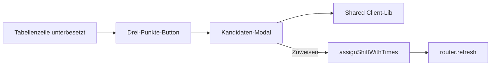
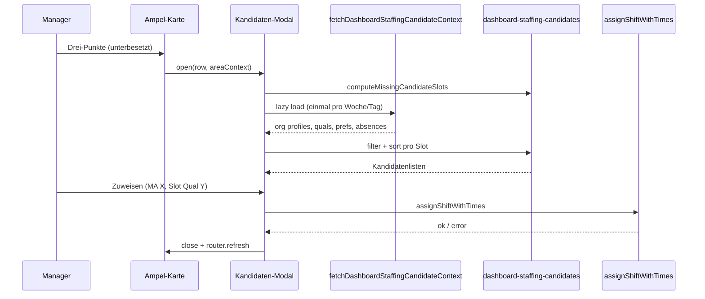

# Specification: Dashboard — Kandidaten-Modal bei Unterbesetzung (Bereichskarten)

**Version:** 1.0  
**Status:** Freigegeben zur Implementierung  
**Quelle:** `Specs/011-dashboard-staffing-candidates-brainstorming.md` (Runden 1–3)  
**Bezug:** `Specs/008-shift-employee-confirmation-specification.md`, `Specs/010-shift-status-actions-specification.md`, `Specs/005-bulk-shift-column-controls-specification.md`  
**Scope:** Web — Dashboard Summary (Bereichskarten / Ampel-Karten), Manager/Admin

**Nicht in diesem Spec:** Konflikt-Modal (Qual-Mismatch, Überbesetzung, …) → eigene Spec `012-…`; Mobile; automatisches Senden von Bestätigungsanfragen; Batch-Zuweisung mehrerer MA in einem Klick

---

## 1. Ziel

In den **Bereichskarten** des Dashboards zeigt die Schichtliste bei **Unterbesetzung** (heute/Zukunft) einen **Drei-Punkte-Button**. Ein Klick öffnet ein Modal mit **geeigneten Mitarbeitern** für genau diese Servicezeit-Zeile — aufgeschlüsselt nach **fehlenden Qualifikations-Slots** (oder einem Gesamt-Block im einfachen Planungsmodus).

Der Manager kann einen Kandidaten **direkt zuweisen** (ein Klick). Die neue Schicht folgt denselben Regeln wie im Bereichskalender (`proposed` bei aktivem Bestätigungs-Feature, Eintrag in **Schicht-Stati** Tab „Nicht versendet“ / „Vorgeschlagen“).



---

## 2. Entscheidungsübersicht

| # | Bereich | Entscheidung | Quelle |
|---|---------|--------------|--------|
| 1 | Release-Scope | **Nur Unterbesetzung**; Konflikt-Modal out of scope | Q1 A, Q25 A |
| 2 | Zweck | **Direkte Zuweisung** im Modal | Q2 B |
| 3 | Qual-Struktur | **Abschnitt pro fehlender Qual** (bzw. ein Block „Personalbedarf“) | Q3 A, Q24 A |
| 4 | Filterlogik | **Harte Kriterien** + Profil muss **`schedulable`** und **`is_active`** sein | Q4, Q17, Q18 |
| 5 | Schichtwunsch | **Nur Sortierung**, kein Ausschluss | Q5 A |
| 6 | Berechnung | **Client-seitig** in shared lib; Org-Daten **lazy** beim Öffnen | Q6 A, Q23 A |
| 7 | Modal-Shell | Wie **`DashboardAreaStaffingIssuesModal`** | Q7 A |
| 8 | Modal-Kopf | **Kompakt eine Zeile**: Bereich · Wochentag · Uhrzeit · Schichtname | Q8 *(empfohlen, nicht explizit gewählt)* |
| 9 | Zuweisung UI | **Ein Klick „Zuweisen“** pro Person | Q9 A |
| 10 | Nach Zuweisung | **Modal schließen** + `router.refresh()` | Q10 A, Q22 A |
| 11 | Leere Liste | Kurzer Hinweis + Link Bereichskalender | Q11 A |
| 12 | Sortierung | **Wunsch-Score absteigend**, dann **wenigste Wochenstunden** dieser Woche, dann Name A–Z | Q12 B |
| 13 | Mitarbeiter-Pool | **Gesamte Organisation** (nicht nur Planungs-Pool) | Q13 C |
| 14 | Schichtbestätigung | **Parität Bereichskalender** (`proposed`, App-Gate, sendable-Regeln) | Q14 A, Q9 |
| 15 | Fehlende Qual-Slots | **On-demand beim Modal-Öffnen** berechnen | Q15 A |
| 16 | Read-only-Woche | Button sichtbar; Modal **read-only** (Listen ja, Zuweisen nein) | Q16 A |
| 17 | Gleiche Qual mehrfach | **Ein Abschnitt** „{Qual} · {n} fehlend“; gemeinsame Liste | Q19 A |
| 18 | Mitarbeiter-Zeile | **Name + Zuweisen-Button** (minimal) | Q20 A |
| 19 | Assign-API | **`assignShiftWithTimes`** (bestehende Kalender-Action) | Q21 A |
| 20 | Einfacher Planungsmodus | Ein Abschnitt **„Personalbedarf“** ohne Qual-Name | Q24 A |

---

## 3. Begriffe

| Begriff | Bedeutung |
|---------|-----------|
| **Unterbesetzung** | `DashboardStaffingWindowRow.status === "understaffed"` und `rowKind === "staffing_window"` |
| **Planbar** | Profil-Flag **`profiles.schedulable`** (wie `is_active`): nur planbare, aktive Profile erscheinen als Kandidaten |
| **Harte Kriterien** | Verfügbarkeit (Schichtfenster ⊆ Verfügbarkeit), keine genehmigte Abwesenheit, passende Qualifikation, keine Schichtüberlappung, Wochenstundenlimit eingehalten, ggf. App-Registrierung bei Schichtbestätigung |
| **Qual-Slot** | Ein offener Bedarf für eine konkrete Qualifikation in einem Servicezeit-Fenster (oder ein Kopf-Slot im einfachen Modus) |
| **Org-Pool** | Alle Profile der Organisation (`listOrganizationProfiles`), danach Filter wie oben |

**Klarstellung Q4 / Q17 / Q18:** „A + planbar“ bedeutet **keine zweite UI-Stufe** („sofort zuweisbar“ vs. „planbar“). Es gilt: Kandidaten müssen alle **harten Kriterien** erfüllen **und** `is_active === true` sowie **`schedulable === true`** haben — analog `profileCanReceiveShiftAssignment` / Bereichskalender.

---

## 4. Trigger — Drei-Punkte-Button

### 4.1 Sichtbarkeit

Button (`DashboardStaffingRowCandidatesButton`) nur wenn **alle** Bedingungen zutreffen:

| Bedingung | Regel |
|-----------|--------|
| Tag | **Nicht vergangen** (`dateISO >= heute`, Org-Zeitzone) |
| Zeilenart | `rowKind === "staffing_window"` |
| Status | `status === "understaffed"` |
| Konflikte | **Nicht** — `hasConflict` allein reicht **nicht** (Konflikt-Modal später) |

**Ist-Abweichung:** `staffingRowShowsCandidatesButton` prüft aktuell auch `hasConflict === true` — bei Implementierung auf **nur Unterbesetzung** korrigieren.

### 4.2 Nicht sichtbar

- Vergangene Tage
- `no_service_hours`-Zeilen
- `met`, `overstaffed`
- Reine Konfliktzeilen ohne Unterbesetzung

### 4.3 Interaktion

- `cursor: pointer`
- `aria-label`: `dashboard.ampelStaffingCandidatesButtonLabel` (bestehend)
- Klick: `stopPropagation` — keine Karten-Navigation

---

## 5. Modal — Shell & Kopf

### 5.1 Shell

Neue Komponente z. B. `DashboardStaffingRowCandidatesModal`:

- Gleiche Klassen/Verhalten wie `DashboardAreaStaffingIssuesModal`:
  - `settingsFixedNestedOverlayClass`, `settingsNestedModalDialogClass`
  - Escape schließt; Klick auf Overlay schließt
  - `useAppShellModalLockActive(true)`
- `role="dialog"`, `aria-modal="true"`, fokussierbarer Schließen-Button

### 5.2 Kopfzeile (Q8)

Eine kompakte Zeile unter dem Titel:

```
{Bereichsname} · {Wochentag} · {timeFrom}–{timeTo} · {shiftName}
```

Optional darunter dezent: `{assigned}/{required} besetzt` — nur wenn Platz; nicht Pflicht.

### 5.3 Body

Scrollbarer Bereich mit **Qual-Abschnitten** (siehe §6). Footer: Schließen-Button (wie Issues-Modal).

---

## 6. Modal — Inhalt & Qual-Abschnitte

### 6.1 Fehlende Slots berechnen (Q15)

Beim Öffnen **client-seitig** aus vorhandenen Dashboard-Daten:

**Inputs (vom Summary-Shell an Karte/Modal durchreichen):**

- `areaId`, `locationId`, `dateISO`, `serviceHourId`, `timeFrom`, `timeTo`
- `staffingRules`, `serviceHours`, `shifts` (Standort/Woche)
- `simplePlanning`
- `qualifications` (Namen)

**Logik:**

1. Staffing-Entry für `serviceHourId` + Bereich rekonstruieren (analog `TagAreaHeaderStaffingEntry` / `computeDashboardAreaWeekStats`).
2. Pro Qual mit `resolveRemainingQualificationNeed(entry, qualId, []) > 0` einen Slot erzeugen.
3. **Mehrfach gleiche Qual (Q19):** Slots mit gleicher `qualificationId` **zusammenfassen** → ein Abschnitt mit `missingCount = Summe`.
4. **Einfacher Planungsmodus (Q24):** Ein Abschnitt `kind: "headcount"` mit Label „Personalbedarf“ / i18n-Key; `missingCount = required - assigned` für das Fenster.

**Typ (Vorschlag):**

```ts
type DashboardStaffingCandidateSlot = {
  qualificationId: string | null; // null = headcount / simple planning
  qualificationName: string;
  missingCount: number;
};
```

### 6.2 Abschnitts-Überschrift

- Mit Qual: `{qualificationName} · {missingCount} fehlend` (Pluralisierung i18n)
- Ohne Qual: `dashboard.staffingCandidatesHeadcountSection` o. ä.

### 6.3 Kandidatenliste pro Abschnitt

**Eine** Liste (keine Unterlisten „sofort/planbar“ — Q17/Q18).

Pro Mitarbeiter eine Zeile:

| Element | Inhalt |
|---------|--------|
| Name | `full_name` |
| Aktion | Button „Zuweisen“ (Primary/outline klein) |

Keine Wochenstunden-, Wunsch-Icons oder Tooltips in V1 (Q20 A).

### 6.4 Leere Liste (Q11)

Wenn nach Filterung keine Kandidaten:

```
Kein passendes Personal für {qualificationName}.
[Link: Bereichskalender öffnen]
```

Deep-Link zum Bereichskalender mit `area=` und Woche/Datum wie bei Footer-Links der Karte.

### 6.5 Read-only (Q16)

Wenn `readOnlyWeek === true` oder Tag vergangen:

- Modal öffnet sich, Listen werden berechnet und angezeigt
- „Zuweisen“-Buttons **deaktiviert**
- Hinweistext: `dashboard.readOnlyWeek` / `dashboard.readOnlyDay`

---

## 7. Kandidaten-Filter & Sortierung

### 7.1 Datenladen (Q13, Q23)

Beim **ersten Öffnen** des Modals für eine Zeile (pro Session cachebar):

**Server Action** (neu oder Erweiterung von `fetchAreaCalendarBulkShiftContext`):

- `listOrganizationProfiles(organizationId)` — **Org-Pool**
- `listOrganizationRecurringAvailability`
- `listProfileQualificationIdsByOrganization`
- `listOrganizationShiftPreferences` für Wochentag der Zeile
- `listOrganizationAbsences` (genehmigt, Woche)
- `listEmployeeLastShiftDates` optional nur für Sort-Hilfen
- Standort-Schichten der Woche bereits im Client (`locationShifts`)

Response-Shape orientiert an `FetchAreaCalendarBulkShiftContextResult`.

**Client-Cache:** Ergebnis pro `(weekStart, dateISO)` im Modal-State halten; erneutes Öffnen derselben Woche ohne erneuten Request.

### 7.2 Filter-Pipeline (pro Qual-Slot)

Reihenfolge — Wiederverwendung aus `@/lib/available-employees-for-shift` und Bulk-Logik:

1. **`profileCanReceiveShiftAssignment`** — `is_active && schedulable` (Planbar-Flag, Q17)
2. **`filterProfilesForShiftConfirmationAssign`** — wenn `shift_confirmation_enabled`
3. **Abwesenheit** — `filterEmployeesNotAbsentOnDate`
4. **Verfügbarkeit Wochentag** — `filterEmployeesAvailableOnWeekday` / Fenster-Check `filterAreaCalendarShiftAssignEmployeesByWindow` für `timeFrom`–`timeTo`
5. **Qualifikation** — `filterEmployeesByQualificationForShift` (außer `simplePlanning` / headcount ohne Qual-Pflicht)
6. **Schichtüberlappung** — bestehende Schichten des MA am Tag (Org/Standort laut Kalender-Parität)
7. **Wochenstunden** — `filterEmployeesWithinWeeklyHoursForShift` / `validateShiftWeeklyHoursCompliance` serverseitig beim Speichern

**Schichtwunsch (Q5):** erfüllt oder nicht — **kein Ausschluss**; nur Einfluss auf Sortierung.

**Bereits zugewiesene MA** am selben Slot/Fenster: aus Liste entfernen, sobald ein Slot durch Zuweisung gefüllt würde (nach Refresh ohnehin neu).

### 7.3 Sortierung (Q12 B)

Innerhalb eines Abschnitts:

1. `employeeWishScore` absteigend (`profile-shift-preference-matching`)
2. **Summe gebuchter Stunden** in der aktuellen Kalenderwoche aufsteigend (aus `locationShifts` + Org-Schichten falls nötig)
3. `full_name` A–Z (`de`)

Neue Hilfsfunktion z. B. `sortDashboardStaffingCandidates` in shared lib; Unit-Tests für Sortierreihenfolge.

---

## 8. Zuweisung

### 8.1 Interaktion (Q9)

- Ein Klick **„Zuweisen“** neben dem Namen
- Kein Bestätigungsdialog (außer bestehende Availability-/Weekly-Hours-Warnungen des Kalenders — falls Action zurückgibt, anzeigen)
- Während Request: Button disabled + pending state im Modal

### 8.2 Server Action (Q21)

**`assignShiftWithTimes`** aus `@/app/actions/shifts` mit Payload analog Bereichskalender / Dashboard Assign:

| Feld | Wert |
|------|------|
| `employeeId` | gewählter Kandidat |
| `shiftDate` | `row.dateISO` |
| `locationId` | Standort der Karte |
| `locationAreaId` | `stats.areaId` |
| `startTime` / `endTime` | `row.timeFrom` / `row.timeTo` |
| `qualificationId` | aus Slot (oder Preset-Qual im simple mode) |
| `serviceHourId` / Vorlage | aus `serviceHourId` + `assignmentPresets` wie Dashboard-Assign |
| `simulatedProposedOnAssign` / `relaxAppRegistrationGate` | wie Dashboard-Kontext |

Server validiert erneut (Parität Q14): Planbarkeit, Labor, Wochenstunden, Bestätigungs-Gate.

### 8.3 Status nach Zuweisung (Q9, Q14, Q22)

| Org-Feature | Ergebnis |
|-------------|----------|
| `shift_confirmation_enabled` | Neue Schicht → **`proposed`** |
| Feature aus | **`confirmed`** (wie Spec 008) |

Schicht erscheint in **Schicht-Stati** Tab **`proposed`** („Nicht versendet“) mit `sendable`-Logik wie `listConfirmationSendShifts` — Manager kann später **„Bestätigung anfordern“** (Spec 010). **Kein** automatisches Senden.

### 8.4 Nach Erfolg (Q10, Q22)

1. Modal **schließen**
2. **`router.refresh()`** — Karte, Tabellenzeile, Ampel aktualisieren
3. Kein Success-Toast Pflicht (optional später)

Bei Fehler: Fehlermeldung im Modal (`translateActionError`), Modal bleibt offen.

**Hinweis Mehrfach-Slots (Q19 + Q10):** Nach einer Zuweisung schließt das Modal; für weiteren Bedarf derselben Zeile erneut Drei-Punkte klicken (Zähler im Abschnitt dann aktualisiert).

---

## 9. Abgrenzung Konflikt-Modal (Q25)

| Thema | Diese Spec | Später `012-…` |
|-------|------------|----------------|
| Unterbesetzung | Drei-Punkte → Kandidaten + Zuweisen | — |
| Qual-Mismatch, Überbesetzung, `hasConflict` | **Nicht** über diesen Button | Eigenes Modal / Issues-Flow |
| Issues-Dreieck (Kartenkopf) | Unverändert — `DashboardAreaStaffingIssuesModal` | — |

---

## 10. Architektur & Dateien

### 10.1 Neue / geänderte Komponenten

| Datei | Aufgabe |
|-------|---------|
| `dashboard-staffing-row-candidates-modal.tsx` | Modal UI |
| `dashboard-area-ampel-card.tsx` | State `openCandidatesRow`, Button `onClick`, readOnly-Props |
| `dashboard-summary-shell.tsx` | Daten an Ampel-Karten (shifts, rules, employees context, readOnlyWeek) |

### 10.2 Neue / geänderte Libs

| Datei | Aufgabe |
|-------|---------|
| `dashboard-staffing-candidates.ts` *(neu)* | `computeMissingCandidateSlots`, `filterCandidatesForSlot`, `sortDashboardStaffingCandidates` |
| `available-employees-for-shift.ts` | ggf. kleine Exporte wiederverwenden, nicht duplizieren |
| `bulk-shift-staffing.ts` | `resolveRemainingQualificationNeed` wiederverwenden |

### 10.3 Server

| Datei | Aufgabe |
|-------|---------|
| `areacalendar-shift-assign.ts` oder `dashboard-staffing-candidates.ts` | `fetchDashboardStaffingCandidateContext(date)` — Org-Pool lazy |

### 10.4 i18n (neu, Auszug)

| Key | DE (Entwurf) |
|-----|----------------|
| `dashboard.staffingCandidatesModalTitle` | Personal vorschlagen |
| `dashboard.staffingCandidatesAssign` | Zuweisen |
| `dashboard.staffingCandidatesEmpty` | Kein passendes Personal für {qualification}. |
| `dashboard.staffingCandidatesOpenCalendar` | Bereichskalender öffnen |
| `dashboard.staffingCandidatesHeadcountSection` | Personalbedarf |
| `dashboard.staffingCandidatesMissingCount` | {count} fehlend |
| `dashboard.staffingCandidatesLoading` | Personal wird geladen… |

Bestehend: `dashboard.ampelStaffingCandidatesButtonLabel`

---

## 11. Ablauf (Sequenz)



---

## 12. Testplan

### 12.1 Unit (`dashboard-staffing-candidates.test.ts`)

- `computeMissingCandidateSlots`: eine/mehrere Quals, Zusammenfassung gleicher Qual, simple planning headcount
- Filter: `schedulable=false` ausgeschlossen; abwesend; keine Verfügbarkeit; falsche Qual; Überlappung; Wochenstunden
- Sort: Wunsch-Score vor Wochenstunden vor Name

### 12.2 Integration / manuell

| # | Szenario |
|---|----------|
| 1 | Unterbesetzte Zeile heute → Button sichtbar → Modal mit Abschnitten |
| 2 | Vergangener Tag → kein Button |
| 3 | 2× gleiche Qual fehlend → ein Abschnitt „2 fehlend“ |
| 4 | Zuweisen → Modal zu → Zeile aktualisiert → Schicht in Schicht-Stati `proposed` |
| 5 | Leere Liste → Hinweis + Kalender-Link |
| 6 | `readOnlyWeek` → Zuweisen disabled |
| 7 | MA nicht `schedulable` → erscheint nicht |
| 8 | Org-MA außerhalb Planungs-Pool aber planbar → erscheint |
| 9 | Schichtbestätigung aus → direkt `confirmed` |
| 10 | Konflikt ohne Unterbesetzung → **kein** Drei-Punkte-Button |

---

## 13. Offene Punkte / später

- Konflikt-Modal (`012-…`)
- Feinere Leer-Listen-Analyse („3 abwesend, …“) — Q11 B verworfen
- Erweiterte Mitarbeiter-Zeile (Wunsch, Wochenstunden) — Q20 C verworfen
- Modal offen lassen für Mehrfach-Zuweisung — Q10 B verworfen
- Toast nach Zuweisung — Q22 B optional

---

## 14. Referenzen (Code)

| Thema | Pfad |
|-------|------|
| Button (Ist) | `apps/web/src/components/dashboard/dashboard-staffing-row-candidates-button.tsx` |
| Ampel-Karte | `apps/web/src/components/dashboard/dashboard-area-ampel-card.tsx` |
| Issues-Modal (Shell) | `apps/web/src/components/dashboard/dashboard-area-staffing-issues-modal.tsx` |
| Zeilentyp | `apps/web/src/lib/dashboard-area-week-stats.ts` |
| MA-Filter | `apps/web/src/lib/available-employees-for-shift.ts` |
| Offener Qual-Bedarf | `apps/web/src/lib/bulk-shift-staffing.ts` |
| Wunsch-Sort | `apps/web/src/lib/profile-shift-preference-matching.ts` |
| Assign Action | `apps/web/src/app/actions/shifts.ts` → `assignShiftWithTimes` |
| Assign-Mitarbeiter laden | `apps/web/src/app/actions/areacalendar-shift-assign.ts` |
| Planbar-Flag | `Profile.schedulable`, `profileCanReceiveShiftAssignment` |
