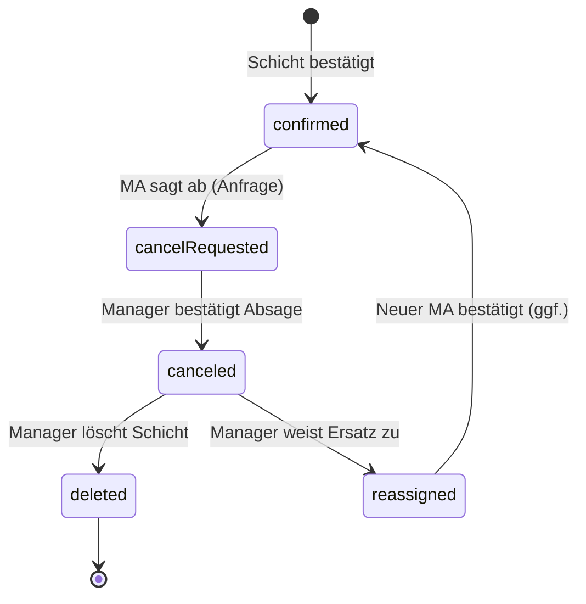
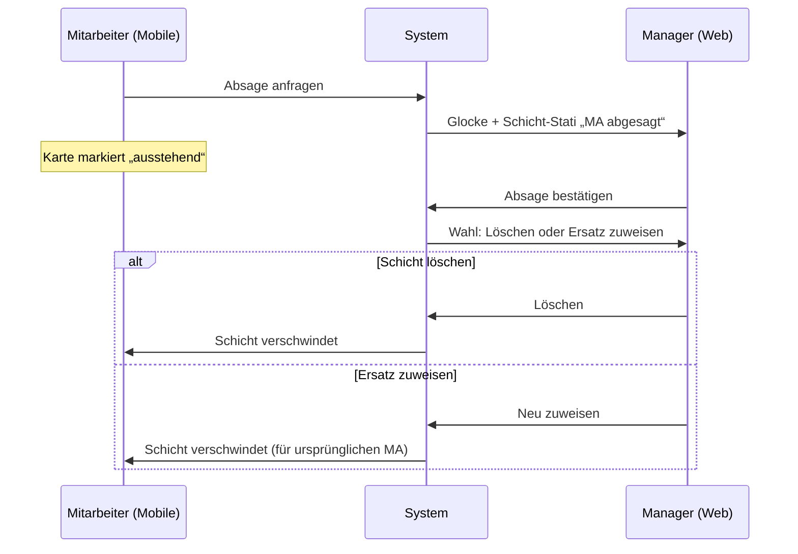
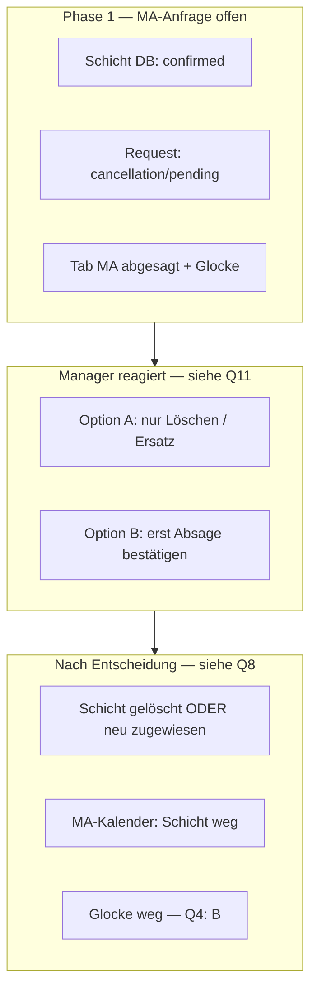
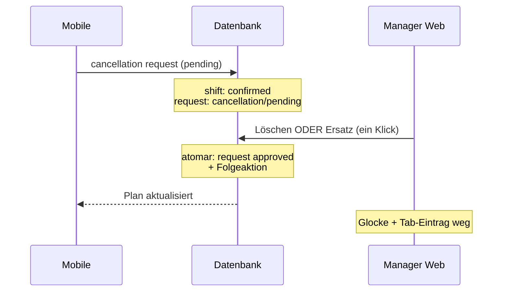

# Brainstorming: Mitarbeiter-Absage von Schichten (Employee Shift Cancellation)

**Status:** Round 1 — offen  
**Kontext:** Ein Mitarbeiter (MA) kann eine bestätigte Schicht kurzfristig absagen. Der Manager muss die Absage entgegennehmen und anschließend entscheiden, ob die Schicht gelöscht oder neu besetzt wird. Mobile- und Web-App sollen den Prozess konsistent abbilden — Benachrichtigungen, Schicht-Stati, Kalenderkarten und Dashboard.  
**Ist-Stand (Kurz):** Zwei-Phasen-Modell teilweise implementiert (`shift_requests` mit `cancellation/pending` → Manager `approveEmployeeShiftCancellation` → `canceled` → `reassign`/`delete`). Mobile zeigt `cancellationPending`-Overlay. Schicht-Stati-Tab „MA abgesagt“ enthält auch offene Absage-Anfragen. Dokumentation (`docs/shift-statuses.md`) beschreibt noch teils Sofort-Absage. Mehrere UI-/Sync-Lücken offen.

**Deine Notizen (Kern):**

- **Mobile:** MA wählt bestätigte Schicht → Slide-in → „Schicht absagen“ → Bestätigungsmodal → Erfolgsmodal („Absage-Anfrage versendet“)
- **Web:** Admin erhält Glocke + Eintrag in Schicht-Stati unter „MA abgesagt“
- Admin bestätigt Absage („Absage bestätigen“) → Benachrichtigung verschwindet → Entscheidung „Schicht löschen“ vs. „Ersatz zuweisen“
- Eintrag bleibt in „MA abgesagt“, bis Admin eine Folgeaktion erfolgreich ausgeführt hat
- Kalender/Dashboard/Wochentray/Drilldown spiegeln Entscheidung wider
- **Mobile (wartend):** Markierung „abgesagt, Aktion vom Manager ausstehend“ — passender Begriff nötig
- **Mobile (abgeschlossen):** Schicht verschwindet automatisch nach Manager-Entscheidung

---

## Round 1 — Fundament: Prozessmodell, Stati & Sichtbarkeit

> Bitte markiere deine Wahl mit `[x]`. Empfohlene Option ist mit ⭐ gekennzeichnet (vorausgewählt).  
> Antworten nur unter **Deine Antwort:** eintragen — bestehende Fragen und Antworten nicht ändern.

---

### Q1 — **Prozessmodell:** Wie viele Schritte hat eine MA-Absage?

| Option | Beschreibung |
|--------|--------------|
| **A** | **Zwei Phasen** — (1) MA stellt Anfrage, Schicht bleibt faktisch `confirmed`; (2) Manager bestätigt Empfang → Schicht wird `canceled` → Manager wählt Löschen/Ersatz ⭐ **empfohlen** (entspricht deinen Notizen + teilweise implementiert) |
| **B** | **Eine Phase** — MA-Absage setzt Schicht sofort auf `canceled`; Manager sieht nur noch Löschen/Ersatz (kein „Absage bestätigen“) |
| **C** | **Drei Phasen** — wie A, aber zwischen „Absage bestätigen“ und Löschen/Ersatz ein expliziter Zwischenschritt „Absage zur Kenntnis genommen“ ohne Statuswechsel |
| **D** | **Konfigurierbar** — Org-Einstellung: Sofort-Absage vs. Anfrage-Modell |

- [x] **A)** Zwei Phasen (Anfrage → Bestätigung → Folgeaktion) ⭐
- [ ] **B)** Sofort `canceled`
- [ ] **C)** Drei explizite Phasen
- [ ] **D)** Org-Einstellung

**Deine Antwort:**

---

### Q2 — **Schicht-Stati-Tab „MA abgesagt“:** Welche Schichten erscheinen dort?

| Option | Beschreibung |
|--------|--------------|
| **A** | **Nur `canceled`** (nach Manager-Bestätigung der Absage) — offene Anfragen in eigenem Tab „Absage angefragt“ |
| **B** | **Anfrage + bestätigte Absage** — solange Folgeaktion (Löschen/Ersatz) aussteht; zwei visuelle Unterzustände im selben Tab ⭐ **empfohlen** (entspricht deiner Notiz „bleibt bis Aktion ausgeführt“) |
| **C** | **Nur offene Anfrage** (`cancellation/pending`) — nach Manager-Bestätigung verschwindet Eintrag aus Tab (Folgeaktion nur über Kalenderkarte) |
| **D** | **Getrennte Tabs** — „Absage angefragt“ und „MA abgesagt“ als zwei Tabpages |

- [ ] **A)** Nur `canceled`
- [x] **B)** Beides im Tab „MA abgesagt“, bis Folgeaktion erledigt ⭐
- [ ] **C)** Nur offene Anfrage
- [ ] **D)** Zwei separate Tabs

**Deine Antwort:**

---

### Q3 — **Schicht-Stati-Buttons pro Unterzustand:** Welche Aktionen sind sichtbar?

**Phase 1** = MA hat abgesagt, Manager hat noch nicht bestätigt (`cancellation/pending`, Schicht noch `confirmed`)  
**Phase 2** = Manager hat Absage bestätigt (`canceled`), Löschen/Ersatz noch offen

| Option | Phase 1 | Phase 2 |
|--------|---------|---------|
| **A** | Nur „Absage bestätigen“ | „Schicht löschen“, „Ersatz zuweisen“ ⭐ **empfohlen** |
| **B** | „Absage bestätigen“, „Ablehnen“ (MA muss Schicht antreten) | wie A |
| **C** | „Absage bestätigen“, „Direkt löschen“ (überspringt Phase 2) | *(entfällt)* |
| **D** | wie A | zusätzlich „Schicht stornieren“ (Manager-Storno, Push an MA) |

- [x] **A)** Phase 1: nur bestätigen · Phase 2: löschen oder Ersatz ⭐
- [ ] **B)** Phase 1 zusätzlich Ablehnen
- [ ] **C)** Direkt löschen aus Phase 1
- [ ] **D)** Phase 2 zusätzlich Manager-Storno

**Deine Antwort:**
Bei genauerem Nachdenken, ist es doch besser nur „Ersatz zuweisen“, „Schicht löschen“.

---

### Q4 — **Benachrichtigung (Glocke):** Wann entsteht sie und wann verschwindet sie?

| Option | Erstellt | Verschwindet |
|--------|----------|--------------|
| **A** | Bei MA-Absage-Anfrage | Sobald Manager „Absage bestätigen“ klickt ⭐ **empfohlen** (passt zu deiner Notiz) |
| **B** | Bei MA-Absage-Anfrage | Erst wenn Löschen oder Ersatz erfolgreich |
| **C** | Bei MA-Absage-Anfrage | Nie automatisch — Manager markiert manuell gelesen |
| **D** | Erst nach Manager-Bestätigung der Absage | Nach Folgeaktion |

- [ ] **A)** Bei Anfrage → weg nach „Absage bestätigen“ ⭐
- [x] **B)** Bei Anfrage → weg nach Folgeaktion
- [ ] **C)** Manuell gelesen
- [ ] **D)** Erst nach Bestätigung sichtbar

**Deine Antwort:**

---

### Q5 — **Nach „Absage bestätigen“:** Wie wählt der Manager Löschen vs. Ersatz?

| Option | Beschreibung |
|--------|--------------|
| **A** | **Sofort-Dialog** — nach Bestätigung öffnet sich Modal „Wie weiter?“ mit zwei gleichwertigen Buttons ⭐ **empfohlen** |
| **B** | **Inline im Schicht-Stati** — Eintrag bleibt, Buttons wechseln von „Absage bestätigen“ zu „Löschen“ / „Ersatz zuweisen“ (kein Extra-Modal) |
| **C** | **Kalender-first** — nach Bestätigung Hinweis-Toast; Entscheidung nur über Kontextmenü der Karte |
| **D** | **Pflicht Ersatz** — System schlägt Kandidaten vor (Dashboard-Kandidaten-Modal), Löschen nur mit Begründung |

- [ ] **A)** Sofort-Entscheidungs-Modal ⭐
- [ ] **B)** Inline Buttonwechsel im Tab
- [ ] **C)** Nur über Kalenderkarte
- [ ] **D)** Ersatz-Vorschlag mit Pflichtlogik

**Deine Antwort:**
siehe Q3

---

### Q6 — **Kalenderkarte während Phase 1** (Anfrage läuft, Schicht noch `confirmed`): Wie sieht die Karte für den Manager aus?

| Option | Beschreibung |
|--------|--------------|
| **A** | Weiterhin **„Bestätigt“** ohne Overlay — Handlungsbedarf nur über Glocke/Schicht-Stati ⭐ **empfohlen** (Schicht ist faktisch noch gültig) |
| **B** | **„Bestätigt“** mit dezentem Overlay/Badge „Absage angefragt“ (orange/gestrichelt) |
| **C** | Sofort visuell wie **„Abgesagt“** (`canceled`-Darstellung), obwohl DB noch `confirmed` |
| **D** | Karte **ausgegraut** mit Tooltip „Absage ausstehend“ |

- [ ] **A)** Unverändert „Bestätigt“
- [x] **B)** Bestätigt + Hinweis-Overlay „Absage angefragt“ ⭐
- [ ] **C)** Sofort „Abgesagt“-Look
- [ ] **D)** Ausgegraut

**Deine Antwort:**

---

### Q7 — **Mobile: Begriff & Darstellung während Phase 1** (MA wartet auf Manager)

Welches **Label** und welche **Markierung** soll der MA sehen?

| Option | Label (Beispiel) | Visuell |
|--------|------------------|---------|
| **A** | „Absage gesendet“ | Orange Overlay + Uhr-Symbol ⭐ **empfohlen** (i18n-Key `cancellationSent` existiert) |
| **B** | „Absage angefragt“ | Orange Overlay + Sanduhr |
| **C** | „Warte auf Freigabe“ | Gelb Overlay, kein Symbol |
| **D** | „Beim Team eingereicht“ | Nur Text im Slide-in, Karte unverändert |

Kurzliste zur Abstimmung (Label):

- [x] **A)** „Absage gesendet“ ⭐
- [ ] **B)** „Absage angefragt“
- [ ] **C)** „Warte auf Freigabe“
- [ ] **D)** „Beim Team eingereicht“

**Deine Antwort:**

---

### Q8 — **Mobile: Wann verschwindet die Schicht aus dem Wochenplan des MA?**

| Option | Beschreibung |
|--------|--------------|
| **A** | **Nach Folgeaktion** — erst wenn Manager gelöscht oder Ersatz zugewiesen hat (Schicht weg oder anderer MA) ⭐ **empfohlen** |
| **B** | **Nach Manager-Bestätigung** der Absage (`canceled`) — MA kann optional „Aus Plan entfernen“ |
| **C** | **Sofort nach eigener Absage** — MA sieht Schicht nicht mehr (nur in Nachrichten-Historie) |
| **D** | **Konfigurierbar** pro Organisation |

- [x] **A)** Nach Löschen oder Ersatz-Zuweisung ⭐
- [ ] **B)** Nach Manager-Bestätigung (+ optional entfernen)
- [ ] **C)** Sofort nach MA-Absage
- [ ] **D)** Org-Einstellung

**Deine Antwort:**

---

### Q9 — **Absage-Rückzug:** Kann der MA eine gesendete Absage-Anfrage zurückziehen?

| Option | Beschreibung |
|--------|--------------|
| **A** | **Nein** — einmal gesendet, bindend bis Manager reagiert ⭐ **empfohlen** (einfacher Prozess) |
| **B** | **Ja, bis Manager bestätigt** — Button „Absage zurückziehen“ im Slide-in |
| **C** | **Ja, mit Zeitlimit** — z. B. 15 Minuten nach Absenden |
| **D** | **Nur über Manager** — MA muss Manager kontaktieren |

- [x] **A)** Kein Rückzug ⭐
- [ ] **B)** Rückzug bis Manager-Bestätigung
- [ ] **C)** Rückzug mit Zeitlimit
- [ ] **D)** Nur über Manager

**Deine Antwort:**

---

### Q10 — **Welche Schicht-Stati darf der MA absagen?**

Heute im Code: `requested`, `pending`, `confirmed` (nur zukünftige Schichten).

| Option | Beschreibung |
|--------|--------------|
| **A** | **Nur `confirmed`** — Absage nur für verbindlich bestätigte Schichten ⭐ **empfohlen** (klarer Use-Case: kurzfristig nicht antreten) |
| **B** | **`confirmed` + `requested` + `pending`** — wie heute im Code |
| **C** | **Alle außer `proposed`** — auch abgelehnte Schichten absagbar |
| **D** | **Nur `confirmed`**, aber `requested`/`pending` weiterhin über „Ablehnen“ |

- [x] **A)** Nur bestätigte Schichten ⭐
- [ ] **B)** confirmed + requested + pending
- [ ] **C)** Alle außer proposed
- [ ] **D)** confirmed absagen; requested/pending ablehnen

**Deine Antwort:**

---

*Round 2 folgt nach deinen Antworten — u. a. Push-Nachrichten, Ersatz-Zuweisungs-Flow, Vergangenheits-Regeln, Parität Dashboard/Bereich-Kalender, Datenmodell-Sync.*

---

## Round 2 — Manager-Aktionen, Benachrichtigungen, Ersatz & Randfälle

> **Hinweis aus Round 1:** In Q3/Q5 hast du „Absage bestätigen“ zugunsten von direkt **„Ersatz zuweisen“ / „Schicht löschen“** hinterfragt — Q11 klärt das explizit.  
> Bitte markiere deine Wahl mit `[x]`. Empfohlene Option ist mit ⭐ gekennzeichnet (vorausgewählt).  
> Antworten nur unter **Deine Antwort:** eintragen — bestehende Fragen und Antworten nicht ändern.

---

### Q11 — **Klärung Q3/Q5:** Braucht es den Schritt „Absage bestätigen“ noch?

Deine Antwort in Q3 deutet darauf hin, dass der Manager **direkt** „Ersatz zuweisen“ oder „Schicht löschen“ sehen soll — ohne separaten Zwischenschritt.

| Option | Beschreibung |
|--------|--------------|
| **A** | **„Absage bestätigen“ entfällt in der UI** — Manager sieht ab MA-Absage sofort „Ersatz zuweisen“ + „Schicht löschen“; Klick führt intern die Bestätigung mit aus ⭐ **empfohlen** (vereinfacht Q3/Q5, DB-Zweiphasen-Modell bleibt möglich) |
| **B** | **Zwei sichtbare Schritte bleiben** — erst „Absage bestätigen“, dann (inline im Tab) „Ersatz zuweisen“ / „Schicht löschen“ |
| **C** | **Nur ein sichtbarer Schritt, aber Pflicht Ersatz** — „Schicht löschen“ nur als sekundäre Aktion / mit Bestätigungsdialog |
| **D** | **Sofort-Löschen als Default** — „Ersatz zuweisen“ ist optionaler zweiter Button |

- [x] **A)** Bestätigen entfällt in UI; Löschen/Ersatz implizit bestätigend ⭐
- [ ] **B)** Zwei Schritte sichtbar
- [ ] **C)** Ersatz bevorzugt / Löschen erschwert
- [ ] **D)** Löschen als Default

**Deine Antwort:**

---

### Q12 — **Schicht-Stati-Tab:** Welche Buttons sieht der Manager **ab MA-Absage** (nach Q11-A)?

| Option | Buttons im Tab „MA abgesagt“ | Kontextmenü Karte (Phase 1) |
|--------|------------------------------|-----------------------------|
| **A** | „Ersatz zuweisen“, „Schicht löschen“ (Bulk nur Löschen) | dieselben Aktionen ⭐ **empfohlen** |
| **B** | wie A | Kontextmenü leer / nur Ansehen (Aktionen nur im Tab) |
| **C** | „Ersatz zuweisen“ prominent, „Löschen“ im ⋮-Menü | wie C |
| **D** | Nur „Ersatz zuweisen“ im Tab; Löschen nur über Kalenderkarte | unterschiedlich |

- [x] **A)** Tab + Kontextmenü paritätisch: Ersatz + Löschen ⭐
- [ ] **B)** Aktionen nur im Tab
- [ ] **C)** Löschen versteckt
- [ ] **D)** Löschen nur Kalender

**Deine Antwort:**
---

### Q13 — **„Ersatz zuweisen“:** Welcher Flow gilt für abgesagte Schichten?

| Option | Beschreibung |
|--------|--------------|
| **A** | **Gleicher Flow wie „Abgelehnt“** — Add-Shift-/Zuweisungs-Modal mit vorausgefüllter Schicht; nach Zuweisung Status `proposed`/`requested` je nach Bestätigungseinstellung ⭐ **empfohlen** |
| **B** | **Kandidaten-Modal** (Dashboard Staffing Candidates) — System schlägt passende MA vor, Manager wählt einen |
| **C** | **Schnellzuweisung** — Combobox im Schicht-Stati-Tab ohne großes Modal |
| **D** | **A + B** — Kandidaten-Modal als erster Schritt, dann Zuweisungs-Modal |

- [x] **A)** Wie bei Abgelehnt (bestehendes Zuweisungs-Modal) ⭐
- [ ] **B)** Nur Kandidaten-Modal
- [ ] **C)** Inline Combobox im Tab
- [ ] **D)** Kandidaten → Modal

**Deine Antwort:**

---

### Q14 — **Nach Ersatz-Zuweisung:** Was passiert mit der ursprünglichen Schicht / dem ursprünglichen MA?

| Option | Beschreibung |
|--------|--------------|
| **A** | **Gleiche Schicht-ID**, `employee_id` wechselt; alter MA verschwindet aus Plan; neuer MA erhält Bestätigungsflow ⭐ **empfohlen** |
| **B** | **Alte Schicht löschen** + neue Schicht anlegen (neue ID) |
| **C** | **Alte Schicht bleibt `canceled`**, neue separate Schicht für Ersatz-MA |
| **D** | **Wie A**, aber alter MA sieht Schicht noch als „abgesagt“, bis er „Aus Plan entfernen“ tippt |

- [x] **A)** Re-Zuweisung auf bestehender Schicht ⭐
- [ ] **B)** Löschen + Neu anlegen
- [ ] **C)** Zwei Schichten parallel
- [ ] **D)** Wie A, manuelles Entfernen beim MA

**Deine Antwort:**

---

### Q15 — **Benachrichtigung Glocke (Manager):** Inhalt & Deep-Link

Bei MA-Absage-Anfrage (Q4: Glocke bleibt bis Folgeaktion).

| Option | Titel (Beispiel) | Klick auf Glocke öffnet … |
|--------|------------------|---------------------------|
| **A** | „Schicht abgesagt: Max M.“ | Schicht-Stati-Modal, Tab **MA abgesagt**, Schicht vorausgewählt ⭐ **empfohlen** |
| **B** | „Absage von Max M.“ | Bereich-Kalender, Tag + Bereich der Schicht |
| **C** | wie A | Dashboard-Wochentray, Tag der Schicht |
| **D** | Kurz: „1 Absage“ | Nur Schicht-Stati ohne Vorauswahl |

- [x] **A)** Schicht-Stati → MA abgesagt, vorausgewählt ⭐
- [ ] **B)** Bereich-Kalender
- [ ] **C)** Dashboard-Tray
- [ ] **D)** Schicht-Stati ohne Vorauswahl

**Deine Antwort:**

---

### Q16 — **Push / Nachricht an MA:** Wann und was?

| Option | Wann | Inhalt (Beispiel) |
|--------|------|-------------------|
| **A** | **Nur nach Abschluss** (Löschen oder Ersatz) | „Deine Schicht am … wurde entfernt“ / „… wurde neu vergeben“ ⭐ **empfohlen** (Q8: MA sieht Schicht bis dahin) |
| **B** | **Zusätzlich bei Zwischenschritt** | + „Deine Absage wurde angenommen“ (falls intern `canceled` vor Folgeaktion) |
| **C** | **Keine Push** — MA sieht Status nur im Kalender |
| **D** | **Bei jeder Manager-Aktion** inkl. Zwischenbestätigung |

- [x] **A)** Push nur nach Löschen/Ersatz ⭐
- [ ] **B)** + Push bei Annahme der Absage
- [ ] **C)** Kein Push
- [ ] **D)** Push bei jeder Aktion

**Deine Antwort:**

---

### Q17 — **Kalenderkarte Phase 2** (falls intern `canceled`, Folgeaktion noch offen): Darstellung für Manager?

Gilt nur wenn zwischen Manager-Reaktion und Löschen/Ersatz ein sichtbarer Zwischenzustand existiert (z. B. bei Q11-B). Bei Q11-A oft kaum sichtbar.

| Option | Beschreibung |
|--------|--------------|
| **A** | **`canceled`-Darstellung** (orange Overlay „Abgesagt“) bis Löschen/Ersatz erledigt ⭐ **empfohlen** |
| **B** | Weiter „Absage angefragt“-Overlay (wie Phase 1) bis Folgeaktion |
| **C** | Karte halbtransparent / gestrichelt, Badge „Ersatz offen“ |
| **D** | Identisch zu Phase 1 — kein visueller Unterschied |

- [x] **A)** Abgesagt-Look bis Folgeaktion ⭐
- [ ] **B)** Weiter „Absage angefragt“
- [ ] **C)** „Ersatz offen“
- [ ] **D)** Kein Unterschied Phase 1/2

**Deine Antwort:**

---

### Q18 — **Schicht-Stati-Liste:** Zwei Unterzustände im Tab „MA abgesagt“ unterscheiden?

Q2: beide Phasen im selben Tab bis Folgeaktion erledigt.

| Option | Phase 1 (Anfrage offen) | Phase 2 (intern canceled, Folgeaktion offen) |
|--------|-------------------------|-----------------------------------------------|
| **A** | Zeile: Badge **„Absage eingegangen“** | Badge **„Ersatz offen“** ⭐ **empfohlen** |
| **B** | Kein Badge — nur Status-Spalte „Bestätigt“ | Status-Spalte „Abgesagt“ |
| **C** | Gleicher Text für beide: „MA abgesagt“ | gleich |
| **D** | Phase 1 in **fetter** Zeile, Phase 2 normal |

- [ ] **A)** Zwei Badges: „Absage eingegangen“ / „Ersatz offen“ ⭐
- [ ] **B)** Status-Spalte unterscheidet
- [ ] **C)** Kein Unterschied
- [ ] **D)** Nur Typografie

**Deine Antwort:**
Nicht verstanden!

---

### Q19 — **Zeitfenster:** Bis wann darf der MA eine bestätigte Schicht absagen?

| Option | Beschreibung |
|--------|--------------|
| **A** | **Nur zukünftige Schichten** (Schichtdatum + Startzeit in der Zukunft) — wie heute im Code ⭐ **empfohlen** |
| **B** | **Bis Schichtbeginn** — am selben Tag möglich, nach Start nicht mehr |
| **C** | **Org-Einstellung** — z. B. „mind. 2 h vor Schichtbeginn“ |
| **D** | **Auch laufende Schicht** — mit Warnung („Schicht hat bereits begonnen“) |

- [x] **A)** Nur vollständig in der Zukunft ⭐
- [ ] **B)** Bis Schichtbeginn
- [ ] **C)** Konfigurierbare Vorlaufzeit
- [ ] **D)** Auch laufende Schicht

**Deine Antwort:**

---

### Q20 — **Bulk-Aktionen** im Tab „MA abgesagt“: Mehrere Schichten gleichzeitig?

| Option | Beschreibung |
|--------|--------------|
| **A** | **Mehrfachauswahl + „Schicht löschen“** (Bulk); **Ersatz nur einzeln** (wie bei Reassign heute) ⭐ **empfohlen** |
| **B** | Keine Bulk-Aktionen — immer einzeln |
| **C** | Bulk-Löschen und Bulk-Ersatz (Ersatz öffnet sequentiell Modals) |
| **D** | Bulk nur innerhalb desselben Tages/Bereichs |

- [x] **A)** Bulk-Löschen ja, Ersatz einzeln ⭐
- [ ] **B)** Alles einzeln
- [ ] **C)** Bulk für beides
- [ ] **D)** Bulk mit Einschränkung

**Deine Antwort:**

---

### Q21 — **Parität Einstiege:** Wo muss der Manager die Absage bearbeiten können?

| Option | Beschreibung |
|--------|--------------|
| **A** | **Überall gleich:** Schicht-Stati, Bereich-Kalender (Kontextmenü + Linksklick), Dashboard (Tray, Drilldown, Staffing-Modals) ⭐ **empfohlen** |
| **B** | **Schicht-Stati primär** — Kalender nur Anzeige mit Hinweis-Overlay |
| **C** | **Kalender primär** — Schicht-Stati nur Inbox-Übersicht |
| **D** | **Nur Schicht-Stati + Dashboard-Tray** — Bereich-Kalender ohne Aktionen |

- [x] **A)** Volle Parität aller Planungs-Einstiege ⭐
- [ ] **B)** Schicht-Stati primär
- [ ] **C)** Kalender primär
- [ ] **D)** Eingeschränkt

**Deine Antwort:**

---

### Q22 — **MA-Absage vs. Manager-Storno:** Wie bleibt die Unterscheidung erhalten?

Manager kann bestätigte Schichten **stornieren** (Push an MA). MA kann **absagen** (Zweiphasen/Inbox).

| Option | Beschreibung |
|--------|--------------|
| **A** | **Getrennte Begriffe & Flows** — MA: „absagen“ → Inbox; Manager: „stornieren“ → sofort löschen/`canceled` + Push ⭐ **empfohlen** (bestehendes Modell) |
| **B** | **Vereinheitlichen** — beide heißen „Schicht stornieren“, gleicher Endzustand |
| **C** | Manager-Storno erscheint **auch** im Tab „MA abgesagt“ |
| **D** | Manager-Storno nur für `confirmed` ohne offene MA-Anfrage; bei offener Anfrage nur Inbox-Flow |

- [x] **A)** Getrennte Begriffe und Flows ⭐
- [ ] **B)** Vereinheitlichen
- [ ] **C)** Manager-Storno im MA-abgesagt-Tab
- [ ] **D)** Storno blockiert bei offener MA-Anfrage

**Deine Antwort:**

---

*Round 3 folgt nach deinen Antworten — u. a. Datenmodell-Sync (`shift_requests`/`lifecycle`), Mobile-Sync/Realtime, Fehlerfälle (Netzwerk, Doppelklick), Tests & Abnahme-Kriterien.*

---

## Round 3 — Datenmodell, Sync, Randfälle & Abnahme

> **Hinweis zu Q18:** Mit Q11-A (Löschen/Ersatz ohne sichtbaren Zwischenschritt „Absage bestätigen“) gibt es für den Manager oft **nur einen** sichtbaren Zustand in der Inbox — Q23 stellt die Frage vereinfacht neu.  
> Bitte markiere deine Wahl mit `[x]`. Empfohlene Option ist mit ⭐ gekennzeichnet (vorausgewählt).  
> Antworten nur unter **Deine Antwort:** eintragen — bestehende Fragen und Antworten nicht ändern.

---

### Q23 — **Schicht-Stati-Liste (vereinfacht, Nachfrage zu Q18):** Was steht in der Zeile, solange die Absage noch nicht bearbeitet ist?

Nach Q11-A gibt es für den Manager praktisch **einen** offenen Zustand: MA hat abgesagt, Manager muss noch **löschen oder Ersatz zuweisen**.

| Option | Anzeige in der Listenzeile |
|--------|----------------------------|
| **A** | Ein Badge: **„Absage offen“** (oder „Handlungsbedarf“) — kein Unterschied Phase 1/2 nötig ⭐ **empfohlen** |
| **B** | Kein Badge — nur Name, Datum, Zeit, Bereich; Handlungsbedarf über Tab-Zähler + Glocke |
| **C** | Status-Spalte zeigt **„Bestätigt“** (weil Schicht faktisch noch läuft) + kleines Warn-Icon |
| **D** | Status-Spalte zeigt **„Abgesagt“** (obwohl DB noch `confirmed`) |

- [x] **A)** Ein Badge „Absage offen“ ⭐
- [ ] **B)** Kein Badge, nur Tab/Glocke
- [ ] **C)** Status „Bestätigt“ + Warn-Icon
- [ ] **D)** Status „Abgesagt“ vorzeitig

**Deine Antwort:**

---

### Q24 — **Datenmodell:** Wann wechselt `confirmation_status` auf `canceled`?

Bei Q11-A bestätigt der Manager die Absage **implizit** durch Löschen oder Ersatz.

| Option | Zeitpunkt | Sichtbarkeit Phase 2 |
|--------|-----------|---------------------|
| **A** | **Atomar mit Folgeaktion** — bei Löschen: löschen; bei Ersatz: Statuswechsel + neuer MA in einer Transaktion ⭐ **empfohlen** |
| **B** | **Sofort bei erstem Manager-Klick** (auch nur Modal öffnen) → `canceled`, Folgeaktion danach |
| **C** | **Erst bei Löschen** → `canceled` kurz sichtbar; bei Ersatz direkt `proposed`/`requested` ohne `canceled`-Zwischenstopp |
| **D** | **Nie `canceled`** bei Ersatz-Pfad — nur Request `approved` + Re-Zuweisung |

- [x] **A)** Atomar: kein sichtbarer Zwischenzustand ⭐
- [ ] **B)** Sofort `canceled` beim Öffnen
- [ ] **C)** Unterschiedlich Löschen vs. Ersatz
- [ ] **D)** Ersatz ohne `canceled`

**Deine Antwort:**

---

### Q25 — **`shift_requests` nach Abschluss:** Wie wird die Absage-Anfrage abgeschlossen?

| Option | Beschreibung |
|--------|--------------|
| **A** | Request `cancellation` → `approved` bei erfolgreichem Löschen **oder** Ersatz; bei Löschen zusätzlich Schichtzeile entfernt ⭐ **empfohlen** |
| **B** | Request → `cancelled` wenn Manager löscht; → `approved` nur bei Ersatz |
| **C** | Request bleibt `pending` bis manuell archiviert |
| **D** | Neuer Request-Typ `cancellation_resolved` |

- [x] **A)** `approved` bei Löschen oder Ersatz ⭐
- [ ] **B)** unterschiedliche Request-Stati
- [ ] **C)** pending bleibt
- [ ] **D)** neuer Typ

**Deine Antwort:**

---

### Q26 — **Mobile-Aktualisierung:** Wie erfährt der MA, dass die Schicht weg ist (nach Manager-Aktion)?

| Option | Beschreibung |
|--------|--------------|
| **A** | **Push** (Q16) + beim nächsten **Pull-to-refresh / Tab-Fokus** Wochenplan neu laden ⭐ **empfohlen** |
| **B** | **Nur Pull-to-refresh** — kein Push |
| **C** | **Realtime** (Supabase Subscription) auf `shifts` / `shift_requests` |
| **D** | **Polling** im Hintergrund alle N Sekunden solange `cancellationPending` |

- [x] **A)** Push + Refresh bei App-Nutzung ⭐
- [ ] **B)** Nur manuell refreshen
- [ ] **C)** Realtime-Subscription
- [ ] **D)** Polling

**Deine Antwort:**

---

### Q27 — **Doppelklick / Race:** MA und Manager gleichzeitig

Szenarien: MA tippt erneut „Absagen“; Manager löscht während Modal offen; zwei Manager bearbeiten dieselbe Absage.

| Option | Beschreibung |
|--------|--------------|
| **A** | **Idempotent + Optimistic Lock** — zweite MA-Absage: Fehler „bereits angefragt“; zweiter Manager: „Schicht nicht mehr verfügbar“; UI schließt Modal ⭐ **empfohlen** |
| **B** | **Letzter gewinnt** — ohne Fehlermeldung, still überschreiben |
| **C** | **Sperre** — wer zuerst Modal öffnet, blockiert andere bis Abschluss |
| **D** | **Nur MA-seitig** absichern; Manager-Race später |

- [x] **A)** Idempotent + klare Fehlermeldungen ⭐
- [ ] **B)** Last write wins
- [ ] **C)** Modal-Sperre
- [ ] **D)** nur MA

**Deine Antwort:**

---

### Q28 — **Füllstand / Ampel:** Zählt die Schicht während offener MA-Absage noch als „bestätigt besetzt“?

| Option | Beschreibung |
|--------|--------------|
| **A** | **Ja, bis Löschen/Ersatz** — Planung bleibt grün/gelb wie bei bestätigter Schicht; Overlay nur auf Karte ⭐ **empfohlen** (Schicht ist noch verbindlich) |
| **B** | **Nein, sofort als Lücke** — Ampel zeigt Engpass wie bei `canceled` |
| **C** | **Gelb-orange Warnung** — „Absage offen, Ersatz prüfen“ in Tooltip |
| **D** | **Org-Einstellung** |

- [x] **A)** Weiter als besetzt zählen ⭐
- [ ] **B)** Sofort als Lücke
- [ ] **C)** Spezielle Warn-Ampel
- [ ] **D)** Konfigurierbar

**Deine Antwort:**

---

### Q29 — **Absagegrund:** Soll der MA optional einen Grund angeben?

| Option | Beschreibung |
|--------|--------------|
| **A** | **Nein** — nur Bestätigungsdialog, kein Freitext ⭐ **empfohlen** (MVP) |
| **B** | **Optional** — Freitextfeld im Slide-in (max. z. B. 200 Zeichen) |
| **C** | **Pflicht** — Auswahl aus Liste (krank, privat, sonstiges) |
| **D** | **Optional**, aber nur vordefinierte Gründe |

- [ ] **A)** Kein Grund (MVP) ⭐
- [x] **B)** Optional Freitext
- [ ] **C)** Pflicht-Liste
- [ ] **D)** Optional Liste

**Deine Antwort:**

---

### Q30 — **Nachrichten-Log (Mobile) & Kommunikation (Web):** Welche Einträge entstehen?

| Option | MA Nachrichten-Log | Web Kommunikations-Hub |
|--------|-------------------|------------------------|
| **A** | Eintrag bei **Abschluss** (Schicht entfernt) | Tab „MA abgesagt“ reicht; kein Extra-Log ⭐ **empfohlen** |
| **B** | Eintrag bei **Absage senden** + bei **Abschluss** | zusätzlich Chronik in Schicht-Detail |
| **C** | Nur bei Manager-Storno, nicht bei eigener Absage | wie A |
| **D** | Vollständige Timeline wie Bestätigungs-Events | Event-Historie pro Schicht |

- [x] **A)** Log nur Abschluss; Web nur Inbox ⭐
- [ ] **B)** Zwei MA-Einträge + Chronik
- [ ] **C)** nur Storno im Log
- [ ] **D)** volle Timeline

**Deine Antwort:**

---

### Q31 — **`employee_dismissed_at`:** Brauchen wir „Aus Plan entfernen“ für abgesagte Schichten noch?

Heute kann MA stornierte Schichten manuell ausblenden — bei Q8 verschwindet die Schicht automatisch nach Manager-Aktion.

| Option | Beschreibung |
|--------|--------------|
| **A** | **Entfällt für MA-Absage-Flow** — nach Manager-Aktion automatisch weg; `dismiss` nur für Manager-Storno-Fälle falls nötig ⭐ **empfohlen** |
| **B** | **Behalten** — MA kann abgesagte Schicht vor Manager-Aktion nicht ausblenden, danach optional |
| **C** | **Komplett entfernen** — auch bei Manager-Storno kein manuelles Entfernen |
| **D** | **Behalten** für alle `canceled`-Schichten wie heute |

- [x] **A)** Auto-weg nach Abschluss; dismiss nur Restfälle ⭐
- [ ] **B)** dismiss optional nach Abschluss
- [ ] **C)** dismiss überall entfernen
- [ ] **D)** dismiss wie heute

**Deine Antwort:**

---

### Q32 — **Bestätigungseinstellung AUS:** Verhalten wenn Org keine Schichtbestätigung nutzt?

Schichten sind sofort `confirmed`; gibt es trotzdem MA-Absage?

| Option | Beschreibung |
|--------|--------------|
| **A** | **MA-Absage bleibt aktiv** — gleicher Flow (Inbox, Löschen/Ersatz) ⭐ **empfohlen** |
| **B** | **MA-Absage deaktiviert** — nur Manager kann Schicht ändern/löschen |
| **C** | **Vereinfacht** — MA-Absage löscht Schicht sofort ohne Manager (Sofort-Absage) |
| **D** | **Nur Push an Manager**, keine Schicht-Stati-Inbox |

- [x] **A)** Gleicher Flow auch ohne Bestätigungsmodus ⭐
- [ ] **B)** Keine MA-Absage
- [ ] **C)** Sofort-Absage ohne Manager
- [ ] **D)** nur Benachrichtigung

**Deine Antwort:**

---

### Q33 — **Abnahme / MVP:** Was muss für „fertig“ gelten?

| Option | Umfang |
|--------|--------|
| **A** | **End-to-End Kernpfad:** Mobile absagen → Glocke + Tab → Löschen **und** Ersatz → Karten sync in Dashboard + Bereich-Kalender + MA-Plan weg ⭐ **empfohlen** |
| **B** | wie A + Bulk-Löschen + alle Staffing-Modals |
| **C** | Nur Mobile + Schicht-Stati; Kalender-Overlays später |
| **D** | wie A + E2E-Test (`e2e/`) verpflichtend grün |

- [x] **A)** Kernpfad + Kalender-Sync ⭐
- [ ] **B)** + Bulk + alle Modals
- [ ] **C)** Minimal ohne Kalender-UI
- [ ] **D)** + E2E Pflicht

**Deine Antwort:**

---

### Q34 — **Letzte Runde?** Fehlt noch ein Thema, oder Spec schreiben?

| Option | Beschreibung |
|--------|--------------|
| **A** | **Spec schreiben** — Antworten in Q23–Q33 reichen; ggf. kurze Round 4 nur bei Lücken in deinen Antworten ⭐ **empfohlen** |
| **B** | **Round 4** — explizit UI-Mockups / Copywriting alle Texte |
| **C** | **Round 4** — Compliance / Arbeitsrecht / Dokumentationspflicht |
| **D** | **Round 4** — Analytics & Reporting (Absage-Statistiken) |

- [x] **A)** Danach Specification schreiben ⭐
- [ ] **B)** Round 4 UI-Copy
- [ ] **C)** Round 4 Compliance
- [ ] **D)** Round 4 Analytics

**Deine Antwort:**

---

*Nach Beantwortung von Round 3 (und ggf. kurzer Round 4) folgt `Specs/014-employee-shift-cancellation-specification.md`.*
