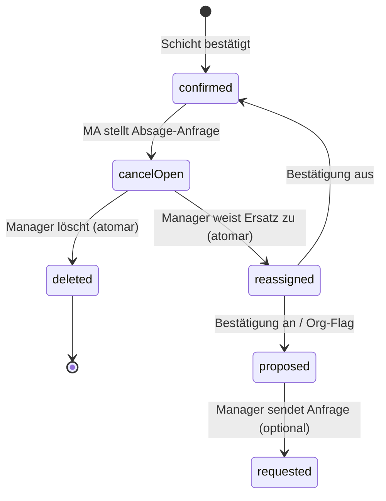

# Specification: Mitarbeiter-Absage von Schichten (Employee Shift Cancellation)

**Version:** 1.0  
**Status:** Freigegeben zur Implementierung  
**Quelle:** `Specs/014-employee-shift-cancellation-brainstorming.md` (Runden 1–3)  
**Scope:** Mobile-App (MA) + Web-App (Manager) + Backend/DB — End-to-End-Kernpfad inkl. Kalender-Sync

**Abhängigkeit:** Schichtbestätigung / Lifecycle (`shift_requests`, `resolveShiftCardDisplayState`) — siehe `docs/shift-statuses.md`, Spec 008/010.

---

## 1. Ziel

Ein Mitarbeiter kann eine **bestätigte, zukünftige** Schicht kurzfristig **absagen**. Die Absage ist eine **Anfrage** — die Schicht bleibt planerisch gültig, bis der Manager reagiert. Der Manager sieht die Absage in der **Glocke** und im Schicht-Stati-Tab **„MA abgesagt“** und bearbeitet sie durch **„Ersatz zuweisen“** oder **„Schicht löschen“** (kein separater Schritt „Absage bestätigen“).

Nach erfolgreicher Manager-Aktion:

- Eintrag verschwindet aus Tab und Glocke
- Kalenderkarten in Dashboard, Bereich-Kalender, Wochentray und Drilldown spiegeln das Ergebnis
- Die Schicht verschwindet aus dem Wochenplan des ursprünglichen MA (Push + Refresh)

**Abgrenzung:** **MA absagt** (Anfrage → Inbox) vs. **Manager storniert** (sofortige Storno-Aktion + Push an MA) — getrennte Begriffe und Flows.

---

## 2. Entscheidungsübersicht

| Bereich | Entscheidung | Quelle |
|---------|--------------|--------|
| Prozessmodell | Zwei Phasen intern; Manager-UI **ein Schritt** (Löschen/Ersatz) | Q1=A, Q11=A |
| Schicht-Stati-Tab | Offene MA-Absagen im Tab **„MA abgesagt“** bis Folgeaktion | Q2=B |
| Manager-Buttons | **„Ersatz zuweisen“**, **„Schicht löschen“** — kein „Absage bestätigen“ | Q3, Q5, Q11, Q12 |
| Glocke erstellt | Bei MA-Absage-Anfrage | Q4 |
| Glocke entfernt | Nach erfolgreichem **Löschen** oder **Ersatz** | Q4=B |
| Kalenderkarte (offen) | Weiter **bestätigt** + Overlay **„Absage angefragt“** | Q6=B |
| Mobile-Label (wartend) | **„Absage gesendet“**, orange Overlay + Uhr | Q7=A |
| MA-Plan | Schicht sichtbar bis Manager-Aktion; danach automatisch weg | Q8=A, Q31=A |
| Rückzug | **Nicht** möglich | Q9=A |
| Absagbare Stati | Nur **`confirmed`** | Q10=A |
| Ersatz-Flow | Wie bei **Abgelehnt** (Zuweisungs-Modal) | Q13=A |
| Ersatz-Daten | **Gleiche Schicht-ID**, `employee_id` wechselt | Q14=A |
| Glocke Deep-Link | Schicht-Stati → Tab MA abgesagt, Schicht vorausgewählt | Q15=A |
| Push an MA | **Nur** nach Abschluss (Löschen/Ersatz) | Q16=A |
| Listen-Badge | **„Absage offen“** | Q23=A |
| Statuswechsel DB | **Atomar** mit Folgeaktion; kein sichtbarer `canceled`-Zwischenstopp | Q24=A |
| Request-Abschluss | `cancellation` → **`approved`** bei Löschen oder Ersatz | Q25=A |
| Mobile-Sync | Push + Pull-to-refresh / Tab-Fokus | Q26=A |
| Race / Doppelklick | Idempotent, klare Fehlermeldungen | Q27=A |
| Ampel / Füllstand | Schicht zählt weiter als **besetzt** bis Folgeaktion | Q28=A |
| Absagegrund | **Optional** Freitext (max. 200 Zeichen) | Q29=B |
| MA-Nachrichten-Log | Eintrag nur bei **Abschluss** | Q30=A |
| `employee_dismissed_at` | Für MA-Absage-Flow entfällt; nur Restfälle (Manager-Storno) | Q31=A |
| Bestätigung AUS | Gleicher MA-Absage-Flow | Q32=A |
| MVP | Kernpfad + Kalender-Sync; Bulk-Löschen inkludiert | Q20, Q33 |
| Parität Einstiege | Schicht-Stati, Bereich-Kalender, Dashboard (Tray, Drilldown, Staffing-Modals) | Q21=A |
| MA vs. Manager | Getrennte Begriffe und Flows | Q22=A |

---

## 3. Status-Automat

### 3.1 Sichtbarer Ablauf (vereinfacht)



### 3.2 Interne DB-Zustände

| Phase | `shifts.confirmation_status` | `shifts.lifecycle_status` | `shift_requests` (cancellation) | Manager sieht |
|-------|------------------------------|---------------------------|----------------------------------|---------------|
| Normal | `confirmed` | `confirmed` | — | Bestätigte Karte |
| **Offene Absage** | `confirmed` | `confirmed` | `pending`, `cancelled_by: employee` | Overlay „Absage angefragt“, Tab „MA abgesagt“, Glocke |
| **Nach Löschen** | *(Zeile gelöscht)* | — | `approved` | Karte weg, Tab/Glocke weg |
| **Nach Ersatz** | `proposed` oder `confirmed`* | `planned` oder `confirmed`* | `approved` | Karte mit neuem MA, Tab/Glocke weg |

\* Je nach `shift_confirmation_enabled` und ob Manager danach „Bestätigung anfordern“ sendet — gleiche Regeln wie bei Reassign ab `rejected`.

**Wichtig (Q24):** Es gibt **keinen** sichtbaren Zwischenzustand `canceled` im MA-Absage-Flow. Löschen und Ersatz bestätigen die Absage-Anfrage **implizit** in derselben Transaktion.

### 3.3 Übergangsregeln

| Auslöser | DB-Wirkung | Akteur |
|----------|------------|--------|
| MA „Schicht absagen“ + Bestätigung | `shift_requests`: `cancellation` / `pending`; Schicht unverändert `confirmed`; Manager-Notification | Employee |
| Manager „Schicht löschen“ | Request → `approved`; Event; Schicht **gelöscht**; Glocke dismissed; Push an MA | Manager |
| Manager „Ersatz zuweisen“ + Speichern | Request → `approved`; `employee_id` neu; Status Reset (`proposed`/`confirmed`); Push an neuen MA ggf. separat; Push an alten MA (Abschluss); Glocke dismissed | Manager |
| Zweite MA-Absage | Fehler: „Absage wurde bereits angefragt.“ | — |
| Manager-Aktion auf erledigter Schicht | Fehler: „Schicht nicht verfügbar“ / „Keine offene Absage“; UI schließt Modal | — |

---

## 4. Mobile-App (Mitarbeiter)

### 4.1 Einstieg

- Wochenanzeige → Schichtkarte antippen → **Slide-in** (Action Sheet)
- Aktion **„Schicht absagen“** nur wenn:
  - `confirmation_status === 'confirmed'`
  - Schichtdatum **und** Startzeit in der Zukunft (Org-Zeitzone)
  - Keine offene Absage (`cancellationPending !== true`)

`requested` / `pending` / `rejected` / `proposed` / `canceled`: **kein** „Schicht absagen“ — bei offener Bestätigung weiter **Ablehnen** nutzen.

### 4.2 Absage senden

1. Tap **„Schicht absagen“**
2. **Bestätigungsdialog** (destructive): Titel „Schicht absagen“, Text „Möchtest du diese Schicht wirklich absagen?“
3. Optional (Q29): Freitextfeld **Absagegrund** (max. 200 Zeichen, nicht Pflicht)
4. API-Aufruf `cancelConfirmationShift`
5. **Erfolgsmodal**: Titel „Absage gesendet“, Text „Deine Absage wurde übermittelt und muss vom Team bestätigt werden.“ (Copy anpassen: Team bearbeitet Löschen/Ersatz — kein „bestätigen“ durch MA sichtbar)

### 4.3 Darstellung wartender Absage (Phase offen)

- Schicht **bleibt** im Wochenplan
- Orange **Overlay** auf der Karte
- Label: **„Absage gesendet“** (`shiftConfirmation.status.cancellationSent`)
- Uhr-Symbol im Overlay
- Slide-in: kein erneutes „Schicht absagen“; Status-Label „Absage gesendet“
- **Kein** Rückzug (Q9)

### 4.4 Nach Manager-Aktion

- Schicht **automatisch** aus Wochenplan entfernt (kein „Aus Plan entfernen“ nötig — Q31)
- **Push** an MA: z. B. „Deine Schicht am DD.MM. (HH:MM–HH:MM) wurde entfernt.“
- Beim Öffnen/Refresh: Wochenplan neu laden (Q26)
- **Nachrichten-Log:** ein Eintrag bei Abschluss (Q30), nicht bei Absage senden

### 4.5 API

Bestehende Mobile-Route erweitern/beibehalten:

- `POST /api/mobile/confirmations/.../cancel` (o. ä.) — Body optional: `{ reason?: string }` (max. 200 Zeichen)
- Response enthält aktualisierten Display-State mit `cancellationPending: true`

---

## 5. Web-App (Manager)

### 5.1 Benachrichtigung (Glocke)

| Feld | Wert |
|------|------|
| Erstellt | Sofort bei MA-Absage-Anfrage |
| Typ | `employee_shift_canceled` (bestehend) |
| Titel | „Schicht abgesagt: {Name}“ |
| Body | „{Name} hat eine geplante Schicht abgesagt.“ |
| Payload | `shift_id`, `employee_id`, `employee_name`, `shift_date`, `canceled_by: employee` |
| Deep-Link | Schicht-Stati-Modal öffnen, Tab **`canceled`** (Label „MA abgesagt“), `preselectedShiftIds: [shiftId]` |
| Entfernt | Wenn Löschen oder Ersatz **erfolgreich** (Q4=B) — Notification als gelesen/erledigt markieren oder löschen |

### 5.2 Schicht-Stati — Tab „MA abgesagt“

**Inhalt:** Alle Schichten mit offener Mitarbeiter-Absage (`hasPendingEmployeeCancellation(displayState)`), unabhängig davon ob `confirmation_status` noch `confirmed` ist.

**Listenzeile:**

- Mitarbeiter, Datum, Zeit, Bereich, Vorlage
- Badge: **„Absage offen“** (neuer i18n-Key)
- Optional: gekürzter Absagegrund aus Request-`payload`, falls vorhanden

**Buttonleiste (Mehrfachauswahl):**

| Aktion | Auswahl | Verhalten |
|--------|---------|-----------|
| **Ersatz zuweisen** | Genau **1** Schicht | Öffnet bestehendes Zuweisungs-Modal (wie `rejected`) |
| **Schicht löschen** | **1..n** Schichten | Bulk-Löschen mit Bestätigungsdialog |

**Entfernt aus UI:** Aktion **„Absage bestätigen“** (`confirmCancellation`) — wird durch Löschen/Ersatz ersetzt (Q11).

### 5.3 Kalenderkarten (Dashboard + Bereich-Kalender)

Während offener MA-Absage:

- Basisstatus weiter **„Bestätigt“** (kein Badge-Wechsel auf Abgesagt)
- Zusätzliches Overlay: **„Absage angefragt“** (Web-i18n, z. B. `shiftConfirmation.status.cancellationPending` oder eigener Tooltip-Key)
- Tooltip erwähnt offene MA-Absage
- **Ampel:** Schicht zählt weiter als besetzt (Q28)

**Kontextmenü** (Parität Q12, Q21):

- **Ersatz zuweisen**
- **Schicht löschen**

Gleiche Aktionen in:

- Bereich-Kalender (Kontextmenü)
- Dashboard-Wochentray / Drilldown / Staffing-Window-Issues-Modal / Area-Assignment-Overview — überall wo `canceled`-Tab-Aktionen heute schon angebunden sind

**Nicht** im Kontextmenü bei offener MA-Absage: „Schicht stornieren“ (Manager-Storno) — Storno bleibt separater Flow für bestätigte Schichten **ohne** offene MA-Anfrage.

### 5.4 Manager „Schicht löschen“

Atomare Transaktion:

1. Offene `cancellation`/`pending`-Request prüfen (`cancelled_by: employee`)
2. Request → `approved`, `responded_at` setzen
3. `shift_confirmation_events`: Eintrag mit `canceled_by: employee`, `source: manager_resolve_delete`
4. Schicht **hard delete** (bestehende Lösch-Logik)
5. Manager-Notifications für diese Absage auflösen
6. Push/Outbox an MA: Schicht entfernt

### 5.5 Manager „Ersatz zuweisen“

Atomare Transaktion (nach Speichern im Zuweisungs-Modal):

1. Offene Cancellation-Request prüfen
2. Request → `approved`
3. `employee_id` auf neuen MA setzen
4. Bestätigungsstatus zurücksetzen:
   - `shift_confirmation_enabled=true` → `proposed` (ggf. `requested` nach explizitem Senden)
   - `shift_confirmation_enabled=false` → `confirmed`
5. `lifecycle_status` analog (`planned` / `confirmed`)
6. Offene `confirmation`-Requests der alten Zuweisung canceln (bestehende Reassign-Logik)
7. Event + Notification-Cleanup + Push an **alten** MA (Abschluss)

Neuer MA: normaler Bestätigungsflow falls Feature an.

### 5.6 Manager-Storno (unverändert, Q22)

- Begriff: **„Schicht stornieren“** (nicht „absagen“)
- Erscheint **nicht** im Tab „MA abgesagt“
- Bei `confirmed` ohne offene MA-Absage: Manager-Storno → `canceled` oder Löschen + Push an MA
- Wenn offene MA-Absage existiert: nur Inbox-Flow (Löschen/Ersatz), kein paralleles Storno

---

## 6. Datenmodell

### 6.1 Keine Schema-Migration Pflicht

Bestehende Tabellen reichen:

- `shifts` — `confirmation_status`, `lifecycle_status`, `employee_dismissed_at` (für MA-Absage-Flow nach Abschluss irrelevant)
- `shift_requests` — `type: cancellation`, `status: pending | approved`
- `shift_confirmation_events` — Audit
- `manager_notifications` — Glocke
- `notification_outbox` — Push an MA

### 6.2 Request-Payload (Erweiterung)

```typescript
// shift_requests.payload bei cancellation
{
  cancelled_by: "employee";
  source: "mobile_cancel";
  reason?: string; // max 200, optional (Q29)
}
```

### 6.3 Display-State

`resolveShiftCardDisplayState` liefert bei offener Anfrage:

```typescript
openCancellation: {
  requestId: string;
  status: "pending";
  cancelledBy: "employee";
}
```

`hasPendingEmployeeCancellation(displayState) === true`

Mobile-Wochen-API: `cancellationPending: true` solange Request offen.

### 6.4 Code-Änderungen (Orientierung)

| Bereich | Änderung |
|---------|----------|
| `communication-tab-actions.ts` | Tab `canceled`: `["reassign", "delete"]` — **`confirmCancellation` entfernen** |
| `shift-card-context-menu-actions.ts` | Offene MA-Absage: Menü wie Tab; kein `confirmCancellation` |
| `approveEmployeeShiftCancellation` | In **resolve-Delete** und **resolve-Reassign** integrieren, nicht als eigener UI-Schritt |
| `EmployeeCancellationConfirmModal` | **Entfernen** oder nur intern, nicht manager-sichtbar |
| `communication-hub.ts` | Gruppierung: `hasPendingEmployeeCancellation` → Tab `canceled` (besteht) |
| `docs/shift-statuses.md` | Abschnitt MA-Absage auf Anfrage-Modell aktualisieren |

---

## 7. i18n (DE maßgeblich, EN parallel)

| Key (Vorschlag) | DE | EN |
|-----------------|----|----|
| `shiftConfirmation.status.cancellationSent` | Absage gesendet | Cancellation sent |
| `shiftConfirmation.status.cancellationPending` | Absage angefragt | Cancellation requested |
| `shiftConfirmation.hub.badgeCancellationOpen` | Absage offen | Cancellation open |
| `shiftConfirmation.cancel.reasonLabel` | Grund (optional) | Reason (optional) |
| `shiftConfirmation.cancel.reasonPlaceholder` | Kurz angeben … | Brief reason … |
| `shiftConfirmation.mobile.cancelSuccessTitle` | Absage gesendet | Cancellation sent |
| `shiftConfirmation.mobile.cancelSuccessBody` | Deine Absage wurde übermittelt. Das Team kümmert sich um die weiteren Schritte. | Your cancellation was submitted. The team will handle next steps. |
| `shiftConfirmation.notify.employeeShiftRemoved` | Deine Schicht am {date} ({time}) wurde entfernt. | Your shift on {date} ({time}) was removed. |

**Entfernen/deprecated:** UI-Strings für `actionConfirmCancellation` als Manager-Button (Server-Fehlermeldungen dürfen intern bleiben).

---

## 8. Randfälle & Fehler

| Szenario | Verhalten |
|----------|-----------|
| MA absagt zweimal | HTTP/Action-Fehler: „Absage wurde bereits angefragt.“ |
| Manager A + B parallel | Zweite Aktion scheitert; Modal schließt; Toast mit Fehler |
| Schicht in Vergangenheit | MA: Absage blockiert; Manager: Löschen/Ersatz blockiert |
| Org ohne Schichtbestätigung | MA-Absage-Flow **identisch** (Q32) |
| Manager löscht Schicht ohne Absage-Request | Normales Löschen (kein Cancellation-Request) |
| Netzwerkfehler Mobile | Fehlermodal „Absage fehlgeschlagen“; kein lokaler Pending-State |

---

## 9. Abnahme / MVP (Q33)

### 9.1 Manueller Testplan

- [ ] MA: bestätigte Zukunftsschicht → absagen (+ optional Grund) → Overlay „Absage gesendet“
- [ ] Manager: Glocke erscheint → Klick → Schicht-Stati / MA abgesagt / Vorauswahl
- [ ] Kalender: Overlay „Absage angefragt“ auf Karte; Ampel unverändert besetzt
- [ ] Manager: **Schicht löschen** → Karte weg überall; Glocke weg; MA-Plan weg nach Refresh/Push
- [ ] Manager: **Ersatz zuweisen** → neuer MA auf Karte; alter MA Plan weg; Glocke weg
- [ ] Bulk: zwei Absagen → Bulk-Löschen
- [ ] Parität: Aktionen aus Bereich-Kalender-Kontextmenü und Dashboard-Staffing-Modal
- [ ] Manager-Storno ohne MA-Absage: unverändert, nicht im Tab MA abgesagt
- [ ] `shift_confirmation_enabled=false`: gleicher Absage-Flow

### 9.2 Automatisierte Tests (empfohlen)

| Datei / Bereich | Inhalt |
|-----------------|--------|
| `shift-display-state.test.ts` | `hasPendingEmployeeCancellation`, Overlay-Logik |
| `communication-hub.test.ts` | Gruppierung offener Absagen → Tab `canceled` |
| `communication-tab-actions.test.ts` | Kein `confirmCancellation`; `reassign` + `delete` |
| `shift-card-context-menu-actions.test.ts` | Menü bei pending cancellation |
| DB-Integration | Atomares Resolve-Delete / Resolve-Reassign |

E2E optional (nicht MVP-Pflicht).

---

## 10. Nicht im Scope (v1)

- Absage-Rückzug durch MA
- Pflicht-Absagegründe / vordefinierte Liste
- Realtime-Subscriptions Mobile
- Analytics / Reporting Absage-Statistiken
- Separater Tab „Absage angefragt“
- Sichtbarer Zwischenstatus `canceled` vor Folgeaktion
- Kandidaten-Modal als Pflicht vor Ersatz (nur bestehendes Zuweisungs-Modal)

---

## 11. Referenzen

- Brainstorming: `Specs/014-employee-shift-cancellation-brainstorming.md`
- Status-Referenz: `docs/shift-statuses.md`
- Bestehende Logik: `packages/database/src/shift-request-writes.ts`, `shift-display-state.ts`, `shift-cancellation.ts`
- Web: `communication-hub.ts`, `communication-tab-actions.ts`, `shift-card-context-menu-actions.ts`
- Mobile: `apps/mobile/app/(tabs)/index.tsx`, `week-shift-card-confirmation-overlay.tsx`
