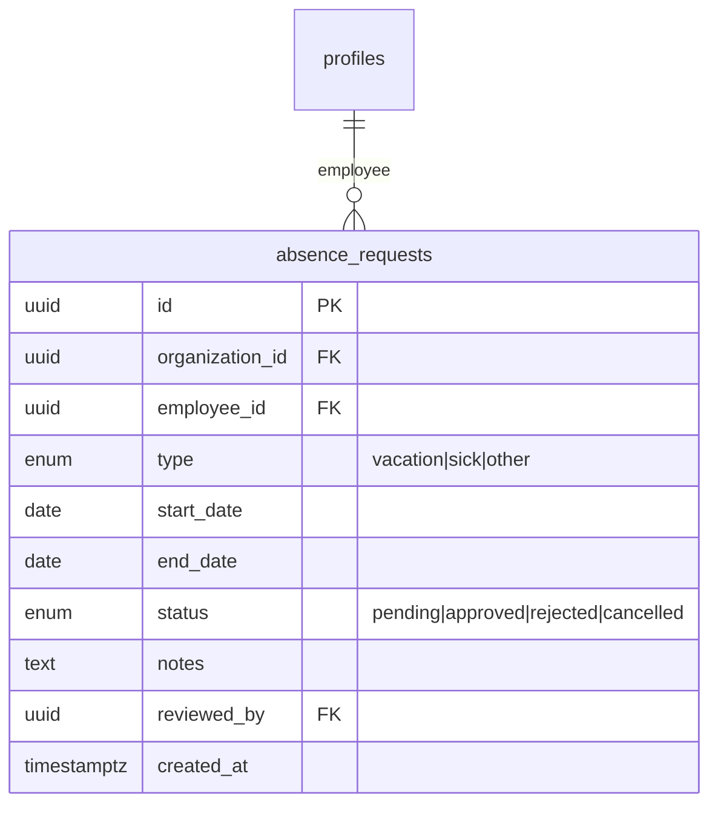
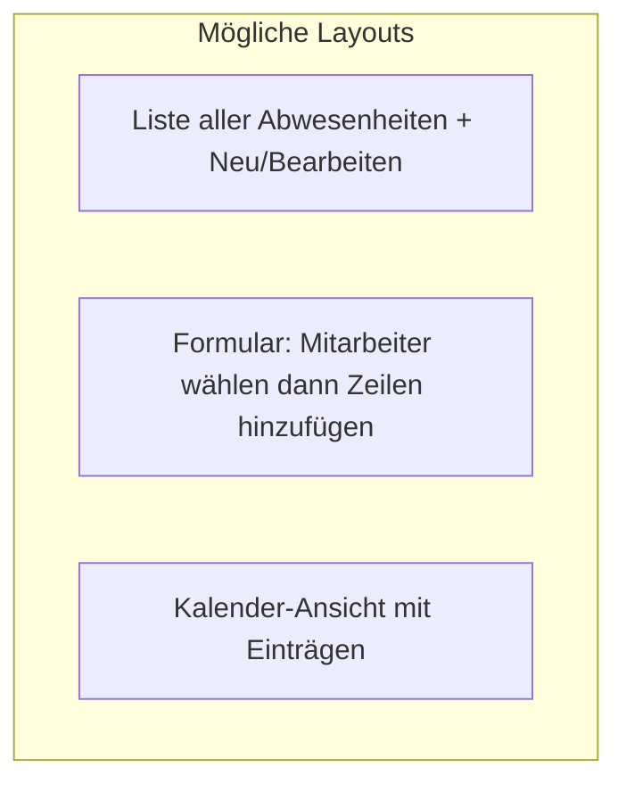
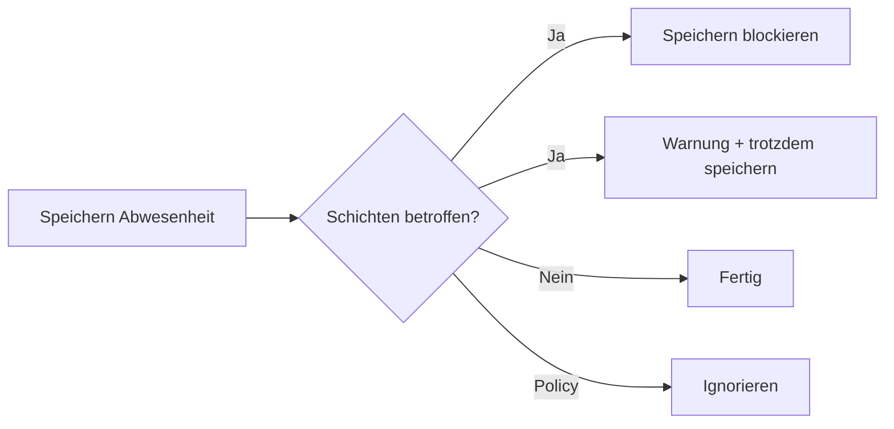
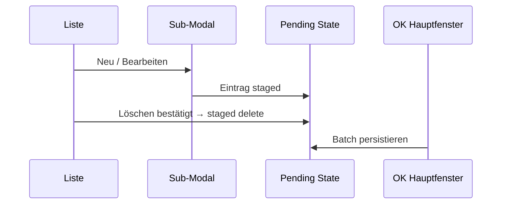
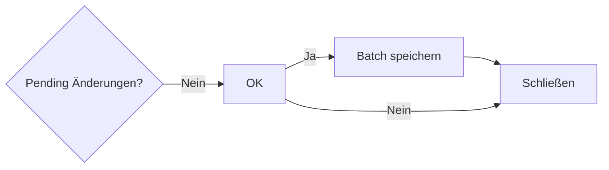

# Brainstorming: Abwesenheiten unter Einstellungen

**Status:** Round 1 — offen  
**Kontext:** Unter „Einstellungen“ (Sidebar) soll unten eine neue Unteroption **Abwesenheiten** erscheinen. Klick öffnet ein Fenster zum Festlegen von Mitarbeiter-Abwesenheiten (Urlaub, Krankheit, …). **OK** speichert, **Abbrechen** verwirft.

**Bestand im Projekt (relevant für Entscheidungen):**

- Tabelle `public.absence_requests` existiert bereits in `packages/database/schema.sql`
- Hauptnavigation enthält separaten Link `/abwesenheiten` (Platzhalter-Seite)
- Andere Einstellungs-Dialoge (Profile, Schichtarten, …) öffnen per URL-Query auf `/dashboard` (z. B. `?profiles=1`) als Vollbild-Modal

---

## Round 1 — Datenmodell, Scope & Einstieg

### Q1 — Soll die **bestehende** Tabelle `absence_requests` verwendet werden oder eine **neue** Supabase-Tabelle angelegt werden?

- [x] **A)** Bestehende `absence_requests` wiederverwenden und ggf. per Migration erweitern ⭐ **empfohlen** (Schema, RLS und Enum-Typen existieren bereits)  
- [ ] **B)** Neue Tabelle (z. B. `employee_absences`) unabhängig von `absence_requests`  
- [ ] **C)** Bestehende Tabelle nur lesen; Schreiben in neue Tabelle  
- [ ] **D)** Erst evaluieren — du entscheidest nach Round 1 in der Spec

**Deine Antwort:**

---

### Q2 — Wie verhält sich das neue Fenster zur **Hauptnavigations-Seite** `/abwesenheiten`?

- [ ] **A)** Nur Einstellungs-Modal; Nav-Seite `/abwesenheiten` bleibt Platzhalter / später  
- [ ] **B)** Einstellungs-Modal **und** Nav-Seite zeigen dieselbe Funktionalität (zwei Einstiege) ⭐ **empfohlen** (Manager braucht oft beides: Schnellzugriff + dedizierte Seite)  
- [x] **C)** Nav-Seite `/abwesenheiten` entfernen/umleiten auf Dashboard-Einstellungen  
- [ ] **D)** Nav-Seite = Kalender/Übersicht; Einstellungen = CRUD-Verwaltung (getrennte Rollen)

**Deine Antwort:**

---

### Q3 — **Technischer Einstieg** für das Einstellungs-Fenster (analog zu Profile, Schichtarten)?

- [x] **A)** URL-Query auf Dashboard: `?abwesenheiten=1` + Modal-Overlay in `dashboard-view` ⭐ **empfohlen** (konsistent mit bestehendem Muster)  
- [ ] **B)** Eigene Route `/einstellungen/abwesenheiten`  
- [ ] **C)** Route `/abwesenheiten` mit eingebettetem Settings-Layout  
- [ ] **D)** Modal ohne URL-Parameter (nur Client-State)

**Deine Antwort:**

---

### Q4 — **Wer** darf Abwesenheiten im Einstellungs-Fenster anlegen/bearbeiten/löschen?

- [x] **A)** Nur **Manager/Admin** (wie andere Einstellungen) ⭐ **empfohlen**  
- [ ] **B)** Manager + Mitarbeiter (basic) für **eigene** Abwesenheiten  
- [ ] **C)** Nur Admin  
- [ ] **D)** Manager legt fest; Mitarbeiter reichen Anträge ein (Workflow)

**Deine Antwort:**

---

### Q5 — **Abwesenheits-Typen** — wie flexibel?

*(Aktuell DB-Enum: `vacation`, `sick`, `other`)*

- [x] **A)** Feste drei Typen (Urlaub, Krank, Sonstiges) — UI nutzt i18n-Labels ⭐ **empfohlen** (MVP, passt zum Schema)  
- [ ] **B)** Typen in neuer Stammdaten-Tabelle konfigurierbar (wie Schichtarten)  
- [ ] **C)** Enum erweitern (Migration) um weitere feste Werte (z. B. `training`, `unpaid`)  
- [ ] **D)** Freitext-Typ pro Eintrag

**Deine Antwort:**

---

### Q6 — **Genehmigungs-Workflow** (`status`: pending / approved / rejected / cancelled)?

- [x] **A)** Manager trägt direkt **genehmigte** Abwesenheiten ein (`status = approved`) — kein Antragsworkflow in v1 ⭐ **empfohlen** (einfach, passt zu „festlegen“ in Notizen)  
- [ ] **B)** Einträge starten als `pending`; Manager genehmigt im selben Fenster  
- [ ] **C)** Vollständiger Antrag durch Mitarbeiter + Freigabe durch Manager  
- [ ] **D)** Status-Feld in v1 ignorieren / immer approved

**Deine Antwort:**

---

### Q7 — **UI-Grundstruktur** des Fensters beim ersten Öffnen?

- [x] **A)** **Liste** (Tabelle) aller Abwesenheiten der Organisation + Toolbar „Neu“ / Zeile auswählen → Detail/Formular ⭐ **empfohlen** (wie Profile, Schichtarten)  
- [ ] **B)** Direkt **Einzelformular** (ein Mitarbeiter, ein Datumsbereich) — Liste kommt später  
- [ ] **C)** **Zwei Spalten:** links Mitarbeiter, rechts Abwesenheiten des Gewählten  
- [ ] **D)** Kalender-Monatsansicht als Haupt-UI

**Deine Antwort:**

---

*Round 2 folgt nach deinen Antworten (Felder pro Eintrag, Datumslogik, Konflikte mit Schichten, OK/Abbrechen-Semantik, Löschen, Schema-Erweiterungen).*

---

## Round 1 — Entscheidungen (Zusammenfassung)

| Frage | Gewählt |
|-------|---------|
| Q1 | **A** — `absence_requests` wiederverwenden |
| Q2 | **C** — Nav `/abwesenheiten` entfernen/umleiten |
| Q3 | **A** — `?abwesenheiten=1` auf Dashboard |
| Q4 | **A** — nur Manager/Admin |
| Q5 | **A** — feste Typen Urlaub / Krank / Sonstiges |
| Q6 | **A** — direkt `approved`, kein Antragsworkflow v1 |
| Q7 | **A** — Liste + Neu/Bearbeiten |

---

## Round 2 — Felder, Speichern, Datumslogik & Konflikte

### Q8 — Was bedeutet **OK / Abbrechen** im Hauptfenster konkret?

*(Andere Einstellungs-Modals speichern oft sofort pro Aktion; deine Notiz verlangt OK/Abbrechen unten rechts.)*

- [x] **A)** **Sammel-Speichern:** Änderungen in der Session sind „dirty“; **OK** persistiert alle pending Änderungen, **Abbrechen** verwirft alles und schließt ⭐ **empfohlen** (passt zu OK/Abbrechen-Notiz)  
- [ ] **B)** **Sofort-Speichern:** Neu/Bearbeiten/Löschen speichert direkt in Sub-Dialogen; OK schließt nur das Fenster  
- [ ] **C)** OK speichert **nur** den aktuell markierten Eintrag; Abbrechen verwirft nur den offenen Detail-Dialog  
- [ ] **D)** Wie Profile-Modal: kein OK — nur Schließen (X); Abbrechen in Sub-Formularen

**Deine Antwort:**

---

### Q9 — Welche **Felder** hat ein Abwesenheits-Eintrag in v1?

| Feld | Im Schema vorhanden |
|------|---------------------|
| Mitarbeiter | `employee_id` |
| Typ | `type` |
| Von / Bis (Datum) | `start_date`, `end_date` |
| Notiz | `notes` |
| Status | `status` (fix `approved`) |

- [x] **A)** Genau diese Felder — sonst nichts ⭐ **empfohlen** (MVP)  
- [ ] **B)** Zusätzlich **Halbtag** (vormittags/nachmittags) — Schema-Migration nötig  
- [ ] **C)** Zusätzlich **Uhrzeit** von/bis (Teil-Tag granular)  
- [ ] **D)** Zusätzlich **Anhang** (Attest o. Ä.)

**Deine Antwort:**

---

### Q10 — **Datums-Logik:** wie werden Start- und Enddatum interpretiert?

- [x] **A)** Beide Tage **inklusiv** (Urlaub Mo–Fr = 5 Tage; `start_date` und `end_date` im UI als Date-Picker) ⭐ **empfohlen**  
- [ ] **B)** Enddatum **exklusiv** (Ende = erster Tag zurück)  
- [ ] **C)** Nur Einzeltage (`start_date = end_date`); Mehr-Tages via mehrere Einträge  
- [ ] **D)** Wie A, plus Anzeige **Anzahl Tage** in der Liste

**Deine Antwort:**

---

### Q11 — **Überlappende** Abwesenheiten desselben Mitarbeiters?

- [x] **A)** **Nicht erlaubt** — Validierung beim Speichern (neuer Eintrag darf bestehende nicht schneiden) ⭐ **empfohlen**  
- [ ] **B)** Erlaubt — Anzeige aller überlappenden Einträge  
- [ ] **C)** Erlaubt, aber **Warnung** vor OK  
- [ ] **D)** Beim Speichern alten Eintrag **automatisch kürzen/ersetzen**

**Deine Antwort:**

---

### Q12 — **Konflikt** mit bereits geplanten **Schichten** im Abwesenheitszeitraum?

- [x] **A)** **Warnung** anzeigen, Speichern trotzdem möglich ⭐ **empfohlen** (Manager entscheidet)  
- [ ] **B)** Speichern **blockieren**, solange Schichten existieren  
- [ ] **C)** Speichern erlaubt **und** betroffene Schichten automatisch entfernen  
- [ ] **D)** In v1 **keine** Schicht-Prüfung

**Deine Antwort:**

---

### Q13 — **Liste:** Spalten & Mitarbeiter-Darstellung?

- [x] **A)** Spalten: Mitarbeiter (mit **Farb-Swatch**), Typ, Von, Bis, Notiz (gekürzt) + optional Sortierung nach Datum ⭐ **empfohlen**  
- [ ] **B)** Wie A + Spalte **Status** (für spätere Erweiterung sichtbar lassen)  
- [ ] **C)** Wie A + **Filter** (Mitarbeiter, Typ, Datumsbereich) in v1  
- [ ] **D)** Minimal: nur Mitarbeiter + Datumsbereich + Typ

**Deine Antwort:**

---

### Q14 — **Anlegen/Bearbeiten:** UI-Flow?

- [x] **A)** Toolbar **„Neu“** → Sub-Modal/Panel (Formular); Zeile klicken → gleiches Formular im Edit-Modus ⭐ **empfohlen** (wie Profile-Form-Modal)  
- [ ] **B)** Inline-Zeile in der Tabelle (Spreadsheet-Stil)  
- [ ] **C)** Rechts permanentes Detail-Panel (Master-Detail)  
- [ ] **D)** Nur „Neu“ — Bearbeiten erst in v2

**Deine Antwort:**

---

### Q15 — **Löschen** von Abwesenheiten?

- [x] **A)** Zeile auswählen → Löschen-Button → **Bestätigungs-Dialog** → bei OK (Hauptfenster) oder sofort persistieren ⭐ **empfohlen** (konsistent mit anderen Einstellungen)  
- [ ] **B)** Hard-Delete sofort ohne Bestätigung  
- [ ] **C)** Soft-Delete (`status = cancelled`) statt physischer Löschung  
- [ ] **D)** Löschen in v1 nicht anbieten

**Deine Antwort:**

---

### Q16 — **Nav `/abwesenheiten` entfernen** (laut Q2=C): gewünschtes Verhalten?

- [x] **A)** Link aus Sidebar **entfernen**; alte URL `/abwesenheiten` → Redirect auf `/dashboard?abwesenheiten=1` ⭐ **empfohlen**  
- [ ] **B)** Link entfernen; `/abwesenheiten` → 404 oder Dashboard ohne Modal  
- [ ] **C)** Link bleibt sichtbar, leitet still weiter  
- [ ] **D)** Link umbenennen, zeigt aber dasselbe Modal

**Deine Antwort:**

---

*Round 3 folgt nach deinen Antworten (Technologie/Server Actions, i18n, Listen-Filter, Pagination, reviewed_by, Migrationen, Abgrenzung Mobile).*

---

## Round 2 — Entscheidungen (Zusammenfassung)

| Frage | Gewählt |
|-------|---------|
| Q8 | **A** — Sammel-Speichern (dirty → OK persistiert) |
| Q9 | **A** — nur Schema-Felder (MA, Typ, Von/Bis, Notiz) |
| Q10 | **A** — Start/Ende inklusiv, Date-Picker |
| Q11 | **A** — keine überlappenden Abwesenheiten pro MA |
| Q12 | **A** — Warnung bei Schicht-Konflikt, Speichern erlaubt |
| Q13 | **A** — Liste mit Farb-Swatch, Typ, Von, Bis, Notiz |
| Q14 | **A** — Neu/Bearbeiten via Sub-Modal |
| Q15 | **A** — Löschen mit Bestätigung |
| Q16 | **A** — Nav-Link weg, Redirect `/abwesenheiten` → `?abwesenheiten=1` |

**Hinweis aus dem Code:** Aktuelle RLS erlaubt `insert` nur für `employee_id = auth.uid()` — Manager können für andere MA **noch nicht** einfügen; `delete`-Policy fehlt. → Round 3 (Q17–Q18).

---

## Round 3 — Technik, RLS, Integration & Randfälle

### Q17 — **Backend-Schicht:** wo liegen Lese-/Schreib-Operationen?

- [x] **A)** Server Actions in `apps/web/src/app/actions/` + Methoden in `packages/database/src/supabase-database.ts` ⭐ **empfohlen** (wie Profile, Schichtarten)  
- [ ] **B)** Nur Server Actions mit direktem Supabase-Client (ohne database-Package)  
- [ ] **C)** Route Handlers (`/api/absences`)  
- [ ] **D)** Client-seitig via Supabase (RLS only)

**Deine Antwort:**

---

### Q18 — **RLS-Migration** für Manager-CRUD (Pflicht für v1)?

*(Aktuell: `absence_insert_own`, `absence_update_manager`; kein Manager-Insert für fremde MA, kein Delete.)*

- [x] **A)** Migration: Manager dürfen **insert/update/delete** für MA **eigener Organisation** (`is_manager_or_owner()`) ⭐ **empfohlen**  
- [ ] **B)** Nur insert + update ergänzen; delete über soft-update (`status = cancelled`)  
- [ ] **C)** Service-Role / Bypass in Server Actions (RLS unverändert)  
- [ ] **D)** Erst in v2 — v1 nur lesen

**Deine Antwort:**

---

### Q19 — Feld **`reviewed_by`** beim Speichern (Status = `approved`)?

- [x] **A)** Beim **OK** (Hauptfenster) auf **eingeloggten Manager** setzen ⭐ **empfohlen**  
- [ ] **B)** Immer `null` in v1  
- [ ] **C)** Nur bei neuen Einträgen setzen; bei Bearbeitung unverändert lassen  
- [ ] **D)** Separates UI-Feld „Genehmigt von“

**Deine Antwort:**

---

### Q20 — **Listen-Umfang:** welche Abwesenheiten werden initial geladen?

- [x] **A)** **Alle** Einträge der Organisation (sortiert nach `start_date` absteigend) ⭐ **empfohlen** (MVP; Pagination erst ab Bedarf)  
- [ ] **B)** Nur **Zukunft + laufend** (Ende ≥ heute)  
- [ ] **C)** Rollierendes Fenster (z. B. ±12 Monate)  
- [ ] **D)** Wie A, aber mit **Pagination** (z. B. 50 pro Seite) ab v1

**Deine Antwort:**

---

### Q21 — **Sammel-Speichern (Q8):** wie verhalten sich Sub-Modal und Löschen?

- [x] **A)** Sub-Modal **Übernehmen** schreibt nur in **lokale Pending-Liste**; DB erst bei Haupt-**OK**; **Abbrechen** (Haupt) verwirft alles ⭐ **empfohlen** (konsistent mit Q8)  
- [ ] **B)** Sub-Modal speichert sofort; Haupt-OK nur schließt  
- [ ] **C)** Löschen sofort in DB; Neu/Bearbeiten staged  
- [ ] **D)** Alles sofort in DB (Q8 ignorieren)

**Deine Antwort:**

---

### Q22 — **Schicht-Konflikt-Warnung (Q12):** wann und wie?

- [x] **A)** Beim **Haupt-OK**, vor Persistenz: Dialog mit Anzahl betroffener Schichten + „Trotzdem speichern“ / „Zurück“ ⭐ **empfohlen**  
- [ ] **B)** Bereits im Sub-Modal nach Datumswahl (live)  
- [ ] **C)** Nur Hinweis-Banner in der Liste, kein blockierender Dialog  
- [ ] **D)** Konflikt-Check erst in v2

**Deine Antwort:**

---

### Q23 — **Dashboard-Integration:** Abwesenheiten vs. Schicht-Zuweisung?

*(Modal „Schicht hinzufügen“ filtert MA nach Verfügbarkeit.)*

- [x] **A)** MA mit **genehmigter** Abwesenheit am Schicht-Tag **nicht** in der Mitarbeiter-Auswahl ⭐ **empfohlen**  
- [ ] **B)** MA erscheint, aber mit Hinweis „Abwesend“  
- [ ] **C)** Keine Auswirkung auf Schicht-Modal in v1  
- [ ] **D)** Wie A + zusätzlich visuell im Kalender (eigene Story)

**Deine Antwort:**

---

### Q24 — **Mobile-App** (`apps/mobile`) in v1?

- [x] **A)** **Nur Web** (Einstellungen); Mobile später ⭐ **empfohlen**  
- [ ] **B)** Mobile: MA sieht **eigene** Abwesenheiten (read-only)  
- [ ] **C)** Mobile: MA kann **Anträge** stellen (`pending`) — widerspricht Q6  
- [ ] **D)** Parität Web + Mobile in v1

**Deine Antwort:**

---

### Q25 — **Schließen ohne Speichern:** Verhalten bei dirty State?

- [x] **A)** **X**, **Abbrechen** und Browser-Zurück → Bestätigung „Ungespeicherte Änderungen verwerfen?“ ⭐ **empfohlen**  
- [ ] **B)** Nur Abbrechen-Button warnt; X schließt still  
- [ ] **C)** Keine Warnung — Abbrechen verwirft still  
- [ ] **D)** Auto-Save-Entwurf (localStorage)

**Deine Antwort:**

---

### Q26 — **Validierung & Fehlermeldungen** (UI)?

- [x] **A)** Pflicht: Mitarbeiter, Typ, Von, Bis; `start_date ≤ end_date`; **Overlap** blockiert mit i18n-Fehlertext ⭐ **empfohlen**  
- [ ] **B)** Wie A + Notiz max. 500 Zeichen  
- [ ] **C)** Wie A, Fehler nur als Toast  
- [ ] **D)** Minimal — DB-Fehler durchreichen

**Deine Antwort:**

---

### Q27 — **i18n:** Namespace für Texte?

- [x] **A)** Neuer Block `settings.absences.*` in `de.ts` / `en.ts` (Sidebar: `nav.absences` existiert bereits) ⭐ **empfohlen**  
- [ ] **B)** Unter `dashboard.*`  
- [ ] **C)** Nur Deutsch in v1  
- [ ] **D)** Freitext-Keys inline im Component

**Deine Antwort:**

---

### Q28 — **DB-Constraint** `start_date` / `end_date`?

- [x] **A)** Migration: `check (start_date <= end_date)` auf `absence_requests` ⭐ **empfohlen**  
- [ ] **B)** Nur App-Validierung, DB unverändert  
- [ ] **C)** Zusätzlich Unique-Index gegen Overlap (DB-seitig)  
- [ ] **D)** Keine Migration nötig

**Deine Antwort:**

---

*Round 4 (final) folgt nach deinen Antworten: Sidebar-Position, leere Liste, Sortierung/Filter optional, Kalender-Darstellung später, Spec-Freigabe. Danach → `specs/001-absences-settings-specification.md`.*

---

## Round 3 — Entscheidungen (Zusammenfassung)

| Frage | Gewählt |
|-------|---------|
| Q17 | **A** — Server Actions + `supabase-database.ts` |
| Q18 | **A** — RLS-Migration Manager insert/update/delete |
| Q19 | **A** — `reviewed_by` = eingeloggter Manager beim OK |
| Q20 | **A** — alle Einträge, sortiert nach `start_date` absteigend |
| Q21 | **A** — Sub-Modal staged; DB beim Haupt-OK |
| Q22 | **A** — Schicht-Konflikt-Dialog beim Haupt-OK |
| Q23 | **A** — abwesende MA aus Schicht-Zuweisung ausschließen |
| Q24 | **A** — nur Web in v1 |
| Q25 | **A** — Warnung bei ungespeicherten Änderungen |
| Q26 | **A** — Pflichtfelder + Overlap blockiert + i18n |
| Q27 | **A** — `settings.absences.*` |
| Q28 | **A** — DB-Check `start_date <= end_date` |

---

## Round 4 (final) — UI-Details, Scope-Grenzen & Spec-Freigabe

### Q29 — **Position** in der Einstellungen-Sidebar?

*(Aktuelle Reihenfolge: Schichtarten → Standorte → Profile → Rollen → Qualifikationen)*

- [ ] **A)** **Ganz unten** als letzter Eintrag unter Qualifikationen ⭐ **empfohlen** (entspricht ursprünglicher Notiz)  
- [ ] **B)** Direkt unter **Profile** (thematisch nah)  
- [ ] **C)** Als erster Einstellungs-Eintrag  
- [ ] **D)** Alphabetisch sortiert

**Deine Antwort:**

---

### Q30 — **Leere Liste** (noch keine Abwesenheiten)?

- [ ] **A)** `SettingsEmptyState` + Hinweis „Neu“-Button oben nutzen ⭐ **empfohlen** (wie andere Einstellungs-Listen)  
- [ ] **B)** Nur leere Tabelle ohne Text  
- [ ] **C)** Empty State + direkt Sub-Modal „Neu“ öffnen  
- [ ] **D)** Beispiel-Eintrag (Demo)

**Deine Antwort:**

---

### Q31 — **Standard-Sortierung** der Liste?

- [ ] **A)** `start_date` **absteigend** (neueste/künftige oben) ⭐ **empfohlen** (konsistent mit Q20)  
- [ ] **B)** `start_date` **aufsteigend** (chronologisch)  
- [ ] **C)** Mitarbeitername A–Z, dann Datum  
- [ ] **D)** Sortierbar per Spaltenkopf in v1

**Deine Antwort:**

---

### Q32 — **Filter** in v1?

*(Q13 wählte Liste ohne Filter.)*

- [ ] **A)** **Kein Filter** in v1 — nur Sortierung ⭐ **empfohlen**  
- [ ] **B)** Einfacher Textfilter (Mitarbeitername)  
- [ ] **C)** Filter Mitarbeiter + Typ  
- [ ] **D)** Filter Mitarbeiter + Typ + Datumsbereich

**Deine Antwort:**

---

### Q33 — **Mitarbeiter-Auswahl** im Sub-Modal: welche Profile?

- [ ] **A)** Alle **aktiven** Profile der Organisation (wie Profile-Liste) ⭐ **empfohlen**  
- [ ] **B)** Nur Mitarbeiter-Rolle (keine Manager)  
- [ ] **C)** Alle Profile inkl. deaktivierter  
- [ ] **D)** Nur MA mit hinterlegter Verfügbarkeit

**Deine Antwort:**

---

### Q34 — **Status-Filter** in der Liste: welche `status`-Werte anzeigen?

*(v1 legt nur `approved` an; alte `pending`-Einträge könnten existieren.)*

- [ ] **A)** Nur **`approved`** anzeigen ⭐ **empfohlen** (v1-Scope)  
- [ ] **B)** Alle Status anzeigen (Spalte Status sichtbar)  
- [ ] **C)** `approved` + `pending`; `rejected`/`cancelled` ausblenden  
- [ ] **D)** Alle laden, aber nicht-approved ausgegraut

**Deine Antwort:**

---

### Q35 — **Sub-Modal** Buttons (Neu/Bearbeiten)?

- [ ] **A)** **Übernehmen** (staged) + **Abbrechen** (Sub-Modal schließen, ohne Pending zu ändern) ⭐ **empfohlen**  
- [ ] **B)** OK + Abbrechen (gleiche Labels wie Hauptfenster)  
- [ ] **C)** Nur Übernehmen; Schließen via X  
- [ ] **D)** Enter = Übernehmen, Escape = Abbrechen (zusätzlich zu Buttons)

**Deine Antwort:**

---

### Q36 — **Hauptfenster-Fußleiste:** OK / Abbrechen Verhalten?

- [ ] **A)** **OK** disabled wenn nicht dirty; enabled → speichern + schließen; **Abbrechen** immer → ggf. Warnung (Q25) ⭐ **empfohlen**  
- [ ] **B)** OK immer enabled (schließt auch ohne Änderung)  
- [ ] **C)** OK speichert, Modal bleibt offen  
- [ ] **D)** Fußleiste wie Profile (kein globales OK) — widerspricht Q8

**Deine Antwort:**

---

### Q37 — **Typ-Darstellung** in der Liste (Urlaub / Krank / Sonstiges)?

- [ ] **A)** Text-Label via i18n ⭐ **empfohlen**  
- [ ] **B)** Text + farbiges Badge (fest definierte Farben pro Typ)  
- [ ] **C)** Nur Icon + Tooltip  
- [ ] **D)** Abkürzung (U/K/S)

**Deine Antwort:**

---

### Q38 — **Kalender-Visualisierung** im Dashboard (später)?

- [ ] **A)** **Nicht** in v1; in Spec als **Out-of-Scope / v2** vermerken ⭐ **empfohlen**  
- [ ] **B)** v1: dezenter Hinweis im MA-Namen wenn abwesend (ohne eigene Zeile)  
- [ ] **C)** v1: eigene Kalender-Markierung (Halbtag-Balken)  
- [ ] **D)** Separate Story „Abwesenheiten im Planungskalender“

**Deine Antwort:**

---

### Q39 — **Löschen-Button** Position?

- [ ] **A)** In der **Fußleiste** der Liste (wie Profile: Papierkorb rechts, nur wenn Zeile selektiert) ⭐ **empfohlen**  
- [ ] **B)** Pro Zeile Inline-Icon  
- [ ] **C)** Im Sub-Modal im Edit-Modus  
- [ ] **D)** Kontextmenü Rechtsklick

**Deine Antwort:**

---

### Q40 — **Spec-Freigabe:** Brainstorming abgeschlossen?

- [ ] **A)** Ja — nach Beantwortung **Specification** erstellen (`specs/001-absences-settings-specification.md`) ⭐  
- [ ] **B)** Noch eine Klärungsrunde (Round 5)  
- [ ] **C)** Spec erstellen, aber markierte offene Punkte als „TBD“  
- [ ] **D)** Spec + grober Implementierungsplan in einem Dokument

**Deine Antwort:**

---

*Nach Q40=A: Schreibe **„Spec erstellen“** — dann wird die Specification aus allen Runden abgeleitet (ohne Implementation).*

