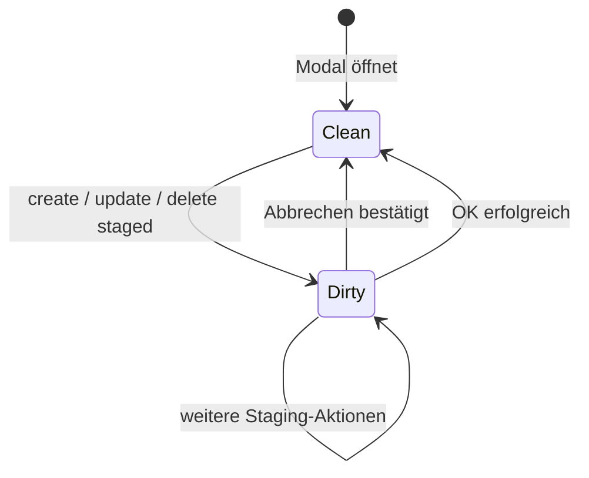

# Specification: Abwesenheiten unter Einstellungen

**Version:** 1.0  
**Status:** Freigegeben zur Implementierung  
**Quelle:** `specs/001-absences-settings-brainstorming.md` (Runden 1–4)  
**Scope:** Web-App (`apps/web`) — Manager/Admin CRUD für Mitarbeiter-Abwesenheiten

---

## 1. Ziel

Manager und Admins können unter **Einstellungen → Abwesenheiten** Abwesenheiten (Urlaub, Krankheit, Sonstiges) für Mitarbeiter der Organisation erfassen, bearbeiten und löschen. Änderungen werden gesammelt im UI vorgehalten und erst mit **OK** in Supabase persistiert; **Abbrechen** verwirft ungespeicherte Änderungen.

Genehmigte Abwesenheiten wirken auf die Schicht-Zuweisung: abwesende Mitarbeiter erscheinen am betroffenen Tag nicht in der Mitarbeiter-Auswahl des Modals „Schicht hinzufügen“.

---

## 2. Entscheidungsübersicht

| Bereich | Entscheidung |
|---------|--------------|
| Datenmodell | Bestehende Tabelle `public.absence_requests` |
| Einstieg | `/dashboard?abwesenheiten=1` + Vollbild-Modal |
| Nav `/abwesenheiten` | Link entfernen; Route redirectet auf Dashboard-Modal |
| Berechtigung | Nur Manager/Admin |
| Typen | Fest: `vacation`, `sick`, `other` (i18n-Labels) |
| Status v1 | Immer `approved` beim Speichern |
| UI | Tabelle + Sub-Modal Neu/Bearbeiten |
| Speichern | Sammel-Speichern (dirty batch) |
| Daten | Start/Ende inklusiv; keine Overlaps pro MA |
| Schicht-Konflikt | Warn-Dialog beim OK; Speichern erlaubt |
| Backend | Server Actions + `supabase-database.ts` |
| RLS | Migration: Manager insert/update/delete für Org |
| Mobile | Out of scope v1 |
| Kalender-UI | Out of scope v1 |

**Runde 4:** Fragen Q29–Q39 wurden nicht einzeln markiert; es gelten die empfohlenen Defaults (konsistent mit Runden 1–3).

---

## 3. Datenmodell

### 3.1 Tabelle `absence_requests` (bestehend)

```sql
-- packages/database/schema.sql (Auszug)
create table public.absence_requests (
  id uuid primary key default gen_random_uuid(),
  organization_id uuid not null references public.organizations (id) on delete cascade,
  employee_id uuid not null references public.profiles (id) on delete cascade,
  type public.absence_type not null,          -- vacation | sick | other
  start_date date not null,
  end_date date not null,
  status public.request_status not null default 'pending',
  notes text,
  reviewed_by uuid references public.profiles (id) on delete set null,
  created_at timestamptz not null default now()
);
```

TypeScript: `AbsenceRequest`, `AbsenceType` in `packages/types/src/index.ts`.

### 3.2 Schema-Migrationen (v1)

1. **Check-Constraint:** `check (start_date <= end_date)` auf `absence_requests`.
2. **RLS-Policies** (ergänzen/ersetzen wo nötig):
   - **Select:** unverändert — MA sieht eigene; Manager/Owner sieht Org.
   - **Insert Manager:** Manager/Owner dürfen Einträge für `employee_id` innerhalb der eigenen `organization_id` anlegen (`is_manager_or_owner()`).
   - **Update Manager:** bestehende Policy beibehalten/angleichen.
   - **Delete Manager:** Manager/Owner dürfen Einträge der eigenen Org löschen.
   - **`absence_insert_own`** kann für zukünftigen Mitarbeiter-Antrag bleiben; v1-UI nutzt Manager-Insert.

Migration-Datei z. B. `packages/database/migrations/YYYYMMDD_absence_manager_crud.sql`; `schema.sql` synchron halten.

### 3.3 Felder pro Eintrag (v1)

| Feld | Pflicht | UI | Persistenz |
|------|---------|-----|------------|
| Mitarbeiter | ja | Combobox (aktive Profile) | `employee_id` |
| Typ | ja | Select | `type` |
| Von | ja | Date-Picker | `start_date` |
| Bis | ja | Date-Picker | `end_date` |
| Notiz | nein | Textarea | `notes` |
| Status | — | nicht editierbar | immer `approved` |
| Genehmigt von | — | nicht sichtbar | `reviewed_by` = eingeloggter Manager beim OK |

Keine Halbtage, Uhrzeiten oder Anhänge in v1.

### 3.4 Datumslogik

- `start_date` und `end_date` sind **beide inklusiv**.
- Ein Tag: `start_date = end_date`.
- Overlap zweier Einträge **desselben** `employee_id` ist verboten (App-Validierung beim Staging und vor Batch-Persistenz). Overlap-Definition: `[start₁, end₁]` schneidet `[start₂, end₂]` wenn `start₁ <= end₂ && start₂ <= end₁` (nur `approved`-Einträge berücksichtigen; staged deletes aus Liste entfernen).

### 3.5 Listen-Filter

- Anzeige nur Einträge mit `status = 'approved'`.
- Alle Einträge der Organisation laden, sortiert nach `start_date` **absteigend**.
- Kein Filter in v1; Pagination erst bei Bedarf.

---

## 4. Navigation & Routing

### 4.1 Einstellungen-Sidebar

- Neuer Eintrag **Abwesenheiten** als **letzter** Unterpunkt unter Einstellungen (nach Qualifikationen).
- Datei: `apps/web/src/components/dashboard/sidebar-nav.tsx`
  - `settingsLinks`: Flag `abwesenheiten`, Label `nav.absences`.
  - `buildSettingsModalUrl`, `settingsModalOpen`, Typ-Union um `abwesenheiten` erweitern.
- i18n: `nav.absences` existiert bereits (`de`/`en`).

### 4.2 Dashboard-Modal

- Query-Parameter: `?abwesenheiten=1` (Woche/Location-Parameter wie bei anderen Settings beibehalten).
- Rendering in `dashboard-view.tsx` analog zu `ProfilesModal`, `ShiftTypesModal`.
- Schließen entfernt Query-Parameter (`closeSettingsModal("abwesenheiten")`).
- `dashboard-header.tsx`: Flag `abwesenheiten` in Settings-Erkennung aufnehmen.

### 4.3 Hauptnavigation `/abwesenheiten`

- Eintrag `{ href: "/abwesenheiten", ... }` aus `NAV_LINKS` in `sidebar-nav.tsx` **entfernen**.
- `apps/web/src/app/(manager)/abwesenheiten/page.tsx`: Redirect auf `/dashboard?abwesenheiten=1` (Next.js `redirect()`).

---

## 5. UI-Spezifikation

### 5.1 Hauptmodal `AbsencesModal`

**Komponente (neu):** `apps/web/src/components/settings/absences-modal.tsx`

Layout orientiert sich an bestehenden Settings-Modals (`profiles-modal.tsx`, `qualifications-modal.tsx`):

- Vollbild-Overlay, Titel via i18n `settings.absences.title`.
- **Liste** (scrollbar, `SettingsEmptyState` wenn leer).
- **Toolbar** oben: Primär „Neu“ (`SettingsPrimaryActionButton` + Plus).
- **Fußleiste Liste:** Bearbeiten (Zeile selektiert), Löschen (Papierkorb rechts, nur bei Selektion) — analog Profile.
- **Fußleiste Modal (unten rechts):** **Abbrechen** | **OK**
  - **OK:** disabled wenn kein dirty state; enabled → Validierung → ggf. Schicht-Konflikt-Dialog → Batch-Speichern → Modal schließen.
  - **Abbrechen:** bei dirty → Bestätigung „Ungespeicherte Änderungen verwerfen?“; sonst schließen.
- **X** und Browser-Zurück: gleiche dirty-Warnung wie Abbrechen.

### 5.2 Listenspalten

| Spalte | Inhalt |
|--------|--------|
| Mitarbeiter | Name + **Farb-Swatch** (`profile.color`) |
| Typ | i18n-Text (`settings.absences.typeVacation` etc.) |
| Von | formatiertes Datum (Locale) |
| Bis | formatiertes Datum |
| Notiz | gekürzt (z. B. max. 40 Zeichen + Ellipse) |

Keine Status-Spalte in v1.

### 5.3 Sub-Modal `AbsenceFormModal`

**Komponente (neu):** z. B. `absence-form-modal.tsx`

- Modus **create** / **edit**.
- Felder: Mitarbeiter (Combobox, alle **aktiven** Org-Profile), Typ (Select), Von/Bis (Date-Picker), Notiz (optional).
- Buttons: **Übernehmen** (validiert, schreibt in pending state, schließt Sub-Modal) | **Abbrechen** (schließt ohne pending zu ändern).
- Validierungsfehler inline am Formular (i18n), nicht nur Toast.

### 5.4 Löschen

1. Zeile in Liste selektieren.
2. Papierkorb in Listen-Fußleiste → `DeleteConfirmModal` (bestehendes Pattern).
3. Bestätigung staged **delete** in pending state (noch nicht in DB).
4. Zeile in UI als entfernt/markiert darstellen bis OK oder Abbrechen.

### 5.5 Pending-State-Modell



Pending-Operationen:

| Op | Daten |
|----|-------|
| `create` | temporäre Client-ID + Felder |
| `update` | bestehende `id` + geänderte Felder |
| `delete` | bestehende `id` |

Beim OK in Reihenfolge ausführen: deletes → updates → creates (oder einheitliche Server-Action mit Transaktionssemantik). Bei Fehler: Fehlermeldung anzeigen, Modal offen lassen, erfolgreiche Ops dokumentieren/rollback je nach Implementierung (mindestens: kein stiller Partial-Success).

### 5.6 Schicht-Konflikt-Dialog

Beim **Haupt-OK**, **vor** Persistenz:

1. Für alle staged creates/updates betroffene `(employee_id, date)` ermitteln (jeder Tag von `start_date` bis `end_date` inklusiv).
2. Gegen bestehende Schicht-Zuweisungen der Org prüfen (Server Action oder DB-Methode).
3. Wenn Konflikte > 0: Dialog mit Anzahl + Kurzinfo; Buttons **Zurück** / **Trotzdem speichern**.
4. Speichern wird **nicht** blockiert (nur gewarnt).

---

## 6. Backend & Server Actions

### 6.1 Database-Layer

Neue Methoden in `packages/database/src/interface.ts` und `supabase-database.ts`, z. B.:

| Methode | Beschreibung |
|---------|--------------|
| `listOrganizationAbsences(organizationId, { status?: 'approved' })` | Alle approved Abwesenheiten |
| `createAbsenceRequest(input)` | Insert mit org, Felder, status, reviewed_by |
| `updateAbsenceRequest(id, input)` | Update Felder + reviewed_by |
| `deleteAbsenceRequest(id)` | Hard delete |
| `countShiftsConflictingWithAbsences(organizationId, ranges[])` | Für Warn-Dialog |

Overlap-Validierung kann in Server Action oder DB-Helper (`absenceRangesOverlap`).

### 6.2 Server Actions

**Datei (neu):** `apps/web/src/app/actions/absences.ts`

| Action | Guard | Beschreibung |
|--------|-------|--------------|
| `fetchOrganizationAbsences` | `requireManager` | Liste für Modal |
| `saveAbsenceBatch` | `requireManager` | creates/updates/deletes in einem Aufruf |
| `checkAbsenceShiftConflicts` | `requireManager` | Konfliktanzahl für Dialog |

Nach erfolgreichem Speichern: `revalidatePath('/dashboard')` (und ggf. Planung).

### 6.3 Dashboard-Daten

- Dashboard-Page lädt Abwesenheiten (approved) für Org mit — entweder direkt an `AbsencesModal` oder separater Fetch im Modal via Server Action beim Öffnen (empfohlen: Fetch beim Modal-Open wie bei dynamischen Panels, oder SSR auf Dashboard-Page wenn konsistent mit anderen Modals).
- **Schicht-Zuweisung:** In `fetchDashboardShiftAssignEmployees` / `available-employees-for-shift.ts` Mitarbeiter ausschließen, wenn am Schicht-Tag (`date`) eine genehmigte Abwesenheit existiert (`start_date <= date <= end_date`).

---

## 7. Berechtigungen

- UI nur für Manager/Admin sichtbar (wie andere Einstellungen).
- Server Actions: `requireManager()` — Fehler bei Unauthorized.
- RLS als zweite Verteidigungslinie (Manager-Policies aus Abschnitt 3.2).

---

## 8. Internationalisierung

Namespace **`settings.absences.*`** in `packages/i18n/src/messages/de.ts` und `en.ts`.

Mindest-Keys:

- `title`, `new`, `edit`, `delete`, `confirmDelete`
- `employee`, `type`, `startDate`, `endDate`, `notes`
- `typeVacation`, `typeSick`, `typeOther`
- `emptyState`, `apply`, `cancel`, `ok`, `unsavedChanges`
- `validation.required`, `validation.endBeforeStart`, `validation.overlap`
- `shiftConflict.title`, `shiftConflict.message`, `shiftConflict.proceed`, `shiftConflict.back`

Sidebar weiterhin `nav.absences`.

---

## 9. Out of Scope (v1)

| Thema | Hinweis |
|-------|---------|
| Mobile-App | Keine UI/API für `apps/mobile` |
| Antragsworkflow | Kein `pending` durch Mitarbeiter, keine Freigabe-UI |
| Kalender-Markierung | Abwesenheiten nicht im Dashboard-Kalender visualisieren |
| Halbtage / Uhrzeiten | Nur Ganztags-Datumsbereiche |
| Anhänge | Keine Dokumente |
| Konfigurierbare Abwesenheitstypen | Feste Enum-Werte |
| Filter / Pagination | Liste ungefiltert, alle approved |
| Automatisches Entfernen von Schichten | Nur Warnung |
| Soft-Delete | Hard delete bei bestätigtem Löschen |

---

## 10. Betroffene Dateien (Implementierung)

### Neu

- `apps/web/src/components/settings/absences-modal.tsx`
- `apps/web/src/components/settings/absence-form-modal.tsx`
- `apps/web/src/app/actions/absences.ts`
- `packages/database/migrations/YYYYMMDD_absence_manager_crud.sql`

### Anpassen

- `apps/web/src/components/dashboard/sidebar-nav.tsx`
- `apps/web/src/components/dashboard/dashboard-view.tsx`
- `apps/web/src/components/dashboard/dashboard-header.tsx`
- `apps/web/src/app/(manager)/dashboard/page.tsx` (optional: Daten für Modal)
- `apps/web/src/app/(manager)/abwesenheiten/page.tsx` (Redirect)
- `packages/database/src/interface.ts`
- `packages/database/src/supabase-database.ts`
- `packages/database/schema.sql`
- `apps/web/src/app/actions/dashboard-shift-assign.ts` und/oder `apps/web/src/lib/available-employees-for-shift.ts`
- `packages/i18n/src/messages/de.ts`, `en.ts`

---

## 11. Akzeptanzkriterien

1. Unter Einstellungen erscheint **Abwesenheiten** ganz unten; Klick öffnet Modal via `?abwesenheiten=1`.
2. Hauptnav-Link `/abwesenheiten` ist entfernt; direkter Aufruf der URL leitet zum Modal weiter.
3. Manager kann Abwesenheit anlegen (MA, Typ, Von, Bis, Notiz optional); Eintrag erscheint in Liste nach **OK**, nicht vorher.
4. **Abbrechen** / **X** mit dirty state zeigt Warnung und verwirft Änderungen.
5. Overlap für denselben MA wird blockiert (Fehlermeldung i18n).
6. `start_date > end_date` wird blockiert (UI + DB-Constraint).
7. Beim OK mit Schicht-Konflikten erscheint Warn-Dialog; Speichern nach Bestätigung möglich.
8. Bearbeiten und Löschen funktionieren über Sub-Modal bzw. Bestätigung + staged delete + OK.
9. `reviewed_by` wird beim Speichern auf aktuellen Manager gesetzt; `status = approved`.
10. Im Modal „Schicht hinzufügen“ sind MA an Tagen mit genehmigter Abwesenheit nicht wählbar.
11. Nicht-Manager sehen das Einstellungs-Modal nicht.
12. Texte DE/EN über `settings.absences.*`.

---

## 12. Testplan (manuell)

- [ ] Modal öffnen/schließen ohne Änderungen (OK disabled).
- [ ] Neu anlegen, Abbrechen → nichts in DB.
- [ ] Neu anlegen, OK → Eintrag in DB, Liste nach Reload.
- [ ] Overlap gleicher MA → Fehler beim Übernehmen.
- [ ] Enddatum vor Startdatum → Fehler.
- [ ] Bearbeiten Typ/Datum, OK → DB aktualisiert.
- [ ] Löschen staged, Abbrechen → Eintrag bleibt.
- [ ] Löschen staged, OK → Eintrag weg.
- [ ] Schicht anlegen an Abwesenheitstag → MA nicht in Liste.
- [ ] Schicht existiert, Abwesenheit anlegen → Warn-Dialog, trotzdem speichern.
- [ ] `/abwesenheiten` → Redirect zum Modal.
- [ ] RLS: Basic-Mitarbeiter kann fremde Abwesenheiten nicht über UI/Actions schreiben.

---

## 13. Referenzen

- Brainstorming: `specs/001-absences-settings-brainstorming.md`
- Schema: `packages/database/schema.sql` (`absence_requests`)
- Typen: `packages/types/src/index.ts` (`AbsenceRequest`)
- UI-Pattern: `apps/web/src/components/settings/profiles-modal.tsx`, `settings-list-ui.tsx`
- Schicht-Zuweisung: `apps/web/src/components/dashboard/dashboard-add-shift-modal.tsx`, `available-employees-for-shift.ts`
