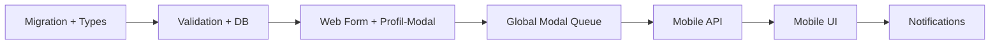

# Specification: Abwesenheiten Phase A+B — Offene Krankmeldung & Mobile Meldung

**Version:** 1.0  
**Status:** Freigegeben zur Implementierung  
**Quelle:** Produkt-Workshop (Chat), aufbauend auf `001-absences-settings-specification.md` (v1, implementiert)  
**Scope:**  
- **Phase A:** Web — erweitertes Manager-CRUD, Profil-SubModal, offenes Ende bei Krankheit, Genehmigungs-Queue  
- **Phase B:** Mobile-App + Mobile-API + Push/Manager-Benachrichtigungen (Mitarbeiter meldet Abwesenheit)

**Nicht in Phase A+B:** Kalender-Markierung im Dashboard/Planer (Phase C), Halbtage, Anhänge, echte FCM/APNs (optional simuliert wie Schichtbestätigung)

---

## 1. Ziel

Organisationen sollen Abwesenheiten auf **zwei Wegen** erfassen können, mit **einem** Datenmodell:

1. **Manager/Admin (Web):** wie v1, erweitert um Profil-Kontext, offene Krankmeldungen und Freigabe ausstehender Anträge.
2. **Mitarbeiter (Mobile):** Krank/Urlaub/Sonstiges melden; Manager erhalten **Push** (über Outbox) und **In-App-Hinweis**.

**Kernproblem Krankheit:** Das Enddatum ist oft unbekannt. Lösung: Typ **`sick`** darf **offenes Ende** haben; Manager oder MA schließen die Meldung später („wieder gesund“).

**Planungswirkung (unverändert zum Grundprinzip):** Nur **`approved`** blockiert Schichtzuweisung und Planer-Zelle „Abwesend“. `pending` ist sichtbar, blockiert nicht hart.

---

## 2. Bezug zu v1 (bereits implementiert)

| v1 | Phase A+B |
|----|-----------|
| Einstellungen → Abwesenheiten (Org-Liste, Batch-OK) | bleibt; erweitert um Status, offenes Ende, Queue |
| Immer `approved` beim Manager-Speichern | Manager kann wählen; MA-Anträge starten als `pending` |
| `start_date` + `end_date` Pflicht | `end_date` optional bei `is_open_ended` |
| Nur approved in Planer | approved blockiert; pending optional als Hinweis (Phase A minimal) |
| Mobile out of scope | Phase B |

---

## 3. Entscheidungsübersicht

| Bereich | Entscheidung |
|---------|--------------|
| Datenmodell | `absence_requests` erweitern: `is_open_ended`, `expected_end_date`, `reported_by`, `updated_at` |
| Offenes Ende | Nur bei Typ **`sick`** (Manager + MA) |
| Urlaub / Sonstiges | `start_date` + `end_date` Pflicht; kein offenes Ende |
| MA-Krank default | Org-Flag **`auto_approve_sick_absence`** (Default **true**) → sofort `approved` |
| MA-Urlaub default | Immer **`pending`** bis Manager genehmigt |
| MA-Sonstiges | **`pending`** (Manager genehmigt) |
| Manager-Erfassung | Weiterhin direkt **`approved`** (wie v1), inkl. offenem Ende bei Krank |
| Overlap | Keine überlappenden **`approved`**- oder **`pending`**-Einträge pro MA |
| Schicht-Konflikt | Warn-Dialog beim Speichern (wie v1); kein Auto-Löschen von Schichten |
| Web Einstieg Profil | SubModal **Abwesenheiten** pro Mitarbeiter in Profileinstellungen |
| Web Einstieg global | Einstellungen → Abwesenheiten: + Tab/Filter **Ausstehend** |
| Mobile | Neuer Tab **Abwesenheit** oder Eintrag unter Profil |
| API | REST unter `apps/web/src/app/api/mobile/absences/` (Pattern wie Confirmations) |
| Push MA → Manager | `notification_outbox` + `manager_notifications` (`type: absence_submitted`) |
| Push Manager → MA | Outbox an MA-Gerät (`absence_approved` / `absence_rejected`) |
| Push Phase B | **Simuliert** in Outbox wenn kein Push-Token; echte Push wenn Infrastruktur vorhanden (gleiches Modell wie Schichtbestätigung) |
| Planer pending | Phase A: **optional** dezenter Hinweis in MA-Zelle (kein Block); Phase C: volle Kalender-Markierung |

---

## 4. Datenmodell

### 4.1 Erweiterung `absence_requests`

```sql
alter table public.absence_requests
  add column if not exists is_open_ended boolean not null default false,
  add column if not exists expected_end_date date,
  add column if not exists reported_by uuid references public.profiles (id) on delete set null,
  add column if not exists updated_at timestamptz not null default now();

-- end_date nullable wenn offen
alter table public.absence_requests
  alter column end_date drop not null;

alter table public.absence_requests
  drop constraint if exists absence_requests_date_range_check;

alter table public.absence_requests
  add constraint absence_requests_date_range_check check (
    (is_open_ended = true and end_date is null)
    or (is_open_ended = false and end_date is not null and start_date <= end_date)
  );

alter table public.absence_requests
  add constraint absence_requests_open_ended_sick_only check (
    is_open_ended = false or type = 'sick'
  );

create trigger absence_requests_updated_at
  before update on public.absence_requests
  for each row execute function public.set_updated_at();
```

**Semantik:**

| Feld | Beschreibung |
|------|--------------|
| `is_open_ended` | `true` = Krankmeldung ohne festes Ende; Planung ab `start_date` täglich abwesend |
| `end_date` | Inklusiv; `null` nur wenn `is_open_ended` |
| `expected_end_date` | Optional, rein informativ („voraussichtlich bis …“); **keine** Planungswirkung |
| `reported_by` | Ersteller (`employee_id` bei MA-Antrag, Manager-Profil bei Manager-Erfassung) |
| `status` | `pending` \| `approved` \| `rejected` \| `cancelled` (bestehendes `request_status`) |

TypeScript (`packages/types/src/index.ts`):

```typescript
export interface AbsenceRequest {
  // … bestehend …
  end_date: string | null;
  is_open_ended: boolean;
  expected_end_date: string | null;
  reported_by: string | null;
  updated_at: string;
}
```

### 4.2 Org-Einstellungen

Neue Spalten auf `organizations` (oder JSON-Settings, falls bevorzugt — hier Spalten):

```sql
alter table public.organizations
  add column if not exists auto_approve_sick_absence boolean not null default true;
```

| Flag | Default | Wirkung |
|------|---------|---------|
| `auto_approve_sick_absence` | `true` | MA-Krankmeldung → sofort `approved`, `reviewed_by` null |

Urlaub bleibt immer genehmigungspflichtig (`pending`).

### 4.3 Datums- und Overlap-Logik

**Tag in Abwesenheit** (`isDateWithinAbsenceRange` — erweitern):

```
start_date <= tag
AND (
  (is_open_ended AND (end_date IS NULL OR tag <= end_date))
  OR (NOT is_open_ended AND tag <= end_date)
)
```

**Overlap** zweier Einträge desselben MA (Status `approved` oder `pending`):

- Geschlossener Bereich `[s₁, e₁]` vs `[s₂, e₂]`: wie bisher `s₁ <= e₂ && s₂ <= e₁`
- Offenes Ende ab `s`: überlappt mit `[s₂, e₂]` wenn `s₂ <= e₁_or_max` und `s <= e₂`  
  Implementierung: offenes Ende als `end_date = '9999-12-31'` **nur intern** in Overlap-Helper, nicht in DB.

**Schließen offener Krankmeldung:**

- Aktion **„Wieder gesund“** → `is_open_ended = false`, `end_date = heute` (oder gewähltes letztes Krankheitstag)
- Aktion **„Verlängern“** → optional `expected_end_date` setzen; oder festes `end_date` + `is_open_ended = false`

### 4.4 RLS (ergänzen)

| Policy | Beschreibung |
|--------|--------------|
| `absence_update_own` | MA darf **eigene** Einträge mit `status IN ('pending', 'approved')` **einschränken** updaten: `cancelled` setzen; bei offener Krankheit `end_date`/`is_open_ended` schließen; **nicht** Typ/Start ändern nach Genehmigung |
| `absence_insert_own` | bestehend; Insert nur `employee_id = auth.uid()`, Org aus Profil |

Manager-Policies (`insert`/`update`/`delete`) unverändert erweitern um neue Felder.

---

## 5. Phase A — Web (Manager/Admin)

### 5.1 Profil-SubModal „Abwesenheiten“

**Einstieg:** Einstellungen → Profile → Detail-Aktion **Abwesenheiten** (neben Verfügbarkeit, Qualifikationen).

**Komponente (neu):** `profile-absences-panel-modal.tsx`

- Liste aller Abwesenheiten **dieses** Mitarbeiters (alle Status, sortiert `start_date` absteigend).
- Toolbar: **Neu**, **Bearbeiten**, **Löschen** (Pattern wie `AbsencesModal`, aber ohne Org-weite Liste).
- Speichern: **sofort** pro Aktion (kein Batch-OK auf Profil-Ebene) **oder** gleiches Batch-Pattern wie v1 — **Empfehlung:** sofort speichern (einfacherer Mental Model pro MA).

**Sub-Formular:** erweitertes `AbsenceFormModal`:

| Feld | Urlaub / Sonstiges | Krank |
|------|-------------------|-------|
| Von | Pflicht | Pflicht |
| Bis | Pflicht | Pflicht, **oder** Checkbox **„Ende noch unbekannt“** → `is_open_ended` |
| Voraussichtliches Ende | — | optional (`expected_end_date`) |
| Notiz | optional | optional |
| Status (Manager) | immer `approved` beim Speichern | immer `approved` |

**Schnellaktionen** in Listenzeile (nur `approved` + offen):

- **Wieder gesund** → Dialog: letzter Krankheitstag (Default: heute) → schließen
- **Verlängern um N Tage** → setzt `expected_end_date` oder schließt mit neuem `end_date`

### 5.2 Globales Modal „Abwesenheiten“ (Erweiterung)

Bestehendes `AbsencesModal` erweitern:

- Spalte **Status** (Badge: Ausstehend / Genehmigt / Abgelehnt)
- Anzeige **Ende:** Datum oder Label **„Offen“** bei `is_open_ended`
- Filter-Tabs: **Alle** | **Ausstehend** (`pending`)
- Zeilenaktionen für `pending`: **Genehmigen** | **Ablehnen** (mit optionaler Notiz an MA — Phase B Push)
- Formular-Felder wie Profil-SubModal (offenes Ende bei Krank)

### 5.3 Planer-Integration (minimal, Phase A)

In `planning-calendar-grid.tsx` / `getDayAssignBlockReason`:

- **`approved`:** unverändert — Zelle „Abwesend“ (rose), keine Zuweisung
- **`pending`:** **kein** Block; optional kleines Icon/Hinweis in MA-Zelle (z. B. Uhr) — **nice-to-have**, kann in A.1 weggelassen werden

Daten: Planung lädt `listOrganizationAbsences(org, { statuses: ['approved', 'pending'] })`.

### 5.4 Server Actions (Web)

Erweiterung `apps/web/src/app/actions/absences.ts`:

| Action | Beschreibung |
|--------|--------------|
| `fetchProfileAbsences(profileId)` | Absences eines MA |
| `saveProfileAbsence` | create/update/delete einzeln |
| `reviewAbsenceRequest(id, approve \| reject)` | pending → approved/rejected, `reviewed_by` |
| `closeOpenAbsence(id, endDate)` | offene Krankmeldung schließen |
| `fetchOrganizationAbsences` | erweitert: alle Status oder Filter |

`AbsenceDraft` erweitern:

```typescript
export type AbsenceDraft = {
  employee_id: string;
  type: AbsenceType;
  start_date: string;
  end_date: string | null;
  is_open_ended: boolean;
  expected_end_date: string | null;
  notes: string | null;
};
```

---

## 6. Phase B — Mobile (Mitarbeiter)

### 6.1 Navigation & Screens

**Einstieg:** Tab **Abwesenheit** (`apps/mobile/app/(tabs)/absence.tsx`) oder Menüpunkt im Profil-Tab.

| Screen | Inhalt |
|--------|--------|
| **Liste** | Eigene Abwesenheiten (pending, approved, rejected, cancelled); Pull-to-refresh |
| **Melden** | Formular Neu |
| **Detail** | Anzeige + Aktionen bei offener Krankmeldung |

### 6.2 Formular „Abwesenheit melden“

| Feld | Verhalten |
|------|-----------|
| Typ | Krank / Urlaub / Sonstiges |
| Von | Date-Picker, Default **heute** |
| Bis | Pflicht bei Urlaub/Sonstiges |
| Krank: „Weiß noch nicht, wie lange“ | Toggle → `is_open_ended = true`, `end_date = null` |
| Krank: voraussichtliches Ende | optional |
| Notiz | optional |
| Absenden | siehe Status-Logik |

**Status nach Absenden:**

| Typ | `auto_approve_sick_absence` | Resultat |
|-----|----------------------------|----------|
| sick | `true` | `approved` |
| sick | `false` | `pending` |
| vacation | — | `pending` |
| other | — | `pending` |

`reported_by = auth.uid()`, `reviewed_by` bei Auto-Approve null, sonst beim Review Manager-ID.

### 6.3 Aktionen Mitarbeiter (Detail)

| Aktion | Bedingung | Wirkung |
|--------|-----------|---------|
| **Zurückziehen** | `pending` | `status = cancelled` |
| **Heute wieder gesund** | `approved` + `is_open_ended` | schließen mit `end_date = heute` |
| **Noch krank (Verlängern)** | offen oder bis heute | `expected_end_date` oder neues `end_date` (UX: +1/+3/+7 Tage) |

MA darf **keine** genehmigten Urlaubseinträge nachträglich verkürzen ohne Manager (Phase B: nur Krank offen/schließen).

### 6.4 Mobile API

Basis: `apps/web/src/app/api/mobile/absences/` — Auth via `requireMobileApiEmployee` (wie Confirmations).

| Methode | Route | Beschreibung |
|---------|-------|--------------|
| GET | `/api/mobile/absences` | Liste eigene Abwesenheiten (`?from=&to=` optional) |
| POST | `/api/mobile/absences` | Neue Meldung |
| PATCH | `/api/mobile/absences/[id]` | Schließen, Verlängern, Stornieren (validierte Felder) |

Request/Response JSON camelCase (Mobile-Konvention wie Confirmations-API).

Beispiel POST Body:

```json
{
  "type": "sick",
  "startDate": "2026-06-05",
  "isOpenEnded": true,
  "expectedEndDate": null,
  "notes": "Migräne"
}
```

### 6.5 Benachrichtigungen

**Bei MA-Submit (`pending` oder auto-approved sick):**

1. **`manager_notifications`** an alle Profile der Org mit `permission_level IN ('admin', 'manager')`:
   - `type`: `absence_submitted`
   - `title` / `body`: i18n-Vorlage mit MA-Name, Typ, Von, Ende/„offen“
   - `payload`: `{ absenceId, employeeId, type, startDate, endDate, isOpenEnded }`
2. **`notification_outbox`** pro Manager mit Push-Token (Template `absence.submitted`); `simulated=true` wenn kein Token

**Bei Review (approve/reject):**

- Outbox an MA (`absence.approved` / `absence.rejected`)
- Optional In-App beim MA (später; Phase B minimal: Push/Outbox only)

**Klick Manager-Notification:** Web navigiert zu `?abwesenheiten=1&absenceId=…` oder Profil des MA.

### 6.6 Erinnerungen (optional B.1, nicht Blocker)

- Täglich 08:00 Org-Zeit: offene Krankmeldung → Push an MA: *„Bist du heute noch krank?“* (Ja/Nein in App)
- Am Tag vor `expected_end_date`: *„Morgen wieder im Dienst?“*

Kann als Follow-up nach B-Launch spezifiziert werden.

---

## 7. Backend & Database-Layer

### 7.1 Neue/erweiterte DB-Methoden

| Methode | Beschreibung |
|---------|--------------|
| `listAbsencesForEmployee(employeeId, filters?)` | Mobile + Profil-Modal |
| `listOrganizationAbsences(orgId, { statuses?, employeeId? })` | Web |
| `createAbsenceRequest(input)` | inkl. open-ended Felder |
| `updateAbsenceRequest(id, input)` | |
| `reviewAbsenceRequest(id, decision, reviewerId)` | |
| `closeOpenAbsence(id, endDate, actorId)` | |
| `insertManagerNotificationsForOrgManagers(...)` | Helper |

### 7.2 Validierung (`packages/database/src/absence-validation.ts`)

- `validateAbsenceDateOrder` — erweitern für open-ended
- `findOverlappingAbsence` — nur `approved` + `pending`
- `isDateWithinAbsenceRange` — open-ended support

### 7.3 Planung & Dashboard

- `isEmployeeAbsentOnDate` — nur `approved` (unverändert)
- Optional: `isEmployeePendingAbsenceOnDate` für UI-Hinweis
- Datenfetch Planung/Dashboard: approved für Block; pending optional separat

---

## 8. Internationalisierung

Neue Keys unter **`settings.absences.*`** und **`mobile.absences.*`**:

- `openEnded`, `openEndedLabel`, `expectedEnd`, `expectedEndHint`
- `statusPending`, `statusApproved`, `statusRejected`, `statusCancelled`
- `approve`, `reject`, `closeSick`, `healthyAgain`, `extend`
- `autoApproveSickHint` (Org-Einstellung in Allgemein/Superadmin später)
- Push-Templates: `absence.submitted`, `absence.approved`, `absence.rejected`

DE + EN in `packages/i18n`.

---

## 9. Out of Scope (Phase C+)

| Thema | Phase |
|-------|-------|
| Abwesenheits-Balken im Dashboard-/Planer-Kalender | C |
| Halbtage / stundenweise Abwesenheit | — |
| Anhänge (AU-Bescheinigung) | — |
| Konfigurierbare Abwesenheitstypen | — |
| Automatisches Entfernen/Umplanen von Schichten | — |
| Genehmigungsketten (Teamlead → Admin) | — |
| E-Mail-Fallback für Abwesenheit | optional später |

---

## 10. Betroffene Dateien (Implementierung)

### Phase A — Neu

- `apps/web/src/components/settings/profile-absences-panel-modal.tsx`
- `packages/database/migrations/YYYYMMDD_absence_open_ended.sql`

### Phase A — Anpassen

- `apps/web/src/components/settings/absence-form-modal.tsx`
- `apps/web/src/components/settings/absences-modal.tsx`
- `apps/web/src/components/settings/profile-detail-actions.tsx`
- `apps/web/src/app/actions/absences.ts`
- `packages/database/src/absence-validation.ts`
- `packages/database/src/shift-assign-eligibility.ts`
- `packages/types/src/index.ts`
- `packages/database/schema.sql`
- `packages/i18n/src/messages/de.ts`, `en.ts`
- `apps/web/src/app/(manager)/planung/page.tsx` (pending optional)

### Phase B — Neu

- `apps/web/src/app/api/mobile/absences/route.ts`
- `apps/web/src/app/api/mobile/absences/[id]/route.ts`
- `apps/mobile/app/(tabs)/absence.tsx` (+ ggf. `_layout` Tab)
- `apps/web/src/lib/absence-notifications.ts` (Manager-Notify + Outbox)

### Phase B — Anpassen

- `apps/mobile/lib/db.ts` oder API-Client
- `packages/database/src/supabase-database.ts`
- RLS-Migration für `absence_update_own`

---

## 11. Akzeptanzkriterien

### Phase A

1. Manager kann im **Profil-SubModal** Abwesenheiten eines MA anlegen, bearbeiten, löschen.
2. Bei Typ **Krank** kann **„Ende unbekannt“** gewählt werden; Liste zeigt **„Offen“**.
3. Manager kann offene Krankmeldung mit **„Wieder gesund“** schließen.
4. Globales Abwesenheits-Modal zeigt **pending**-Anträge und erlaubt **Genehmigen/Ablehnen**.
5. Overlap-Validierung berücksichtigt offene Enden und `pending`.
6. Nur **`approved`** blockiert Schichtzuweisung und Planer „Abwesend“.
7. Schicht-Konflikt-Warnung funktioniert mit offenen Enden (Prüfung ab `start_date` bis heute + 90 Tage oder bis `end_date`).

### Phase B

8. MA kann in der App Abwesenheit melden (alle drei Typen).
9. Krank mit offenem Ende ohne `end_date` ist möglich.
10. Urlaub landet als **`pending`**; Manager erhält **In-App-Notification** (+ Outbox-Eintrag).
11. Krank mit `auto_approve_sick_absence = true` ist sofort **`approved`** und wirkt im Planer.
12. MA sieht eigene Liste und kann **pending** stornieren sowie offene Krankmeldung **schließen**.
13. Manager-Genehmigung sendet Push/Outbox an MA.
14. RLS: MA kann fremde Abwesenheiten nicht lesen/ändern; Manager Org-weit.

---

## 12. Testplan (manuell)

### Phase A

- [ ] Krank offen anlegen → Planer blockiert ab Start, kein Enddatum in DB
- [ ] Krank offen schließen → Block endet am `end_date`
- [ ] Urlaub ohne Enddatum → Validierungsfehler
- [ ] Overlap pending + approved → Fehler
- [ ] Profil-SubModal CRUD
- [ ] Globales Modal: pending genehmigen/ablehnen
- [ ] Schicht-Konflikt-Warnung bei offener Krankmeldung

### Phase B

- [ ] Mobile: Krank offen melden → Manager-Notification
- [ ] Mobile: Urlaub melden → pending, Planer nicht blockiert
- [ ] Auto-approve sick an/aus
- [ ] Mobile: gesund melden → end_date gesetzt
- [ ] Mobile: pending stornieren
- [ ] API-Auth: fremder MA → 403

---

## 13. Implementierungsreihenfolge (empfohlen)



1. Schema + Validierung + `isEmployeeAbsentOnDate`
2. Web Formular + Profil-Panel
3. Globale Queue + Review-Actions
4. Mobile API
5. Mobile Screens
6. Push / Manager-Notifications

---

## 14. Referenzen

- v1 Spec: `Specs/Brainstorming_Absence/001-absences-settings-specification.md`
- Schema: `packages/database/schema.sql` (`absence_requests`, `manager_notifications`, `notification_outbox`)
- Implementierung v1: `apps/web/src/components/settings/absences-modal.tsx`, `absence-form-modal.tsx`, `apps/web/src/app/actions/absences.ts`
- Planer Abwesend: `apps/web/src/components/planning/planning-calendar-grid.tsx`, `shift-assign-eligibility.ts`
- Mobile-Pattern: `apps/web/src/app/api/mobile/confirmations/`, `Specs/008-shift-employee-confirmation-specification.md`
- Push/Outbox: `notification_outbox`, `manager_notifications`
