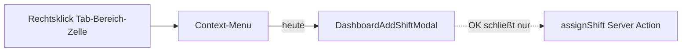
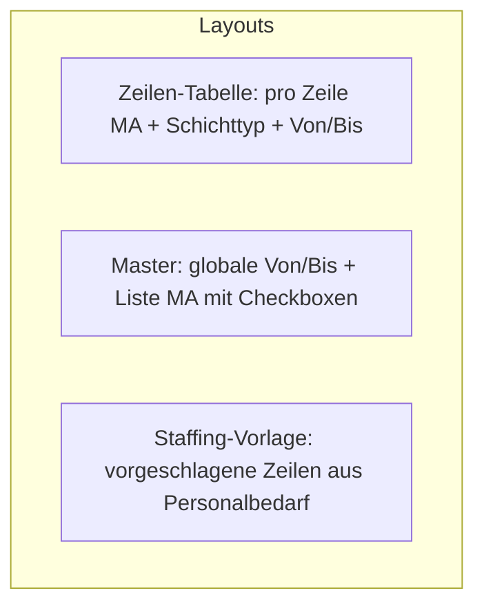
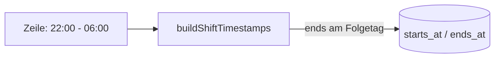
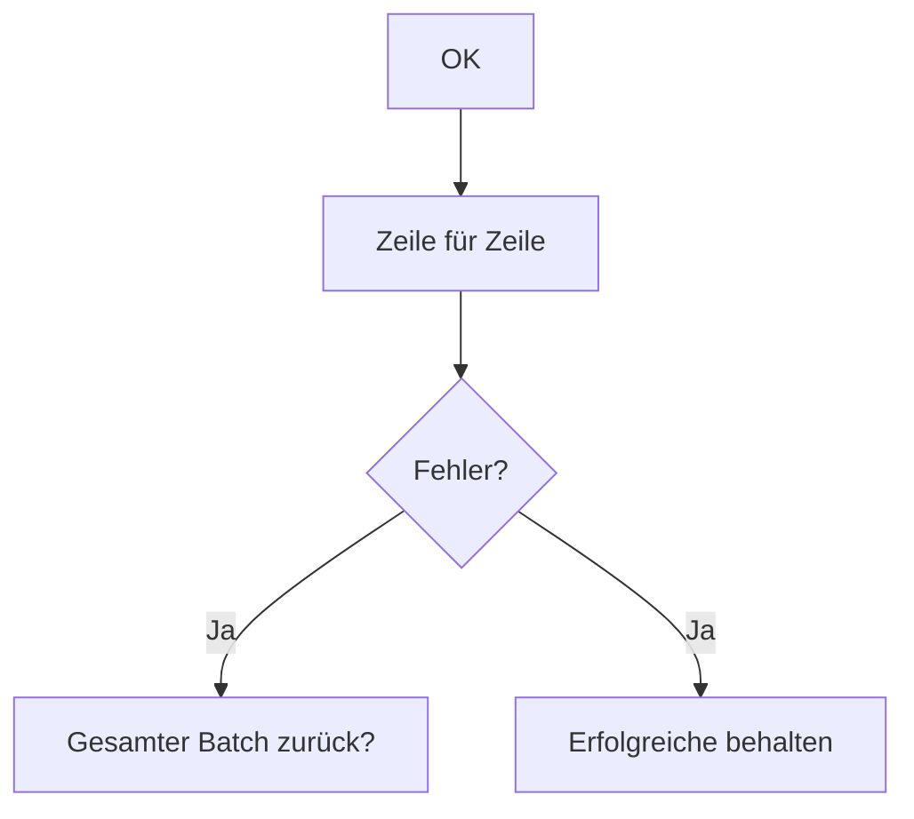

# Brainstorming: Mehrfach-Schichtzuweisung (Dashboard-Kalender)

**Status:** Round 1 — offen  
**Kontext:** Rechtsklick auf **Tab-Bereich-Zelle** (Tag-Bereich, heute/Zukunft) öffnet Context-Menu mit „eine Schicht hinzufügen“. Neu: Option zum **schnellen Zuweisen mehrerer Mitarbeiter** auf verschiedene Schichten.

**Bestand im Projekt (relevant):**

- `dashboard-add-shift-modal.tsx`: ein MA, Schichttyp + Uhrzeit von/bis, MA-Combobox mit Farbe, Sync Schichttyp ↔ Zeiten (`skipShiftTypeFromTimesSyncRef`), Verfügbarkeit + Abwesenheit-Filter
- **Uhrzeiten in Feldern sind maßgeblich** (bereits im Single-Modal angelegt)
- Nachtschichten: Verfügbarkeits-Logik unterstützt über-Mitternacht (`shiftWindowFitsAvailabilitySlot`)
- `assignShift` nutzt aktuell **Schichttyp-Zeiten** aus DB (`buildShiftTimestamps`), nicht freie Eingabe — Bulk-Feature braucht ggf. Schema/API-Erweiterung
- Abwesenheiten: genehmigte Abwesenheit am Tag → MA nicht wählbar

**Deine Notizen (Kern):**

- Mehrere MA → verschiedene Schichten, einfach & schnell
- MA immer mit **Farb-Swatch + Name**
- Schichttyp-Auswahl **und** editierbare **Uhrzeit von/bis** (flexibel, auch außerhalb Standard-Schichtzeiten)
- Nachtschichten (von/bis über Tagesgrenze)
- Schichttyp wählen → Zeiten füllen; Zeiten ändern → passender Schichttyp (ohne Endlosschleife)
- **Entscheidend sind immer die Uhrzeit-Felder**, nicht der Schichttyp-Name
- Nur MA mit passender Verfügbarkeit und **ohne Abwesenheit** am Tag

---

## Round 1 — Einstieg, UI-Grundform & Scope

### Q1 — **Context-Menu:** wie heißt die neue Option und wie verhält sie sich zur bestehenden?

- [x] **A)** Zusätzlicher Menüpunkt neben „eine Schicht hinzufügen“ (z. B. „**Mehrere Schichten zuweisen**“) ⭐ **empfohlen** (Single bleibt für schnellen 1:1-Fall)  
- [ ] **B)** Nur ein Menüpunkt „Schicht(en) zuweisen“ → Sub-Auswahl Single / Mehrfach  
- [ ] **C)** Bestehenden Punkt ersetzen — Bulk-Modal deckt auch Einzelzuweisung ab (1 Zeile)  
- [ ] **D)** Bulk nur über Tastenkürzel / Toolbar, nicht Context-Menu

**Deine Antwort:**

---

### Q2 — **Scope** beim Öffnen: welcher Kontext ist fix?

*(Rechtsklick liefert bereits `areaId` + `date`.)*

- [x] **A)** **Ein** Tab-Bereich + **ein** Tag (aus Rechtsklick) — alle Zeilen beziehen sich darauf ⭐ **empfohlen** (passt zu Zelle)  
- [ ] **B)** Tag fix, Bereich in Zeilen wählbar  
- [ ] **C)** Bereich fix, mehrere Tage wählbar  
- [ ] **D)** Tag + Bereich wählbar (weitgehend frei)

**Deine Antwort:**

---

### Q3 — **UI-Grundstruktur** des Bulk-Modals?

- [x] **A)** **Zeilen-Tabelle:** jede Zeile = eine Zuweisung (MA, Schichttyp, Von, Bis); Toolbar „Zeile hinzufügen“ ⭐ **empfohlen** (flexibel, mehrere verschiedene Schichten)  
- [ ] **B)** **Eine** Schicht (Typ + Von/Bis) + **Mehrfachauswahl** MA (alle bekommen dieselbe Schicht)  
- [ ] **C)** Wie A, aber Zeilen initial aus **Personalbedarf** (Staffing-Regeln) des Bereichs/Tags vorbefüllt  
- [ ] **D)** Spreadsheet-artig inline in der Kalenderzelle (ohne Modal)

**Deine Antwort:**

---

### Q4 — **Initialzustand** beim Öffnen (leere Zeilen)?

- [x] **A)** **Eine leere Zeile** (MA leer, Schichttyp leer, Zeiten `00:00`/`00:00` wie Single-Modal) ⭐ **empfohlen**  
- [ ] **B)** Keine Zeile — nur Button „Zeile hinzufügen“  
- [ ] **C)** Zeilen = Anzahl offener Personalbedarf-Slots (Staffing minus bereits geplante Schichten)  
- [ ] **D)** Zeilen = alle aktiven MA mit Verfügbarkeit an dem Tag (zu viele — eher nicht)

**Deine Antwort:**

---

### Q5 — **Speichern:** wann landen Zuweisungen in der DB?

- [x] **A)** **Ein OK** im Modal → alle **gültigen** Zeilen in einem Batch persistieren; Abbrechen verwirft ⭐ **empfohlen** (schneller Workflow)  
- [ ] **B)** Pro Zeile sofort speichern („Übernehmen“ pro Zeile)  
- [ ] **C)** Wie A, aber ungültige/leere Zeilen werden übersprungen ohne Fehler  
- [ ] **D)** Wie Single-Modal v1: OK schließt nur (noch ohne Persistenz) — erst später

**Deine Antwort:**

---

### Q6 — **Schichttyp ↔ Uhrzeiten-Sync** in **jeder Zeile** (wie Single-Modal, ohne Loop)?

- [x] **A)** **Ja, pro Zeile** dieselbe Logik: Schichttyp → füllt Von/Bis; Von/Bis geändert → auto Schichttyp wenn exakter Match; `skip`-Ref gegen Rekursion ⭐ **empfohlen** (deine Notiz)  
- [ ] **B)** Nur Schichttyp → Zeiten; **kein** Rückweg (Zeiten manuell = Schichttyp „—“ oder leer)  
- [ ] **C)** Globale Von/Bis für alle Zeilen, nur MA pro Zeile unterschiedlich  
- [ ] **D)** Kein Schichttyp-Feld — nur Von/Bis + optionaler Freitext

**Deine Antwort:**

---

### Q7 — **Persistenz technisch:** `assignShift` speichert heute nur Schichttyp-Zeiten — Bulk braucht **freie Von/Bis**?

*(Schema: `shifts.starts_at` / `ends_at` existieren; Zuweisung nutzt `buildShiftTimestamps(shiftDate, shiftType.start, shiftType.end)`.)*

- [x] **A)** Server Action erweitern: **`assignShiftWithTimes(employeeId, date, shiftTypeId, startTime, endTime, locationAreaId?)`** — DB speichert tatsächliche Von/Bis ⭐ **empfohlen** (Uhrzeiten-Felder sind maßgeblich)  
- [ ] **B)** Immer `shift_type_id` speichern; abweichende Zeiten nur UI (nicht persistiert) — widerspricht Notiz  
- [ ] **C)** Bei abweichenden Zeiten: `shift_type_id` = nächstbeste oder „Sonder“-Typ  
- [ ] **D)** Neue Tabelle / Spalten für override-Zeiten

**Deine Antwort:**

---

### Q8 — **Mitarbeiter-Filter** pro Zeile (Verfügbarkeit + Abwesenheit)?

- [x] **A)** MA-Combobox zeigt nur MA, deren Verfügbarkeit **die Zeile Von/Bis vollständig umfasst** und **keine genehmigte Abwesenheit** am Tag hat; bei Zeitänderung Liste neu filtern ⭐ **empfohlen**  
- [ ] **B)** Wie A + bereits in **anderer Zeile** gewählte MA ausblenden (kein Doppel pro Tag/Bereich)  
- [ ] **C)** Wie A, Doppelbelegung erlaubt  
- [ ] **D)** Alle aktiven MA anzeigen, unpassende ausgegraut mit Tooltip

**Deine Antwort:**

---

*Round 2 folgt nach deinen Antworten (Zeilen-Limits, Personalbedarf-Vorlage, Nachtschicht-Darstellung, Konflikte, i18n, Mobile, Abgrenzung Planung).*

---

## Round 1 — Entscheidungen (Zusammenfassung)

| Frage | Gewählt |
|-------|---------|
| Q1 | **A** — zusätzlicher Menüpunkt „Mehrere Schichten zuweisen“ |
| Q2 | **A** — fix: ein Tab-Bereich + ein Tag |
| Q3 | **A** — Zeilen-Tabelle (MA + Schichttyp + Von/Bis) |
| Q4 | **A** — startet mit einer leeren Zeile |
| Q5 | **A** — ein OK → Batch persistieren |
| Q6 | **A** — Sync Schichttyp ↔ Zeiten pro Zeile (Loop-Schutz) |
| Q7 | **A** — `assignShiftWithTimes` mit freien Von/Bis |
| Q8 | **A** — MA nur bei passender Verfügbarkeit, ohne Abwesenheit |

**Hinweis aus dem Code:** `assignShift` erlaubt aktuell **eine Schicht pro MA und Kalendertag** (`findShiftByEmployeeDate`); `location_area_id` wird beim Insert **noch nicht** gesetzt. → Round 2 (Q9, Q10, Q14).

---

## Round 2 — Zeilen, Validierung, Nachtschicht & Konflikte

### Q9 — **Doppelbelegung:** derselbe MA in mehreren Zeilen **oder** bereits geplant am Tag?

*(Q8=A erlaubt theoretisch denselben MA in zwei Bulk-Zeilen.)*

- [ ] **A)** Pro Modal: jeder MA **höchstens einmal**; bereits geplante Schicht am Tag → MA nicht wählbar (außer Bearbeitung bestehender) ⭐ **empfohlen**  
- [ ] **B)** Wie A, aber MA mit Schicht **in anderem Bereich** am selben Tag erlaubt (mehrere Schichten/Tag) — **Schema/API-Änderung** nötig  
- [ ] **C)** Doppel in Bulk-Zeilen erlaubt; Server dedupliziert  
- [ ] **D)** Keine Prüfung in v1

**Deine Antwort:**
B! Es muss möglich sein, dass ein Mitarbeiter keine direkte Schichttyp-Zweisung erhält, aber z.B. Morgens von 7:00 - 11:00 und Abends von 18:00 - 22:00 eingeteilt werden kann.

---

### Q10 — **`location_area_id`** beim Speichern?

*(Rechtsklick liefert `areaId`; `insertShift` setzt heute nur `location_id`.)*

- [x] **A)** Jede Zuweisung speichert **`location_area_id`** = Tab-Bereich aus Kontext + `location_id` vom Standort ⭐ **empfohlen**  
- [ ] **B)** Nur `location_id` (wie bisher)  
- [ ] **C)** Optional; null wenn nicht gesetzt  
- [ ] **D)** Erst in v2

**Deine Antwort:**

---

### Q11 — **Pflichtfelder** pro Zeile beim OK?

- [x] **A)** MA + **Von/Bis vollständig gültig** Pflicht; Schichttyp optional (leer wenn Zeiten keinem Typ entsprechen) ⭐ **empfohlen** (Zeiten maßgeblich)  
- [ ] **B)** MA + Schichttyp + Von/Bis alle Pflicht  
- [ ] **C)** Wie A; leere Zeilen werden ignoriert  
- [ ] **D)** Wie A; leere Zeilen blockieren OK

**Deine Antwort:**

---

### Q12 — **Schichttyp leer**, aber Von/Bis gesetzt — welcher `shift_type_id` in DB?

*(Spalte `shift_type_id` ist NOT NULL.)*

- [ ] **A)** **Nächster Match** via `resolveShiftTypeIdFromTimes`; wenn keiner → OK blockiert mit Fehler ⭐ **empfohlen**  
- [ ] **B)** Fallback auf festen Typ „Sonder“ / `other` (Migration neuer Typ)  
- [ ] **C)** `shift_type_id` = letzter manuell gewählter Typ der Zeile, auch wenn Zeiten abweichen  
- [ ] **D)** Freitext in `notes`, Typ = beliebiger Default

**Deine Antwort:**
Spalte `shift_type_id` auf NULLABLE ändern. "Schichttyp leer" setzen.

---

### Q13 — **Nachtschicht** (Von > Bis, z. B. 22:00–06:00) — UI & Persistenz?

- [x] **A)** UI zeigt Von/Bis wie eingegeben; Server: `ends_at` = **Folgetag** wenn `endTime <= startTime` (wie Planung/Verfügbarkeit) ⭐ **empfohlen**  
- [ ] **B)** UI zwingt Endzeit > Startzeit (keine Nachtschicht in Bulk v1)  
- [ ] **C)** Separates Feld „Ende am nächsten Tag“ Checkbox  
- [ ] **D)** Nur Schichttypen ohne Über-Mitternacht erlaubt

**Deine Antwort:**

---

### Q14 — **Bestehende Schicht** desselben MA am Tag (anderer Bereich/Typ)?

- [ ] **A)** **Überschreiben** der bestehenden Schicht (wie heutiges `assignShift`) ⭐ **empfohlen** (konsistent, ein MA / Tag)  
- [ ] **B)** Speichern **blockieren** + Hinweis  
- [ ] **C)** Warnung, Trotzdem ersetzen  
- [ ] **D)** Zweite Schicht anlegen (Modell „mehrere Schichten/Tag“)

**Deine Antwort:**
Es muss möglich sein, dass ein Mitarbeiter keine direkte Schichttyp-Zweisung erhält, aber z.B. Morgens von 7:00 - 11:00 und Abends von 18:00 - 22:00 eingeteilt werden kann. Wenn die zu speichernde Schicht sich mit bestehender Schicht überschneidet, dann A, sonst Hinweis und D.

---

### Q15 — **Auto-Auswahl Mitarbeiter** pro Zeile (wie Single-Modal: längste Pause ohne Schicht)?

- [x] **A)** Beim Ausfüllen Von/Bis: automatisch MA wählen (**längste Zeit ohne Schicht**), solange User nicht manuell gewählt hat ⭐ **empfohlen**  
- [ ] **B)** Immer manuell  
- [ ] **C)** Auto nur für erste Zeile  
- [ ] **D)** Auto rotiert — jede Zeile nächster freier MA

**Deine Antwort:**

---

### Q16 — **Verfügbarkeits-Kontextmenü** am MA-Feld (wie Single-Modal)?

- [x] **A)** **Ja**, Hover-Kontextmenü mit Verfügbarkeits-Slots → setzt Von/Bis (+ ggf. Schichttyp) ⭐ **empfohlen** (Konsistenz)  
- [ ] **B)** Nein in v1 — nur Combobox  
- [ ] **C)** Nur Button „Verfügbarkeit übernehmen“  
- [ ] **D)** Nur in Single-Modal, nicht Bulk

**Deine Antwort:**

---

### Q17 — **Zeilen-Limits & Aktionen** in der Tabelle?

- [x] **A)** Max. **20** Zeilen; Zeile hinzufügen / Zeile löschen (Papierkorb) ⭐ **empfohlen**  
- [ ] **B)** Unbegrenzt  
- [ ] **C)** Max = offene Personalbedarf-Slots  
- [ ] **D)** Max. 10 Zeilen

**Deine Antwort:**

---

### Q18 — **Personalbedarf-Hinweis** im Modal (Staffing)?

- [x] **A)** Nur **Info-Zeile** unter Titel: „Bedarf: X/Y“ (assigned/required) — keine Auto-Zeilen ⭐ **empfohlen** (Q4=A)  
- [ ] **B)** Button „Aus Bedarf vorschlagen“ fügt Zeilen hinzu  
- [ ] **C)** Kein Bezug zu Staffing in v1  
- [ ] **D)** Spalte „Position/Qualifikation“ aus Staffing

**Deine Antwort:**

---

*Round 3 folgt nach deinen Antworten (Single-Modal mitpersistieren, Fußleiste OK/Abbrechen, Fehlerbehandlung Batch, i18n, Abgrenzung Planungsseite, Spec-Freigabe).*

---

## Round 2 — Entscheidungen (Zusammenfassung)

| Frage | Gewählt / Antwort |
|-------|-------------------|
| Q9 | **B** — mehrere Schichten/MA/Tag möglich (z. B. 7–11 + 18–22) |
| Q10 | **A** — `location_area_id` + `location_id` speichern |
| Q11 | **A** — MA + Von/Bis Pflicht; Schichttyp optional |
| Q12 | **Custom** — `shift_type_id` **NULLABLE**; leer erlaubt |
| Q13 | **A** — Nachtschicht: `ends_at` Folgetag wenn Von > Bis |
| Q14 | **Custom** — bei **Overlap** bestehende Schicht **ersetzen**; sonst **neue Schicht anlegen** |
| Q15 | **A** — Auto-MA (längste Pause ohne Schicht) |
| Q16 | **A** — Verfügbarkeits-Kontextmenü pro Zeile |
| Q17 | **A** — max. 20 Zeilen, hinzufügen/löschen |
| Q18 | **A** — Bedarf-Hinweis „X/Y“ unter Titel |

**Folge:** DB/API müssen von „1 Schicht/MA/Tag“ auf **Overlap-Logik** umgestellt werden; Migration `shift_type_id` nullable.

---

## Round 3 — Schema, Overlap, Single-Modal & Batch-Fehler

### Q19 — **Overlap-Definition:** wann gilt eine Schicht als „überlappend“?

*(Relevant für Q14: ersetzen vs. anlegen; auch zwischen Bulk-Zeilen.)*

- [x] **A)** Intervalle `[starts_at, ends_at]` **schneiden sich** (Rand berühren z. B. 11:00–11:00 = **kein** Overlap) ⭐ **empfohlen**  
- [ ] **B)** Overlap wenn **gleicher MA + shift_date**, unabhängig von Uhrzeit (altes Modell)  
- [ ] **C)** Overlap nur bei gleichem `location_area_id`  
- [ ] **D)** Mindestabstand 1 Minute zwischen Schichten

**Deine Antwort:**

---

### Q20 — **Bulk-Zeilen untereinander:** gleicher MA zweimal, wenn Zeiten **nicht** überlappen?

*(Beispiel: Zeile 1 MA Anna 7–11, Zeile 2 MA Anna 18–22.)*

- [ ] **A)** **Erlaubt** — Validierung nur gegen Overlap (nicht gegen Doppel-MA) ⭐ **empfohlen** (passt zu Q9/B)  
- [ ] **B)** Pro Bulk-Session: MA nur einmal (zwei Zeilen → Fehler)  
- [ ] **C)** Erlaubt, aber Warnung  
- [ ] **D)** Nur unterschiedliche Bereiche (hier irrelevant — ein Bereich fix)

**Deine Antwort:**
A + Gleiche Mitarbeiter sollen direkt untereinander gezeigt werden.

---

### Q21 — **DB-Lookup** bestehende Schicht(en) pro MA/Tag?

- [x] **A)** `listShiftsForEmployeeDate(employeeId, date)` → alle Schichten; Overlap-Check in App/Server ⭐ **empfohlen**  
- [ ] **B)** Weiter `findShiftByEmployeeDate` (max. eine) — reicht nicht für Q14  
- [ ] **C)** DB-Constraint / Exclusion-Constraint gegen Overlaps  
- [ ] **D)** Nur Bulk prüfen; Single-Modal unverändert

**Deine Antwort:**

---

### Q22 — **Migration `shift_type_id` NULLABLE** — Anzeige im Kalender?

*(Wenn kein Typ: nur Von/Bis + MA-Name.)*

- [x] **A)** Kachel zeigt **Uhrzeitbereich** + MA; kein Schichtname (oder „—“) ⭐ **empfohlen**  
- [ ] **B)** Kachel zeigt „Sonder“ als festes Label  
- [ ] **C)** Typ aus nächstem Match nur in UI, DB bleibt null  
- [ ] **D)** Ohne Typ keine Speicherung (widerspricht Q12)

**Deine Antwort:**

---

### Q23 — **Single-Modal** („eine Schicht hinzufügen“) in **derselben** Spec/Release?

*(Heute: OK schließt ohne Persistenz; gleiche Zeiten-/Sync-Logik.)*

- [x] **A)** **Ja** — Single nutzt dieselbe `assignShiftWithTimes`; Persistenz + nullable Typ + Overlap ⭐ **empfohlen**  
- [ ] **B)** Nur Bulk in v1; Single später  
- [ ] **C)** Single bleibt ohne Persistenz  
- [ ] **D)** Single und Bulk → ein gemeinsames Modal (1 vs. n Zeilen)

**Deine Antwort:**

---

### Q24 — **Fußleiste** Bulk-Modal?

- [x] **A)** **Abbrechen** + **OK** (OK = Batch speichern, Abbrechen verwirft) ⭐ **empfohlen**  
- [ ] **B)** Nur Schließen (X)  
- [ ] **C)** OK disabled bis mindestens eine gültige Zeile  
- [ ] **D)** Wie Abwesenheiten: Schließen in Fußleiste + OK

**Deine Antwort:**

---

### Q25 — **Leere Zeilen** beim OK?

- [x] **A)** **Ignorieren** — nur vollständig gültige Zeilen speichern ⭐ **empfohlen**  
- [ ] **B)** Mindestens eine gültige Zeile Pflicht; sonst Fehler  
- [ ] **C)** Leere Zeilen blockieren OK  
- [ ] **D)** Alle Zeilen müssen vollständig sein

**Deine Antwort:**

---

### Q26 — **Batch-Fehler:** eine Zeile schlägt fehl?

- [ ] **A)** **Alles oder nichts** — bei erstem Fehler nichts persistieren, Fehlermeldung ⭐ **empfohlen**  
- [ ] **B)** **Partial success** — erfolgreiche Zeilen speichern, Fehler pro Zeile anzeigen  
- [x] **C)** Wie B + Modal offen lassen  
- [ ] **D)** Retry-Button

**Deine Antwort:**

---

### Q27 — **Overlap-Hinweis** vor Ersetzen (Q14)?

- [ ] **A)** Dialog: „Überschneidung mit bestehender Schicht — **ersetzen** oder **abbrechen**?“ (nur betroffene Zeilen) ⭐ **empfohlen**  
- [x] **B)** Still ersetzen ohne Dialog  
- [ ] **C)** Immer blockieren, User muss in Planung löschen  
- [ ] **D)** Nur Toast-Warnung

**Deine Antwort:**

---

### Q28 — **Abgrenzung** zur Seite **Planung** (`/planung`)?

- [x] **A)** Dashboard-Bulk **ergänzt** Planung; keine Doppelpflege — gleiche `shifts`-Tabelle ⭐ **empfohlen**  
- [ ] **B)** Dashboard nur „light“; komplexe Planung nur in Planung  
- [ ] **C)** Bulk ersetzt Drag&Drop in Planung langfristig  
- [ ] **D)** Getrennte Daten

**Deine Antwort:**

---

### Q29 — **i18n** Menü & Modal?

- [x] **A)** Unter `dashboard.*` (z. B. `assignMultipleShifts`, `bulkShiftTitle`) in de/en ⭐ **empfohlen**  
- [ ] **B)** Neuer Block `dashboard.bulkShift.*`  
- [ ] **C)** Nur Deutsch v1  
- [ ] **D)** Inline-Strings

**Deine Antwort:**

---

### Q30 — **Spec-Freigabe:** noch Round 4 nötig?

- [ ] **A)** **Nein** — nach Beantwortung → `specs/002-bulk-shift-assign-specification.md` ⭐  
- [x] **B)** **Ja** — Round 4 (Mobile, Berechtigungen, Performance, Tests)  
- [ ] **C)** Spec mit TBD für Offene  
- [ ] **D)** Spec + Implementierungsplan

**Deine Antwort:**

---

*Nach Q30=A: Schreibe **„Spec erstellen“** — dann Specification aus allen Runden (ohne Implementation).*

---

## Round 3 — Entscheidungen (Zusammenfassung)

| Frage | Gewählt / Antwort |
|-------|-------------------|
| Q19 | **A** — Overlap = Intervalle schneiden sich (Rand = kein Overlap) |
| Q20 | **A** + gleicher MA in **aufeinanderfolgenden Zeilen** gruppieren |
| Q21 | **A** — `listShiftsForEmployeeDate` + Overlap in Server |
| Q22 | **A** — Kachel: Uhrzeit + MA, kein Typ-Name wenn null |
| Q23 | **A** — Single-Modal mitpersistieren (gleiche API) |
| Q24 | **A** — Abbrechen + OK |
| Q25 | **A** — leere Zeilen ignorieren |
| Q26 | **C** — Partial Success + Modal bleibt offen |
| Q27 | **B** — Overlap-Ersetzen still (ohne Dialog) |
| Q28 | **A** — gleiche `shifts`-Tabelle wie Planung |
| Q29 | **A** — i18n unter `dashboard.*` |
| Q30 | **B** — Round 4 |

---

## Round 4 (final) — UX-Details, Berechtigungen, Technik & Spec-Freigabe

### Q31 — **Zeilen-Sortierung** im Bulk-Modal (Q20: gleiche MA untereinander)?

- [ ] **A)** Nach **Mitarbeitername** sortieren; Zeilen desselben MA **direkt untereinander** ⭐ **empfohlen**  
- [ ] **B)** Nur manuelle Reihenfolge (Drag)  
- [ ] **C)** Sortierung nach Von-Zeit  
- [ ] **D)** Einfügen neuer Zeile: direkt unter letzter Zeile desselben MA, falls MA schon gewählt

**Deine Antwort:**
C, aber Ausnahme: Wenn ein Mitarbeiter mwehrmals vorkommt, dann diesen Mitarbeiter untereinander (Sortierung: Zeit,Mitarbeiter)

---

### Q32 — **Neue Zeile** einfügen — wohin?

- [x] **A)** Immer **am Ende** der Tabelle ⭐ **empfohlen** (einfach); Sortierung bei OK oder Button „Sortieren“  
- [ ] **B)** Automatisch **unter** die letzte Zeile desselben MA (wenn MA gewählt)  
- [ ] **C)** Direkt unter selektierter Zeile  
- [ ] **D)** Am Anfang

**Deine Antwort:**

---

### Q33 — **Berechtigungen:** wer darf Bulk- und Single-Zuweisung?

- [x] **A)** Nur **Manager/Admin** (wie andere Dashboard-Schreibaktionen) ⭐ **empfohlen**  
- [ ] **B)** Manager + Planer-Rolle  
- [ ] **C)** Alle eingeloggten User  
- [ ] **D)** Nur Admin

**Deine Antwort:**

---

### Q34 — **Context-Menu** Voraussetzungen (wie heute Single)?

*(Tab-Bereich offen, Tag heute/Zukunft, Bereich aktiv.)*

- [x] **A)** **Gleiche Regeln** für beide Menüpunkte (Single + Bulk) ⭐ **empfohlen**  
- [ ] **B)** Bulk auch auf geschlossenen Bereichen (Notfall)  
- [ ] **C)** Bulk auch für vergangene Tage (readonly-Wochen)  
- [ ] **D)** Bulk nur wenn Personalbedarf > 0

**Deine Antwort:**

---

### Q35 — **Partial Success (Q26=C):** technische Umsetzung?

- [x] **A)** Zeilen **sequentiell** speichern; Erfolg/Fehler pro Zeile sammeln; Modal zeigt Fehlerliste; Kalender partial refresh ⭐ **empfohlen**  
- [ ] **B)** DB-Transaktion pro Zeile; kein Gesamt-Rollback  
- [ ] **C)** Erst alle validieren, dann eine Transaktion für alle gültigen  
- [ ] **D)** Bei erstem Fehler stoppen (widerspricht Q26)

**Deine Antwort:**

---

### Q36 — **Uhrzeit `00:00` / `00:00`** (Initial wie Single-Modal)?

- [x] **A)** Ungültig zum Speichern — Zeile wird ignoriert (wie unvollständig) ⭐ **empfohlen**  
- [ ] **B)** Als „Mitternacht–Mitternacht“ (24h) erlaubt  
- [ ] **C)** Pflicht: beim OK Fehler wenn Zeile MA hat aber Zeiten 00:00/00:00  
- [ ] **D)** Start leer statt 00:00

**Deine Antwort:**

---

### Q37 — **Daten laden:** MA-Liste pro Zeile?

- [x] **A)** **Einmal** beim Modal-Open: alle MA + Verfügbarkeiten + Abwesenheiten; pro Zeile clientseitig filtern nach Von/Bis ⭐ **empfohlen**  
- [ ] **B)** Pro Zeile Server-Request bei Zeitänderung  
- [ ] **C)** Einmal MA; Verfügbarkeit pro Zeile nachladen  
- [ ] **D)** Cache 5 Minuten

**Deine Antwort:**

---

### Q38 — **Kalender nach OK:** Darstellung mehrerer Schichten pro MA in **einer Zelle**?

- [x] **A)** **Alle** Schichten des Bereichs/Tags als **gestapelte Kacheln** (wie heute, mehrere Cards) ⭐ **empfohlen**  
- [ ] **B)** Nur neueste Schicht sichtbar  
- [ ] **C)** Zusammenfassen zu einer Kachel mit mehreren MA-Zeilen  
- [ ] **D)** Separate Zeile pro Schicht mit reduzierter Höhe

**Deine Antwort:**

---

### Q39 — **Mobile-App** in v1?

- [x] **A)** **Nur Web** Dashboard; Mobile später ⭐ **empfohlen**  
- [ ] **B)** Mobile read-only Anzeige der Schichten  
- [ ] **C)** Parität  
- [ ] **D)** Mobile nur Single-Zuweisung

**Deine Antwort:**

---

### Q40 — **Out of Scope** v1 (explizit in Spec)?

- [ ] **A)** Kein Drag&Drop im Bulk-Modal; keine Qualifikations-Prüfung gegen Staffing; kein Undo; kein Import ⭐ **empfohlen**  
- [ ] **B)** Qualifikations-Mismatch warnen  
- [ ] **C)** Auto-Fill aller Bedarf-Slots  
- [ ] **D)** Schichten über Mitternacht in **zwei** Kalendertage splitten (UI)

**Deine Antwort:**
B + D! Qualifikations-Prüfung ist wichtig.

**Q40 Klärung (Nachfrage):**
| Frage | Antwort |
|-------|---------|
| Q40-B1 | **A** — Inline-Warnung in Zeile |
| Q40-B2 | **A** — nur warnen, Speichern möglich |
| Q40-B3 | **A** — Prüfung nur bei gewähltem Schichttyp |
| Q40-B4 | **C** — Spalte „Qualifikation“ mit Ampel |
| Q40-D1 | **A** — Kalender-Split: Starttag 22:00–24:00, Folgetag 00:00–06:00 |
| Q40-D2 | **A** — Folgetag-Kachel immer wenn Schicht dort endet |
| Q40-D3 | **A** — Personalbedarf zählt nur am Starttag |
| Out of Scope | **Abweichung:** Drag&Drop, Undo, CSV/Import **in v1**; kein Auto-Fill Bedarf-Slots |

---

### Q41 — **Spec-Freigabe:** Brainstorming abgeschlossen?

- [x] **A)** Ja — nach Beantwortung → **`specs/002-bulk-shift-assign-specification.md`** ⭐  
- [ ] **B)** Noch Round 5  
- [ ] **C)** Spec mit offenen TBD  
- [ ] **D)** Spec + Migrations-Reihenfolge als Anhang

**Deine Antwort:**

---

*Nach Q41=A: Schreibe **„Spec erstellen“** — Specification aus allen Runden ableiten (ohne Implementation).*

---

## Round 4 — Entscheidungen (Zusammenfassung)

| Frage | Gewählt / Antwort |
|-------|-------------------|
| Q31 | **Custom** — Sortierung nach Von-Zeit; mehrfach vorkommende MA untereinander (Zeit, MA) |
| Q32 | **A** — neue Zeile am Ende |
| Q33 | **A** — nur Manager/Admin |
| Q34 | **A** — gleiche Context-Menu-Regeln wie Single |
| Q35 | **A** — sequentiell speichern, Fehler pro Zeile, Modal offen |
| Q36 | **A** — 00:00/00:00 = ungültig, Zeile ignorieren |
| Q37 | **A** — MA-Daten einmal beim Open |
| Q38 | **A** — gestapelte Kacheln pro Schicht |
| Q39 | **A** — nur Web v1 |
| Q40 | **B+D** + Klärung (Quali-Ampel, Kalender-Split); **Drag&Drop, Undo, CSV/Import in Scope** |
| Q41 | **A** — Spec freigeben |

