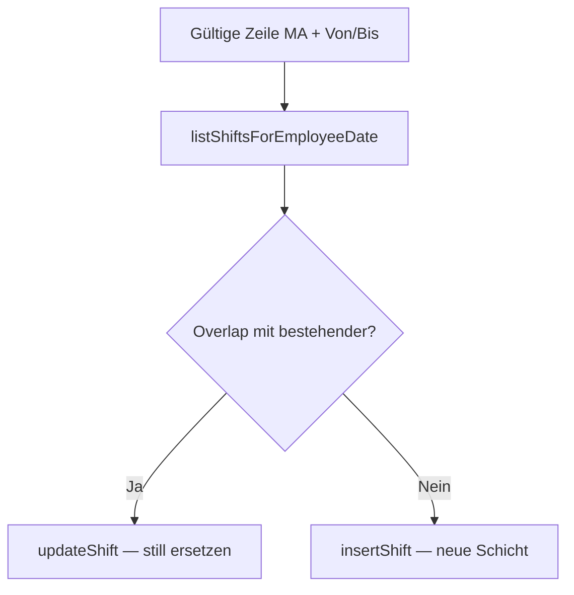

# Specification: Mehrfach-Schichtzuweisung (Dashboard-Kalender)

**Version:** 1.0  
**Status:** Freigegeben zur Implementierung  
**Quelle:** `specs/002-bulk-shift-assign-brainstorming.md` (Runden 1–4 + Q40-Klärung)  
**Scope:** Web-App (`apps/web`) — Dashboard-Kalender, Manager/Admin

---

## 1. Ziel

Manager und Admins können im **Dashboard-Kalender** per Rechtsklick auf eine **Tab-Bereich-Zelle** (fixer Bereich + Tag) Schichten zuweisen:

1. **Einzeln** — bestehender Menüpunkt „eine Schicht hinzufügen“ (`DashboardAddShiftModal`), persistiert ab v1.
2. **Mehrfach** — neuer Menüpunkt „Mehrere Schichten zuweisen“ (`DashboardBulkShiftModal`) mit Zeilen-Tabelle (MA, Schichttyp, Von/Bis), Batch-Speichern, Drag&Drop, CSV-Import und Undo.

**Maßgeblich sind immer die Uhrzeit-Felder Von/Bis**, nicht der Schichttyp-Name. Ein Mitarbeiter kann **mehrere nicht überlappende Schichten am selben Tag** haben (z. B. 7–11 und 18–22). Überlappende Schichten werden **still ersetzt** (kein Dialog).

Alle Zuweisungen landen in derselben `shifts`-Tabelle wie die Planungsseite (`/planung`).

---

## 2. Entscheidungsübersicht

| Bereich | Entscheidung |
|---------|--------------|
| Einstieg Bulk | Zusätzlicher Context-Menu-Punkt neben Single |
| Kontext | Fix: ein Tab-Bereich + ein Tag (aus Rechtsklick) |
| UI Bulk | Zeilen-Tabelle: MA + Schichttyp + Von/Bis + Qualifikation (Ampel) |
| Initial | Eine leere Zeile (`00:00`/`00:00`) |
| Single-Modal | Gleiche Release: Persistenz + nullable Typ + Overlap |
| Speichern Bulk | OK → Batch; Abbrechen verwirft ungespeicherte Zeilen |
| Leere Zeilen | Beim OK ignorieren |
| Batch-Fehler | Partial Success; Modal bleibt offen; Fehlerliste pro Zeile |
| Sync Typ↔Zeit | Pro Zeile wie Single-Modal (`skip`-Ref gegen Loop) |
| API | `assignShiftWithTimes` + `assignShiftBatch` |
| `shift_type_id` | **NULLABLE**; leer wenn kein Typ gewählt |
| `location_area_id` | Beim Insert/Update setzen (+ `location_id`) |
| Mehrere Schichten/MA/Tag | Ja; Overlap = Intervalle schneiden sich (Rand = kein Overlap) |
| Overlap bestehend | Ersetzen (still); sonst neue Schicht anlegen |
| Nachtschicht Persistenz | `ends_at` am Folgetag wenn `endTime <= startTime` |
| Nachtschicht Kalender | Split-UI: Starttag + Folgetag (siehe §8) |
| MA-Filter | Verfügbarkeit umfasst Von/Bis; keine genehmigte Abwesenheit |
| Auto-MA | Längste Pause ohne Schicht (pro Zeile, bis manuell gewählt) |
| Verfügbarkeits-Menü | Pro Zeile am MA-Feld (wie Single) |
| Zeilen-Limit | Max. 20 |
| Personalbedarf | Info „Bedarf: X/Y“ unter Titel; **kein** Auto-Fill |
| Zeilen-Sortierung | Primär Von-Zeit; MA mit mehreren Zeilen gruppiert untereinander |
| Neue Zeile | Am Ende; Sortierung bei OK oder Button „Sortieren“ |
| Qualifikation | Spalte Ampel; Warnung inline; Speichern trotzdem möglich |
| Quali-Prüfung | Nur wenn Schichttyp gewählt; MA vs. Staffing-Qualifikationen |
| Berechtigung | Nur Manager/Admin |
| Context-Menu | Gleiche Regeln wie Single (Bereich offen, heute/Zukunft) |
| Daten laden | Einmal beim Modal-Open; Filter clientseitig pro Zeile |
| Kalender-Kacheln | Gestapelt; Uhrzeit + MA; kein Typ-Name wenn null |
| Drag&Drop | Zeilen per Drag Handle umsortieren |
| Undo | Letzten Batch-Speichervorgang rückgängig (Toast, 30 s) |
| CSV-Import | Zeilen aus CSV in Bulk-Modal laden |
| Mobile | Out of scope v1 |
| i18n | `dashboard.*` (de/en) |

---

## 3. Datenmodell

### 3.1 Tabelle `shifts` (Anpassungen)

**Migration:** `shift_type_id` nullable machen.

```sql
alter table public.shifts
  alter column shift_type_id drop not null;
```

`schema.sql` synchron halten.

| Feld | v1-Verhalten |
|------|----------------|
| `shift_type_id` | Optional (`null` wenn Zeiten keinem Typ entsprechen / Typ leer) |
| `location_area_id` | Pflicht bei Dashboard-Zuweisung (Tab-Bereich aus Kontext) |
| `location_id` | Standort aus Dashboard-Kontext |
| `shift_date` | Kalendertag des **Schichtbeginns** (Starttag) |
| `starts_at` / `ends_at` | Aus Von/Bis + `buildShiftTimestamps` (Nachtschicht → Folgetag) |

**Kein** Unique-Constraint „ein MA pro Tag“. Bestehender Index `shifts_employee_date_idx` bleibt für Lookups.

### 3.2 Overlap-Definition

Zwei Schichten überlappen, wenn ihre Intervalle `[starts_at, ends_at)` sich schneiden. **Berührung am Rand** (Ende A = Start B) gilt **nicht** als Overlap.

Prüfung gegen:
- bestehende Schichten desselben MA am relevanten Datumsbereich (Starttag ± ggf. Folgetag bei Nachtschicht),
- andere Zeilen im selben Batch (vor Persistenz).

### 3.3 Persistenz-Regeln pro Zeile



- **Overlap mit bestehender Schicht:** `updateShift` auf überlappende Schicht (still, Q27=B).
- **Kein Overlap:** `insertShift` (neue Schicht, Q14).
- Bulk-Zeilen mit internem Overlap: vor Speichern validieren; betroffene Zeilen als Fehler markieren (kein stiller Sieger).

### 3.4 Nullable Schichttyp — Anzeige

- Kalender-Kachel: **Uhrzeitbereich** + MA-Name.
- Wenn `shift_type_id` null: **kein** Schichtname (nicht „Sonder“).
- Farbe: MA-Profilfarbe (`profile.color`) bevorzugt; Fallback Schichttyp-Farbe wenn gesetzt.

---

## 4. Navigation & Einstieg

### 4.1 Context-Menu

**Datei:** `apps/web/src/components/dashboard/dashboard-calendar.tsx`

Zweiter Menüpunkt unter bestehendem „eine Schicht hinzufügen“:

| Key | DE (Beispiel) |
|-----|----------------|
| `dashboard.assignShift` | (bestehend) eine Schicht hinzufügen |
| `dashboard.assignMultipleShifts` | Mehrere Schichten zuweisen |

**Voraussetzungen (Single + Bulk identisch, Q34=A):**
- Tab-Bereich an diesem Tag geöffnet bzw. Zelle planbar (bestehende Logik `showOpenDayCell` / Context-Menu-Guard),
- Tag **heute oder Zukunft** (nicht readonly Vergangenheit),
- Bereich in Kalender aktiv.

### 4.2 Modals

| Modal | Komponente (neu/angepasst) | State |
|-------|---------------------------|-------|
| Single | `dashboard-add-shift-modal.tsx` | `{ areaId, date }` |
| Bulk | `dashboard-bulk-shift-modal.tsx` (**neu**) | `{ areaId, date, locationId }` |

Beide erhalten `areas`, `shiftTypes`, `staffingRules`, `qualifications` (Bulk zusätzlich für Ampel).

---

## 5. UI — Single-Modal (`DashboardAddShiftModal`)

### 5.1 Persistenz (Q23=A)

- Fußleiste: **Abbrechen** + **OK**.
- **OK:** validiert MA + Von/Bis → ruft `assignShiftWithTimes` auf → schließt bei Erfolg; Fehler inline/Alert.
- **Abbrechen:** schließt ohne Speichern.
- Schichttyp optional; Sync Typ↔Zeit unverändert (bestehende Logik).
- Verfügbarkeits-Kontextmenü am MA-Feld bleibt.
- Auto-MA bei Zeitänderung (längste Pause ohne Schicht).

### 5.2 Qualifikation (Single)

- Wenn Schichttyp gewählt: gleiche Ampel-Logik wie Bulk (kompakt unter MA oder neben Typ), Warnung blockiert Speichern **nicht**.

---

## 6. UI — Bulk-Modal (`DashboardBulkShiftModal`)

### 6.1 Layout

- Titel: Bereich + formatiertes Datum (i18n).
- Info-Zeile: **„Bedarf: X/Y“** (`requiredStaffForAreaOnDate` / geplante Schichten im Bereich — Q18=A).
- Toolbar:
  - **Zeile hinzufügen** (disabled ab 20 Zeilen),
  - **Importieren** (CSV, §10),
  - **Sortieren** (§6.5),
  - optional Papierkorb für selektierte Zeile.
- Tabelle (Spalten):

| Spalte | Inhalt |
|--------|--------|
| ⋮⋮ | Drag-Handle (§9) |
| Mitarbeiter | Combobox: Farb-Swatch + Name |
| Schichttyp | Select (optional, leer erlaubt) |
| Von | `TimeInput` |
| Bis | `TimeInput` |
| Qualifikation | Ampel (§7) |
| Aktionen | Zeile löschen |

- Fußleiste: **Abbrechen** + **OK** (Q24=A).
- Beim Open: Ladezustand (wait cursor) bis MA/Verfügbarkeiten/Abwesenheiten/Staffing geladen (Q37=A).

### 6.2 Zeilen-Logik

- Start: **eine leere Zeile** (Q4=A).
- **Leere/unvollständige Zeilen** (`00:00`/`00:00`, MA fehlt): beim OK **ignorieren** (Q25, Q36).
- Pro Zeile: Sync Schichttyp ↔ Von/Bis wie Single (`skipShiftTypeFromTimesSyncRef`).
- MA-Combobox: nur MA deren Verfügbarkeit **Von/Bis vollständig umfasst** und **keine genehmigte Abwesenheit** am Tag (Q8=A).
- Bei Von/Bis-Änderung: MA-Liste neu filtern; Auto-MA wenn noch nicht manuell gewählt (Q15=A).
- Verfügbarkeits-Kontextmenü am MA-Feld (Q16=A).
- Gleicher MA in mehreren Zeilen **erlaubt**, wenn Zeiten nicht überlappen (Q9=B, Q20).

### 6.3 OK — Batch-Speichern

1. Optional: **Sortieren** (§6.5) — wenn User nicht manuell sortiert hat, vor Persistenz anwenden.
2. Gültige Zeilen extrahieren.
3. Interne Overlap-Validierung zwischen Batch-Zeilen.
4. **Sequentiell** speichern (Q35=A); pro Zeile Ergebnis sammeln.
5. **Erfolg:** Kalender partial refresh (`revalidatePath('/dashboard')`); Toast mit **Undo** (§11); Modal schließen wenn **alle** Zeilen OK.
6. **Partial Success (Q26=C):** erfolgreiche Zeilen persistiert; Modal **bleibt offen**; Fehlerliste unter Tabelle (Zeile + i18n-Fehlertext); erfolgreiche Zeilen aus Tabelle entfernen oder als gespeichert markieren.
7. **Keine gültige Zeile:** Hinweis, Modal offen.

### 6.4 Abbrechen

Schließt Modal; ungespeicherte Zeilen verwerfen (kein dirty-Warn-Dialog nötig, da noch nicht in DB).

### 6.5 Sortierung (Q31 Custom)

Button **Sortieren** und automatisch vor OK:

1. Primär: **Von-Zeit** aufsteigend.
2. Sekundär: **Mitarbeitername** aufsteigend.
3. **Gruppierung:** alle Zeilen desselben MA direkt untereinander (stabile Gruppe nach erstem Auftreten des MA in der Zeit-Sortierung).

Manuelle Drag-Reihenfolge bleibt erhalten, bis User **Sortieren** klickt oder OK (dann Sortierung anwenden, Q32=A).

---

## 7. Qualifikations-Prüfung (Q40-B)

### 7.1 Wann

**Inline**, sobald in einer Zeile **MA + Von/Bis gültig + Schichttyp gewählt** (Q40-B1=A, B3=A).

Ohne Schichttyp: Ampel **neutral/grau** („—“), keine Prüfung.

### 7.2 Regel

Für Zeile mit `shift_type_id`:

1. Staffing-Regeln laden: `location_area_staffing` für `(areaId, shift_type_id, weekday)` des Tages.
2. Erforderliche `qualification_id`(s) mit `required_count > 0` sammeln.
3. Profil-Qualifikationen des MA laden (`listProfileQualifications`).
4. **Match:** MA hat **mindestens eine** der geforderten Qualifikationen → Ampel **grün**.
5. Bedarf existiert, MA hat **keine** passende Qualifikation → Ampel **gelb/rot** + Tooltip mit fehlender Qualifikation.
6. Kein Staffing-Bedarf für Typ/Tag → Ampel **grün** oder neutral (kein Bedarf).

### 7.3 Konsequenz (Q40-B2=A)

Warnung **blockiert Speichern nicht**. Tooltip: z. B. „Mitarbeiter hat Qualifikation ‚Koch‘ nicht (Bedarf: Service)“.

### 7.4 Spalte (Q40-B4=C)

Dedizierte Spalte **Qualifikation** mit Ampel-Icon (grün / gelb / grau). Hover → Tooltip mit Details.

---

## 8. Nachtschicht — Kalender-Split (Q40-D)

### 8.1 Modal & DB (Q13=A)

- Eingabe z. B. `22:00`–`06:00` unverändert in einer Zeile.
- DB: **ein** Datensatz; `shift_date` = Starttag; `ends_at` am Folgetag.

### 8.2 Kalender-Darstellung (Q40-D1=A)

Aus `starts_at`/`ends_at` abgeleitet (nicht Schichttyp-Standardzeiten):

| Zelle | Kachel-Inhalt |
|-------|----------------|
| **Starttag** (shift_date) | Uhrzeit **Von–24:00** (bzw. bis Mitternacht) + MA; gleiche `shift.id` |
| **Folgetag** (ends_at Datum) | Uhrzeit **00:00–Bis** + MA; **dieselbe** `shift.id`, Flag `continuation: true` |

Folgetag-Kachel **immer** anzeigen, wenn Schicht dort endet (Q40-D2=A), auch wenn Bereich am Folgetag geschlossen.

### 8.3 Personalbedarf (Q40-D3=A)

Staffing-Zählung (`X/Y`, Header-Overlay) nur am **Starttag**; Folgetag-Split-Kachel zählt nicht extra.

### 8.4 Datenabfrage

`listDashboardShifts` erweitern: neben `shift_date`-Filter auch Schichten laden, deren `ends_at` in die sichtbare Woche fällt aber `shift_date` davor liegt → für Folgetag-Kacheln. Select um `starts_at`, `ends_at` ergänzen; Karten-Mapping in `dashboard/page.tsx` auf **tatsächliche** Zeiten umstellen.

---

## 9. Drag&Drop (Bulk-Modal)

- Jede Zeile: Drag-Handle (⋮⋮) links.
- Native HTML5 DnD oder bestehende Projektbibliothek (falls vorhanden); sonst `@dnd-kit` o. ä.
- Beim Drop: Zeilenreihenfolge im Client-State aktualisieren.
- Drag überschreibt Sortierung bis **Sortieren** oder OK.
- Kein Drag zwischen Modals / Kalender.

---

## 10. CSV-Import (Bulk-Modal)

### 10.1 Einstieg

Toolbar-Button **Importieren** → Datei-Dialog (`.csv`, UTF-8).

### 10.2 Format

Header-Zeile **Pflicht** (case-insensitive):

| Spalte | Pflicht | Beschreibung |
|--------|---------|--------------|
| `employee` | ja | Vollständiger Name oder E-Mail (Match gegen Org-Profile) |
| `start_time` | ja | `HH:MM` |
| `end_time` | ja | `HH:MM` |
| `shift_type` | nein | Schichttyp-Name (exakter Match) |

Trennzeichen: `,` oder `;` (auto-erkennen).

### 10.3 Verhalten

- Geparste Zeilen **ans Ende** der Tabelle anhängen.
- Max. **20 Zeilen** gesamt; Import schneidet ab oder meldet Überschuss.
- Unbekannter MA / ungültige Zeiten / unbekannter Typ → Zeile importieren mit Fehler-Badge oder Import-Protokoll (Dialog mit Fehlerliste); gültige Zeilen trotzdem übernehmen.
- Nach Import: Quali-Ampel und MA-Filter wie manuelle Zeilen.

### 10.4 Export (optional v1)

Nicht Pflicht; Template-Download (leere CSV mit Header) empfohlen.

---

## 11. Undo

### 11.1 Scope

**Rückgängig** für den **letzten erfolgreichen Batch- oder Single-Speichervorgang** aus Bulk- oder Single-Modal (ein gemeinsamer Undo-Stack pro Session).

### 11.2 UX

- Nach erfolgreichem OK: Toast **„Schichten gespeichert“** + Button **„Rückgängig“** (30 Sekunden sichtbar).
- Klick **Rückgängig:** Server Action `undoLastShiftAssignBatch`:
  - neu angelegte Schicht-IDs → `deleteShift`,
  - ersetzte Schichten → vorherigen Zustand aus Snapshot wiederherstellen (`updateShift`).

### 11.3 Server

Bei jedem `assignShiftWithTimes` / Batch-Zeile: Snapshot `{ shiftId, previousPayload | null }` in Session/Server-Store (org + user scoped); nur **ein** Undo-Level (letzter Batch).

Single-Modal: ein Eintrag im gleichen Undo-Mechanismus.

---

## 12. Backend & Server Actions

### 12.1 Database-Layer (neu/erweitert)

| Methode | Beschreibung |
|---------|--------------|
| `listShiftsForEmployeeDate(employeeId, shiftDate)` | Alle Schichten mit `shift_date = shiftDate` (+ ggf. Nachtschicht-Folgetag-Lookup) |
| `listShiftsOverlapping(employeeId, startsAt, endsAt, excludeId?)` | Overlap-Check |
| `insertShift` | Erweitern: `location_area_id`, nullable `shift_type_id`, freie `starts_at`/`ends_at` |
| `updateShift` | Wie oben |
| `listDashboardShifts` | + `starts_at`, `ends_at`; Folgetag-Query |
| `listProfileQualificationsForOrg(organizationId)` | Bulk-Ampel (oder pro MA) |
| `saveShiftAssignUndoSnapshot` / `popShiftAssignUndoSnapshot` | Undo (Implementierungsdetail) |

Overlap-Hilfe: `shiftsOverlap(aStart, aEnd, bStart, bEnd)` in `@/lib/shift-overlap.ts` (neu).

### 12.2 Server Actions

**Datei:** `apps/web/src/app/actions/shifts.ts` (erweitern)

| Action | Beschreibung |
|--------|--------------|
| `assignShiftWithTimes(input)` | Single-Zeile; Overlap → replace else insert; Undo-Snapshot |
| `assignShiftBatch(input)` | `{ rows: AssignRow[], locationId, locationAreaId, shiftDate }` → sequentiell; `{ results: { rowIndex, ok, error? }[] }` |
| `undoLastShiftAssignBatch()` | Letzten Snapshot rückgängig |
| `fetchDashboardBulkShiftContext(date, areaId)` | MA, Verfügbarkeiten, Abwesenheiten, Staffing, Qualifikationen (ein Request) |

`AssignRow`: `{ employeeId, shiftTypeId: string | null, startTime, endTime }`.

Guards: `requireManager()`, `isPastShiftDate` → Fehler, Location/Area/MA Org-Check.

Nach Erfolg: `revalidatePath('/dashboard')`, `revalidatePath('/planung')`.

### 12.3 Bestehendes `assignShift`

Deprecated für Dashboard; Planung kann später migrieren. Dashboard nutzt nur `assignShiftWithTimes`.

---

## 13. Kalender-Kacheln (Q22, Q38)

- Mehrere Schichten pro Zelle: **gestapelte Karten** (bestehendes Layout).
- Text Zeile 1: `{Uhrzeit}` oder `{Typ} {Uhrzeit}` wenn Typ gesetzt.
- Text Zeile 2: MA-Name.
- Nachtschicht-Split: zwei Karten an zwei Tagen (§8), visuell gleiche Farbe, Folgetag ggf. dezenter „Fortsetzung“-Stil optional.
- Shifts ohne `location_area_id` (Legacy): weiter anzeigen wenn `shift_date` passt; neue Zuweisungen setzen Area immer.

---

## 14. Berechtigungen

- Context-Menu, Modals, Server Actions: **`requireManager()`** (Q33=A).
- Nicht-Manager: Menüpunkte nicht anzeigen bzw. Actions liefern Unauthorized.

---

## 15. Internationalisierung

Namespace **`dashboard.*`** in `packages/i18n/src/messages/de.ts` und `en.ts`.

Mindest-Keys:

- `assignMultipleShifts`, `bulkShiftTitle`, `bulkShiftStaffingHint` (`Bedarf: {assigned}/{required}`)
- `bulkShiftAddRow`, `bulkShiftSort`, `bulkShiftImport`, `bulkShiftUndo`, `bulkShiftSaved`
- Spalten: `bulkShiftEmployee`, `bulkShiftType`, `bulkShiftFrom`, `bulkShiftTo`, `bulkShiftQualification`
- `bulkShiftQualificationOk`, `bulkShiftQualificationMissing`, `bulkShiftQualificationNoRequirement`
- Fehler: `bulkShiftErrorOverlap`, `bulkShiftErrorSave`, `bulkShiftPartialSuccess`
- CSV: `bulkShiftImportTitle`, `bulkShiftImportErrors`, `bulkShiftImportTemplate`
- Single: bestehende Keys + Persistenz-Fehler

---

## 16. Out of Scope (v1)

| Thema | Hinweis |
|-------|---------|
| Mobile-App | Keine Bulk/Single-Zuweisung in `apps/mobile` |
| Auto-Fill Personalbedarf | Nur Hinweis X/Y; kein „Aus Bedarf vorschlagen“ |
| Overlap-Bestätigungsdialog | Still ersetzen (Q27=B) |
| Drag&Drop im Kalender | Nur Zeilen im Bulk-Modal |
| Mehrstufiges Undo | Nur letzter Batch |
| Planungsseite umbauen | Nutzt gleiche DB; Bulk-UI nur Dashboard |
| Schicht löschen im Bulk-Modal | Nur Zuweisen/Ersetzen; Löschen weiter in Planung |

**In Scope (explizit, Abweichung von Round-1-Default):** Drag&Drop Zeilen, Undo, CSV-Import.

---

## 17. Betroffene Dateien (Implementierung)

### Neu

- `apps/web/src/components/dashboard/dashboard-bulk-shift-modal.tsx`
- `apps/web/src/lib/shift-overlap.ts`
- `apps/web/src/lib/bulk-shift-csv-import.ts`
- `packages/database/migrations/YYYYMMDD_shift_type_id_nullable.sql`

### Anpassen

- `apps/web/src/components/dashboard/dashboard-calendar.tsx` (Context-Menu, Bulk-Modal, Overnight-Kacheln)
- `apps/web/src/components/dashboard/dashboard-add-shift-modal.tsx` (Persistenz, Quali)
- `apps/web/src/app/actions/shifts.ts`
- `apps/web/src/app/actions/dashboard-shift-assign.ts` (Bulk-Context-Fetch)
- `apps/web/src/app/(manager)/dashboard/page.tsx` (Karten aus `starts_at`/`ends_at`, Folgetag)
- `packages/database/src/interface.ts`, `supabase-database.ts`, `schema.sql`
- `packages/i18n/src/messages/de.ts`, `en.ts`

---

## 18. Akzeptanzkriterien

1. Rechtsklick auf planbare Tab-Bereich-Zelle zeigt **zwei** Menüpunkte (Single + Bulk).
2. Bulk-Modal öffnet mit fixem Bereich/Tag, einer leeren Zeile, Bedarf X/Y.
3. MA-Combobox: Farb-Swatch + Name; gefiltert nach Verfügbarkeit/Abwesenheit pro Von/Bis.
4. Schichttyp ↔ Zeiten Sync pro Zeile ohne Endlosschleife.
5. OK speichert gültige Zeilen; leere/`00:00`-Zeilen werden übersprungen.
6. Derselbe MA kann 7–11 und 18–22 am selben Tag erhalten (zwei DB-Einträge).
7. Overlap mit bestehender Schicht ersetzt still; ohne Overlap neue Schicht.
8. `shift_type_id` null speicherbar; Kachel ohne Typ-Name.
9. `location_area_id` gesetzt; Schicht erscheint in korrekter Tab-Bereich-Zelle.
10. Nachtschicht 22–06: eine DB-Zeile; Kalender Split Starttag/Folgetag.
11. Quali-Spalte: Ampel bei gewähltem Typ; Warnung blockiert nicht.
12. Partial Batch-Fehler: Modal bleibt offen mit Fehlerliste; erfolgreiche Zeilen in DB.
13. Single-Modal OK persistiert über dieselbe API.
14. Drag&Drop ändert Zeilenreihenfolge; Sortieren nach Zeit+MA-Gruppe.
15. CSV-Import hängt Zeilen an (max 20).
16. Toast Undo macht letzten Batch rückgängig.
17. Nur Manager/Admin.
18. Texte DE/EN unter `dashboard.*`.

---

## 19. Testplan (manuell)

- [ ] Context-Menu: Single + Bulk nur bei offenem Bereich / heute+.
- [ ] Bulk: zwei Zeilen, zwei MA, OK → zwei Kacheln in Zelle.
- [ ] Bulk: gleicher MA 7–11 + 18–22 → zwei Kacheln, zwei DB-Rows.
- [ ] Overlap 7–11 existiert, neu 8–10 → ersetzt; neu 12–14 → zweite Schicht.
- [ ] Schichttyp leer, Zeiten gesetzt → DB `shift_type_id` null.
- [ ] Nachtschicht: Split-Kacheln Mo 22–24 + Di 0–6; Staffing nur Mo.
- [ ] Quali: MA ohne Quali bei Bedarf → gelbe Ampel; OK speichert trotzdem.
- [ ] Abwesenheit: MA nicht in Liste.
- [ ] Partial Error: eine Zeile ungültig → andere gespeichert, Modal offen.
- [ ] Single-Modal OK persistiert.
- [ ] Drag&Drop Reihenfolge; Sortieren nach Zeit.
- [ ] CSV-Import: gültige + ungültige Zeilen.
- [ ] Undo nach Batch → Schichten zurück.
- [ ] Planung zeigt dieselben Schichten.
- [ ] Basic-User: kein Context-Menu Schreibzugriff.

---

## 20. Referenzen

- Brainstorming: `specs/002-bulk-shift-assign-brainstorming.md`
- Single-Modal: `apps/web/src/components/dashboard/dashboard-add-shift-modal.tsx`
- Kalender: `apps/web/src/components/dashboard/dashboard-calendar.tsx`
- Schichten: `apps/web/src/app/actions/shifts.ts`
- Zeitstempel: `apps/web/src/lib/dates.ts` (`buildShiftTimestamps`)
- Verfügbarkeit: `apps/web/src/lib/available-employees-for-shift.ts`
- Staffing: `apps/web/src/lib/location-staffing-client.ts`
- Schema: `packages/database/schema.sql` (`shifts`, `location_area_staffing`, `profile_qualifications`)
