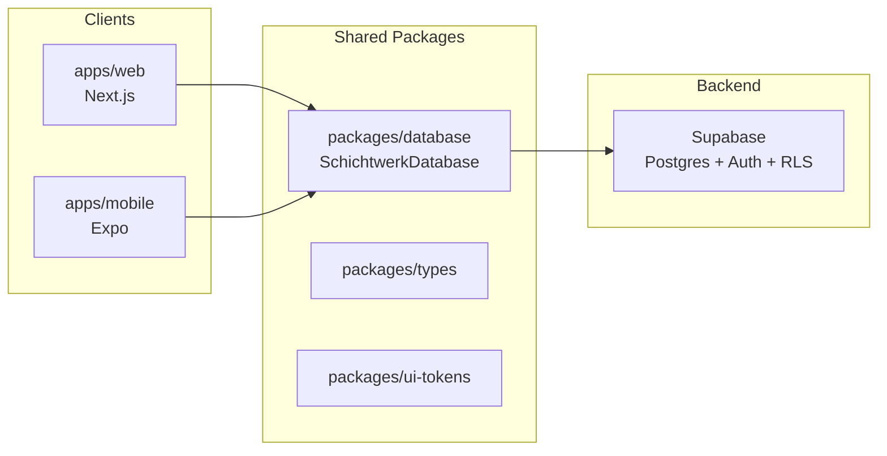

# Studienabgabe: MVP Development with AI — SHIFTWERK (Schichtwerk)

Vorlage zur Nachweisführung für die Bootcamp-/Studienaufgabe **„MVP Development with AI“**.  
Projekt: Schichtplanung für kleine Teams — Web (Manager) + Mobile (Mitarbeiter), geplant für späteren Live-Gang.

| Feld | Inhalt |
|------|--------|
| **Projektname** | SHIFTWERK / Schichtwerk |
| **Team / Name** | _[eintragen]_ |
| **Datum der Abgabe** | _[eintragen]_ |
| **Live-URL (HTTPS)** | _[z. B. `https://…vercel.app` — eintragen]_ |
| **Repository** | _[Git-URL eintragen]_ |
| **Demo-Login (nur für Prüfung)** | _[optional: Test-Account, kein Produktiv-Passwort]_ |

---

## Kurzbeschreibung (2–3 Sätze)

_[Beschreibe: Zielgruppe, Kernfunktion (Schichtplanung), Tech-Stack (Next.js, Supabase, Expo).]_

**Beispiel:** Schichtwerk ermöglicht Betrieben die Wochenplanung mit Bereichen, Personalbedarf und Schichtbestätigung. Manager nutzen die Web-App; Mitarbeiter die Mobile-App. Daten liegen in Supabase; Zugriff über eine zentrale TypeScript-Datenbankschicht.

---

## Architektur (Überblick)



| Schicht | Pfad / Link |
|---------|-------------|
| Gesamt-README & Setup | [README.md](../README.md) |
| Web-App (Next.js) | [apps/web/](../apps/web/) |
| Mobile-App (Expo) | [apps/mobile/](../apps/mobile/) |
| Datenbank-Package | [packages/database/README.md](../packages/database/README.md) |
| SQL-Schema (Single Source of Truth) | [packages/database/schema.sql](../packages/database/schema.sql) |
| DB-Schnittstelle | [packages/database/src/interface.ts](../packages/database/src/interface.ts) |
| Supabase-Adapter | [packages/database/src/supabase-database.ts](../packages/database/src/supabase-database.ts) |
| Web: DB-Zugang | [apps/web/src/lib/db.ts](../apps/web/src/lib/db.ts) |

**Hinweis zur „API“:** Es gibt kein separates REST-Server-Projekt. Stattdessen: **Supabase (Postgres)** + **Server Actions** in Next.js + typisierte **`SchichtwerkDatabase`**-Schnittstelle. Das ist für ein MVP/Live-Produkt üblich und in der Abgabe kurz erklären.

---

## 1. Backend

### Datenbank & Struktur

- [ ] Datenbankschema ist logisch aufgebaut (Organisationen, Profile, Schichten, Bereiche, …)
- [ ] Schema ist versioniert und dokumentiert
- [ ] Row Level Security (RLS) / Mandantenfähigkeit berücksichtigt

**Nachweis im Repo:**

| Thema | Link |
|-------|------|
| Vollständiges Schema | [packages/database/schema.sql](../packages/database/schema.sql) |
| Nachfolgende Migrationen | [packages/database/migrations/](../packages/database/migrations/) |
| Security-Linter-Fixes | [packages/database/migrations/20250617_security_linter_fixes.sql](../packages/database/migrations/20250617_security_linter_fixes.sql) |
| DB-Dokumentation | [packages/database/README.md](../packages/database/README.md) |

### API / Datenzugriff

- [ ] Backend-Anbindung funktional (Lesen/Schreiben zentral über eine Schicht)
- [ ] Keine verstreuten Raw-SQL-Aufrufe in UI-Komponenten
- [ ] Server-seitige Aktionen für Mutationen (Schichten, Profile, …)

**Nachweis im Repo:**

| Thema | Link |
|-------|------|
| Zentrale Interface-Definition | [packages/database/src/interface.ts](../packages/database/src/interface.ts) |
| Server Actions (Auswahl) | [apps/web/src/app/actions/](../apps/web/src/app/actions/) |
| Schichten | [apps/web/src/app/actions/shifts.ts](../apps/web/src/app/actions/shifts.ts) |
| Profile / Team | [apps/web/src/app/actions/profiles.ts](../apps/web/src/app/actions/profiles.ts), [team.ts](../apps/web/src/app/actions/team.ts) |
| Organisation | [apps/web/src/app/actions/organization.ts](../apps/web/src/app/actions/organization.ts) |
| Auth (Login/Register) | [apps/web/src/app/actions/auth.ts](../apps/web/src/app/actions/auth.ts) |
| Registrierung (UI) | [apps/web/src/app/register/page.tsx](../apps/web/src/app/register/page.tsx) |

### Zentrale Schnittstelle

- [ ] Eine definierte Schnittstelle für alle Datenzugriffe
- [ ] Web und Mobile nutzen dieselbe Abstraktion

**Nachweis:** `SchichtwerkDatabase` in [interface.ts](../packages/database/src/interface.ts), Implementierung [supabase-database.ts](../packages/database/src/supabase-database.ts).

**Eigene Notizen / Screenshots:** _[z. B. Supabase Table Editor, ER-Skizze]_

---

## 2. Codequalität & Architektur

### Ordnerstruktur

- [ ] Monorepo-Struktur ist klar (Apps vs. Packages)
- [ ] Trennung UI / Logik / Datenzugriff erkennbar

**Nachweis:** [README.md — Projektstruktur](../README.md#projektstruktur)

| Bereich | Link |
|---------|------|
| Planungs-UI | [apps/web/src/components/](../apps/web/src/components/) |
| Domänen-Logik (Lib) | [apps/web/src/lib/](../apps/web/src/lib/) |
| Geteilte Typen | [packages/types/](../packages/types/) |
| UI-Tokens | [packages/ui-tokens/](../packages/ui-tokens/) |

### Tests

- [ ] Modultests vorhanden und ausführbar
- [ ] Tests dokumentiert (Befehl in README oder hier)

**Nachweis:**

| Thema | Link / Befehl |
|-------|----------------|
| Vitest-Konfiguration | [vitest.config.ts](../vitest.config.ts) |
| Beispiel-Tests (Lib) | [apps/web/src/lib/](../apps/web/src/lib/) (`*.test.ts`) |
| Package-Tests | [packages/database/src/](../packages/database/src/), [packages/compliance/](../packages/compliance/) |
| **Ausführen** | `npm test` (im Repository-Root) |

- [ ] Screenshot oder Log: `npm test` erfolgreich _[Dateiname: `screenshots/test-run.png`]_

### Code-Stil & Wartbarkeit

- [ ] TypeScript durchgängig
- [ ] Keine Secrets im Quellcode
- [ ] Kommentare bei komplexer Domänenlogik

**Nachweis (Beispiele):** [apps/web/src/lib/shift-cancellation-policy.ts](../apps/web/src/lib/shift-cancellation-policy.ts), [bulk-staffing-header.ts](../apps/web/src/lib/bulk-staffing-header.ts)

---

## 3. Frontend — Anbindung ans Backend

### API / Datenladung

- [ ] Frontend lädt Daten aus Backend-Schicht (nicht hardcodierte Demo-Daten)
- [ ] Server Components / Server Actions genutzt

**Nachweis:**

| Thema | Link |
|-------|------|
| Mitarbeiter-Kalender (Server-Load) | [employee-calendar-page.tsx](../apps/web/src/components/dashboard/employee-calendar-page.tsx) |
| Kalender-Daten-Layer | [dashboard-calendar-layer-data.ts](../apps/web/src/lib/dashboard-calendar-layer-data.ts) |
| Bereich-Kalender-Seite | [apps/web/src/app/(manager)/(planning)/bereich-kalender/page.tsx](../apps/web/src/app/(manager)/(planning)/bereich-kalender/page.tsx) |
| Dashboard-Übersicht | [dashboard-page-shell.tsx](../apps/web/src/components/dashboard/dashboard-page-shell.tsx) |

### Loading-Zustände & Fehler

- [ ] Ladezustände bei Navigation / Aktionen berücksichtigt
- [ ] Fehler dem Nutzer angezeigt (nicht nur Console)

**Nachweis:**

| Thema | Link |
|-------|------|
| React `useTransition` / Pending | [dashboard-view.tsx](../apps/web/src/components/dashboard/dashboard-view.tsx) |
| Navigations-Wartecursor | [app-shell-main-nav-pending.tsx](../apps/web/src/lib/app-shell-main-nav-pending.tsx) |
| Action-Fehler übersetzen | [translate-action-error.ts](../apps/web/src/lib/translate-action-error.ts) |
| UI: Alert / Modals | [apps/web/src/components/ui/](../apps/web/src/components/ui/) |

- [ ] Screenshot: Lade-/Pending-Zustand _[optional]_

### Darstellung

- [ ] Daten werden sinnvoll dargestellt (Kalender, Listen, Formulare)
- [ ] Responsive / nutzbar auf Desktop

**Nachweis (Screenshots einfügen):**

- [ ] Login — `screenshots/01-login.png`
- [ ] Dashboard / Übersicht — `screenshots/02-dashboard.png`
- [ ] Mitarbeiter-Kalender — `screenshots/03-mitarbeiter-kalender.png`
- [ ] Bereich-Kalender — `screenshots/04-bereich-kalender.png`
- [ ] Einstellungen (Profile/Rollen) — `screenshots/05-einstellungen.png`
- [ ] Mobile-App (optional) — `screenshots/06-mobile.png`

**UI-Komponenten:** [dashboard-view.tsx](../apps/web/src/components/dashboard/dashboard-view.tsx), [areacalendar-view.tsx](../apps/web/src/components/areacalendar/areacalendar-view.tsx)

---

## 4. Sicherheit

### Secrets & Konfiguration

- [ ] Keine API-Keys / Service-Role im Git-Repository
- [ ] `.env.example` ohne echte Werte
- [ ] Produktions-Env nur im Hosting (z. B. Vercel)

**Nachweis:**

| Thema | Link |
|-------|------|
| Env-Vorlage (Root) | [.env.example](../.env.example) |
| Mobile Env-Vorlage | [apps/mobile/.env.example](../apps/mobile/.env.example) |
| README Env-Abschnitt | [README.md — Umgebungsvariablen](../README.md#2-umgebungsvariablen) |

- [ ] Bestätigung: `SUPABASE_SERVICE_ROLE_KEY` nur serverseitig _[Checkbox]_

### XSS / CSRF / Session

- [ ] React-Standard (kein `dangerouslySetInnerHTML` ohne Grund)
- [ ] Geschützte Routen nur mit Session
- [ ] Server Actions / Supabase Session-Handling

**Nachweis:**

| Thema | Link |
|-------|------|
| Middleware (geschützte Routen) | [apps/web/src/middleware.ts](../apps/web/src/middleware.ts) |
| Supabase Session Update | [apps/web/src/lib/supabase/middleware.ts](../apps/web/src/lib/supabase/middleware.ts) |
| Auth Callback | [apps/web/src/app/auth/callback/](../apps/web/src/app/auth/callback/) |
| Superadmin-Allowlist | [apps/web/src/lib/superadmin-access.ts](../apps/web/src/lib/superadmin-access.ts) |

### Authentifizierung

- [ ] Registrierung / Login funktional
- [ ] Passwort-Reset / Einladung dokumentiert
- [ ] Rollen: Manager vs. Mitarbeiter getrennt

**Nachweis:**

| Thema | Link |
|-------|------|
| Login | [apps/web/src/app/login/](../apps/web/src/app/login/) |
| Register | [apps/web/src/app/register/page.tsx](../apps/web/src/app/register/page.tsx) |
| Rollen-Actions | [apps/web/src/app/actions/roles.ts](../apps/web/src/app/actions/roles.ts) |
| README Einladungen | [README.md — Supabase für Einladungen](../README.md#supabase-für-einladungen--passwort-reset) |

---

## 5. Live-Deployment

- [ ] App unter öffentlicher URL erreichbar
- [ ] HTTPS aktiv (Standard bei Vercel/Supabase)
- [ ] Env-Variablen im Hosting gesetzt (nicht nur lokal)
- [ ] Supabase Redirect-URLs für Produktions-Domain konfiguriert

| Variable (Beispiel) | Zweck |
|---------------------|--------|
| `NEXT_PUBLIC_SUPABASE_URL` | Supabase-Projekt |
| `NEXT_PUBLIC_SUPABASE_ANON_KEY` | Client (öffentlich) |
| `NEXT_PUBLIC_SITE_URL` | Produktions-URL |
| `SUPABASE_SERVICE_ROLE_KEY` | Nur Server (Einladungen) |
| `SUPERADMIN_EMAILS` | Optional: Superadmin-Menü |

**Live-URL:** _[https://…………]_

**Deployment-Anbieter:** _[z. B. Vercel]_

**Build-Befehl:** `npm run build` (siehe [README.md — Scripts](../README.md#scripts))

- [ ] Screenshot: Hosting-Dashboard mit Env-Variablen (ohne Secret-Werte) — `screenshots/07-deployment-env.png`

---

## 6. Organisation & Zugänge (Multi-Tenant)

- [ ] Projekt ist an **Organisation / Betrieb** gebunden
- [ ] Mehrere **Profile (Mitarbeiter)** pro Organisation
- [ ] **Rollen** (z. B. Manager / Mitarbeiter) umgesetzt
- [ ] Test-Accounts für Prüfung vorhanden

**Nachweis im Schema / Code:**

| Thema | Link |
|-------|------|
| Schema (organizations, profiles, roles) | [packages/database/schema.sql](../packages/database/schema.sql) |
| Organisation anlegen | [apps/web/src/app/actions/organization.ts](../apps/web/src/app/actions/organization.ts) |
| Profile verwalten | [apps/web/src/app/actions/profiles.ts](../apps/web/src/app/actions/profiles.ts) |
| Manager-Session | [apps/web/src/lib/server-manager-session.ts](../apps/web/src/lib/server-manager-session.ts) |

**Test-Organisation:** _[Name eintragen]_  
**Test-User Manager:** _[E-Mail eintragen]_  
**Test-User Mitarbeiter:** _[E-Mail eintragen]_

---

## 7. Dokumentation

- [ ] README mit Setup-Schritten
- [ ] Architektur beschrieben (dieses Dokument + README)
- [ ] Entwicklungs-Workflow (Git, Scripts)
- [ ] Screenshots für zentrale Funktionen

| Dokument | Link |
|----------|------|
| Haupt-README | [README.md](../README.md) |
| Datenbank | [packages/database/README.md](../packages/database/README.md) |
| Supabase-Hinweise | [supabase/README.md](../supabase/README.md) |
| i18n | [packages/i18n/README.md](../packages/i18n/README.md) |
| **Diese Abgabe** | [docs/studien-abgabe-mvp.md](./studien-abgabe-mvp.md) |

### Entwicklungs-Workflow (Kurz)

```bash
git clone <repo-url>
cd SHIFTWERK
cp .env.example apps/web/.env.local   # Werte eintragen
npm install
npm run dev:web                       # http://localhost:3000
npm test                              # Modultests
```

- [ ] Branching-Strategie beschrieben: _[z. B. `main` + Feature-Branches]_

---

## 8. Gesamt-Checkliste vor Abgabe

- [ ] Alle Checkboxen oben durchgegangen und befüllt
- [ ] Live-URL in Deckblatt eingetragen und getestet
- [ ] Screenshots in `docs/screenshots/` abgelegt (oder in LMS hochgeladen)
- [ ] Keine echten Secrets in Repo, Screenshots oder PDF
- [ ] `npm test` und `npm run build` lokal (oder in CI) erfolgreich
- [ ] Abgabe-PDF oder Link zum Repo an Studiengang übermittelt

---

## Anhang: Wichtige Routen (Web)

| Route | Beschreibung |
|-------|----------------|
| `/login` | Manager-Login |
| `/register` | Betrieb registrieren |
| `/dashboard` | Schichtübersicht |
| `/mitarbeiter-kalender` | Mitarbeiter-Wochenkalender |
| `/bereich-kalender` | Bereich-Kalender |
| `/uebersicht` | Übersichten / Modals |

---

## Anhang: Offene Punkte / bekannte Limitierungen (optional)

_[Ehrlich dokumentieren — z. B. Features in Entwicklung, bekannte Bugs, geplantes Live-Rollout.]_

- _[ … ]_

---

*Vorlage erstellt für SHIFTWERK — bei Abgabe Checkboxen setzen (`[x]`), Platzhalter ersetzen und Screenshots ergänzen.*
